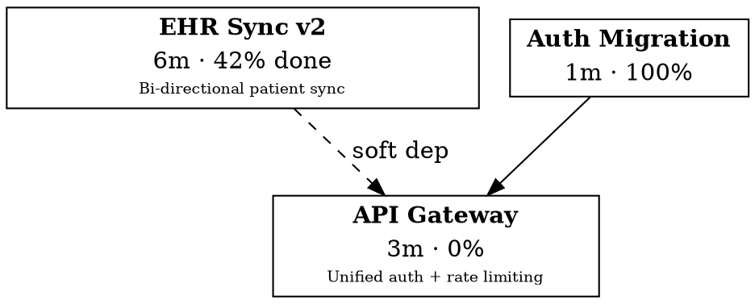

🌿: 2026-04-03.07-16-59.100.md: what is "Graphviz (DOT language)"

💬: now, let's think about how to model resources, so far we have modeled project, its size and dependencies. now I want to explore how to model resources, that's people working on the projects. 

following the same yaml file setup, if each file is a team, then its content is either a team's project, or a team's resource. project start with top level -project, people should start with top level -person. 

overall, let's start simple by treating this as quarterly planning, e.g. the start of each quarter, we see the projects we need to deliver, and the persons we have in that quarter. this means to view the vision/ directory as a database of all project of all time (that we care), then we ask question regarding each quarter, what projects should we pick to work on, which depending on resource we have. the various visualization tool, and in the future planning assistant tool, help business and tech to align their goals. 

so under the context of quarterly planning granularity, at higher level we would follow some processes like: 

1/ every quarter we have a folder in vision: `vision/25Q3`, which at the start would copy from previous quarter. 

2/ we need to model partial completion of a project. we already say a project have a size, I think we should make another hierarchy of size in months: 1m, 3m, 6m, 9m 12m etc. those implies different visualized size in dot file generated, size in between, e.g. 2m, 4m, uses the size of what's defined below, so 2m use 1m size in dot, 4m use 3m. 

3/ during quarter planning, we may gradually copy "yaml" files over. so the view of the database, in `25Q4` is really an overlaying file system of all files in `vision/25Q4`, over `vision/25Q3`. let's do one level of overlying for now, as we assume previous quarter is stable. files in newer quarter will overwrite file from older quarter, in this overlaying file system view.

4/ default view is the latest quarter available in vision dir, so if we have `25Q3`, `25Q2` folder, and run commands without specifying what's current quarter, then `25Q3` will be assumed.

5/ then, we need to model partially completed project from previous quarter. let's just add a -completion: 42, to project entity to indicate 42% of it are completed.

6/ then we need a way to visualize this in dot file generated. I suggest using background color, display 2 color background with some darker color occupying 42% space to indicate completion.

Thoughts?

🤖:[Claude-Code-Opus]

🧠: The user is designing a quarterly planning system that models both projects and people, using YAML files as a database with an overlay filesystem concept. They want to visualize project completion in Graphviz dot files. Let me think through the design carefully and provide constructive feedback.

Key things to address:
1. The YAML schema for persons
2. The overlay filesystem concept (previous quarter + current quarter)
3. Project completion modeling
4. Visualization of completion percentage in Graphviz
5. The size hierarchy mapping to months

I should be honest about what works and what has friction. The 2-color background in Graphviz is doable but tricky - Graphviz doesn't natively support "partial fill" of a node. You'd need to use HTML-like labels with a table trick, or use a gradient with a hard stop. Let me think about the best approach.

For the gradient approach in Graphviz: you can use `style=striped` with `fillcolor="darkgreen:lightgreen"` but that gives equal stripes, not proportional. Actually, Graphviz supports `style=wedged` for pie-chart-like fills on ellipses, and `style=striped` for box shapes. With striped, you can use a colorList with weights like `fillcolor="darkgreen;0.42:lightgreen;0.58"`. This is actually the right approach!

Let me also think about the overlay filesystem - this is a nice idea, essentially like Docker layers or OverlayFS. Simple to implement: read base quarter, then override with current quarter files.

For person modeling, I should suggest what attributes matter for quarterly planning: allocation percentage, skills/role, availability.

Let me also push back or refine where needed:
- The month-to-dot-size mapping is reasonable but the "round down" rule (2m→1m size, 4m→3m size) feels arbitrary. Why not just linear scaling?
- Completion percentage is good, but we should think about what "42% complete" means - is it time spent vs estimated, or scope complete?
- The folder-per-quarter + overlay is clean but we should think about what happens to completed projects - do they disappear or stay with 100%?

This is a solid design. Let me give structured, actionable feedback with code examples.

This is a well-thought-out design. Let me work through each piece — some I'll reinforce, some I'll push back on.

### The overlay filesystem: clean and practical

The concept is essentially OverlayFS semantics — base layer (previous quarter) + upper layer (current quarter). This is intuitive for engineers and simple to implement:

```
vision/
  25Q2/
    backend.yaml
    platform.yaml
  25Q3/
    backend.yaml    # overrides 25Q2/backend.yaml
    # platform.yaml is inherited from 25Q2/
```

One clarification worth locking down: **overlay is file-level, not entity-level**, right? If `25Q3/backend.yaml` exists, it fully replaces `25Q2/backend.yaml` — you don't merge individual project entries across quarters. That's simpler and less error-prone. If you need to carry forward 4 of 5 projects from a team, you copy the whole file and edit.

### Person schema

Keeping it minimal for quarterly planning:

```yaml
- person:
    name: Alice Chen
    role: senior-backend    # maps to capability, not title
    allocation: 0.8         # 80% available this quarter (leaves, oncall, etc.)
    projects:
      - ehr-sync-v2: 0.5    # 50% of her allocated time
      - api-gateway: 0.3
      # remaining 0.2 is unplanned/buffer — tool can flag or accept this

- person:
    name: Bob Park
    role: frontend
    allocation: 1.0
    projects:
      - patient-portal: 1.0
```

The `projects` mapping here creates the **join** between your two entity types. This lets you answer the key quarterly planning questions:

- Is this project **staffed**? (sum allocations across persons vs. project size)
- Is this person **over-allocated**? (sum > allocation)
- What's our **slack**? (unallocated person-months)

### Pushback on the size bucketing

You proposed: sizes in months (1m, 3m, 6m, 9m, 12m) and values in between round down to the nearest bucket for dot rendering.

I'd simplify — just use the raw month value and scale linearly:

```python
# continuous scaling rather than discrete buckets
def node_width(months):
    BASE = 1.5
    SCALE = 0.4
    return BASE + (months * SCALE)

# 1m → 1.9"    3m → 2.7"    6m → 3.9"    12m → 6.3"
```

Why: discrete buckets lose information (a 2-month project looks identical to a 1-month project), and the rounding-down rule is one more thing to explain to non-technical stakeholders. Linear scaling is self-evident — bigger box, bigger project.

### Completion visualization: Graphviz actually supports this

Your instinct about two-color fill is right, and Graphviz has native support via **weighted color lists** with `style=striped`:



The `striped` style draws **horizontal bands** proportional to the weights. So `"darkseagreen;0.42:lightyellow;0.58"` gives you a visual progress bar built into the node. No custom rendering needed.

### One thing to watch: what does "completion" mean?

This matters more than it seems. Two options:

| Model | Meaning | Implication |
|-------|---------|-------------|
| **Scope-based** | 42% of deliverables shipped | Remaining 58% is the work left, which you staff against |
| **Time-based** | 42% of estimated months burned | Doesn't tell you if you're on track (could be 42% time spent, 20% done) |

For quarterly planning, **scope-based** is more useful because the question you're answering is: *how much of this project's remaining size do we need to staff?* So effective remaining size = `size * (1 - completion)`.

```yaml
- project:
    name: ehr-sync-v2
    size: 6m
    completion: 42        # scope-based: 42% of deliverables done
    # effective remaining effort: 6 * 0.58 = 3.48 person-months
    desc_biz: "Bi-directional patient data sync with top 5 EHRs"
    desc_tech: "CDC pipeline + FHIR adapter layer"
    link: "https://notion.so/..."
    deps:
      - api-gateway: hard
```

### Suggested project structure

```
vision/
  25Q2/
    backend.yaml       # projects + persons for backend team
    platform.yaml
  25Q3/
    backend.yaml       # overlays 25Q2/backend.yaml
    # platform.yaml inherited from 25Q2
  tool/
    generate_dot.py    # reads vision dir, applies overlay, emits .dot
    quarterly_check.py # staffing gaps, over-allocation, unblocked projects
```

The tool reads the overlay, joins persons→projects, and can answer:

- **"What's understaffed?"** — projects where allocated person-months < remaining effort

Want me to write the `generate_dot.py` that implements the overlay + completion visualization?

📝: You asked about modeling resources (people) alongside projects for quarterly planning with overlay filesystem semantics, I answered with a person YAML schema with allocation/project mappings, pushed back on discrete size buckets in favor of linear scaling, showed Graphviz's native weighted color list for completion visualization, and clarified scope-based vs time-based completion semantics.

💬: confirming choices:

1. yes, overlaying is about files, not entities. 
2. don't model -role in a -person yet, keep things simple that everyone in a team (e.g. yaml file) can do all projects in it. start simple is important. 
3. don't use relative -allocation, just use -capacity: 11w, to indicate x weeks out of a quarter. that's enough granularity for now. 
4. don't do detailed allocation of person to project yet. we will for now just count at team level, you have this many project (indicated by size, 1m, 6m, etc.) and this many people, with capacity: 4w, do they add up. 
5. we should actually extend -project to have a -start, and -end time, expressed in quarters, or months, e.g. `25Q3`, `25M11`. when used in -start, it means start of that time span, when used in -end, it means the end of that time span. so a project with -end `25M11`, means it needs to be finished by end of `25M11`. Note, -end is already modeled by -need_by, so let's just use that. we just need -start, or -start_by, to keep wording more consistent. 
6. now, with start_by and need_by, we can assume uniform progress, e.g. if start_by, and need_by span 4 quarters, then with respect to current quarter within that space, we need to deal with 1/4 of the size of the project. so we would use 1/4 of size as "project size" for any given quarter. 
7. for project not having need_by, we assume it needs to finish in the current planning quarter. 
8. for project not having start_by, we assume we will start in the current planning quarter. 
9. for project not having start_by and need_by, we assume it starts this quarter and end this quarter. 
10. linear scale of size (1m, 10m), sure. 
11. completion means scope completion, not just time passed. it's one input human needs to provide, or we can pull from external sources, like JIRA. for now, it's just some manual estimation of where a project is at the start of the current quarter's planning cycle. 

Thoughts?

🤖:[Claude-Code-Opus]

🧠: The user is confirming and refining design choices. Let me think through what they've laid out and where I should push back or refine.

Key points to address:
1-4: Simple, agreed. Person is just name + capacity in weeks.
5: start_by/need_by with quarter or month granularity. Good.
6: Uniform progress assumption - this is the interesting one. If a project spans 4 quarters, you only "charge" 1/4 of the size to any given quarter. This is smart for capacity planning - it distributes the load. But I should think about edge cases.
7-9: Defaults for missing start_by/need_by. Reasonable.
10: Linear scale, confirmed.
11: Scope completion, manual for now.

Let me think about pushbacks:

On #6 - uniform progress assumption: This is pragmatic but has a known issue - projects rarely have uniform effort distribution. The beginning (design, spike) and end (testing, launch) often have different resource profiles. But for quarterly planning granularity, this is probably fine. The user said "start simple" multiple times. I should note the limitation but not over-engineer.

On #6 - interaction with completion: If a project is 42% complete and spans 4 quarters, and we're in Q2 of 4, what do we charge? The remaining work (58%) spread over remaining quarters (2), so 29% per quarter? Or do we still charge 25% per quarter? I think the right model is: remaining_size = size * (1 - completion), then distribute over remaining quarters. This is an important nuance.

On capacity in weeks: A quarter is ~13 weeks. So capacity: 11w means 2 weeks of vacation/overhead. This is clean. But project sizes are in months. We need a conversion. 1 month ≈ 4.33 weeks. So a 3m project ≈ 13 weeks ≈ 1 quarter. This needs to be explicit.

On the "do they add up" question (#4): Sum of project sizes (in weeks, for current quarter's portion) vs sum of person capacities. Simple. Good.

Let me also think about what the YAML looks like now with all these decisions.

I should keep this focused - confirm, refine the one tricky interaction (completion + uniform distribution), show the updated schema, and maybe a worked example.

Mostly solid. A few refinements and one important interaction to nail down.

### On capacity vs. size unit mismatch

Projects are sized in **months**, people have capacity in **weeks**. We need an explicit conversion constant. A quarter is ~13 weeks, and convention is roughly **1 month = 4.33 weeks**. I'd just hard-code that in the tool and document it:

```python
WEEKS_PER_MONTH = 4.33
```

So a `3m` project ≈ 13 weeks ≈ one full person-quarter. This makes the "do they add up" arithmetic straightforward.

### The important interaction: completion × uniform distribution

Your rule #6 says: spread size uniformly across the start_by→need_by span. Your rule #11 says: completion is scope-based.

These interact. Consider:

> **Project X**: size 12m, start_by 25Q1, need_by 25Q4, completion 50%

Naive uniform: charge 3m/quarter (12m ÷ 4). But 50% is already done — you only have 6m of work left across Q3 and Q4.

The right model is:

```
remaining_effort = size × (1 - completion / 100)
remaining_quarters = quarters from current_quarter to need_by (inclusive)
quarterly_charge = remaining_effort / remaining_quarters
```

So for Q3: `12 * 0.5 / 2 = 3m` charged. Happens to match naive here, but wouldn't if completion were 25% (would be `12 * 0.75 / 2 = 4.5m` — heavier than the naive 3m, which correctly signals you're behind).

This also handles the "project is ahead of schedule" case — if completion were 75%, you'd charge `12 * 0.25 / 2 = 1.5m`, freeing capacity.

### Edge case: completion but current quarter is before start_by

If a project has `start_by: 25Q4` and we're planning 25Q3, it should contribute **zero** to Q3's capacity demand, regardless of completion. Just skip it in the quarterly charge calculation.

### Edge case: past need_by but not 100% complete

A project with `need_by: 25Q2`, completion 80%, and we're planning Q3 — this is a **slip**. I'd suggest the tool flags these explicitly rather than silently distributing remaining work. Something like:

```
⚠ OVERDUE: project-x (need_by 25Q2, 80% complete, 2.4m remaining)
```

Then the planner decides: does it get added to Q3 explicitly (update need_by), or is it deprioritized?

### Updated schema

```yaml
# vision/25Q3/backend.yaml

- person:
    name: Alice Chen
    capacity: 11w

- person:
    name: Bob Park
    capacity: 10w

# Team capacity: 21 weeks

- project:
    name: ehr-sync-v2
    size: 6m
    start_by: 25Q2
    need_by: 25Q4
    completion: 33
    desc_biz: "Bi-directional patient sync with top 5 EHRs"
    desc_tech: "CDC pipeline + FHIR adapter layer"
    link: "https://notion.so/ehr-sync"
    deps:
      - api-gateway: hard

- project:
    name: api-gateway
    size: 3m
    # no start_by/need_by → defaults to this quarter (25Q3)
    completion: 0
    desc_biz: "Unified API entry point for partners"
    desc_tech: "Kong + custom auth plugin"
```

**Capacity check for Q3:**

```
ehr-sync-v2:
  remaining = 6 * (1 - 0.33) = 4.02m
  remaining quarters (Q3, Q4) = 2
  Q3 charge = 4.02 / 2 = 2.01m → 8.7 weeks

api-gateway:
  remaining = 3 * (1 - 0) = 3m
  remaining quarters (Q3) = 1
  Q3 charge = 3 / 1 = 3m → 13.0 weeks

Total demand: 21.7 weeks
Team capacity: 21 weeks
→ ⚠ Slightly over-committed (0.7w gap, ~3%)
```

### One suggestion: add a `status` field?

Not for tracking — just three values that affect planning logic:

- `active` (default, included in calculations)
- `paused` (excluded from quarterly charge, but still visible in graph)
- `cut` (excluded from everything, but stays in YAML as historical record)

This avoids the awkward dance of deleting projects from YAML when priorities shift mid-quarter. Thoughts?

📝: You confirmed design choices for the quarterly planning model (file-level overlay, simple person with capacity in weeks, no per-person allocation, start_by/need_by with uniform distribution, scope-based completion). I refined the completion × uniform distribution interaction (remaining effort ÷ remaining quarters), flagged unit mismatch (months vs weeks needing conversion), called out edge cases (overdue projects, pre-start projects), and suggested a `status` field for paused/cut projects.

💬: further clarification:

1. capacity/size unit mismatch is intentional: project worth planning are months; but for person capacity within a quarter, we need week level granularity. 

2. yes, the interaction between completion and uniform distribution is correct. the completion is there by design, not the same as percentage of time completed, otherwise we won't need such field. this is an estimation from previous quarters execution, are we ahead of time, or behind time. a totally separate input. 

3. if a project haven't started, using start_by, then it counts 0 size. actually 0 sized project should be excluded from current quarter planning. I mentioned before that we infer current quarter during export function (e.g. dot export). the command should support an explicit parameter to also generate for all, e.g. just show all projects configured in the database. actually, a more disciplined extension of this is that we can support a planning range not just a quarter, say for 1 half (2 quarters), or a year. the principle stays the same really. 

4. overdue project will need to be added to current planning cycle, and size of it is the remaining work (1-completion)*size.

5. use a single -description, to describe. and use -type to indicate tech vs business projects. 

6. yes, make a command to generate allocation report. 

7. don't need status, as manipulating start_by, would have same effect. and if a project is cut, it's cut, and shouldn't tracked here. I know this is a dramatic choice, I want a forcing function to keep things clean, not having many projects that we can't finish. if this matters enough, move start_by date. otherwise just remove it from database. 

thoughts?

🤖:[Claude-Code-Opus]

🧠: The user is refining the design further. Let me process each point:

1. Unit mismatch is intentional - acknowledged, no need to discuss further.
2. Completion interaction - already aligned, just confirming.
3. Zero-size projects excluded from current quarter view. Support for planning ranges (quarter, half, year). This is a good extension - the math stays the same, you just change the window.
4. Overdue projects - remaining work charged to current quarter. Simple, no special handling needed.
5. Single -description, add -type (tech/business). Simplification.
6. Allocation report command - yes.
7. No status field - projects are either in the database or not. start_by handles pausing. This is opinionated and I like it - it's a forcing function.

The user is converging on a clean, minimal design. I think the design is now tight enough that I should mostly confirm, note the elegance of the forcing function choice (#7), and maybe surface one or two remaining questions before we start coding. 

Key remaining questions:
- The planning range parameter: how to express it? `--range 25Q3` (single quarter), `--range 25H2` (half), `--range 25Y` (year)?
- For multi-quarter ranges, how do we visualize? One graph with all projects in that range, sized by their charge within that range?
- The -type field: does it affect visualization (e.g., different node shapes for tech vs business)?
- Should the allocation report be text-based, or also a visual output?

I think I should keep this tight - confirm the design is solid, raise the few remaining questions about the range parameter and type visualization, and ask if we should start coding.

These are clean decisions. A few reactions and remaining questions before we start building.

### On #7 — no status field

This is the strongest choice in the whole design. It makes the YAML file a **commitment ledger**, not a wish list. If it's in the file, you're planning to do it. If you're not, delete it. Version control (git) gives you the history anyway — you can always `git log` to see what was cut and when. This eliminates the graveyard of `paused` and `maybe-someday` projects that plague most planning tools.

### On #3 — planning range

The math generalizes cleanly. One question on the CLI interface:

```bash
# single quarter (default: latest quarter dir)
vision export --quarter 25Q3

# half-year
vision export --range 25Q3:25Q4

# full year
vision export --range 25Q1:25Q4

# all projects regardless of time window
vision export --all
```

For `--range`, the quarterly charge becomes the **range charge** — remaining effort distributed across quarters within the range, then summed. So for a half-year view, you see the total demand over 2 quarters against total capacity over 2 quarters. Same principle, wider window.

Does `--all` just mean unbounded range (show every project in the overlay, regardless of start_by/need_by), with size = full remaining size?

### On #5 — type field

Does `type` affect visualization? Two natural options:

- **Shape**: tech projects as boxes, business projects as rounded boxes (or vice versa)
- **Color hue**: tech = blue family, business = green family (with completion still shown via dark/light fill ratio)

Shape is probably better since color is already carrying the completion signal. And it gives stakeholders an instant read on the portfolio mix.

### On #6 — allocation report

I'm thinking a simple text report:

```
=== 25Q3 Planning Summary (Backend) ===

Team capacity: 21.0w (2 persons)
  Alice Chen      11w
  Bob Park        10w

Project demand:   21.7w
  ehr-sync-v2      8.7w  (2.0m charged, 33% → 67% target)
  api-gateway     13.0w  (3.0m charged, 0% → 100% target)

Balance: -0.7w ⚠ over-committed (3%)
```

The `33% → 67% target` shows where the project should be at end of quarter assuming uniform progress — useful for setting expectations.

### Remaining schema

```yaml
# vision/25Q3/backend.yaml

- person:
    name: Alice Chen
    capacity: 11w

- person:
    name: Bob Park
    capacity: 10w

- project:
    name: ehr-sync-v2
    type: tech
    size: 6m
    start_by: 25Q2
    need_by: 25Q4
    completion: 33
    description: "Bi-directional patient sync via CDC + FHIR adapters"
    link: "https://notion.so/ehr-sync"
    deps:
      - api-gateway: hard

- project:
    name: api-gateway
    type: tech
    size: 3m
    description: "Unified API entry point with auth and rate limiting"
```

I think we're at the point where the design is tight enough to start writing the tool. Shall I build out the Python CLI with:

1. **YAML loader** with overlay semantics
2. **Dot exporter** (graph with sized nodes, completion fill, shape by type, dependency edges)
3. **Allocation report** (text summary per team file)
4. **`--quarter`/`--range`/`--all`** filtering

Or do you want to refine anything else first?

📝: You asked about further refinemets to the quarterly planning model (units, completion, planning ranges, no status field, type field), I answered confirming the design choices, especially praising the no-status forcing function, and proposed CLI interface shape, visualization by shape for type, allocation report format, and confirmed readiness to start coding the tool.

💬: further clarification:

1. -type field is rendered in dot file with different background color. 

