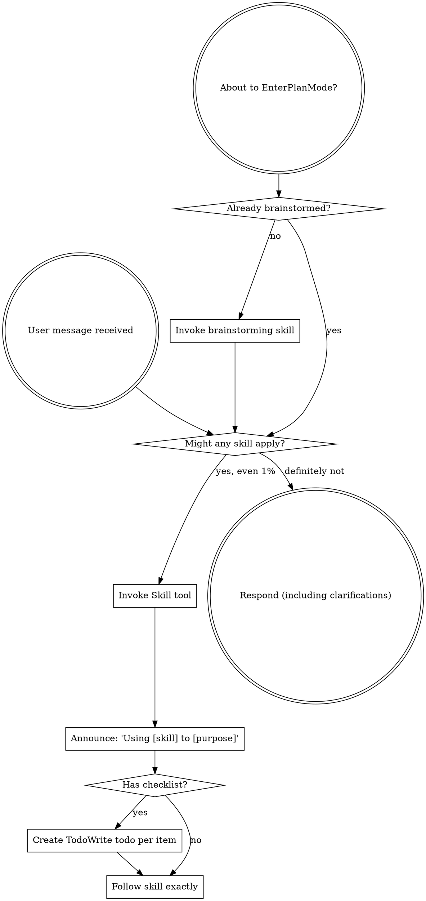

# Boundary Review — parley.nvim#199 (whole-issue close)

| field | value |
|-------|-------|
| issue | 199 — Restore chat setup after buffer reopen |
| repo | parley.nvim |
| issue file | workshop/issues/000199-restore-chat-after-reopen.md |
| boundary | whole-issue close |
| milestone | — |
| window | 1ef877a313134991ee1e300193766f0ae726bda2..HEAD |
| command | sdlc close --issue 199 |
| reviewer | codex |
| timestamp | 2026-08-18T15:38:43-07:00 |
| verdict | SHIP |

## Review

Reading additional input from stdin...
OpenAI Codex v0.147.0
--------
workdir: /Users/xianxu/workspace/parley.nvim
model: gpt-5.6-sol
provider: openai
approval: never
sandbox: workspace-write [workdir, /tmp, $TMPDIR, /tmp] (network access enabled)
reasoning effort: medium
reasoning summaries: none
session id: 01a01704-6794-7290-b4c8-87b621adc285
--------
user
# Code review — the one SDLC boundary review

You are conducting a fresh-context code review at a development boundary —
whole-issue close — in the **parley.nvim** repository.

- repository: parley.nvim   (root: /Users/xianxu/workspace/parley.nvim)
- issue:      parley.nvim#199   (file: workshop/issues/000199-restore-chat-after-reopen.md)
- window:     Base: 1ef877a313134991ee1e300193766f0ae726bda2   Head: HEAD

Review the **parley.nvim** repo and its tracker — the ariadne base-layer repo itself (changes here propagate to dependent repos). Do not assume any
other repository or apply another repo's conventions.

You have no prior session context — that is the anti-collusion property. Verify
behavior against the issue's documented Spec/Plan and the code itself; do NOT
take the implementor's word in commit messages or docs at face value. Tools are
read-only: report findings precisely; the main agent (which has session context)
applies the fixes, commits, and re-runs.

Read the diff against the issue's Spec + Plan, then work the checklist below.
Categorize every finding by severity — not everything is Critical; a nitpick
marked Critical is noise.

  Critical (must fix before crossing the boundary)
    - correctness bugs; crashes / panics on unexpected input
    - behavior drift from stated contracts (for ports of existing code where
      byte-faithfulness was promised, diff against the source)
    - silent error swallowing where the source raised
  Important (fix before the boundary if cheap)
    - API design of newly-introduced internal packages (downstream work will
      consume them; is the surface stable?)
    - missing test coverage that would catch the kind of bug shipped
    - inconsistent error handling across the diff
  Minor (note for future)
    - style nits, naming, comment density; performance only if hot-path

## Review checklist

Code quality
  - Clean separation of concerns; edge cases handled (empty / nil / unexpected).
  - Proper error handling — no silent swallowing where the source raised.
  - No duplicated logic / copy-paste that should be a shared helper.

Testing
  - Tests pin real logic, not mocks reasserting the implementation.
  - The kind of bug this diff could ship is covered.
  - PURE entities tested without IO; INTEGRATION via injected fakes (see below).

Requirements traceability
  - Every Plan checklist item this boundary claims is actually delivered.
  - Implementation matches the Spec; no undeclared scope creep.
  - Breaking changes documented.

Production readiness
  - Migration / backward-compatibility considered where state or formats change.
  - Docs / atlas updated for new surface (see the Docs update gate).

## Plan-gate carry-forward (ariadne#187)

Read `workshop/plans/<issue-stem>-plan-gate.md` if it exists — the durable ledger of the
pre-implementation plan gate. It holds the findings that gate raised but deliberately did
NOT block on: Minor findings, and blocking ones demoted once the round cap was reached.
They were deferred to THIS boundary by design — that deferral is only safe because you
pick them up.

For each finding still listed under `## Open findings`, confirm the code either addresses
it or that it no longer applies. A still-valid deferred finding is a finding here, at its
original severity.

## Core concepts cross-check (if the plan has a Core concepts table)

The plan should list entities in a greppable table — name, kind
(PURE/INTEGRATION), file location, status (new/modified/deleted). For each row:
  - Verify the entity exists at the stated path (grep the diff or filesystem).
  - PURE: tests run without IO (no exec, net, mutable fs). If tests need mocks
    to run, it isn't really PURE — flag Critical and recommend promoting it to
    INTEGRATION.
  - INTEGRATION: injected into pure callers, not invoked directly from business
    logic.
  - "modified" / "deleted": the diff shows the expected change/removal at the
    stated location.
Any contradiction between table and code = Critical finding, plus a plan-revision
recommendation (a "## Revisions" entry so the plan stops claiming what the code
doesn't deliver).

## Docs update gate (atlas + README, per AGENTS.md §8)

The boundary should update user-facing docs for any new surface introduced:

  - **atlas/** — new architectural surface, flow, or terminology. Scan the diff
    for new entity types, subcommands, conventions, file-tree locations. Any
    present without corresponding atlas/ changes in the same range = Important
    finding ("atlas update appears missing for <surface>").
  - **README.md** — new user-facing surface a reader runs or types: subcommands,
    flags, keybindings, config keys, install/usage steps. If the diff adds or
    changes such surface and README.md is not updated in the same range =
    Important finding ("README update appears missing for <surface>"). This is the
    class of gap that used to surface only at the merge-time `specs` judge (#142);
    catch it here, at the earliest gate, before the close verdict is recorded.

## Architecture (the at-review backstop — these matter most long-term)

Work through each of ARCH-DRY, ARCH-PURE, ARCH-PURPOSE, ARCH-MOCK explicitly, applying its at-review lens. The
full principle definitions are delivered in the ARCHITECTURE PRINCIPLES block
right after this prompt — for EACH marker, state pass or flag, and cite the
marker (e.g. ARCH-DRY) in any finding. Architecture is where review has the
least training signal and the longest-delayed payoff, so be deliberate here, not
holistic.

## Verdict + output

Begin your response with this fenced verdict block — the machine-read handoff:

```verdict
verdict: <SHIP | FIX-THEN-SHIP | REWORK>
confidence: <high | medium | low>
```

  SHIP           ready; ship it
  FIX-THEN-SHIP  ship after addressing the findings (non-blocking at the gate)
  REWORK         blocking; needs rework before shipping — fix + re-run

The fenced ```` ```verdict ```` block above is the **authoritative machine-read
handoff** — emit it as the first thing in your response. (A prose
`VERDICT: <TOKEN>` first line still satisfies the legacy contract as a fallback,
but the block is what the binary trusts.)

After the verdict block: a 1-paragraph summary — what worked, what blocks SHIP if
it isn't — followed by:
  1. Strengths: 2-5 specific things done well (file:line where useful). Affirm
     validated approaches so the operator knows what's confirmed-good ground.
     Empty acceptable for trivial boundaries.
  2. Critical findings (file:line + fix sketch); empty if none.
  3. Important findings (same format).
  4. Minor findings (terse one-liners).
  5. Test coverage notes.
  6. Architectural notes for upcoming work.
  7. Plan revision recommendations: specific "## Revisions" entries the plan
     needs (empty if the plan still matches the code).


ARCHITECTURE PRINCIPLES — work through each of the 4 entries below explicitly, applying its `at-review` lens; cite the marker (e.g. ARCH-DRY) in any finding.

# Architecture principles (ARCH-*)

Injected architectural taste — the structural decisions whose payoff (or cost)
shows up many turns, often months, down the road. Agents are strong at local
tactics and weak here, so these are checked **at-plan** (when the design is being
made — highest leverage) and **at-review** (backstop, on the diff). Cite the
marker (e.g. `ARCH-DRY`) in plans, `## Log` entries, and review findings.

This file is the single source; it is embedded into the planning, plan-quality,
and code-review prompts. The human narrative lives in AGENTS.md "Core Design
Principles"; this is its machine-delivered companion.

## ARCH-DRY — Don't Repeat Yourself

- **principle:** Reuse before adding. One source of truth per fact/behavior; no
  duplicated logic, copy-pasted blocks, or parallel functions that should be one
  shared helper.
- **at-plan:** Flag a plan that re-implements something the codebase already has,
  or that will obviously duplicate logic across the new files instead of
  extracting a shared helper. Name the existing thing it should reuse.
- **at-review:** Flag duplicated logic / copy-pasted blocks / near-identical
  functions in the diff; point at the consolidation (file:line + the shared
  helper they should become).

## ARCH-PURE — Pure core, thin IO shell

- **principle:** The majority of code is pure functions (deterministic, no side
  effects); a thin "glue" layer at the boundary touches IO/UI/network/clock. Pure
  functions are unit-tested directly; the glue is kept small and injected.
- **at-plan:** Flag a design that buries business logic inside IO/handlers, or
  that will only be testable with heavy mocks (a sign logic isn't separated from
  IO). The plan should name what's pure vs the thin IO seam.
- **at-review:** Flag business logic mixed with IO in the diff; logic that should
  be a pure function injected into a thin caller. If a test needs mocks to run a
  "pure" entity, it isn't pure — recommend extracting the IO to the boundary.

## ARCH-PURPOSE — Serve the issue's actual purpose

- **principle:** Deliver the issue's stated purpose, not the easy subset of it. A
  single-source / "compiled to consumers" change is not done until **every
  consumer derives** from the source — the source is *enforced*, not just
  documentation a surface happens to restate; a hand-maintained restatement of the
  model is a deferred consumer, not a finished one. "Follow-up" is for separable
  extensions, never for the thing that is the point. This is the *opposite axis*
  from Simplicity-First/YAGNI: not "build for an imagined future," but "don't
  **under**-deliver the purpose you already committed to."
- **at-plan:** Flag a plan whose scope is a strict subset of the issue's stated
  goal / Done-when where the part deferred as "follow-up" *is* the purpose (e.g.
  wires one consumer + enforcement but leaves the consumers that motivated the
  issue as documentation that doesn't derive). Ask: does the plan fulfill the
  purpose, or just the cheap win? Name the deferred purpose.
- **at-review:** Does the diff *fulfill* the purpose or settle for the easy win?
  For a single-source change, run the **shadow-sweep** — enumerate the consumers,
  confirm each derives from the source, flag any remaining hand-maintained
  restatement of the model. A "follow-up" that is actually the deferred point of
  the issue is a finding, not a deferral.

## ARCH-MOCK — Stateful external doubles

- **principle:** Every external binary or service dependency the system relies on
  has a stateful fake behind the same seam, modeling our current understanding of
  the dependency's behavior across calls. For libraries, services, and binaries we
  own, the storage/backend layer is backed by a portable folder of files and/or
  database configuration, so the component can be spun up without depending on
  production configuration or production databases. Integration and end-to-end
  tests run against the fake; scheduled/live conformance checks compare the
  fake's modeled behavior with the real binary or service so drift is detected
  and corrected.
- **at-plan:** Flag a design that shells out to, or calls, an external binary or
  service without naming the seam and stateful fake. For owned libraries, services,
  and binaries, also flag any design whose storage/backend depends on production
  configuration or databases instead of a portable file folder and/or database
  configuration. The plan should identify the dependency surface consumed, the
  fake's persisted state model, the owned component's portable backend shape,
  the integration or end-to-end tests that run against it, and the live
  conformance check cadence.
  Examples include `git`, GitHub/`gh`, and Google OAuth.
- **at-review:** Flag direct external calls outside the seam, stateless mocks for
  stateful interactions, tests that cannot run the stack against the fake, owned
  components that cannot boot from portable non-production storage/backend
  configuration, or a missing live conformance check for behavior we depend on. A
  fake satisfies this only when production flow and test flow share the same
  boundary.


OUTPUT CONTRACT (machine-read — do not deviate). LEAD your response with the
fenced ```verdict block shown above — that is the authoritative handoff the binary
reads (its `verdict:` value is one of the listed tokens). Everything after the block
is advisory: a non-blocking verdict WITH findings still PASSES the gate. A bare
`VERDICT: <TOKEN>` line is accepted only as a FALLBACK when the block is absent.

Diff:
diff --git a/lua/parley/highlighter.lua b/lua/parley/highlighter.lua
index 5633c16..984c1bc 100644
--- a/lua/parley/highlighter.lua
+++ b/lua/parley/highlighter.lua
@@ -1121,6 +1121,12 @@ M.setup_buf_handler = function()
         group = gid,
         callback = function(event)
             local buf = event.buf
+            -- :bdelete removes buffer-local setup while keeping the handle
+            -- reusable; :bunload preserves the mappings, so only deletion
+            -- ends prep_chat's idempotence lifecycle (#199).
+            if event.event == "BufDelete" then
+                _parley._prepared_bufs[buf] = nil
+            end
             _parley._parley_bufs[buf] = nil
             for winid, cache in pairs(_decor_cache) do
                 if cache.bufnr == buf then
diff --git a/tests/integration/define_spec.lua b/tests/integration/define_spec.lua
index 981d0ea..f01ab47 100644
--- a/tests/integration/define_spec.lua
+++ b/tests/integration/define_spec.lua
@@ -648,6 +648,47 @@ end)
 describe("define keybinding split (#161)", function()
     local kb = require("parley.keybinding_registry")
     local parley = require("parley")
+    local lifecycle_path, lifecycle_buf, saved_hidden
+
+    local function has_visual_map(key)
+        local mapping = vim.fn.maparg(key, "x", false, true)
+        return mapping and mapping.buffer == 1 and next(mapping) ~= nil
+    end
+
+    local function open_lifecycle_chat(suffix)
+        local dir = parley.config.chat_dir
+        vim.fn.mkdir(dir, "p")
+        lifecycle_path = dir .. "/2026-08-18-" .. suffix .. ".md"
+        vim.fn.writefile({
+            "# topic: " .. suffix,
+            "- file: " .. vim.fn.fnamemodify(lifecycle_path, ":t"),
+            "---",
+            "",
+            "💬: hi",
+        }, lifecycle_path)
+        vim.cmd("edit " .. vim.fn.fnameescape(lifecycle_path))
+        lifecycle_buf = vim.api.nvim_get_current_buf()
+        assert.is_true(parley._prepared_bufs[lifecycle_buf])
+        return lifecycle_buf
+    end
+
+    after_each(function()
+        if saved_hidden ~= nil then
+            vim.o.hidden = saved_hidden
+            saved_hidden = nil
+        end
+        if lifecycle_buf then
+            if vim.api.nvim_buf_is_valid(lifecycle_buf) then
+                pcall(vim.api.nvim_buf_delete, lifecycle_buf, { force = true })
+            end
+            parley._prepared_bufs[lifecycle_buf] = nil
+            lifecycle_buf = nil
+        end
+        if lifecycle_path then
+            vim.fn.delete(lifecycle_path)
+            lifecycle_path = nil
+        end
+    end)
 
     it("routes visual <M-CR> to define, keeps visual <C-g><C-g> as respond, n/i respond", function()
         local buf = vim.api.nvim_create_buf(false, true)
@@ -720,8 +761,39 @@ describe("define keybinding split (#161)", function()
         assert.is_true(cgg and cgg.buffer == 1 and next(cgg) ~= nil,
             "<C-g><C-g> not buffer-mapped in visual mode after prep_chat")
 
+        vim.api.nvim_buf_delete(buf, { force = true })
+        parley._prepared_bufs[buf] = nil
         vim.fn.delete(path)
     end)
+
+    it("restores visual chat mappings after bdelete and finder-style reopen", function()
+        local original = open_lifecycle_chat("bdelete-reopen")
+        assert.is_true(has_visual_map("<M-CR>"))
+        assert.is_true(has_visual_map("<C-g><C-g>"))
+
+        vim.cmd("bdelete " .. original)
+        local reopened = parley.open_buf(lifecycle_path, true)
+
+        assert.are.equal(original, reopened, "finder reopen must exercise the resurrected handle")
+        assert.is_true(has_visual_map("<M-CR>"), "visual definition mapping was not restored")
+        assert.is_true(has_visual_map("<C-g><C-g>"), "visual respond mapping was not restored")
+    end)
+
+    it("preserves prepared chat state across standalone bunload", function()
+        saved_hidden = vim.o.hidden
+        vim.o.hidden = true
+        local original = open_lifecycle_chat("bunload-reopen")
+        assert.is_true(has_visual_map("<M-CR>"))
+
+        vim.cmd("enew")
+        vim.cmd("bunload " .. original)
+        assert.is_true(parley._prepared_bufs[original],
+            "BufUnload must not invalidate preparation while mappings survive")
+
+        local reopened = parley.open_buf(lifecycle_path, true)
+        assert.are.equal(original, reopened)
+        assert.is_true(has_visual_map("<M-CR>"))
+    end)
 end)
 
 describe("define: context_for_selection vs real parse_chat (#161)", function()
diff --git a/workshop/plans/000199-restore-chat-after-reopen-plan-gate.md b/workshop/plans/000199-restore-chat-after-reopen-plan-gate.md
new file mode 100644
index 0000000..3000e21
--- /dev/null
+++ b/workshop/plans/000199-restore-chat-after-reopen-plan-gate.md
@@ -0,0 +1,57 @@
+---
+gate: plan-quality
+issue: 199
+id_prefix: PQ
+rounds:
+    - "n": 1
+      timestamp: "2026-08-18T15:27:45-07:00"
+      agent: codex
+      blocked: false
+      protocol_error: no valid findings block
+    - "n": 2
+      timestamp: "2026-08-18T15:29:14-07:00"
+      agent: codex
+      findings:
+        - id: PQ-1
+          severity: Important
+          title: The teardown step does not specify how to avoid clearing state on BufUnload
+          detail: The existing classification teardown is one autocmd registered for both BufDelete and BufUnload at lua/parley/highlighter.lua:1120. Adding the marker clear there as written would violate the negative-case requirement. Amend the plan to condition on event.event == "BufDelete" or split out a BufDelete-only teardown, preserving BufUnload behavior (ARCH-PURPOSE).
+          round: 2
+      blocked: true
+    - "n": 3
+      timestamp: "2026-08-18T15:30:02-07:00"
+      agent: codex
+      dispose:
+        - id: PQ-1
+          disposition: addressed
+          note: The revised implementation step explicitly guards on event.event == "BufDelete" and preserves the prepared marker for BufUnload.
+          round: 3
+      blocked: false
+content_hash: 5d4131e65eaa62613afc23ae651f50b05691d5ad9364a903ca93ff365a1b3806
+---
+
+# Gate ledger — parley.nvim#199 (plan-quality)
+
+Findings this gate raised, the stable ids the binary assigned them, and how
+later rounds disposed of them. Generated — edit the gate, not this file.
+
+## Round 1 — 2026-08-18T15:27:45-07:00 (codex) — passed
+
+**Protocol error:** no valid findings block — this round contributed no findings.
+
+## Round 2 — 2026-08-18T15:29:14-07:00 (codex) — BLOCKED
+
+### Raised
+
+- **PQ-1** [Important] The teardown step does not specify how to avoid clearing state on BufUnload
+  The existing classification teardown is one autocmd registered for both BufDelete and BufUnload at lua/parley/highlighter.lua:1120. Adding the marker clear there as written would violate the negative-case requirement. Amend the plan to condition on event.event == "BufDelete" or split out a BufDelete-only teardown, preserving BufUnload behavior (ARCH-PURPOSE).
+
+## Round 3 — 2026-08-18T15:30:02-07:00 (codex) — passed
+
+### Disposed
+
+- PQ-1 — addressed — The revised implementation step explicitly guards on event.event == "BufDelete" and preserves the prepared marker for BufUnload.
+
+## Open findings
+
+(none — every finding has been disposed)


codex
I’m using the repository’s SDLC and “using superpowers” skills because this is the mandated whole-issue boundary review. I’ll inspect the issue, durable plan/gate ledger, full diff, relevant implementation paths, and verification evidence without modifying the workspace.
exec
/bin/zsh -lc "sed -n '1,240p' .agents/skills/superpowers-using-superpowers/SKILL.md && sed -n '1,300p' .agents/skills/xx-sdlc/SKILL.md && sdlc --help && sed -n '1,240p' workshop/lessons.md" in /Users/xianxu/workspace/parley.nvim
 succeeded in 0ms:
---
name: superpowers-using-superpowers
description: Use when starting any conversation - establishes how to find and use skills, requiring Skill tool invocation before ANY response including clarifying questions
---

<SUBAGENT-STOP>
If you were dispatched as a subagent to execute a specific task, skip this skill.
</SUBAGENT-STOP>

<EXTREMELY-IMPORTANT>
If you think there is even a 1% chance a skill might apply to what you are doing, you ABSOLUTELY MUST invoke the skill.

IF A SKILL APPLIES TO YOUR TASK, YOU DO NOT HAVE A CHOICE. YOU MUST USE IT.

This is not negotiable. This is not optional. You cannot rationalize your way out of this.
</EXTREMELY-IMPORTANT>

## Instruction Priority

> **Ariadne note:** AGENTS.md Section 3 governs subagent strategy and overrides skills that mandate subagent-driven-development as the default execution path.

Superpowers skills override default system prompt behavior, but **user instructions always take precedence**:

1. **User's explicit instructions** (CLAUDE.md, GEMINI.md, AGENTS.md, direct requests) — highest priority
2. **Superpowers skills** — override default system behavior where they conflict
3. **Default system prompt** — lowest priority

If CLAUDE.md, GEMINI.md, or AGENTS.md says "don't use TDD" and a skill says "always use TDD," follow the user's instructions. The user is in control.

## How to Access Skills

**In Claude Code:** Use the `Skill` tool. When you invoke a skill, its content is loaded and presented to you—follow it directly. Never use the Read tool on skill files.

**In Gemini CLI:** Skills activate via the `activate_skill` tool. Gemini loads skill metadata at session start and activates the full content on demand.

**In other environments:** Check your platform's documentation for how skills are loaded.

## Platform Adaptation

Skills use Claude Code tool names. Non-CC platforms: see `references/codex-tools.md` (Codex) for tool equivalents. Gemini CLI users get the tool mapping loaded automatically via GEMINI.md.

# Using Skills

## The Rule

**Invoke relevant or requested skills BEFORE any response or action.** Even a 1% chance a skill might apply means that you should invoke the skill to check. If an invoked skill turns out to be wrong for the situation, you don't need to use it.



## Red Flags

These thoughts mean STOP—you're rationalizing:

| Thought | Reality |
|---------|---------|
| "This is just a simple question" | Questions are tasks. Check for skills. |
| "I need more context first" | Skill check comes BEFORE clarifying questions. |
| "Let me explore the codebase first" | Skills tell you HOW to explore. Check first. |
| "I can check git/files quickly" | Files lack conversation context. Check for skills. |
| "Let me gather information first" | Skills tell you HOW to gather information. |
| "This doesn't need a formal skill" | If a skill exists, use it. |
| "I remember this skill" | Skills evolve. Read current version. |
| "This doesn't count as a task" | Action = task. Check for skills. |
| "The skill is overkill" | Simple things become complex. Use it. |
| "I'll just do this one thing first" | Check BEFORE doing anything. |
| "This feels productive" | Undisciplined action wastes time. Skills prevent this. |
| "I know what that means" | Knowing the concept ≠ using the skill. Invoke it. |

## Skill Priority

When multiple skills could apply, use this order:

1. **Process skills first** (brainstorming, debugging) - these determine HOW to approach the task
2. **Implementation skills second** (frontend-design, mcp-builder) - these guide execution

"Let's build X" → brainstorming first, then implementation skills.
"Fix this bug" → debugging first, then domain-specific skills.

## Skill Types

**Rigid** (TDD, debugging): Follow exactly. Don't adapt away discipline.

**Flexible** (patterns): Adapt principles to context.

The skill itself tells you which.

## User Instructions

Instructions say WHAT, not HOW. "Add X" or "Fix Y" doesn't mean skip workflows.
---
name: sdlc
description: Use when at an SDLC checkpoint — starting work, closing an issue or milestone, opening/merging a PR, or recovering workflow state after compaction. The `sdlc` binary owns the gates between workflow stages and refuses transitions that lack required evidence.
---

# sdlc — SDLC checkpoint binary

`sdlc` owns the gates between SDLC workflow stages (claim → change-code → pr →
merge, plus close, milestone-close, judge). It requires evidence at each gate,
mutates state, logs the transition, and refuses transitions that lack the
evidence — that is the shape of a "checkpoint guard."

The binary is the single source of truth. This skill is a static pointer and
intentionally carries no copy of the contract, so it can never drift:

- **`sdlc --help`** — the workflow contract: the start-of-work runbook,
  conventions, and the verb list.
- **`sdlc <verb> --help`** — one checkpoint's full contract, flags, and examples.

Read those instead of relying on memory; the binary's help is always current.
sdlc collects ariadne's SDLC checkpoint guards into one binary. Each subcommand
owns one checkpoint: it requires evidence at the gate, mutates state, logs the
transition, and refuses transitions that lack it. We don't model the SDLC as a
state machine — stages stay prose; we codify the gates between them where drift
recurs. `sdlc` manages the development life cycle; prefer it over `git`/`gh`.

BEFORE WORK
  - `sdlc claim --issue N` — the single start-of-work gesture, a CHEAP LOCK.
    Flips an *open* issue to `working` and publishes the claim to origin/main so
    peer agents see it. No estimate demanded (#113) — claim early, the moment an
    idea crystallizes. `--no-start` suppresses the flip.
  - Do NOT hand-edit an issue's `status:` — let `sdlc claim` or `sdlc issue
    set-status` own that transition (it carries the reopen/`→ done` guards).

ENTER IMPLEMENTATION
  - After plan approval, before editing code, run `sdlc change-code`. It owns the
    branching decision (in-place branch by default; `--worktree=yes` for an
    isolated worktree), the plan-quality check, and the `estimate_hours` gate
    (relocated here from claim, #113). Don't start coding without it.

PUBLISH
  - Publishing goes through a PR: `sdlc pr` → `sdlc merge`. Direct `sdlc push`
    if working directly on main.
  - Publish ONCE at issue close, not per milestone — and do NOT reuse a branch
    name that already has a merged PR. `sdlc merge` refuses (#148) when a branch
    has commits not in main despite a merged PR (a reused name would otherwise
    silently strand the new commits); rename to a fresh branch, `sdlc pr`, retry.

RECOVER
  - After a compaction or session resume, run `sdlc state` to recover where you
    are instead of re-inferring from issue files.

LOCAL REPO TRANSACTION LOCK
  - Mutating verbs take an SDLC-owned repo transaction lock at
    `.git/sdlc.lock` before reading/writing issue state, committing, changing
    branches, or pushing. The lock is local to the Git common dir, so linked
    worktrees of the same repo serialize with each other.
  - Wait messages identify the holder pid and command when metadata is
    available. `close` and `milestone-close` release the lock while the external
    boundary-review subprocess runs, then reacquire before finalization; if HEAD
    or the issue/project file state they prepared changed meanwhile, they refuse
    to finalize and tell you to rerun. `change-code`, `merge`, and `push` can still hold the lock during
    long-running review/ship transactions; wait or retry rather than removing
    the lock while that process is alive.
  - A dead same-host holder is reclaimed automatically; initializing metadata
    is waited through. Other stale/timeout errors tell you how to inspect
    `.git/sdlc.lock`. Remote push/ref races are separate: the local lock
    serializes this checkout, not another machine or clone.

WHEN A VERB ERRORS
  Do NOT route around it with hand-rolled `git`/`gh`. Its errors are next-action
  specs. The fix is one of two things:
    (a) satisfy the precondition it names and re-run the same verb (e.g. `sdlc
        merge` saying "no upstream" → run `sdlc pr` first, then `sdlc merge`); or
    (b) if the error is a genuine gap in `sdlc` itself, fix that edge case in the
        source and re-run. We're still ironing out edge cases.
  Only drop to manual when a verb genuinely cannot express the need — say so.

These gates sit inside a wider prose arc the binary does NOT own: ideation
(parley/pensive) → brainstorm → plan → build → milestone review (`sdlc judge`,
auto-dispatched) → close/ship → postmortem.

CONVENTIONS

  --issue vs --github-issue — `--issue N` always means workshop/issues
  (6-digit ID). `--github-issue N` means a GitHub issue number. Bare `--issue`
  never means a GitHub issue.

  Form vs essence — checkpoint guards (close, milestone-close, push, merge)
  defend against *omission* via required-evidence flags; `sdlc judge` defends
  against *theater* via fresh-context review. Form runs first; judge second.

The verb list + per-verb help (`sdlc <verb> --help`) follow below.

Usage:
  sdlc [flags]
  sdlc [command]

Available Commands:
  claim           Start work: flip an open issue to working + broadcast the claim
  start-plan      Enter planning: deliver the architecture principles to design against (#75)
  change-code     Enter implementation after the structural + plan-quality gates
  issue           Create + manage issues (new / set-status / list / show)
  project         Create + manage projects (new / list / show / set-status / validate)
  actual          Compute an issue's focused dev-hours via active-time-v3 (#68)
  active-time     Per-issue active-time attribution table (the v3 engine, standalone)
  close           Close an issue or milestone (ACTUAL + VERIFIED + atlas/project sweep)
  milestone-close Close one milestone + auto-dispatch its review
  pr              Open a pull request from a feature branch
  merge           Merge the PR, archive done issues, clean up
  push            Ship from main (clean tree + pre-merge judges + archive)
  state           Inspect workflow state (branch, working issues, drift)
  resolve         Resolve a symbolic artifact ref (ariadne#11, #15 M4) to its current path(s) — read-only
  open            Resolve a ref and open the primary artifact in $EDITOR
  migrate         Move a markdown artifact to a peer repo, rewriting refs (#179)
  judge           Run an LLM-judge check against the diff (fresh-context)
  arch-principles Print the ARCH-* architecture principles (single source; pull for non-gate work)
  estimate-source Name the shared estimate method + the repo-local calibration source (pull)
  process-manual  Unroll every injection source into a linked process manual (#153)
  propagate-base  Re-weave every recursive dependent of this repo (foundation-first)
  help            Help about any command

Flags:
  -h, --help   help for sdlc

Use "sdlc [command] --help" for more information about a command.
# Lessons

## 2026-07-19 (#196)

- **A value cached at attach/init goes stale when its inputs are recognized
  later; if a sibling path recomputes the same value live, the two silently
  diverge.** Path typeahead froze the neighborhood policy in
  `vim.b[buf].parley_root_policy` at completion-attach, while tool execution
  recomputed `policy_for_buf` fresh each submit — so once the repo was
  recognized *after* attach, completion offered a narrower root than submission
  resolved. Rule: when two consumers must agree on a derived value, have them
  share the derivation *at use time*, not a snapshot; only cache a derivation
  whose inputs are immutable after capture, else invalidate on the exact inputs
  that change it (here `config.repo_root` / `chat_roots`). One owner, evaluated
  consistently (`ARCH-DRY`).
- **A regression test that plants the very state the fix removes guards the
  implementation line, not the behavior.** The first #196 test set
  `parley_root_policy` directly — a var production no longer reads — so it
  pinned one code path and would miss a freeze re-added under a different name.
  Rule: drive the real state transition through the production entry point
  (attach-before-recognition → recognize → assert the live result), so the test
  survives refactors of *how* the value is derived (`ARCH-PURPOSE`).

## 2026-07-17 (#194)

- **A revision that changes a contract must update the normative Spec, not only
  append historical rationale.** #195 intentionally made initial hydration the
  sole `zE` boundary, but the original Spec still said Parley never clears
  document-wide folds. Rule: after every behavioral plan revision, shadow-sweep
  the Spec, Done-when, plan goal, atlas, and header comments for superseded
  absolutes (`ARCH-PURPOSE`).

- **A checked plan edge-case list must map to explicit production tests, not
  merely to helper-level coverage or nearby happy paths.** The close review
  found that end submission promised no/one/multiple trailing blanks and a
  final-line marker, while its integration tests instantiated only the first
  two shapes. Rule: before ticking a plan step, enumerate every named fixture
  variant against the production entry-point tests; adjacent coverage does not
  satisfy a promised slice (`ARCH-PURPOSE`).
- **Whole-buffer replacement is observable UI state destruction even when the
  resulting text is identical.** Neovim manual folds are attached to buffer
  ranges, so rewriting the transcript can erase or migrate folds into unrelated
  questions. Rule: plan semantic transforms as original-coordinate edits and
  apply them bottom-to-top through bounded buffer mutations; test both fold text
  and gutter visibility through the production entry point (`ARCH-PURE`).

## 2026-07-16 (#191)

- **Moving an artifact into a typed archive subdirectory is also a consumer
  configuration migration.** The filesystem move to
  `workshop/history/issues/` landed while Parley's `history_dir` default still
  named the parent container, so non-recursive Issue Finder and next-ID scans
  silently returned no archived records. Rule: for every archive-layout move,
  shadow-sweep configured defaults, ordinary and super-repo expansion, ID
  allocation, neighborhood classification, tests, and atlas; keep one new
  canonical path rather than adding legacy fallback traversal (`ARCH-DRY`,
  `ARCH-PURPOSE`).

## 2026-07-16 (#189)

- **A finder-local comparator must stop at its actual primary fields.** Issue
  and Vision compared native IO paths after equal status/ID or file-level
  values, so the shared sorter never reached its canonical identity tie-break.
  Rule: when a shared sorter owns deterministic ties, local comparators return
  `false` after their primary fields tie; add an adversarial fixture whose
  native paths and canonical identities sort in opposite directions
  (`ARCH-DRY`, `ARCH-PURPOSE`).
- **A derived metadata view must consume the canonical grammar, not reproduce
  its convenient subset.** Chat Finder's pure record adapter copied delimiter,
  key-prefix, and tag parsing from `chat_parser`, leaving two owners that could
  drift. Rule: when a finder needs metadata from an existing document format,
  export the smallest pure parser seam from the format owner and add parity
  fixtures for legacy and current syntax (`ARCH-DRY`).
- **A joinable raw outcome needs a policy-divergence test, not only a join-count
  test.** One opener joining a prewarm proved scan reuse but did not prove that
  multiple subscribers could independently apply recency to the same records.
  Rule: shared async-result tests must bind at least two subscribers with
  different materialization policies and assert both projections.
- **A scheduled controller is INTEGRATION even when its decisions are
  deterministic.** `SliceBatcher` owns mutable progress and yields through an
  injected scheduler/clock, so classifying it as PURE hid the event-loop seam.
  Rule: classify the whole named symbol, not just its normalization policy
  (`ARCH-PURE`).
- **Async adapter and filesystem results must be validated at their consumer
  boundaries.** A `{kind="record"}` with a nil payload crashed a scheduled
  producer callback, while a successful stat could still identify a directory
  reached through a tracked symlink. Rule: validate record payload shape before
  storage and require the exact filesystem object type promised by the finder.
- **A production loading test must cross both the real process and real picker
  boundaries.** Unit lifecycle tests missed settlement running in a libuv fast
  event, where querying the prompt raised `E5560` and left `scanning…` stranded.
  Rule: for async UI, delay a real process, prove a real spinner frame advances,
  and assert the real picker replaces it after settlement.
- **Protocol coverage must instantiate every object named by the plan.** A
  nested repository is not evidence for submodule opacity. Rule: when a plan
  promises real Git edge cases, construct and assert each distinct Git object
  explicitly.
- **A process-stream error is a terminal event for that stream.** Killing the
  child does not guarantee another EOF callback, so waiting on an unretired pipe
  can strand the whole lifecycle. Rule: on read error, stop/close that side,
  mark it terminal, and test settlement after child exit for stdout and stderr.
- **A byte cap constrains retained state, not only the failure threshold.**
  Appending a whole chunk and checking afterward can retain arbitrarily more
  than the advertised maximum. Rule: parse framed chunks incrementally and
  reject before concatenation would cross the cap; ignore later callbacks from
  the retired stream.
- **Canonical comparison identity and native IO location are different path
  fields.** Separator normalization makes ordering portable but corrupts legal
  POSIX backslashes if reused for file opening. Rule: use canonical keys only
  for dedup/sort and preserve resolved/unresolved native paths for IO.
- **An asynchronous acquisition event is untrusted until its whole schema is
  validated.** Checking only the table and ordinal lets bad failure kinds or
  list shapes reach asserting reducers after the producer call has returned,
  escaping synchronous containment and stranding UI. Rule: validate ordinal,
  status, list shape, and registered kinds before any accumulator mutation;
  collapse violations to one static bounded outcome.
- **Framed protocols must reject EOF with a pending fragment.** Exit zero does
  not make a missing final NUL valid; silently dropping it converts corruption
  into empty success. Rule: at EOF, require the framing buffer to be empty and
  test a below-cap truncated record separately from overflow.
- **Compatibility tests must assert presentation, not only row cardinality.**
  Invalid super-repo labels still produced two rows, but new `{}` prefixes
  changed display/search semantics. Rule: for fallback records, pin visible and
  searchable text alongside count.

## 2026-07-15 (#190)

- **A persisted path key is an identity boundary, so its normalization must have
  one owner.** #190 initially repeated `expand → resolve → trim trailing slash`
  in toggle persistence, startup restoration, and transient-root filtering;
  the close review found that a later change could make reads and writes use
  different keys. Rule: whenever a path becomes a durable map key, centralize
  normalization before the first consumer and add an architecture check that
  forbids parallel normalization expressions (`ARCH-DRY`).

## 2026-07-14 (#187)

- **A changed user-facing command needs a README discoverability check even when
  README has no stale sentence to grep.** #187 updated Markdown Finder's facet
  and query behavior and corrected every atlas consumer, but the close review
  found that README did not mention `:ParleyMarkdownFinder` / `<C-g>m` at all.
  Rule: for every visible command or keybinding changed, search README for the
  command and key; absence is a documentation gap, not evidence that no update
  is needed.
- **A readiness file is ready only when its payload validates, not merely when
  it exists.** The close review's full suite intermittently observed the fake
  SSE server's port file after `open()` but before its write/close, producing a
  readable empty file and `port=nil`; a clean retry passed. Rule: process-fixture
  readiness polling must parse and validate the announced value inside the wait
  predicate before consumers proceed.

## 2026-07-12 (#170)
- **Making terminal failure explicit in an async callback changes every consumer contract.** `generate_topic` began calling `callback(nil, reason)` on abort/empty so the response leg could finalize exactly once, but `ChatPrune` still concatenated its callback argument as a guaranteed string. Rule: whenever a callback gains a failure invocation or return shape, grep every consumer and add one real-entry-point test per terminal outcome; shared-producer tests do not prove consumer glue handles the new contract.
- **A bounded-work API must measure actual traversal/copying, not merely report a bounded logical row count.** A successful one-row structural replacement reported one row while deep-copying arrays proportional to the whole document, and reasoning openers each rescanned a suffix. Rule: performance tests must pin implementation-observable visits/sharing at multiple document sizes and adversarial repeated-marker fixtures; use persistent sharing and linear indexing where derived state is unchanged.
- **Canonical grammar ownership requires a repository shadow search, including private helpers.** Exporting the managed-footnote predicate did not prevent `chat_respond` from retaining a stricter untrimmed regex. Rule: after centralizing grammar, add an architecture search forbidding old helper names/patterns and test whitespace/edge parity through every consumer.

## 2026-07-10 (#177)
- **A durable plan filename must use the issue's exact canonical slug, not a shortened equivalent.** The first `sdlc change-code` review saw only #177's summary checklist because `workshop/plans/000177-sticky-issue-finder-query-plan.md` did not match the issue filename; the detailed plan existed but was undiscoverable. Rule: derive the plan path by appending `-plan.md` to the complete issue basename (`NNNNNN-<issue-slug>`), then confirm the gate's review prompt includes the separate plan before trusting its verdict.

## 2026-06-10
- A config→data mapping written as an inline IIFE/closure in glue code is invisible to tests — a dropped or typo'd key silently degrades behavior. Extract it to a small *pure* named helper (`f(cfg) -> data`) and unit-test the mapping. (#127: the `chat_boundaries` prefix list started as an inline closure in `chat_respond`; the boundary review flagged the untested surface.)
- Pure-but-IO-adjacent helpers belong in the *pure* module taking the config table as a param, not requiring config — keeps the core testable while quarantining the field-name knowledge in one place.
- A template placeholder added for one creation path must be rendered through a shared helper before touching call sites. #135 added `{{status}}` to `ISSUE_TEMPLATE` and updated `create_issue`, but `cmd_issue_decompose` still called the template directly; the boundary review caught child issues that would be written with literal `status: {{status}}`. Rule: when a template gains a placeholder, grep every direct template use, extract one renderer, and test the renderer with a non-default/fake value so every creation path proves it uses the same substitution.

## 2026-06-26
- Any tool that shells out with LLM-controlled inputs must use argv-list execution and typed validation for every field before process launch. Shell-quoting only some fields is not enough: unquoted numeric/count fields can reintroduce command injection even when pattern/path strings are quoted. After hardening one shell-out family, run a sibling-tool sweep for `vim.fn.system(<string>)` and either fold matching tools into scope or file a follow-up immediately.

## 2026-05-30
- **A "line-bounded" parser's line bound is often a load-bearing blast-radius cap, not just a limitation.** `parse_markers` was line-bounded only because it fed `parse_marker_sections` one line at a time — `find_matching_bracket` itself already scanned across `\n` (drill_in relied on that). So "make it multi-line" was really "stop slicing per-line + add a bound back in." Before removing a bound that looks accidental, ask what it was silently protecting: here, an unmatched `🤖{` could only ruin one line; unbounded it would swallow to EOF. The fix kept the protection as an explicit per-section newline budget (#125).
- **Extend a shared parser via an optional opts arg that defaults to the historical behavior — then existing callers are provably untouched.** `find_matching_bracket(text, start, open, close, opts)` with `opts.budget`/`opts.is_excluded`; `opts or {}` → `budget == nil` → unbounded, exactly as before. Only the new caller (`parse_markers`) opts in. This sidesteps the lesson-#7 trap (2-arg call sites silently losing a new return) because there's no new *return* and no signature change at the call sites — highlighter and drill_in still pass 3 args. Grep-confirm the call sites anyway.
- **When a per-iteration budget resets, the per-marker total ≠ the budget.** A reviewer caught that the 50-line ceiling resets at each opening bracket, so a well-formed `🤖<…>[…]{…}` can span ~150 lines even though each *section* is ≤50. The runaway guarantee (a single *stray* opener is bounded) still holds, but the comment/docs claiming "~50 lines per marker" were wrong. Name the unit precisely in comments ("per section") and pin it with a test so nobody "tightens" it into a per-marker cap later.

## 2026-05-07
- **A parser shared across two semantic layers can hide an ambiguity for months.** The `🤖` marker family was used by two features (review skill / drill-in) with overlapping syntax (`🤖{T}[Q]` vs `🤖{agent}[user]`). The parser couldn't distinguish them, so each caller patched its own "is this drill-in?" heuristic (drill_in: "first section is non-empty `{}`?"). When you spot a caller-side disambiguator like that, a *third syntactic slot* (here: `<>`) is usually cleaner than a smarter heuristic. #123 introduced `<T>` as the unambiguous quoted-body marker; the heuristic disappeared and the whole strip pipeline simplified. Rule: if two callers of the same parser need to read the same parsed shape differently, the grammar is wrong, not the callers.
- **`find_matching_bracket` only depth-tracks one bracket pair.** When extending a bracket-based grammar with a new pair (`<>`), test cross-pair interactions: `🤖<a [b> c]` parses with quoted = "a [b" because the `>` inside `[]` still closes the `<>`. If that's acceptable, **pin the behavior with a test** so a future "fix" doesn't silently change it. If not, write a parser that maintains a stack across all bracket kinds.
- **Normalize empty-vs-absent at one boundary.** Parser produced `quoted = { text = "" }` for `🤖<>[U]`. Every downstream consumer (gather/strip/format/resolve) had to choose: treat empty as a real quote or ignore it? Picking *one* normalization site (drill_in.M.parse → `quoted = nil` when empty) lets every caller stay simple. Doing it at the parser level would be wrong (review may want to see the empty `<>` as parser truth); doing it at each consumer is duplicated logic. Drill-in is the *interpretation* layer — that's where the normalization belongs.
- **Adding a third return value to a shared API is silently lossy at 2-arg call sites.** `_parse_marker_sections` went from `(sections, end_pos)` to `(sections, end_pos, quoted)`. Lua truncates extra returns at assignment sites, so existing callers (`local sections, end_pos = parse(...)`) keep compiling and silently miss the new info. Grep every caller and decide explicitly whether to ignore or consume the new return. Caught the highlighter via grep; missing it would have meant `<T>` spans never highlighted.

## 2026-05-04
- **Vim ex-commands that take an implicit current-buffer arg (`:undojoin`, `:write`, `:edit`, etc.) silently target the wrong buffer when called from async/scheduled callbacks.** `helpers.undojoin(buf)` accepted a buf param but called `vim.cmd.undojoin` directly — `:undojoin` operates on the current buffer, ignoring the param. The streaming path looked like it worked because users stay focused on the chat buffer during streaming; the longer-cadence spinner timer was more likely to fire during transient focus changes (autocmds, window switches), and its joins silently went to the wrong buffer. Fix: wrap in `vim.api.nvim_buf_call(buf, function() vim.cmd.undojoin() end)`. Rule: any helper that takes a `buf` parameter and dispatches a Vim ex-command must use `nvim_buf_call` — passing the param to the helper without enforcing buffer context is a contract the helper isn't actually upholding. Spotted in #80 second-pass debugging.
- **Sanitized snapshot in `M.get_agent` (init.lua:3570) is an allow-list, not a passthrough.** Every new field added to the agent config schema must also be appended to this snapshot, or it is silently dropped before `agent_info.resolve` ever sees it. This bit #81 (tools/max_tool_iterations/tool_result_max_bytes) and bit #118 again (synthetic_system_prompt/synthetic_system_prompt_ack) — same vector. Rule: when adding a new agent-config field, grep for `M.get_agent = function` and add it there too; ship a regression test that walks `agent record → get_agent → get_agent_info → final usage` (see `tests/unit/config_tools_spec.lua` "get_agent forwards synthetic_system_prompt config" for the pattern).

## 2026-04-27
- **`string.gsub` returns 2 values; `table.insert(t, str:gsub(...))` blows up.** Lua expands the last argument of a call to all its return values. So `table.insert(out, "abc":gsub("c","d"))` passes three args (`out`, `"abd"`, `1`) and triggers `bad argument #2 to 'insert' (number expected, got string)` because the 3-arg form expects `(table, pos, value)`. The bug is silent in single-value contexts (`local x = s:gsub(...)`, concat with `..`) but bites the moment you pass the result through a variadic-aware API. Fix: bind to a local first (`local out = s:gsub(...); return out`) or wrap in parens (`return (s:gsub(...))`). Same shape applies to any function returning multiple values that ends a call's argument list.

## 2026-04-11
- **AGENTS.md overrides skill boilerplate.** The `writing-plans` skill template includes "REQUIRED: Use superpowers:subagent-driven-development" in plan headers. AGENTS.md explicitly says "Do NOT default to skills like `superpowers:subagent-driven-development`." User instructions are highest priority per the skill priority chain. Always check AGENTS.md for conflicts before copying skill boilerplate into artifacts.
- **In autocmd callbacks, use `nvim_buf_get_name(buf)` not `ev.file`.** `ev.file` can be a relative path when the user opened the file with a relative path (e.g. `nvim workshop/file.md`). `nvim_buf_get_name(buf)` always returns the absolute path. This caused `not_chat()` to fail silently because `find_chat_root` couldn't match the relative path against configured roots.
- **After `nvim_buf_set_name` + rename, do `write!` then `edit!`.** `nvim_buf_set_name` marks the buffer as a "new file" at the new path. Without `edit!` to reload, the next manual `:w` warns "file already exists". The `write!` forces the initial write, and `edit!` clears the new-file flag.

## 2026-04-10
- **The exchange_model is the ONLY source of truth for buffer positions.** NEVER compute positions by scanning lines, using foldexpr with backward lookups, or querying `foldlevel()`. The model knows every block's kind, size, start, and end. Any feature that needs positional information (folding, highlighting, insertion, deletion) MUST use the model. This was violated 4 times in one session: foldexpr with backward scan, foldlevel() dependency, `last_content_line()` for prompt append, re-parsing buffer on recursive calls. Every time, the model-based approach was simpler and correct.
- **Don't commit before user tests.** When fixing a bug that requires manual verification (especially buffer layout, margins, folding), wait for user confirmation before committing. Premature commits require reverts and pollute git history.
- **Lua empty table `{}` encodes as JSON `[]` (array), not `{}` (object).** Use `vim.empty_dict()` when an empty dict is required (e.g., Anthropic tool_use.input). This bit us when `parse_call` returned empty input for condensed tool blocks.
- **Parser's `line_start`/`line_end` must not include margins.** Trailing and leading blank lines are margins owned by the model, not block content. The parser must trim them so `from_parsed_chat` computes correct sizes. Also applies to `🧠:`/`📝:` lines — they must be fed to `cb_append_line` so the content_blocks state machine tracks them.

## 2026-04-09
- Parley test files hardcode `/tmp/parley-*` paths (`dispatcher_spec.lua:7`, `tree_export_spec.lua:22`, etc.). Under Claude Code sandbox, `/tmp` is narrowed to `/tmp/claude` regardless of user `allowWrite` config, so all these tests fail at setup with `Vim:E739: Cannot create directory`. Fix: use `vim.fn.tempname()` or `os.getenv("TMPDIR")` instead of hardcoded `/tmp/` — it's both sandbox-friendly AND more portable. Tracked for future cleanup (not in #81 scope).
- When adding ONLY new files (no modifications to existing code), regression risk in untouched modules is zero. A full `make test` regression gate is belt-and-suspenders, not load-bearing — individual file verification suffices if you can't run the full suite.
- **Never have two code paths (legacy + new) coexisting in the same function for the same operation.** #90 attempted to add a model-based insert path alongside the legacy absolute-line path in `chat_respond.M.respond`. The two paths shared closure variables (`response_line`, `progress_line`) and produced conflicting buffer states. THREE rounds of "targeted fix" attempts each made things worse. Rule: if you're replacing an algorithm, REPLACE it — don't add a parallel path gated by a condition. The old path must be deleted, not left as a fallback.
- **Use SIZE not POSITION for tracking buffer layout.** Absolute line numbers are invalidated by any insert/delete. Size-based models (exchange_model.lua) compute positions on demand from accumulated sizes, so they're always correct regardless of concurrent edits. When building buffer-mutation infrastructure, make the model the single source of truth and have callers ask "where does section K go?" rather than computing offsets themselves.
- **When adding a new state to code that already has fragile line-offset arithmetic, refactor first — don't stack another branch.** #81 M2 Task 2.7 needed to insert a tool-loop recursion branch into `chat_respond.M.respond`'s imperative line-position chain (`response_line / response_block_lines / progress_line / response_start_line / raw_request_offset`). Each new branch added an `if recursion then +1 else +3` magic-number offset. Three manual test rounds, three distinct offset bugs (progress_line mismatch, stuck-spinner cleanup failure, suspected buffer-state corruption causing an Anthropic "assistant message prefill" rejection on a payload that looked spec-correct). The third bug was the trigger to stop patching and refactor — filed #90 to extract a pure `exchange → lines` + `positions` layer with a single mutation entry point. Rule: when you notice you're adding the Nth `+K vs +M` branch to the same code path, stop and refactor. The cost of one refactor < the cost of N+1 offset patches + the debug sessions between them.
- **Integration tests at the wiring layer catch bugs unit tests cannot.** During #81 M1 Task 1.8 manual verification, `M.get_agent()` was found to return a sanitized agent snapshot without the `tools`/`max_tool_iterations`/`tool_result_max_bytes` fields. Each hop was unit-tested in isolation (`get_agent_info` with a fake agent table that already had `tools`; `prepare_payload` with an explicit `agent_tools` arg) but no test exercised the full chain `M.agents → get_agent → get_agent_info → prepare_payload`. The bug was caught only by inspecting a real query cache JSON after a real user interaction. Rule: for any multi-hop data flow through module boundaries, write at least one test that exercises the FULL chain with the actual modules wired up, not just mocks at each hop. For any field added to an entity (here: `agent.tools`), grep all the read-sides (functions that build derived objects from the entity) and verify each forwards the field.

## 2026-03-07
- No escaped-quote init in Makefile recipes — use newline-producing helpers + `for` loops
- Run new Make targets against real inputs before closing

## 2026-03-08
- Run `make test-changed` after spec doc changes
- Verify provider capabilities against provider's own docs
- Capability rules go in `provider_params.lua`, not transport code
- Write plan in `tasks/todo.md` before non-trivial work
- Run `make lint` after every change; warnings = failures

## 2026-03-09
- Fast-event callbacks: no direct `nvim_*` APIs — use `vim.schedule`
- Progress UI must handle `reasoning_content` not just tool events
- Normalize provider progress events to shared shape (`kind`/`phase`/`message`)
- Propagate raw progress text for display, not just coarse labels
- `git stash` changing behavior = strong causality signal — diff the stash
- Prefer semantic header keys (`system_prompt`) over overloaded ones (`role`)
- Global whitespace trim can eat required terminal newlines — handle post-trim
- When one path is fixed, narrow focus to remaining failures
- Bottom-anchored picker: verify `scrolloff` + buffer line count, not just window height
- Separate initial placement logic from keyboard navigation scrolling

## 2026-03-11
- UI bugs in live-only: add runtime tracing, don't stop at unit tests
- Bottom-anchored pickers: verify visual-row vs logical-index mapping

## 2026-03-13
- ChatFinder move bugs: instrument full lifecycle in live path, not just helpers

## 2026-03-25
- Read the full existing implementation before adding a variant
- Always handle `~/` expansion in file path resolution
- Strip empty-content messages before sending to LLM — Anthropic rejects them
- Sanitize inputs when extracting reusable functions (strip `cache_control`, etc.)
- Programmatic buffer inserts don't fire `BufEnter` — trigger renders manually

codex
The governing review workflow is now loaded. The plan-gate ledger has no open carry-forward findings, so the key checks are whether the `BufDelete`/`BufUnload` distinction is correct in real Neovim lifecycle behavior, whether the tests genuinely exercise handle reuse, and whether the issue/plan claims match the delivered diff.
exec
/bin/zsh -lc "git status --short && git diff --stat 1ef877a313134991ee1e300193766f0ae726bda2..HEAD && git diff --name-status 1ef877a313134991ee1e300193766f0ae726bda2..HEAD && sed -n '1,280p' workshop/issues/000199-restore-chat-after-reopen.md && issue_stem="'$(basename workshop/issues/000199-restore-chat-after-reopen.md .md); if test -f "workshop/plans/${issue_stem}-plan.md"; then sed -n '"'1,340p' \"workshop/plans/"'${issue_stem}-plan.md"; fi && sed -n '"'1,180p' workshop/plans/000199-restore-chat-after-reopen-plan-gate.md && sdlc arch-principles && git log --oneline --decorate 1ef877a313134991ee1e300193766f0ae726bda2..HEAD" in /Users/xianxu/workspace/parley.nvim
 succeeded in 0ms:
 D workshop/parley/2026-05-03.22-29-53.828_global-warming-overview.md
?? docs/parley.nvim.md
?? docs/parley.nvim.md.parley-backup.1
?? workshop/parley/2026-05-03.22-29-53.828_discussion-around-parley.md
?? workshop/parley/2026-08-15.16-56-51.344_software-similar-parley.md
 lua/parley/highlighter.lua                         |  6 ++
 tests/integration/define_spec.lua                  | 72 ++++++++++++++++++++++
 .../issues/000199-restore-chat-after-reopen.md     | 19 ++++--
 .../000199-restore-chat-after-reopen-plan-gate.md  | 57 +++++++++++++++++
 4 files changed, 149 insertions(+), 5 deletions(-)
M	lua/parley/highlighter.lua
M	tests/integration/define_spec.lua
M	workshop/issues/000199-restore-chat-after-reopen.md
A	workshop/plans/000199-restore-chat-after-reopen-plan-gate.md
---
id: 000199
status: working
deps: []
github_issue:
created: 2026-08-18
updated: 2026-08-18
estimate_hours: 1.13
started: 2026-08-18T15:21:36-07:00
---

# Restore chat setup after buffer reopen

## Problem

Deleting a prepared chat buffer with `:bdelete` unloads it and removes its
buffer-local keymaps. Opening the same document again through Chat Finder
resurrects the same buffer handle, but `M._prepared_bufs[buf]` still says the
buffer is prepared. `prep_chat` therefore returns before reinstalling chat
setup, leaving visual `<M-CR>`, visual `<C-g><C-g>`, and the other buffer-local
chat behavior unavailable until Neovim restarts.

## Spec

- Treat `BufDelete` as the end of a chat buffer's prepared lifecycle. The
  synchronous classification teardown in `highlighter.setup_buf_handler` must
  invalidate `M._prepared_bufs[buf]` alongside `_parley_bufs[buf]`, because both
  are buffer-keyed inputs to that handler's `BufEnter` classification/setup
  path (ARCH-DRY). Do not clear the marker for standalone `BufUnload`: Neovim
  preserves buffer-local mappings across `:bunload`, while `:bdelete` removes
  them.
- Keep `prep_chat`'s idempotence guard for repeated `BufEnter` events while a
  buffer remains loaded; do not rerun all chat setup on every entry.
- Cover the production path with an integration regression: prepare a real
  chat, verify its visual mappings are present, `:bdelete` it, reopen it through
  `open_buf(..., true)` as Chat Finder does, verify Neovim reused the handle,
  and verify both visual `<M-CR>` and `<C-g><C-g>` mappings were restored. The
  test need not invoke network-backed callbacks; mapping presence proves that
  `prep_chat` reran after the lifecycle transition.
- Cover the neighboring negative case: standalone `:bunload` must retain the
  prepared marker and its buffer-local mapping across reopen, proving teardown
  distinguishes `BufUnload` from `BufDelete` and does not redundantly prepare
  an already-prepared handle (ARCH-PURPOSE).
- No external service or binary is involved (ARCH-MOCK); this is a thin Neovim
  lifecycle fix with no new pure entity or public interface (ARCH-PURE).

## Done when

- A chat reopened after `:bdelete` regains visual `<M-CR>` definition lookup.
- The same reopened chat regains visual `<C-g><C-g>` response submission.
- The regression test fails without the lifecycle invalidation and passes with
  it.
- Standalone `:bunload` retains the prepared marker and mapping.
- Relevant integration tests and repository lint pass.

## Estimate

```estimate
model: estimate-logic-v3.1
familiarity: 1.0
item: issue-spec design=0.5 impl=0.04
item: lua-neovim design=0.2 impl=0.2
item: milestone-review design=0.0 impl=0.08
design-buffer: 0.15
total: 1.13
```

Produced via `brain/data/life/42shots/velocity/estimate-logic-v3.1.md`
against `baseline-v3.1.md`. Method A only. The reviewed spec resolves the
lifecycle decision, so the Lua design component uses the high-spec discount;
implementation values use v3.1's 40% ship-wall-clock scaling.

## Plan

- [x] Add an integration test that reproduces prepare → `:bdelete` →
      finder-style reopen and asserts the chat mappings are restored.
- [x] Add the adjacent `:bunload` regression asserting the preparation marker
      is retained and the mapping remains present after reopen.
- [x] Run the focused test and confirm it fails because the prepared marker
      survives teardown.
- [x] In the existing synchronous classification teardown, clear the prepared
      marker only when `event.event == "BufDelete"`; leave the marker untouched
      when the shared callback receives `BufUnload`.
- [x] Run focused and broader verification, then update the issue log and atlas
      only if the architectural map needs a behavior change.

## Log

### 2026-08-18

- Reproduced against the production `open_buf(path, true)` path: Neovim reused
  buffer handle 1; `_prepared_bufs[1]` remained true; visual `<M-CR>` and
  `<C-g><C-g>` changed from present before `:bdelete` to absent after reopen.
  Root cause is incomplete teardown of buffer-keyed preparation state
  (ARCH-PURPOSE).
- Checked standalone `:bunload`: Neovim reused the same handle and retained the
  visual mapping. Scope is therefore specifically `BufDelete`; clearing on
  `BufUnload` would cause unnecessary repeated setup.
- Plan-quality gate PQ-1 required the implementation step to name the event
  guard explicitly because the owning autocmd receives both lifecycle events.
- TDD red: `tests/integration/define_spec.lua` reported 26 passing and the new
  `:bdelete` regression failing because visual `<M-CR>` was not restored; the
  adjacent `:bunload` regression passed.
- TDD green: the focused definition spec passed 27/27 after the guarded
  teardown change. Full `make test` passed with the repository's pinned
  ripgrep 15.1.0 ahead of the host's 15.2.0 (required by harness goldens), and
  lint reported 0 warnings/errors across 326 files. `git diff --check` passed.
  No atlas update is needed: this restores the existing documented lifecycle
  and introduces no new surface.

## Revisions

### 2026-08-18 — Plan-quality event distinction

Reason: PQ-1 found that “clear in the existing teardown” was ambiguous because
the teardown callback receives both `BufDelete` and `BufUnload`.

Delta: the implementation step now requires an `event.event == "BufDelete"`
guard and explicitly preserves the marker for `BufUnload`.
---
gate: plan-quality
issue: 199
id_prefix: PQ
rounds:
    - "n": 1
      timestamp: "2026-08-18T15:27:45-07:00"
      agent: codex
      blocked: false
      protocol_error: no valid findings block
    - "n": 2
      timestamp: "2026-08-18T15:29:14-07:00"
      agent: codex
      findings:
        - id: PQ-1
          severity: Important
          title: The teardown step does not specify how to avoid clearing state on BufUnload
          detail: The existing classification teardown is one autocmd registered for both BufDelete and BufUnload at lua/parley/highlighter.lua:1120. Adding the marker clear there as written would violate the negative-case requirement. Amend the plan to condition on event.event == "BufDelete" or split out a BufDelete-only teardown, preserving BufUnload behavior (ARCH-PURPOSE).
          round: 2
      blocked: true
    - "n": 3
      timestamp: "2026-08-18T15:30:02-07:00"
      agent: codex
      dispose:
        - id: PQ-1
          disposition: addressed
          note: The revised implementation step explicitly guards on event.event == "BufDelete" and preserves the prepared marker for BufUnload.
          round: 3
      blocked: false
content_hash: 5d4131e65eaa62613afc23ae651f50b05691d5ad9364a903ca93ff365a1b3806
---

# Gate ledger — parley.nvim#199 (plan-quality)

Findings this gate raised, the stable ids the binary assigned them, and how
later rounds disposed of them. Generated — edit the gate, not this file.

## Round 1 — 2026-08-18T15:27:45-07:00 (codex) — passed

**Protocol error:** no valid findings block — this round contributed no findings.

## Round 2 — 2026-08-18T15:29:14-07:00 (codex) — BLOCKED

### Raised

- **PQ-1** [Important] The teardown step does not specify how to avoid clearing state on BufUnload
  The existing classification teardown is one autocmd registered for both BufDelete and BufUnload at lua/parley/highlighter.lua:1120. Adding the marker clear there as written would violate the negative-case requirement. Amend the plan to condition on event.event == "BufDelete" or split out a BufDelete-only teardown, preserving BufUnload behavior (ARCH-PURPOSE).

## Round 3 — 2026-08-18T15:30:02-07:00 (codex) — passed

### Disposed

- PQ-1 — addressed — The revised implementation step explicitly guards on event.event == "BufDelete" and preserves the prepared marker for BufUnload.

## Open findings

(none — every finding has been disposed)
ARCHITECTURE PRINCIPLES — work through each of the 4 entries below explicitly, applying its `at-plan` lens; cite the marker (e.g. ARCH-DRY) in any finding.

# Architecture principles (ARCH-*)

Injected architectural taste — the structural decisions whose payoff (or cost)
shows up many turns, often months, down the road. Agents are strong at local
tactics and weak here, so these are checked **at-plan** (when the design is being
made — highest leverage) and **at-review** (backstop, on the diff). Cite the
marker (e.g. `ARCH-DRY`) in plans, `## Log` entries, and review findings.

This file is the single source; it is embedded into the planning, plan-quality,
and code-review prompts. The human narrative lives in AGENTS.md "Core Design
Principles"; this is its machine-delivered companion.

## ARCH-DRY — Don't Repeat Yourself

- **principle:** Reuse before adding. One source of truth per fact/behavior; no
  duplicated logic, copy-pasted blocks, or parallel functions that should be one
  shared helper.
- **at-plan:** Flag a plan that re-implements something the codebase already has,
  or that will obviously duplicate logic across the new files instead of
  extracting a shared helper. Name the existing thing it should reuse.
- **at-review:** Flag duplicated logic / copy-pasted blocks / near-identical
  functions in the diff; point at the consolidation (file:line + the shared
  helper they should become).

## ARCH-PURE — Pure core, thin IO shell

- **principle:** The majority of code is pure functions (deterministic, no side
  effects); a thin "glue" layer at the boundary touches IO/UI/network/clock. Pure
  functions are unit-tested directly; the glue is kept small and injected.
- **at-plan:** Flag a design that buries business logic inside IO/handlers, or
  that will only be testable with heavy mocks (a sign logic isn't separated from
  IO). The plan should name what's pure vs the thin IO seam.
- **at-review:** Flag business logic mixed with IO in the diff; logic that should
  be a pure function injected into a thin caller. If a test needs mocks to run a
  "pure" entity, it isn't pure — recommend extracting the IO to the boundary.

## ARCH-PURPOSE — Serve the issue's actual purpose

- **principle:** Deliver the issue's stated purpose, not the easy subset of it. A
  single-source / "compiled to consumers" change is not done until **every
  consumer derives** from the source — the source is *enforced*, not just
  documentation a surface happens to restate; a hand-maintained restatement of the
  model is a deferred consumer, not a finished one. "Follow-up" is for separable
  extensions, never for the thing that is the point. This is the *opposite axis*
  from Simplicity-First/YAGNI: not "build for an imagined future," but "don't
  **under**-deliver the purpose you already committed to."
- **at-plan:** Flag a plan whose scope is a strict subset of the issue's stated
  goal / Done-when where the part deferred as "follow-up" *is* the purpose (e.g.
  wires one consumer + enforcement but leaves the consumers that motivated the
  issue as documentation that doesn't derive). Ask: does the plan fulfill the
  purpose, or just the cheap win? Name the deferred purpose.
- **at-review:** Does the diff *fulfill* the purpose or settle for the easy win?
  For a single-source change, run the **shadow-sweep** — enumerate the consumers,
  confirm each derives from the source, flag any remaining hand-maintained
  restatement of the model. A "follow-up" that is actually the deferred point of
  the issue is a finding, not a deferral.

## ARCH-MOCK — Stateful external doubles

- **principle:** Every external binary or service dependency the system relies on
  has a stateful fake behind the same seam, modeling our current understanding of
  the dependency's behavior across calls. For libraries, services, and binaries we
  own, the storage/backend layer is backed by a portable folder of files and/or
  database configuration, so the component can be spun up without depending on
  production configuration or production databases. Integration and end-to-end
  tests run against the fake; scheduled/live conformance checks compare the
  fake's modeled behavior with the real binary or service so drift is detected
  and corrected.
- **at-plan:** Flag a design that shells out to, or calls, an external binary or
  service without naming the seam and stateful fake. For owned libraries, services,
  and binaries, also flag any design whose storage/backend depends on production
  configuration or databases instead of a portable file folder and/or database
  configuration. The plan should identify the dependency surface consumed, the
  fake's persisted state model, the owned component's portable backend shape,
  the integration or end-to-end tests that run against it, and the live
  conformance check cadence.
  Examples include `git`, GitHub/`gh`, and Google OAuth.
- **at-review:** Flag direct external calls outside the seam, stateless mocks for
  stateful interactions, tests that cannot run the stack against the fake, owned
  components that cannot boot from portable non-production storage/backend
  configuration, or a missing live conformance check for behavior we depend on. A
  fake satisfies this only when production flow and test flow share the same
  boundary.

f354aee (HEAD -> 000199-restore-chat-after-reopen) chat: #199 restore setup after buffer reopen

exec
/bin/zsh -lc "rg -n \"_prepared_bufs|prep_chat|setup_buf_handler|open_buf =|M\\.open_buf|BufDelete|BufUnload\" lua tests | head -n 260 && nl -ba lua/parley/highlighter.lua | sed -n '1070,1160p' && rg -n \"M\\.prep_chat|prep_chat =|M\\.open_buf|open_buf =\" lua/parley/init.lua lua/parley.lua lua/parley -g '*.lua' && nl -ba tests/integration/define_spec.lua | sed -n '620,835p' && git diff --check 1ef877a313134991ee1e300193766f0ae726bda2..HEAD && git diff --find-renames --find-copies --minimal 1ef877a313134991ee1e300193766f0ae726bda2..HEAD -- lua/parley/highlighter.lua tests/integration/define_spec.lua workshop/issues/000199-restore-chat-after-reopen.md" in /Users/xianxu/workspace/parley.nvim
 exited 2 in 0ms:
tests/perf/chat_typing.lua:184:    -- prep_chat deliberately queues an <Esc>; flush all production setup input
tests/integration/diagnostic_refresh_spec.lua:82:        { event = "BufUnload", name = "clears on BufUnload" },
tests/integration/diagnostic_refresh_spec.lua:83:        { event = "BufDelete", name = "clears on BufDelete" },
tests/integration/define_spec.lua:671:        assert.is_true(parley._prepared_bufs[lifecycle_buf])
tests/integration/define_spec.lua:684:            parley._prepared_bufs[lifecycle_buf] = nil
tests/integration/define_spec.lua:745:    it("real prep_chat wiring: <M-CR>/<C-g><C-g> buffer-mapped in visual mode", function()
tests/integration/define_spec.lua:755:        parley.prep_chat(buf, path)
tests/integration/define_spec.lua:759:            "<M-CR> not buffer-mapped in visual mode after prep_chat")
tests/integration/define_spec.lua:762:            "<C-g><C-g> not buffer-mapped in visual mode after prep_chat")
tests/integration/define_spec.lua:765:        parley._prepared_bufs[buf] = nil
tests/integration/define_spec.lua:790:        assert.is_true(parley._prepared_bufs[original],
tests/integration/define_spec.lua:791:            "BufUnload must not invalidate preparation while mappings survive")
lua/parley/init.lua:1169:	M.setup_buf_handler()
lua/parley/init.lua:1609:M._prepared_bufs = {}
lua/parley/init.lua:1613:-- wired into both prep_chat and setup_markdown_keymaps.
lua/parley/init.lua:1961:-- Identical shape used in both prep_chat and setup_markdown_keymaps.
lua/parley/init.lua:2000:M.prep_chat = function(buf, file_name)
lua/parley/init.lua:2010:	if M._prepared_bufs[buf] then
lua/parley/init.lua:2014:	M._prepared_bufs[buf] = true
lua/parley/init.lua:2501:M.setup_buf_handler = function()
lua/parley/init.lua:2502:	highlighter.setup_buf_handler()
lua/parley/init.lua:2508:M.open_buf = function(file_name, from_chat_finder)
lua/parley/init.lua:2849:				M.open_buf(expanded)
lua/parley/init.lua:2853:				M.open_buf(expanded)
lua/parley/init.lua:3145:	local buf = M.open_buf(filename)
lua/parley/init.lua:3553:	M.open_buf(new_file)
lua/parley/init.lua:3784:		M.open_buf(expanded)
lua/parley/init.lua:3814:		M.open_buf(chat_file)
lua/parley/init.lua:3853:		M.open_buf(abs_path)
lua/parley/init.lua:3915:		M.open_buf(expanded_path)
lua/parley/init.lua:3917:		-- No need to explicitly handle insert mode here as M.open_buf now
lua/parley/init.lua:3947:			M.open_buf(expanded_path)
lua/parley/init.lua:4109:				M.open_buf(expanded_path)
tests/integration/markdown_finder_async_spec.lua:68:		open_buf = function() end,
lua/parley/buffer_lifecycle.lua:6:local TEARDOWN_EVENTS = { "BufUnload", "BufDelete" }
tests/integration/neighborhood_completion_spec.lua:83:        parley.prep_chat(buf, path)
tests/integration/neighborhood_completion_spec.lua:119:        parley.prep_chat(buf, path)
tests/integration/neighborhood_completion_spec.lua:134:        parley.prep_chat(buf, path)
tests/integration/neighborhood_completion_spec.lua:203:        parley.prep_chat(buf, path)
tests/integration/neighborhood_completion_spec.lua:234:        parley.prep_chat(buf, path)
tests/unit/vision_finder_spec.lua:90:            open_buf = function(path) opened_path = path end,
lua/parley/interview.lua:131:--- Clear the cached match ID entry for a buffer (call on BufDelete/BufUnload).
lua/parley/tool_folds.lua:180:    vim.api.nvim_create_autocmd({ "BufUnload", "BufDelete" }, {
lua/parley/highlighter.lua:966:M.setup_buf_handler = function()
lua/parley/highlighter.lua:1056:                _parley.prep_chat(buf, file_name)
lua/parley/highlighter.lua:1110:    vim.api.nvim_create_autocmd({ "BufDelete", "BufUnload" }, {
lua/parley/highlighter.lua:1120:    vim.api.nvim_create_autocmd({ "BufDelete", "BufUnload" }, {
lua/parley/highlighter.lua:1126:            -- ends prep_chat's idempotence lifecycle (#199).
lua/parley/highlighter.lua:1127:            if event.event == "BufDelete" then
lua/parley/highlighter.lua:1128:                _parley._prepared_bufs[buf] = nil
tests/integration/highlighting_spec.lua:79:    parley.setup_buf_handler()
tests/integration/highlighting_spec.lua:201:    for _, event_name in ipairs({ "BufUnload", "BufDelete" }) do
tests/integration/highlighting_spec.lua:792:        { event = "BufUnload", name = "clears on BufUnload" },
tests/integration/highlighting_spec.lua:793:        { event = "BufDelete", name = "clears on BufDelete" },
tests/integration/highlighting_spec.lua:809:        for _, event_name in ipairs({ "BufUnload", "BufDelete" }) do
tests/integration/highlighting_spec.lua:1276:            parley.setup_buf_handler()
tests/integration/highlighting_spec.lua:1296:        parley.setup_buf_handler()
tests/unit/open_chat_reference_spec.lua:26:        local original_open_buf = parley.open_buf
tests/unit/open_chat_reference_spec.lua:27:        parley.open_buf = function(path)
tests/unit/open_chat_reference_spec.lua:33:        parley.open_buf = original_open_buf
tests/unit/issue_finder_spec.lua:191:            open_buf = function() end,
tests/unit/issue_finder_spec.lua:489:            open_buf = function() end,
tests/unit/markdown_finder_spec.lua:396:			open_buf = function() end,
tests/unit/markdown_finder_spec.lua:428:		fake.open_buf = function(value, listed)
tests/unit/chat_finder_logic_spec.lua:131:        original_open_buf = M.open_buf
tests/unit/chat_finder_logic_spec.lua:209:        M.open_buf = original_open_buf
tests/unit/note_finder_logic_spec.lua:115:        original_open_buf = M.open_buf
tests/unit/note_finder_logic_spec.lua:179:        M.open_buf = original_open_buf
tests/unit/note_finder_logic_spec.lua:299:        M.open_buf = function(path, from_finder)
tests/unit/buffer_lifecycle_spec.lua:59:        handlers.BufUnload({ buf = 4, event = "BufUnload" })
  1070	                _parley._parley_bufs[buf] = "markdown"
  1071	                _parley.prep_md(buf)
  1072	                _parley.setup_markdown_keymaps(buf)
  1073	                interview.highlight_timestamps(buf)
  1074	                buffer_lifecycle.setup(buf)
  1075	                vim.schedule(function()
  1076	                    if vim.api.nvim_buf_is_valid(buf) then
  1077	                        _parley.highlight_chat_branch_refs(buf)
  1078	                    end
  1079	                end)
  1080	                -- Disable native markdown strikethrough so only the 🤖-gated
  1081	                -- review-deletion strike (🤖~X~, rendered in compute_markdown_highlights)
  1082	                -- shows — a bare ~X~ or a `~/path` tilde must not cross out text.
  1083	                M.disable_strikethrough(buf)
  1084	            end
  1085	        end,
  1086	    })
  1087	
  1088	    _parley.helpers.autocmd({ "WinEnter" }, nil, function(event)
  1089	        local buf = event.buf
  1090	
  1091	        if not vim.api.nvim_buf_is_valid(buf) then
  1092	            return
  1093	        end
  1094	
  1095	        local file_name = vim.api.nvim_buf_get_name(buf)
  1096	
  1097	        -- Handle chat files
  1098	        if _parley.not_chat(buf, file_name) == nil then
  1099	            _parley.display_agent(buf, file_name)
  1100	            interview.highlight_timestamps(buf)
  1101	        -- Handle non-chat markdown files
  1102	        elseif _parley.is_markdown(buf, file_name) then
  1103	            interview.highlight_timestamps(buf)
  1104	        end
  1105	    end, gid)
  1106	
  1107	    -- LineReader state must be invalidated synchronously: the generic helper
  1108	    -- schedules callbacks, leaving a window where Neovim could reuse the
  1109	    -- numeric buffer handle and expose the prior buffer's observer.
  1110	    vim.api.nvim_create_autocmd({ "BufDelete", "BufUnload" }, {
  1111	        group = gid,
  1112	        callback = function(event)
  1113	            M.clear_structure(event.buf)
  1114	        end,
  1115	    })
  1116	
  1117	    -- Classification teardown must be synchronous too: a scheduled cleanup for
  1118	    -- an unloaded buffer handle can otherwise erase a new entry's classification
  1119	    -- after Neovim reuses that numeric handle.
  1120	    vim.api.nvim_create_autocmd({ "BufDelete", "BufUnload" }, {
  1121	        group = gid,
  1122	        callback = function(event)
  1123	            local buf = event.buf
  1124	            -- :bdelete removes buffer-local setup while keeping the handle
  1125	            -- reusable; :bunload preserves the mappings, so only deletion
  1126	            -- ends prep_chat's idempotence lifecycle (#199).
  1127	            if event.event == "BufDelete" then
  1128	                _parley._prepared_bufs[buf] = nil
  1129	            end
  1130	            _parley._parley_bufs[buf] = nil
  1131	            for winid, cache in pairs(_decor_cache) do
  1132	                if cache.bufnr == buf then
  1133	                    _decor_cache[winid] = nil
  1134	                end
  1135	            end
  1136	            interview.clear_match_cache(buf)
  1137	            if _parley._branch_topic_timers and _parley._branch_topic_timers[buf] then
  1138	                stop_and_close_timer(_parley._branch_topic_timers[buf])
  1139	                _parley._branch_topic_timers[buf] = nil
  1140	            end
  1141	        end,
  1142	    })
  1143	end
  1144	
  1145	return M
rg: lua/parley.lua: No such file or directory (os error 2)
lua/parley/init.lua:2000:M.prep_chat = function(buf, file_name)
lua/parley/init.lua:2508:M.open_buf = function(file_name, from_chat_finder)
lua/parley/init.lua:2849:				M.open_buf(expanded)
lua/parley/init.lua:2853:				M.open_buf(expanded)
lua/parley/init.lua:3145:	local buf = M.open_buf(filename)
lua/parley/init.lua:3553:	M.open_buf(new_file)
lua/parley/init.lua:3784:		M.open_buf(expanded)
lua/parley/init.lua:3814:		M.open_buf(chat_file)
lua/parley/init.lua:3853:		M.open_buf(abs_path)
lua/parley/init.lua:3915:		M.open_buf(expanded_path)
lua/parley/init.lua:3917:		-- No need to explicitly handle insert mode here as M.open_buf now
lua/parley/init.lua:3947:			M.open_buf(expanded_path)
lua/parley/init.lua:4109:				M.open_buf(expanded_path)
lua/parley/init.lua:2000:M.prep_chat = function(buf, file_name)
lua/parley/init.lua:2508:M.open_buf = function(file_name, from_chat_finder)
lua/parley/init.lua:2849:				M.open_buf(expanded)
lua/parley/init.lua:2853:				M.open_buf(expanded)
lua/parley/init.lua:3145:	local buf = M.open_buf(filename)
lua/parley/init.lua:3553:	M.open_buf(new_file)
lua/parley/init.lua:3784:		M.open_buf(expanded)
lua/parley/init.lua:3814:		M.open_buf(chat_file)
lua/parley/init.lua:3853:		M.open_buf(abs_path)
lua/parley/init.lua:3915:		M.open_buf(expanded_path)
lua/parley/init.lua:3917:		-- No need to explicitly handle insert mode here as M.open_buf now
lua/parley/init.lua:3947:			M.open_buf(expanded_path)
lua/parley/init.lua:4109:				M.open_buf(expanded_path)

exec
/bin/zsh -lc "nl -ba lua/parley/init.lua | sed -n '1580,1635p'; nl -ba lua/parley/init.lua | sed -n '1970,2075p'; nl -ba lua/parley/init.lua | sed -n '2480,2565p'; nl -ba tests/integration/define_spec.lua | sed -n '630,830p'; git diff --check 1ef877a313134991ee1e300193766f0ae726bda2..HEAD; git diff --minimal 1ef877a313134991ee1e300193766f0ae726bda2..HEAD -- lua/parley/highlighter.lua tests/integration/define_spec.lua workshop/issues/000199-restore-chat-after-reopen.md" in /Users/xianxu/workspace/parley.nvim
 succeeded in 0ms:
  1580	
  1581		local headers, header_end = parse_chat_headers(lines)
  1582		if not header_end then
  1583			return "missing header separator"
  1584		end
  1585	
  1586		if not headers or not headers.topic or headers.topic == "" then
  1587			return "missing topic header"
  1588		end
  1589	
  1590		if not headers.file or headers.file == "" then
  1591			return "missing file header"
  1592		end
  1593	
  1594		return nil
  1595	end
  1596	
  1597	M.display_agent = function(buf, file_name)
  1598		highlighter.display_agent(buf, file_name)
  1599	end
  1600	
  1601	--- Build display label for an agent, including web_search indicator suffix.
  1602	---@param agent_name string
  1603	---@param ag_conf table|nil
  1604	---@return string
  1605	M.agent_display_name_with_web_search = function(agent_name, ag_conf)
  1606		return highlighter.agent_display_name_with_web_search(agent_name, ag_conf)
  1607	end
  1608	
  1609	M._prepared_bufs = {}
  1610	
  1611	-- Drill-in handlers — shared between chat and markdown buffers (any buffer
  1612	-- in `parley_buffer` scope). Take buf as an explicit param so they can be
  1613	-- wired into both prep_chat and setup_markdown_keymaps.
  1614	local _drill_in_mod = require("parley.drill_in")
  1615	
  1616	local function drill_in_visual(buf)
  1617		local sp = vim.fn.getpos("'<")
  1618		local ep = vim.fn.getpos("'>")
  1619		local sr, sc = sp[2], sp[3]
  1620		local er, ec = ep[2], ep[3]
  1621		if sr == 0 or er == 0 then return end
  1622	
  1623		local lines_in_range = vim.api.nvim_buf_get_lines(buf, sr - 1, er, false)
  1624		if #lines_in_range == 0 then return end
  1625	
  1626		-- Clamp end col for V-line mode (col can be huge)
  1627		local end_line_text = lines_in_range[#lines_in_range]
  1628		if ec > #end_line_text then ec = #end_line_text end
  1629	
  1630		local prefix = lines_in_range[1]:sub(1, sc - 1)
  1631		local suffix = end_line_text:sub(ec + 1)
  1632	
  1633		-- #161 ARCH-DRY: one shared visual-selection slice (define.slice_selection).
  1634		-- lines_in_range is the [sr..er] slice, so line sr → index 1, er → er-sr+1;
  1635		-- getpos cols are 1-based, slice_selection takes 0-based (sub(sc, ec)).
  1970				v = function()
  1971					vim.cmd("normal! " .. vim.api.nvim_replace_termcodes("<Esc>", true, false, true))
  1972					drill_in_visual(buf)
  1973				end,
  1974				x = function()
  1975					vim.cmd("normal! " .. vim.api.nvim_replace_termcodes("<Esc>", true, false, true))
  1976					drill_in_visual(buf)
  1977				end,
  1978				i = function() drill_in_insert(buf) end,
  1979				n = function()
  1980					-- Always insert in normal mode. Accept/reject have their
  1981					-- own dedicated bindings (<M-a>, <M-r>) per the review
  1982					-- convention; <M-q> doesn't overload to mean both.
  1983					drill_in_insert(buf)
  1984					vim.cmd("startinsert")
  1985				end,
  1986			},
  1987			chat_accept_drill_in = function()
  1988				if not drill_in_accept_at_cursor(buf) then
  1989					M.logger.warning("No 🤖 marker at cursor")
  1990				end
  1991			end,
  1992			chat_reject_drill_in = function()
  1993				if not drill_in_reject_at_cursor(buf) then
  1994					M.logger.warning("No 🤖 marker at cursor")
  1995				end
  1996			end,
  1997		}
  1998	end
  1999	
  2000	M.prep_chat = function(buf, file_name)
  2001		if M.not_chat(buf, file_name) then
  2002			return
  2003		end
  2004	
  2005		if buf ~= vim.api.nvim_get_current_buf() then
  2006			return
  2007		end
  2008	
  2009		M.refresh_state({ last_chat = file_name })
  2010		if M._prepared_bufs[buf] then
  2011			-- 	M.logger.debug("buffer already prepared: " .. buf)
  2012			return
  2013		end
  2014		M._prepared_bufs[buf] = true
  2015	
  2016		M.prep_md(buf)
  2017	
  2018		-- Spellcheck + as-you-type spell-suggestion typeahead (config.chat_spell).
  2019		-- The spell <CR> map shadows interview's global <CR> map buffer-locally, so we
  2020		-- inject interview.cr_keys as the no-popup base to keep timestamp insertion (#134).
  2021		local cs = M.config.chat_spell
  2022		if cs and (cs.enable or cs.typeahead) then
  2023			require("parley.spell").attach(buf, vim.tbl_extend("force", cs, {
  2024				prompt_buf_type = M.config.chat_prompt_buf_type,
  2025				base_cr = require("parley.interview").cr_keys,
  2026			}))
  2027		end
  2028	
  2029		-- Set up tool block folding (clickable foldcolumn icons)
  2030		require("parley.tool_folds").setup(buf)
  2031	
  2032		require("parley.neighborhood").attach_completion(buf)
  2033	
  2034		if M.config.chat_prompt_buf_type then
  2035			vim.api.nvim_set_option_value("buftype", "prompt", { buf = buf })
  2036			vim.fn.prompt_setprompt(buf, "")
  2037			vim.fn.prompt_setcallback(buf, function()
  2038				M.cmd.ChatRespond({ args = "" })
  2039			end)
  2040		end
  2041	
  2042		-- Register chat buffer-local keymaps from registry
  2043		-- Helper: make respond callback for a given command name
  2044		local function make_respond_cb(command_name)
  2045			local cmd_str = M.config.cmd_prefix .. command_name
  2046			local range_cmd = ":<C-u>'<,'>" .. cmd_str .. "<cr>"
  2047			return {
  2048				n = function()
  2049					vim.api.nvim_command(cmd_str)
  2050					vim.api.nvim_command("stopinsert")
  2051					M.helpers.feedkeys("<esc>", "xn")
  2052				end,
  2053				i = function()
  2054					vim.api.nvim_command(cmd_str)
  2055					vim.api.nvim_command("stopinsert")
  2056					M.helpers.feedkeys("<esc>", "xn")
  2057				end,
  2058				v = range_cmd,
  2059				x = range_cmd,
  2060			}
  2061		end
  2062	
  2063		-- Branch ref helpers (chat-specific: uses relative path)
  2064		local function chat_insert_branch_ref()
  2065			local cursor_pos = vim.api.nvim_win_get_cursor(0)
  2066			local new_chat_file = M.config.chat_dir .. "/" .. M.logger.now() .. ".md"
  2067			local rel_path = vim.fn.fnamemodify(new_chat_file, ":t")
  2068			local branch_prefix = M.config.chat_branch_prefix or "🌿:"
  2069			vim.api.nvim_buf_set_lines(buf, cursor_pos[1], cursor_pos[1], false, {
  2070				branch_prefix .. " " .. rel_path .. ": ",
  2071			})
  2072			vim.api.nvim_win_set_cursor(0, { cursor_pos[1] + 1, 0 })
  2073			vim.schedule(function() vim.cmd("startinsert!") end)
  2074			M.logger.info("Created branch reference to new chat: " .. rel_path)
  2075			M.highlight_chat_branch_refs(buf)
  2480						M.cmd.ChatFinder()
  2481					end,
  2482				},
  2483				md_delete_file = function()
  2484					local file = vim.api.nvim_buf_get_name(buf)
  2485					if file ~= "" then
  2486						local rel = vim.fn.fnamemodify(file, ":~:.")
  2487						local choice = vim.fn.confirm("Delete " .. rel .. "?", "&Yes\n&No", 2)
  2488						if choice == 1 then
  2489							M.helpers.delete_file(file)
  2490						end
  2491					end
  2492				end,
  2493				md_delete_tree = M.cmd.ChatDeleteTree,
  2494				md_export_html = function() exporter.pandoc_export_html() end,
  2495			},
  2496			M.helpers.set_keymap
  2497		)
  2498	
  2499	end
  2500	
  2501	M.setup_buf_handler = function()
  2502		highlighter.setup_buf_handler()
  2503	end
  2504	
  2505	---@param file_name string
  2506	---@param from_chat_finder boolean | nil # whether this is called from ChatFinder
  2507	---@return number # buffer number
  2508	M.open_buf = function(file_name, from_chat_finder)
  2509		-- Track file access when opening a file
  2510		local file_tracker = require("parley.file_tracker")
  2511		file_tracker.track_file_access(file_name)
  2512	
  2513		-- Is the file already open in a buffer?
  2514		for _, b in ipairs(vim.api.nvim_list_bufs()) do
  2515			if vim.api.nvim_buf_get_name(b) == file_name then
  2516				for _, w in ipairs(vim.api.nvim_list_wins()) do
  2517					if vim.api.nvim_win_get_buf(w) == b then
  2518						vim.api.nvim_set_current_win(w)
  2519						return b
  2520					end
  2521				end
  2522			end
  2523		end
  2524	
  2525		-- Get all windows in the current tab
  2526		local tab_wins = vim.api.nvim_tabpage_list_wins(0)
  2527	
  2528		-- If we have exactly two splits AND we're not from ChatFinder, open in the other split
  2529		if #tab_wins == 2 and not from_chat_finder then
  2530			local current_win = vim.api.nvim_get_current_win()
  2531			local other_win
  2532	
  2533			-- Find the other window that's not the current one
  2534			for _, win in ipairs(tab_wins) do
  2535				if win ~= current_win then
  2536					other_win = win
  2537					break
  2538				end
  2539			end
  2540	
  2541			-- Switch to the other window and open the file
  2542			if other_win then
  2543				M.logger.debug("Opening file in other split: " .. file_name)
  2544				vim.api.nvim_set_current_win(other_win)
  2545				vim.api.nvim_command("edit " .. vim.fn.fnameescape(file_name))
  2546				local buf = vim.api.nvim_get_current_buf()
  2547				return buf
  2548			end
  2549		end
  2550	
  2551		-- If from ChatFinder or not using the other split, just open in current window
  2552		local open_mode = from_chat_finder and "Opening file in current window (from ChatFinder)"
  2553			or "Opening file in current window"
  2554		M.logger.debug(open_mode .. ": " .. file_name)
  2555		vim.api.nvim_command("edit " .. vim.fn.fnameescape(file_name))
  2556		local buf = vim.api.nvim_get_current_buf()
  2557		return buf
  2558	end
  2559	
  2560	-- registered_chat_dir and chat_root_display are local wrappers defined at top of file.
  2561	
  2562	local function sync_moved_chat_buffers(old_path, new_path)
  2563		local resolved_old = resolve_dir_key(old_path)
  2564		for _, buf in ipairs(vim.api.nvim_list_bufs()) do
  2565			if vim.api.nvim_buf_is_valid(buf) and resolve_dir_key(vim.api.nvim_buf_get_name(buf)) == resolved_old then
   630	            })
   631	            vim.schedule(function() on_exit("qid_none") end)
   632	        end
   633	        vim.fn.setpos("'<", { buf, 3, 9, 0 })
   634	        vim.fn.setpos("'>", { buf, 3, 12, 0 })
   635	        require("parley").define_visual(buf)
   636	        vim.wait(1000, function() return false end) -- let on_done run
   637	        assert.is_true(query_called)
   638	        assert.are.equal(0, #vim.diagnostic.get(buf, { namespace = ns }),
   639	            "a no-tool response must not set a diagnostic")
   640	        assert.are.equal("here is ASIN in context",
   641	            vim.api.nvim_buf_get_lines(buf, 2, 3, false)[1],
   642	            "a no-tool response must not footnote the term")
   643	        assert.are.equal(0, #spinner_marks(buf), "no-tool completion leaked spinner")
   644	        assert.is_false(require("parley.progress").is_active())
   645	    end)
   646	end)
   647	
   648	describe("define keybinding split (#161)", function()
   649	    local kb = require("parley.keybinding_registry")
   650	    local parley = require("parley")
   651	    local lifecycle_path, lifecycle_buf, saved_hidden
   652	
   653	    local function has_visual_map(key)
   654	        local mapping = vim.fn.maparg(key, "x", false, true)
   655	        return mapping and mapping.buffer == 1 and next(mapping) ~= nil
   656	    end
   657	
   658	    local function open_lifecycle_chat(suffix)
   659	        local dir = parley.config.chat_dir
   660	        vim.fn.mkdir(dir, "p")
   661	        lifecycle_path = dir .. "/2026-08-18-" .. suffix .. ".md"
   662	        vim.fn.writefile({
   663	            "# topic: " .. suffix,
   664	            "- file: " .. vim.fn.fnamemodify(lifecycle_path, ":t"),
   665	            "---",
   666	            "",
   667	            "💬: hi",
   668	        }, lifecycle_path)
   669	        vim.cmd("edit " .. vim.fn.fnameescape(lifecycle_path))
   670	        lifecycle_buf = vim.api.nvim_get_current_buf()
   671	        assert.is_true(parley._prepared_bufs[lifecycle_buf])
   672	        return lifecycle_buf
   673	    end
   674	
   675	    after_each(function()
   676	        if saved_hidden ~= nil then
   677	            vim.o.hidden = saved_hidden
   678	            saved_hidden = nil
   679	        end
   680	        if lifecycle_buf then
   681	            if vim.api.nvim_buf_is_valid(lifecycle_buf) then
   682	                pcall(vim.api.nvim_buf_delete, lifecycle_buf, { force = true })
   683	            end
   684	            parley._prepared_bufs[lifecycle_buf] = nil
   685	            lifecycle_buf = nil
   686	        end
   687	        if lifecycle_path then
   688	            vim.fn.delete(lifecycle_path)
   689	            lifecycle_path = nil
   690	        end
   691	    end)
   692	
   693	    it("routes visual <M-CR> to define, keeps visual <C-g><C-g> as respond, n/i respond", function()
   694	        local buf = vim.api.nvim_create_buf(false, true)
   695	        local who
   696	        -- Mirror the production chat_define callback: n/i = respond, v/x = define.
   697	        local callbacks = {
   698	            chat_respond = {
   699	                n = function() who = "respond" end,
   700	                i = function() who = "respond" end,
   701	                v = function() who = "respond" end,
   702	                x = function() who = "respond" end,
   703	            },
   704	            chat_define = {
   705	                n = function() who = "respond" end,
   706	                i = function() who = "respond" end,
   707	                v = function() who = "define" end,
   708	                x = function() who = "define" end,
   709	            },
   710	        }
   711	
   712	        local records = {}
   713	        local function set_keymap(_scopes, mode, key, cb, _desc)
   714	            records[#records + 1] = { mode = mode, key = key, cb = cb }
   715	        end
   716	        kb.register_buffer({ "chat" }, buf, parley.config, callbacks, set_keymap)
   717	
   718	        local function invoke(mode, key)
   719	            for _, r in ipairs(records) do
   720	                if r.mode == mode and r.key == key then
   721	                    who = nil
   722	                    r.cb()
   723	                    return who
   724	                end
   725	            end
   726	            return "<unbound>"
   727	        end
   728	
   729	        -- visual <M-CR> → define; visual <C-g><C-g> → respond (resubmit preserved)
   730	        assert.are.equal("define", invoke("x", "<M-CR>"))
   731	        assert.are.equal("respond", invoke("x", "<C-g><C-g>"))
   732	        -- normal/insert <M-CR> → respond (unchanged)
   733	        assert.are.equal("respond", invoke("n", "<M-CR>"))
   734	        assert.are.equal("respond", invoke("i", "<M-CR>"))
   735	        -- chat_respond no longer binds <M-CR> (no double-bind): exactly one per mode
   736	        local mcr_x_count = 0
   737	        for _, r in ipairs(records) do
   738	            if r.mode == "x" and r.key == "<M-CR>" then
   739	                mcr_x_count = mcr_x_count + 1
   740	            end
   741	        end
   742	        assert.are.equal(1, mcr_x_count, "<M-CR> must be bound exactly once in visual mode")
   743	    end)
   744	
   745	    it("real prep_chat wiring: <M-CR>/<C-g><C-g> buffer-mapped in visual mode", function()
   746	        -- Exercises the production callback table + registry (not a hand-mirror):
   747	        -- catches a chat_define id/key mismatch that would silently no-op.
   748	        local dir = parley.config.chat_dir
   749	        vim.fn.mkdir(dir, "p")
   750	        local path = dir .. "/2026-03-01-kbwire.md"
   751	        -- must pass not_chat: >=5 lines + topic/file headers + separator
   752	        vim.fn.writefile({ "# topic: kbwire", "- file: kbwire.md", "---", "", "💬: hi" }, path)
   753	        vim.cmd("edit " .. vim.fn.fnameescape(path))
   754	        local buf = vim.api.nvim_get_current_buf()
   755	        parley.prep_chat(buf, path)
   756	
   757	        local mcr = vim.fn.maparg("<M-CR>", "x", false, true)
   758	        assert.is_true(mcr and mcr.buffer == 1 and next(mcr) ~= nil,
   759	            "<M-CR> not buffer-mapped in visual mode after prep_chat")
   760	        local cgg = vim.fn.maparg("<C-g><C-g>", "x", false, true)
   761	        assert.is_true(cgg and cgg.buffer == 1 and next(cgg) ~= nil,
   762	            "<C-g><C-g> not buffer-mapped in visual mode after prep_chat")
   763	
   764	        vim.api.nvim_buf_delete(buf, { force = true })
   765	        parley._prepared_bufs[buf] = nil
   766	        vim.fn.delete(path)
   767	    end)
   768	
   769	    it("restores visual chat mappings after bdelete and finder-style reopen", function()
   770	        local original = open_lifecycle_chat("bdelete-reopen")
   771	        assert.is_true(has_visual_map("<M-CR>"))
   772	        assert.is_true(has_visual_map("<C-g><C-g>"))
   773	
   774	        vim.cmd("bdelete " .. original)
   775	        local reopened = parley.open_buf(lifecycle_path, true)
   776	
   777	        assert.are.equal(original, reopened, "finder reopen must exercise the resurrected handle")
   778	        assert.is_true(has_visual_map("<M-CR>"), "visual definition mapping was not restored")
   779	        assert.is_true(has_visual_map("<C-g><C-g>"), "visual respond mapping was not restored")
   780	    end)
   781	
   782	    it("preserves prepared chat state across standalone bunload", function()
   783	        saved_hidden = vim.o.hidden
   784	        vim.o.hidden = true
   785	        local original = open_lifecycle_chat("bunload-reopen")
   786	        assert.is_true(has_visual_map("<M-CR>"))
   787	
   788	        vim.cmd("enew")
   789	        vim.cmd("bunload " .. original)
   790	        assert.is_true(parley._prepared_bufs[original],
   791	            "BufUnload must not invalidate preparation while mappings survive")
   792	
   793	        local reopened = parley.open_buf(lifecycle_path, true)
   794	        assert.are.equal(original, reopened)
   795	        assert.is_true(has_visual_map("<M-CR>"))
   796	    end)
   797	end)
   798	
   799	describe("define: context_for_selection vs real parse_chat (#161)", function()
   800	    it("slices the enclosing exchange from real parse_chat output (field contract)", function()
   801	        local parley = require("parley")
   802	        local define = require("parley.define")
   803	        -- A real 2-exchange chat; selecting inside exchange 2 must yield ONLY
   804	        -- exchange 2's lines (guards context_for_selection's field access against
   805	        -- the real parse_chat output shape, not just a synthetic table).
   806	        local lines = {
   807	            "# topic: ctx",
   808	            "- file: ctx.md",
   809	            "---",
   810	            "",
   811	            "💬: what is FIRSTONLY",
   812	            "🤖: first answer about FIRSTONLY",
   813	            "",
   814	            "💬: define ASIN",
   815	            "🤖: ASIN is a product id",
   816	        }
   817	        local header_end = parley.chat_parser.find_header_end(lines) or 0
   818	        local parsed = parley.parse_chat(lines, header_end)
   819	        assert.is_true(#parsed.exchanges >= 2, "fixture must parse into >=2 exchanges")
   820	        -- the "define ASIN" question is line 8 (1-based)
   821	        local ctx = define.context_for_selection(parsed, 8, lines, parley.find_exchange_at_line)
   822	        assert.is_true(ctx:find("ASIN", 1, true) ~= nil, "enclosing exchange must be present")
   823	        assert.is_nil(ctx:find("FIRSTONLY", 1, true), "other exchange must not be in context")
   824	    end)
   825	end)
diff --git a/lua/parley/highlighter.lua b/lua/parley/highlighter.lua
index 5633c16..984c1bc 100644
--- a/lua/parley/highlighter.lua
+++ b/lua/parley/highlighter.lua
@@ -1121,6 +1121,12 @@ M.setup_buf_handler = function()
         group = gid,
         callback = function(event)
             local buf = event.buf
+            -- :bdelete removes buffer-local setup while keeping the handle
+            -- reusable; :bunload preserves the mappings, so only deletion
+            -- ends prep_chat's idempotence lifecycle (#199).
+            if event.event == "BufDelete" then
+                _parley._prepared_bufs[buf] = nil
+            end
             _parley._parley_bufs[buf] = nil
             for winid, cache in pairs(_decor_cache) do
                 if cache.bufnr == buf then
diff --git a/tests/integration/define_spec.lua b/tests/integration/define_spec.lua
index 981d0ea..f01ab47 100644
--- a/tests/integration/define_spec.lua
+++ b/tests/integration/define_spec.lua
@@ -648,6 +648,47 @@ end)
 describe("define keybinding split (#161)", function()
     local kb = require("parley.keybinding_registry")
     local parley = require("parley")
+    local lifecycle_path, lifecycle_buf, saved_hidden
+
+    local function has_visual_map(key)
+        local mapping = vim.fn.maparg(key, "x", false, true)
+        return mapping and mapping.buffer == 1 and next(mapping) ~= nil
+    end
+
+    local function open_lifecycle_chat(suffix)
+        local dir = parley.config.chat_dir
+        vim.fn.mkdir(dir, "p")
+        lifecycle_path = dir .. "/2026-08-18-" .. suffix .. ".md"
+        vim.fn.writefile({
+            "# topic: " .. suffix,
+            "- file: " .. vim.fn.fnamemodify(lifecycle_path, ":t"),
+            "---",
+            "",
+            "💬: hi",
+        }, lifecycle_path)
+        vim.cmd("edit " .. vim.fn.fnameescape(lifecycle_path))
+        lifecycle_buf = vim.api.nvim_get_current_buf()
+        assert.is_true(parley._prepared_bufs[lifecycle_buf])
+        return lifecycle_buf
+    end
+
+    after_each(function()
+        if saved_hidden ~= nil then
+            vim.o.hidden = saved_hidden
+            saved_hidden = nil
+        end
+        if lifecycle_buf then
+            if vim.api.nvim_buf_is_valid(lifecycle_buf) then
+                pcall(vim.api.nvim_buf_delete, lifecycle_buf, { force = true })
+            end
+            parley._prepared_bufs[lifecycle_buf] = nil
+            lifecycle_buf = nil
+        end
+        if lifecycle_path then
+            vim.fn.delete(lifecycle_path)
+            lifecycle_path = nil
+        end
+    end)
 
     it("routes visual <M-CR> to define, keeps visual <C-g><C-g> as respond, n/i respond", function()
         local buf = vim.api.nvim_create_buf(false, true)
@@ -720,8 +761,39 @@ describe("define keybinding split (#161)", function()
         assert.is_true(cgg and cgg.buffer == 1 and next(cgg) ~= nil,
             "<C-g><C-g> not buffer-mapped in visual mode after prep_chat")
 
+        vim.api.nvim_buf_delete(buf, { force = true })
+        parley._prepared_bufs[buf] = nil
         vim.fn.delete(path)
     end)
+
+    it("restores visual chat mappings after bdelete and finder-style reopen", function()
+        local original = open_lifecycle_chat("bdelete-reopen")
+        assert.is_true(has_visual_map("<M-CR>"))
+        assert.is_true(has_visual_map("<C-g><C-g>"))
+
+        vim.cmd("bdelete " .. original)
+        local reopened = parley.open_buf(lifecycle_path, true)
+
+        assert.are.equal(original, reopened, "finder reopen must exercise the resurrected handle")
+        assert.is_true(has_visual_map("<M-CR>"), "visual definition mapping was not restored")
+        assert.is_true(has_visual_map("<C-g><C-g>"), "visual respond mapping was not restored")
+    end)
+
+    it("preserves prepared chat state across standalone bunload", function()
+        saved_hidden = vim.o.hidden
+        vim.o.hidden = true
+        local original = open_lifecycle_chat("bunload-reopen")
+        assert.is_true(has_visual_map("<M-CR>"))
+
+        vim.cmd("enew")
+        vim.cmd("bunload " .. original)
+        assert.is_true(parley._prepared_bufs[original],
+            "BufUnload must not invalidate preparation while mappings survive")
+
+        local reopened = parley.open_buf(lifecycle_path, true)
+        assert.are.equal(original, reopened)
+        assert.is_true(has_visual_map("<M-CR>"))
+    end)
 end)
 
 describe("define: context_for_selection vs real parse_chat (#161)", function()
diff --git a/workshop/issues/000199-restore-chat-after-reopen.md b/workshop/issues/000199-restore-chat-after-reopen.md
index 2e5632f..719c03b 100644
--- a/workshop/issues/000199-restore-chat-after-reopen.md
+++ b/workshop/issues/000199-restore-chat-after-reopen.md
@@ -72,16 +72,16 @@ implementation values use v3.1's 40% ship-wall-clock scaling.
 
 ## Plan
 
-- [ ] Add an integration test that reproduces prepare → `:bdelete` →
+- [x] Add an integration test that reproduces prepare → `:bdelete` →
       finder-style reopen and asserts the chat mappings are restored.
-- [ ] Add the adjacent `:bunload` regression asserting the preparation marker
+- [x] Add the adjacent `:bunload` regression asserting the preparation marker
       is retained and the mapping remains present after reopen.
-- [ ] Run the focused test and confirm it fails because the prepared marker
+- [x] Run the focused test and confirm it fails because the prepared marker
       survives teardown.
-- [ ] In the existing synchronous classification teardown, clear the prepared
+- [x] In the existing synchronous classification teardown, clear the prepared
       marker only when `event.event == "BufDelete"`; leave the marker untouched
       when the shared callback receives `BufUnload`.
-- [ ] Run focused and broader verification, then update the issue log and atlas
+- [x] Run focused and broader verification, then update the issue log and atlas
       only if the architectural map needs a behavior change.
 
 ## Log
@@ -98,6 +98,15 @@ implementation values use v3.1's 40% ship-wall-clock scaling.
   `BufUnload` would cause unnecessary repeated setup.
 - Plan-quality gate PQ-1 required the implementation step to name the event
   guard explicitly because the owning autocmd receives both lifecycle events.
+- TDD red: `tests/integration/define_spec.lua` reported 26 passing and the new
+  `:bdelete` regression failing because visual `<M-CR>` was not restored; the
+  adjacent `:bunload` regression passed.
+- TDD green: the focused definition spec passed 27/27 after the guarded
+  teardown change. Full `make test` passed with the repository's pinned
+  ripgrep 15.1.0 ahead of the host's 15.2.0 (required by harness goldens), and
+  lint reported 0 warnings/errors across 326 files. `git diff --check` passed.
+  No atlas update is needed: this restores the existing documented lifecycle
+  and introduces no new surface.
 
 ## Revisions
 

codex
Static inspection confirms the implementation is tightly scoped and the former PQ-1 concern is addressed by the event guard. I’m now validating the actual regression tests and checking adjacent lifecycle semantics; I’ll also verify that no public or architectural surface was introduced that would require README/atlas changes.
exec
/bin/zsh -lc "sed -n '1,260p' TOOLING.md; sed -n '1,220p' Makefile; rg -n \"define_spec|TEST_FILE|busted|test-integration|test-file|make test\" Makefile scripts tests .github -g '*' | head -n 240; rg -n \"prepared|prep_chat|buffer lifecycle|BufDelete|BufUnload|open_buf\" README.md atlas -g '*.md'" in /Users/xianxu/workspace/parley.nvim
 succeeded in 0ms:
# Tooling

## Development Commands
- Manual testing: Start Neovim and use `:lua require('parley').setup()` followed by `:Parley`
- Run tests: `make test` (runs all unit + integration tests via plenary.nvim in headless Neovim)
- Lint: `make lint` (requires `luacheck`; see install note below)
- Run tests for one spec: `make test-spec SPEC=chat/lifecycle` (uses `atlas/traceability.yaml` mapping)
- Run tests for changed specs: `make test-changed` (runs mapped tests for changed `atlas/*/*.md` files), this is faster than full test run
- Run the report-only real chat-typing benchmark: `make perf` (details below).
- Refresh SSE fixtures: `ANTHROPIC_API_KEY=... OPENAI_API_KEY=... make fixtures`
- Test files live in `tests/unit/` (pure logic, no Neovim APIs) and `tests/integration/` (full Neovim runtime)

## Chat-Typing Performance Report

`make perf` opens normally attached Parley chat buffers at 100, 1,000, and
5,000 lines, performs 5 warmups and 20 measured samples, and reports the real
insert-event/redraw interval plus isolated timezone, footnote, decoration, and
spell phases. Inclusive `edit_total` overlaps the isolated measurements; do not
add or subtract the isolated phase timings as if they decomposed it.

The command prints median/p95 timings and scaling ratios, then overwrites
`.test-tmp/perf/parley-chat-typing.json`. Override the destination (including a
new parent directory) with:

```sh
make perf PERF_OUTPUT=/path/to/parley-chat-typing.json
```

The JSON envelope has `schema_version: 1`, `generated_at`,
`timing_unit: "milliseconds"`, `environment` (`os`, `nvim`, and the measured
git `commit`), and `scenarios`. Every scenario records `name`, `phase`,
`attribution` (`inclusive` or `isolated`), `line_count`, `iteration_count`,
`elapsed_ms` (`samples`, `median`, `p95`), and `work`
(`line_read_calls`, `lines_requested`, `full_buffer_reads`, and
`structure_rows_processed`). Generated reports are ignored artifacts; durable
baseline/optimized summaries belong in the issue log.

Elapsed timings are report-only and never fail CI. Scenario validity and
structural bounds are correctness gates: the measured insert event must not
perform a full-buffer read; decoration reads stay within the viewport/context
allowances; matched 1,000/5,000-line viewports request identical work; and
ordinary prose edits process the same bounded structure rows. Timezone and
managed-footnote diagnostics deliberately remain stale during `TextChangedI`,
then converge synchronously on `InsertLeave`, normal `TextChanged`,
`BufWritePost`, `BufEnter`, `WinEnter`, and stream-leg finalization. Structural
marker edits may suppress decorations during insertion; the same convergence
events rebuild structure before returning. Redraw itself consumes only the
buffer-owned bounded structure snapshot and visible/context rows.

For an optional manual comparison, repeat ordinary typing with
`:MarkdownPreview` enabled. The automated report intentionally excludes that
external plugin so its measurements attribute only Parley-owned work.

## Installing `luacheck` (macOS)

`luacheck` 1.2.0 (current stable) is incompatible with Lua 5.5's stricter
`<const>` semantics — loading fails with `attempt to assign to const variable
'field_name'`. Brew's `lua` formula tracks latest, so a fresh
`brew install luarocks` pulls in 5.5 and breaks lint.

Install against Lua 5.4 instead:

```
brew install lua@5.4
luarocks --lua-version=5.4 install luacheck
ln -sf "$(brew --prefix lua@5.4)/bin/luacheck-5.4" "$(brew --prefix)/bin/luacheck"
```

Verify with `luacheck --version`. If `make test` still complains, ensure
`luacheck` is on `PATH` ahead of any 5.5 install.
# Canonical repo name from git remote (portable across worktrees and containers)
REPO_NAME := $(shell git remote get-url origin 2>/dev/null | sed 's|.*/||; s|\.git$$||')

# This project nests issues and history under workshop/
WF_ISSUES_DIR = workshop/issues
WF_HISTORY_DIR = workshop/history

# Assemble sub-Makefiles (Makefile.workflow already includes .openshell/Makefile)
include Makefile.workflow
-include Makefile.local

.PHONY: help

# help-sandbox, help-tart, and help-colima are defined by .openshell/Makefile,
# .tart/Makefile, and .colima/Makefile respectively, all included via
# Makefile.workflow's -include lines. Every consumer that vendors the ariadne
# base layer ships all three fragments (see construct/base.manifest), so these
# targets always resolve. If a consumer ever drops .openshell, .tart, or
# .colima from its manifest, the corresponding help-X line would need to come
# out. Transient window: a consumer that pulls this updated Makefile before
# running setup.sh to materialize the new .colima/Makefile symlink will get a
# "No rule to make target 'help-colima'" until setup runs — same accepted
# fragility the other two already carry.
help: help-workflow help-sandbox help-tart help-colima
	@true
tests/integration/cliproxy_download_spec.lua:31:-- Fixture + HTTP server built once at file load (plenary busted has no setup()).
tests/integration/cliproxy_conformance_spec.lua:42:-- Resolved at load time: plenary's busted has no setup/teardown, only
tests/integration/cliproxy_tool_conformance_spec.lua:21:--   is OFF unless PARLEY_LIVE_CONFORMANCE=1 is set, so a routine `make test`
tests/arch/arch_helper.lua:5:-- no vim.api calls". They run as part of `make test` and fail with a
atlas/chat/drill_in.md:163:- `lua/parley/init.lua` — `<M-q>` (insert), `<M-a>` (accept), `<M-r>` (reject) wiring inside `prep_chat` / `setup_markdown_keymaps`; and the chat-only `*`/`#`/`g*`/`g#` anchor-jump maps (`bracket_jump`, #141) set in `prep_chat`.
atlas/chat/drill_in.md:174:Register-side: `M.prep_chat` and `M.setup_markdown_keymaps` both pass the
atlas/chat/drill_in.md:188:to the builtin motion via `normal!`. Wired directly in `prep_chat`
atlas/chat/inline_define.md:160:- `lua/parley/highlighter.lua` — chat/markdown buffer lifecycle refresh hooks.
atlas/chat/spell_typeahead.md:69:- `lua/parley/init.lua` — `M.prep_chat` calls `spell.attach(buf, …)` after
atlas/chat/lifecycle.md:43:recovery reparses only to restore prepared folds while preserving the original
atlas/chat/lifecycle.md:72:`BufUnload`/`BufDelete` tears down lifecycle, structure, and LineReader state so

exec
/bin/zsh -lc "sed -n '1,130p' atlas/chat/lifecycle.md; sed -n '1,120p' Makefile.workflow; rg -n \""'^test:|test-spec|lint:" -g '"'Makefile*' -g '*.mk' . | head -n 120; rg -n \"PlenaryBustedFile|define_spec.lua|tests/integration\" scripts . -g '*.sh' -g 'Makefile*' | head -n 160" in /Users/xianxu/workspace/parley.nvim
 succeeded in 0ms:
# Chat Lifecycle

## Creation (`:ParleyChatNew` / `<C-g>c`)
Creates timestamped `.md` in primary `chat_dir`. Multi-root: all roots scanned for discovery; new chats always in primary.

## Slug Rename (auto, on save)
When a chat's `topic:` header changes, the file is auto-renamed to include a slug: `YYYY-MM-DD.HH-MM-SS.mmm_slug-words.md`. The slug is derived from the topic (stop words stripped, kebab-case, max 5 words / 40 chars). The `_` separator ensures unambiguous parsing. References to old filenames resolve via fuzzy timestamp glob with read-repair of stale `🌿:` links. See `lua/parley/chat_slug.lua` for the pure slug logic.

## Move (`:ParleyChatMove`)
Moves entire chat tree (root + descendants) to another chat root; rewrites all `🌿:` references.

## Branching / Pruning (`<C-g>b`)
Splits current exchange + following into a new child chat with `🌿:` links. Async LLM topic generation.

The tool-fold toggle remains configurable as
`chat_shortcut_toggle_tool_folds`, but has no default mapping. A configured
non-empty shortcut is registered and shown through the shared keybinding
registry.

## Response (`:ParleyChatRespond` / `<C-g><C-g>`)
Assembles context (with memory summarization), streams LLM response into buffer. The [exchange model](exchange_model.md) is the single source of truth for all transcript mutations during the response lifecycle — streaming text growth, tool block insertion, and prompt append all go through the model. [Response progress](response_progress.md) is cosmetic extmark state that begins at the response header (or a recursive leg's last visible block), then follows the current generation tip; it never becomes a model block. A per-buffer pending-session guard prevents duplicate calls.

Semantic folds are a pure projection of one exchange's positive-size thinking,
summary, tool-use, and tool-result blocks (`lua/parley/fold_projection.lua`).
Streaming still reduces only the active insertion span; a late explicit
thinking terminator may widen that bounded read to its recorded provisional
opener. Before a known exchange mutation, Parley removes that exchange's old
projected folds in every window showing the buffer; afterward it creates the
updated projection in those same windows. Tool-loop appends use the same
transaction. Unchanged exchanges receive no fold commands, unrelated user folds
remain untouched during live reconciliation.

Initial setup and window-entry events parse once and hydrate every exchange in
the entering window. Hydration first clears restored/manual fold state in that
window, then renders the complete semantic projection. This makes initial fold
state a pure function of the parsed exchange model: stale blank-line folds and
a live transaction that beats scheduled hydration cannot survive as duplicate
nesting. Fold ranges
come only from item bounds; inter-item and inter-exchange gaps are never fold
targets. A lightweight `(buffer, window)` initialization registry
prevents duplicate manual folds and is cleared with window/buffer teardown.
Successful live transactions use the current model without reparsing; failure
recovery reparses only to restore prepared folds while preserving the original
error.

Inline-comment submission follows the same preservation boundary. Drill-in
marker/anchor transformations are planned as original-coordinate byte edits and
applied from bottom to top; end and branch destinations use narrow line edits.
The submission path never replaces the whole chat, so completed semantic folds
and unrelated user folds migrate only with their covered logical text.

Pending responses also hold a per-buffer chat lease (`lua/parley/chat_lease.lua`) anchored on an `invalidate=true` extmark on the response's `🤖:` agent-header line (#138). Each async callback validates the lease before mutating the transcript; ordinary edits and streaming move the anchor and stay valid, while deleting that line — undo/redo of the inserted response, or removing the header — invalidates the lease, stops/suppresses late stream/tool/progress/topic writes, and prevents recursive tool resubmit from using a stale live model. The pending extmark and its staged output are discarded on lost ownership. (Pre-#138 the lease keyed on buffer `changedtick`, which mis-read Parley's own writes as drift; the extmark anchor makes `commit` a no-op.)

While a response is pending, the chat buffer's standard `u` and `<C-r>` keys
ask for default-No confirmation before changing history. Approval stops only
that buffer's transport, performs the counted native history operation once,
then synchronously retires its pending presentation and lease. With no pending
response the keys remain native and do not prompt. Ex commands such as `:undo`,
`:redo`, `:earlier`, and `:later`, plus custom mappings that bypass these keys,
remain outside this interception seam; the structural lease rejects their late
callbacks and emits one bounded generic cancellation notice.

## Editing, Diagnostics, and Decoration Convergence

`lua/parley/buffer_lifecycle.lua` is the neutral owner of buffer convergence
events. It invokes diagnostics and highlight structure independently on
`InsertLeave`, normal `TextChanged`, `BufWritePost`, `BufEnter`, and `WinEnter`;
chat-response finalization enters the same coordinator after a mutated API leg.
The production `BufEnter` classifier installs the lifecycle synchronously, so a
new chat or Markdown buffer is fully converged before its first entry event
returns; unrelated helper-managed UI events may remain scheduled.
`BufUnload`/`BufDelete` tears down lifecycle, structure, and LineReader state so
obsolete callbacks and reused buffer handles are harmless.

Ordinary insert keystrokes do not rebuild document-wide timezone or managed
footnote diagnostics. Those diagnostics may remain stale during `TextChangedI`
and are synchronously current before the next convergence event returns.
Structural-marker edits mark decorations dirty in bounded changed-row work and
may suppress them until convergence; ordinary prose edits keep the current
structure valid.

`lua/parley/highlight_structure.lua` owns the pure canonical prefix/fence/tool/
reasoning structure. `lua/parley/highlighter.lua` keeps one buffer-owned
structure snapshot and per-window viewport decorations. A redraw reads only
the visible rows plus its fixed context/reasoning allowances, never scans the
whole document for a managed footer, and recomputes separately for scrolling or
multiple windows. `lua/parley/line_reader.lua` is the observable adapter for all
performance-sensitive buffer reads; the report-only `make perf` suite asserts
structural work bounds while treating elapsed timings as evidence rather than
CI budgets.

## Follow Cursor (`:ParleyToggleFollowCursor` / `<C-g>l`)
Toggles auto-follow of streaming insertion point.

## Resubmit All (`:ParleyChatRespondAll` / `<C-g>G`)
Resubmits all questions from start to cursor, replacing existing answers. Stop with `<C-g>x`.

## Context Assembly (Tree of Chat)
Child chats inject ancestor context by walking parent chain to root. Summaries replace full answers when available.

## Review (`:ParleyChatReview`)
Creates a new chat pre-filled with a proof-read prompt for the current file. Inserts a `🌿:` back-link into the source file's front matter pointing to the review chat.

## Deletion (`:ParleyChatDelete` / `<C-g>d`)
Deletes current file only (not children). Purges associated memory and cached metrics.
# AI issue-based workflow — include from your project Makefile:
#   include Makefile.workflow

# Include openshell targets if available
-include .openshell/Makefile

# Include tart targets if available (macOS VM testing — Apple Silicon)
-include .tart/Makefile

# Include colima targets if available (clean Linux VM testing — Apple Silicon)
-include .colima/Makefile
# Override WF_ISSUES_DIR / WF_HISTORY_DIR before the include if your
# issues and history live somewhere other than issues/ and history/.

WF_ISSUES_DIR ?= issues
WF_HISTORY_DIR ?= history
export WF_ISSUES_DIR WF_HISTORY_DIR

# BRAIN_DIR points at the brain repo for cross-cutting state (project files,
# velocity baselines). close-issue.py reads it to update parent project tasks.
# Must default *here* — without ?=, the close-issue: export below would emit
# an empty string when BRAIN_DIR is unset, which silently overrides the
# Python default in scripts/close-issue.py and suppresses project updates.
BRAIN_DIR ?= ../brain

.PHONY: help-workflow worktree fetch push pull-request merge check pre-merge weave weave-drift-check issue-sync

help-workflow:
	@printf '%s\n' \
	"AI Workflow (issue-based):" \
	"" \
	"  Work on main:" \
	"    make fetch 42       Fetch GitHub issue, create $(WF_ISSUES_DIR)/NNNN-slug.md" \
	"    make push           Auto-commit, push, close done issues, archive to $(WF_HISTORY_DIR)/" \
	"" \
	"  Work on a larger issue:" \
	"    make worktree       Auto-detect issue file, commit, create worktree" \
	"    make worktree NAME  Create a worktree with explicit name" \
	"    make pull-request   Push branch, open PR referencing GitHub issues" \
	"    make merge          Merge PR, archive done issues, clean up worktree" \
	"" \
	"  Pre-merge checks (agent-driven, run first in push/merge):" \
	"    make check          Run all checks with interactive selection" \
	"    make check-dry      Check DRY principle" \
	"    make check-pure     Check PURE principle" \
	"    make check-plan     Check issue plan completeness" \
	"    make check-specs    Check atlas/README sync" \
	"    make check-lessons  Check for lessons to capture" \
	"    PRE_MERGE_CHECKS=yynnyn make pre-merge   Preset selection" \
	"" \
	"  Sync issues:" \
	"    make issue-sync     Sync $(WF_ISSUES_DIR)/ changes to main and push" \
	"" \
	"  Close (mechanical §5 checklist):" \
	"    make close-issue ISSUE=N [MILESTONE=Mx] ACTUAL=h VERIFIED='...'" \
	"                        Tick checkboxes, set status/actual_hours, update project file" \
	"" \
	"  Setup:" \
	"    make weave          Re-run $(UPSTREAM_NAME) setup (link + merge settings)" \
	""

# ── Issue sync ────────────────────────────────────────────────────────────────
# Sync issue file changes to main and push, even when on a feature branch.
# Delegates to bin/sdlc claim (renamed from `sdlc lock` in #39) when the
# binary is built; falls back to the shell script otherwise.
issue-sync:
	@if [ -x bin/sdlc ]; then \
	    bin/sdlc claim; \
	else \
	    scripts/issue-sync.sh; \
	fi

# ── Close (issue or milestone) ────────────────────────────────────────────────
# Mechanical part of AGENTS.md §5: tick checkboxes, flip status, write
# actual_hours, update the project file's task row + detail block.
# Does NOT commit — the agent commits, usually bundling other content.
#
# Usage:
#   make close-issue ISSUE=15 MILESTONE=M4 ACTUAL=2.5 VERIFIED="ran ./test, saw X"
#   make close-issue ISSUE=15 ACTUAL=7 VERIFIED="end-to-end run, captured in Log"
# Required for issue close: ACTUAL + VERIFIED.
# Flags:
#   FORCE=1   skip "already done" / "Plan unchecked" / "atlas untouched" guards
#   DRY=1     print what would change, write nothing
#   BRAIN_DIR=../brain   override project-file lookup root
.PHONY: close-issue
close-issue: export ISSUE       := $(ISSUE)
close-issue: export MILESTONE   := $(MILESTONE)
close-issue: export ACTUAL      := $(ACTUAL)
close-issue: export VERIFIED    := $(VERIFIED)
close-issue: export FORCE       := $(FORCE)
close-issue: export DRY         := $(DRY)
close-issue: export BRAIN_DIR   := $(BRAIN_DIR)
# Delegates to bin/sdlc when the Go binary is built; falls back to the Python
# script otherwise. #146: with MILESTONE set, routes to `bin/sdlc milestone-close`
# (the reviewed path — `close` refuses --milestone), else `bin/sdlc close`.
# The fallback path keeps downstream repos that haven't run `make sdlc-build` yet
# working — but scripts/close-issue.py still does a NO-REVIEW milestone close (the
# pre-binary behavior, slated for M8 removal); build the binary for the reviewed path.
#
# Bash ${VAR:+--flag "$$VAR"} expands to nothing when VAR is unset/empty,
# else to --flag "value" — preserves spaces in VERIFIED across the call.
close-issue:
	@if [ -x bin/sdlc ]; then \
	    if [ -n "$$MILESTONE" ]; then \
	        bin/sdlc milestone-close \
	          $${ISSUE:+--issue "$$ISSUE"} \
	          --milestone "$$MILESTONE" \
	          $${ACTUAL:+--actual "$$ACTUAL"} \
	          $${VERIFIED:+--verified "$$VERIFIED"} \
	          $${FORCE:+--force} \
	          $${DRY:+--dry-run} \
	          $${BRAIN_DIR:+--brain-dir "$$BRAIN_DIR"}; \
	    else \
	        bin/sdlc close \
	          $${ISSUE:+--issue "$$ISSUE"} \
	          $${ACTUAL:+--actual "$$ACTUAL"} \
	          $${VERIFIED:+--verified "$$VERIFIED"} \
	          $${FORCE:+--force} \
	          $${DRY:+--dry-run} \
./Makefile.parley:4:.PHONY: help-parley test test-unit test-integration test-spec test-changed perf lint fixtures model-check model-checker test-clean-env
./Makefile.parley:12:	"  make test-spec SPEC=  Run tests for a specific spec key" \
./Makefile.parley:35:test: lint test-unit test-integration
./Makefile.parley:82:# Example: make test-spec SPEC=chat/lifecycle
./Makefile.parley:83:test-spec:
./Makefile.parley:85:		echo "Usage: make test-spec SPEC=chat/lifecycle"; \
./Makefile.parley:174:lint:
./Makefile.parley:46:RUN_SPEC = sh -c 'out=$$(mktemp "$$TMPDIR/parley-test.XXXXXX"); if nvim -n --headless --noplugin -u tests/minimal_init.vim -c "PlenaryBustedFile $$1" -c "qa!" >"$$out" 2>&1; then printf "PASS: %s\n" "$$1"; rm -f "$$out"; else { printf "===FAIL: %s===\n" "$$1"; sed "s/^/  /" "$$out"; }; echo "$$1" >> "$$FAILED_LOG"; rm -f "$$out"; exit 1; fi' _
./Makefile.parley:70:	find tests/integration tests/arch -name '*_spec.lua' | sort | \
./Makefile.parley:98:		  -c "PlenaryBustedFile $$test_file" \
./Makefile.parley:153:			  -c "PlenaryBustedFile $$test_file" \

2026-08-18T22:36:53.455160Z ERROR codex_core::tools::router: error=exec_command failed for `/bin/zsh -lc "sed -n '1,210p' Makefile.parley; tmp_out="'$(mktemp "$TMPDIR/parley-review-199.XXXXXX"); if nvim -n --headless --noplugin -u tests/minimal_init.vim -c "PlenaryBustedFile tests/integration/define_spec.lua" -c "qa!" >"$tmp_out" 2>&1; then sed -n '"'1,260p' \""'$tmp_out"; result=0; else sed -n '"'1,320p' \""'$tmp_out"; result=1; fi; rm -f "$tmp_out"; exit "$result"'`: CreateProcess { message: "Rejected(\"`/bin/zsh -lc \\\"sed -n '1,210p' Makefile.parley; tmp_out=\\\"'$(mktemp \\\"$TMPDIR/parley-review-199.XXXXXX\\\"); if nvim -n --headless --noplugin -u tests/minimal_init.vim -c \\\"PlenaryBustedFile tests/integration/define_spec.lua\\\" -c \\\"qa!\\\" >\\\"$tmp_out\\\" 2>&1; then sed -n '\\\"'1,260p' \\\\\\\"\\\"'$tmp_out\\\"; result=0; else sed -n '\\\"'1,320p' \\\\\\\"\\\"'$tmp_out\\\"; result=1; fi; rm -f \\\"$tmp_out\\\"; exit \\\"$result\\\"'` rejected: rm -f style commands are not permitted. Use a safer approach\")" }
codex
The first focused-test invocation was blocked before execution by the environment’s safety policy because the wrapper tried to delete its temporary capture file. No repository action occurred; I’m rerunning the same test directly without cleanup commands.
exec
/bin/zsh -lc "sed -n '1,210p' Makefile.parley" in /Users/xianxu/workspace/parley.nvim
 succeeded in 0ms:
# Parley-specific targets (Lua/Neovim plugin) — include from your project Makefile:
#   include Makefile.parley

.PHONY: help-parley test test-unit test-integration test-spec test-changed perf lint fixtures model-check model-checker test-clean-env

help-parley:
	@printf '%s\n' \
	"Parley (Lua/Neovim):" \
	"  make test             Run all tests (unit parallel + integration sequential)" \
	"  make test-unit        Run unit tests in parallel" \
	"  make test-integration Run integration tests sequentially" \
	"  make test-spec SPEC=  Run tests for a specific spec key" \
	"  make test-changed     Run tests for changed spec files" \
	"  make perf             Report real headless chat-typing performance" \
	"  make lint             Run luacheck on lua/ and tests/" \
	"  make fixtures         Refresh SSE fixture files from real APIs" \
	"  make model-check      Check latest model offerings from providers" \
	"  make test-clean-env   Remove test environment directories" \
	""

# ── Test environment ─────────────────────────────────────────────────────────

PLENARY = ~/.local/share/nvim/lazy/plenary.nvim
REAL_HOME = $(HOME)
TEST_HOME = $(CURDIR)/.test-home
TEST_XDG = $(CURDIR)/.test-xdg
TEST_TMP = $(CURDIR)/.test-tmp
TEST_ENV = HOME="$(TEST_HOME)" XDG_DATA_HOME="$(TEST_XDG)/data" XDG_STATE_HOME="$(TEST_XDG)/state" XDG_CACHE_HOME="$(TEST_XDG)/cache" TMPDIR="$(TEST_TMP)" NVIM_TEST_PLENARY="$(REAL_HOME)/.local/share/nvim/lazy/plenary.nvim"

define PREP_TEST_ENV
mkdir -p "$(TEST_HOME)" "$(TEST_XDG)/data" "$(TEST_XDG)/state" "$(TEST_XDG)/cache" "$(TEST_TMP)"
endef

# Run all tests: unit in parallel, integration sequentially.
test: lint test-unit test-integration

# Number of parallel test processes (override with JOBS=N).
JOBS ?= 8

# Per-file test runner. Captures the file's output; prints `PASS: <path>` on
# success or a labelled `===FAIL: <path>===` block (with indented output) on
# failure; appends the failing path to $FAILED_LOG so the recipe can print a
# reliable summary after xargs finishes. Single-line PASS writes are atomic;
# the FAIL block is best-effort across parallel jobs but the end-of-run
# summary is authoritative either way.
RUN_SPEC = sh -c 'out=$$(mktemp "$$TMPDIR/parley-test.XXXXXX"); if nvim -n --headless --noplugin -u tests/minimal_init.vim -c "PlenaryBustedFile $$1" -c "qa!" >"$$out" 2>&1; then printf "PASS: %s\n" "$$1"; rm -f "$$out"; else { printf "===FAIL: %s===\n" "$$1"; sed "s/^/  /" "$$out"; }; echo "$$1" >> "$$FAILED_LOG"; rm -f "$$out"; exit 1; fi' _

# Run unit tests in parallel — each file in its own Neovim process.
# Safe because unit tests have no shared state.
test-unit:
	@$(PREP_TEST_ENV)
	@export $(TEST_ENV); \
	FAILED_LOG=$$(mktemp "$$TMPDIR/parley-failed.XXXXXX"); export FAILED_LOG; \
	find tests/unit -name '*_spec.lua' | sort | \
	  xargs -P $(JOBS) -I {} $(RUN_SPEC) {}; \
	rc=0; \
	if [ -s "$$FAILED_LOG" ]; then \
	  printf '\n=== Failed unit test files ===\n'; \
	  sort -u "$$FAILED_LOG"; \
	  rc=1; \
	fi; \
	rm -f "$$FAILED_LOG"; \
	exit $$rc

# Run integration + arch tests in parallel — each file in its own Neovim process.
test-integration:
	@$(PREP_TEST_ENV)
	@export $(TEST_ENV); \
	FAILED_LOG=$$(mktemp "$$TMPDIR/parley-failed.XXXXXX"); export FAILED_LOG; \
	find tests/integration tests/arch -name '*_spec.lua' | sort | \
	  xargs -P $(JOBS) -I {} $(RUN_SPEC) {}; \
	rc=0; \
	if [ -s "$$FAILED_LOG" ]; then \
	  printf '\n=== Failed integration test files ===\n'; \
	  sort -u "$$FAILED_LOG"; \
	  rc=1; \
	fi; \
	rm -f "$$FAILED_LOG"; \
	exit $$rc

# Run tests mapped to one spec key/path from atlas/traceability.yaml.
# Example: make test-spec SPEC=chat/lifecycle
test-spec:
	@if [ -z "$(SPEC)" ]; then \
		echo "Usage: make test-spec SPEC=chat/lifecycle"; \
		exit 1; \
	fi
	@$(PREP_TEST_ENV); \
	tests="$$(scripts/spec_test_map.sh list-tests "$(SPEC)")"; \
	if [ -z "$$tests" ]; then \
		echo "No tests mapped for spec: $(SPEC)"; \
		echo "Update atlas/traceability.yaml to add mappings."; \
		exit 1; \
	fi; \
	for test_file in $$tests; do \
		echo "Running $$test_file"; \
		$(TEST_ENV) nvim -n --headless --noplugin -u tests/minimal_init.vim \
		  -c "PlenaryBustedFile $$test_file" \
		  -c "qa!" || exit $$?; \
	done

# Run tests mapped to changed spec files under atlas/*/*.md.
# Uses tracked and untracked file changes since feature-branch base
# (default base ref: remote/main, fallback origin/main, then main).
test-changed:
	@$(PREP_TEST_ENV); \
	scripts/spec_test_map.sh base-info; \
	changed_specs="$$(scripts/spec_test_map.sh list-changed-specs)"; \
	if [ -z "$$changed_specs" ]; then \
		echo "No changed spec files under atlas/*/*.md"; \
		exit 0; \
	fi; \
	echo "Changed specs:"; \
	printf '%s\n' "$$changed_specs"; \
	missing=0; \
	for spec_path in $$changed_specs; do \
		if ! scripts/spec_test_map.sh has-mapping "$$spec_path"; then \
			echo "No traceability entry for $$spec_path"; \
			missing=1; \
		fi; \
	done; \
	if [ "$$missing" -ne 0 ]; then \
		echo "Please update atlas/traceability.yaml for missing mappings."; \
		exit 1; \
	fi; \
	all_tests="$$(scripts/spec_test_map.sh list-tests-from-changed-specs)"; \
	if [ -z "$$all_tests" ]; then \
		echo "No mapped tests for changed specs (all may have tests: [])."; \
		exit 0; \
	fi; \
	lua_tests=""; sh_tests=""; unknown=""; \
	for f in $$all_tests; do \
		case "$$f" in \
			*.lua) lua_tests="$$lua_tests $$f" ;; \
			*.sh)  sh_tests="$$sh_tests $$f" ;; \
			*)     unknown="$$unknown $$f" ;; \
		esac; \
	done; \
	if [ -n "$$unknown" ]; then \
		echo "Unknown test types:$$unknown"; \
		exit 1; \
	fi; \
	sh_pids=""; sh_fail=0; \
	for test_file in $$sh_tests; do \
		echo "Running $$test_file (background)"; \
		bash "$$test_file" & \
		sh_pids="$$sh_pids $$!"; \
	done; \
	if [ -n "$$lua_tests" ]; then \
		for test_file in $$lua_tests; do \
			echo "Running $$test_file"; \
			$(TEST_ENV) nvim -n --headless --noplugin -u tests/minimal_init.vim \
			  -c "PlenaryBustedFile $$test_file" \
			  -c "qa!" || exit $$?; \
		done; \
	fi; \
	for pid in $$sh_pids; do \
		wait "$$pid" || sh_fail=1; \
	done; \
	if [ "$$sh_fail" -ne 0 ]; then \
		echo "One or more shell tests failed"; \
		exit 1; \
	fi

# Report-only real-Neovim chat typing benchmark. Elapsed timings never gate CI;
# scenario validity and structural work accounting still fail loudly.
PERF_OUTPUT ?= $(TEST_TMP)/perf/parley-chat-typing.json
perf:
	@$(PREP_TEST_ENV)
	@$(TEST_ENV) PERF_OUTPUT="$(PERF_OUTPUT)" nvim -n --headless --noplugin -u tests/minimal_init.vim \
	  -c "lua require('tests.perf.chat_typing').start()"

# Run static analysis for Lua code and tests.
lint:
	@command -v luacheck >/dev/null 2>&1 || { \
		echo "luacheck not found. Install with: luarocks install luacheck"; \
		exit 1; \
	}
	@luacheck lua tests

# Refresh SSE fixture files from real APIs.
# Requires ANTHROPIC_API_KEY, OPENAI_API_KEY, GOOGLEAI_API_KEY in environment.
fixtures:
	@$(PREP_TEST_ENV)
	@$(TEST_ENV) nvim --headless --noplugin -u tests/minimal_init.vim \
	  -c "luafile scripts/record_fixtures.lua" \
	  -c "qa!"

# Check latest model offerings from each provider and optionally update fixture models.
# Requires API keys in environment.
model-check:
	@bash scripts/model_check.sh

# Backward-compatible alias.
model-checker: model-check

test-clean-env:
	rm -rf "$(TEST_HOME)" "$(TEST_XDG)" "$(TEST_TMP)"

exec
/bin/zsh -lc 'nvim -n --headless --noplugin -u tests/minimal_init.vim -c "PlenaryBustedFile tests/integration/define_spec.lua" -c "qa!"' in /Users/xianxu/workspace/parley.nvim
 exited 1 in 319ms:
Success	||	emit_definition tool is registered and selectable without raising	
Success	||	emit_definition tool does not advertise pager offset/limit params	
Success	||	define skill is auto-discovered by the registry	
Success	||	define skill folds the phrase into the system prompt and forces no tool	
Success	||	define: web-toggle payload (#161) includes web_search in the anthropic payload iff the global toggle is on	
Success	||	define keybinding split (#161) routes visual <M-CR> to define, keeps visual <C-g><C-g> as respond, n/i respond	
Fail	||	define keybinding split (#161) real prep_chat wiring: <M-CR>/<C-g><C-g> buffer-mapped in visual mode	
            vim/_editor.lua:0: command line..script nvim_exec2() called at command line:0, line 1: Vim(edit):E303: Unable to open swap file for "/private/var/folders/07/b9wcwwld4_v2w9r3hk525bm80000gn/T/nvim.xianxu/rHEwp1/0-define-chat/2026-03-01-kbwire.md", recovery impossible
            
            stack traceback:
            	vim/_editor.lua: in function 'cmd'
            	.../workspace/parley.nvim/tests/integration/define_spec.lua:753: in function <.../workspace/parley.nvim/tests/integration/define_spec.lua:745>
            	
Fail	||	define keybinding split (#161) restores visual chat mappings after bdelete and finder-style reopen	
            vim/_editor.lua:0: command line..script nvim_exec2() called at command line:0, line 1: Vim(edit):E303: Unable to open swap file for "/private/var/folders/07/b9wcwwld4_v2w9r3hk525bm80000gn/T/nvim.xianxu/rHEwp1/0-define-chat/2026-08-18-bdelete-reopen.md", recovery impossible
            
            stack traceback:
            	vim/_editor.lua: in function 'cmd'
            	.../workspace/parley.nvim/tests/integration/define_spec.lua:669: in function 'open_lifecycle_chat'
            	.../workspace/parley.nvim/tests/integration/define_spec.lua:770: in function <.../workspace/parley.nvim/tests/integration/define_spec.lua:769>
            	
Fail	||	define keybinding split (#161) preserves prepared chat state across standalone bunload	
            vim/_editor.lua:0: command line..script nvim_exec2() called at command line:0, line 1: Vim(edit):E303: Unable to open swap file for "/private/var/folders/07/b9wcwwld4_v2w9r3hk525bm80000gn/T/nvim.xianxu/rHEwp1/0-define-chat/2026-08-18-bunload-reopen.md", recovery impossible
            
            stack traceback:
            	vim/_editor.lua: in function 'cmd'
            	.../workspace/parley.nvim/tests/integration/define_spec.lua:669: in function 'open_lifecycle_chat'
            	.../workspace/parley.nvim/tests/integration/define_spec.lua:785: in function <.../workspace/parley.nvim/tests/integration/define_spec.lua:782>
            	
Success	||	define: context_for_selection vs real parse_chat (#161) slices the enclosing exchange from real parse_chat output (field contract)	
	
Success: 	7	
Failed : 	3	
Errors : 	2	
========================================	
We had an unexpected error: 	{ {
    descriptions = { "define: skill_invoke read-only seams (#161)" },
    msg = "vim/_editor.lua:0: command line..script nvim_exec2() called at command line:0, line 1: Vim(edit):E303: Unable to open swap file for \"/var/folders/07/b9wcwwld4_v2w9r3hk525bm80000gn/T/nvim.xianxu/rHEwp1/1-def/chat.md\", recovery impossible\n\nstack traceback:\n\tvim/_editor.lua: in function 'cmd'\n\t.../workspace/parley.nvim/tests/integration/define_spec.lua:91: in function 'w'\n\t...ocal/share/nvim/lazy/plenary.nvim/lua/plenary/busted.lua:167: in function 'run_each'\n\t...ocal/share/nvim/lazy/plenary.nvim/lua/plenary/busted.lua:174: in function 'it'\n\t.../workspace/parley.nvim/tests/integration/define_spec.lua:124: in function <.../workspace/parley.nvim/tests/integration/define_spec.lua:77>\n"
  }, {
    descriptions = { "define_visual + render_definition (#161)" },
    msg = "vim/_editor.lua:0: command line..script nvim_exec2() called at command line:0, line 1: Vim(edit):E303: Unable to open swap file for \"/var/folders/07/b9wcwwld4_v2w9r3hk525bm80000gn/T/nvim.xianxu/rHEwp1/2-dv/chat.md\", recovery impossible\n\nstack traceback:\n\tvim/_editor.lua: in function 'cmd'\n\t.../workspace/parley.nvim/tests/integration/define_spec.lua:207: in function 'w'\n\t...ocal/share/nvim/lazy/plenary.nvim/lua/plenary/busted.lua:167: in function 'run_each'\n\t...ocal/share/nvim/lazy/plenary.nvim/lua/plenary/busted.lua:174: in function 'it'\n\t.../workspace/parley.nvim/tests/integration/define_spec.lua:251: in function <.../workspace/parley.nvim/tests/integration/define_spec.lua:193>\n"
  } }	{
  errs = { {
      descriptions = { "define: skill_invoke read-only seams (#161)" },
      msg = "vim/_editor.lua:0: command line..script nvim_exec2() called at command line:0, line 1: Vim(edit):E303: Unable to open swap file for \"/var/folders/07/b9wcwwld4_v2w9r3hk525bm80000gn/T/nvim.xianxu/rHEwp1/1-def/chat.md\", recovery impossible\n\nstack traceback:\n\tvim/_editor.lua: in function 'cmd'\n\t.../workspace/parley.nvim/tests/integration/define_spec.lua:91: in function 'w'\n\t...ocal/share/nvim/lazy/plenary.nvim/lua/plenary/busted.lua:167: in function 'run_each'\n\t...ocal/share/nvim/lazy/plenary.nvim/lua/plenary/busted.lua:174: in function 'it'\n\t.../workspace/parley.nvim/tests/integration/define_spec.lua:124: in function <.../workspace/parley.nvim/tests/integration/define_spec.lua:77>\n"
    }, {
      descriptions = { "define_visual + render_definition (#161)" },
      msg = "vim/_editor.lua:0: command line..script nvim_exec2() called at command line:0, line 1: Vim(edit):E303: Unable to open swap file for \"/var/folders/07/b9wcwwld4_v2w9r3hk525bm80000gn/T/nvim.xianxu/rHEwp1/2-dv/chat.md\", recovery impossible\n\nstack traceback:\n\tvim/_editor.lua: in function 'cmd'\n\t.../workspace/parley.nvim/tests/integration/define_spec.lua:207: in function 'w'\n\t...ocal/share/nvim/lazy/plenary.nvim/lua/plenary/busted.lua:167: in function 'run_each'\n\t...ocal/share/nvim/lazy/plenary.nvim/lua/plenary/busted.lua:174: in function 'it'\n\t.../workspace/parley.nvim/tests/integration/define_spec.lua:251: in function <.../workspace/parley.nvim/tests/integration/define_spec.lua:193>\n"
    } },
  fail = { {
      descriptions = { "define keybinding split (#161)", "real prep_chat wiring: <M-CR>/<C-g><C-g> buffer-mapped in visual mode" },
      msg = "vim/_editor.lua:0: command line..script nvim_exec2() called at command line:0, line 1: Vim(edit):E303: Unable to open swap file for \"/private/var/folders/07/b9wcwwld4_v2w9r3hk525bm80000gn/T/nvim.xianxu/rHEwp1/0-define-chat/2026-03-01-kbwire.md\", recovery impossible\n\nstack traceback:\n\tvim/_editor.lua: in function 'cmd'\n\t.../workspace/parley.nvim/tests/integration/define_spec.lua:753: in function <.../workspace/parley.nvim/tests/integration/define_spec.lua:745>\n"
    }, {
      descriptions = { "define keybinding split (#161)", "restores visual chat mappings after bdelete and finder-style reopen" },
      msg = "vim/_editor.lua:0: command line..script nvim_exec2() called at command line:0, line 1: Vim(edit):E303: Unable to open swap file for \"/private/var/folders/07/b9wcwwld4_v2w9r3hk525bm80000gn/T/nvim.xianxu/rHEwp1/0-define-chat/2026-08-18-bdelete-reopen.md\", recovery impossible\n\nstack traceback:\n\tvim/_editor.lua: in function 'cmd'\n\t.../workspace/parley.nvim/tests/integration/define_spec.lua:669: in function 'open_lifecycle_chat'\n\t.../workspace/parley.nvim/tests/integration/define_spec.lua:770: in function <.../workspace/parley.nvim/tests/integration/define_spec.lua:769>\n"
    }, {
      descriptions = { "define keybinding split (#161)", "preserves prepared chat state across standalone bunload" },
      msg = "vim/_editor.lua:0: command line..script nvim_exec2() called at command line:0, line 1: Vim(edit):E303: Unable to open swap file for \"/private/var/folders/07/b9wcwwld4_v2w9r3hk525bm80000gn/T/nvim.xianxu/rHEwp1/0-define-chat/2026-08-18-bunload-reopen.md\", recovery impossible\n\nstack traceback:\n\tvim/_editor.lua: in function 'cmd'\n\t.../workspace/parley.nvim/tests/integration/define_spec.lua:669: in function 'open_lifecycle_chat'\n\t.../workspace/parley.nvim/tests/integration/define_spec.lua:785: in function <.../workspace/parley.nvim/tests/integration/define_spec.lua:782>\n"
    } },
  pass = { {
      descriptions = { "emit_definition tool", "is registered and selectable without raising" }
    }, {
      descriptions = { "emit_definition tool", "does not advertise pager offset/limit params" }
    }, {
      descriptions = { "define skill", "is auto-discovered by the registry" }
    }, {
      descriptions = { "define skill", "folds the phrase into the system prompt and forces no tool" }
    }, {
      descriptions = { "define: web-toggle payload (#161)", "includes web_search in the anthropic payload iff the global toggle is on" }
    }, {
      descriptions = { "define keybinding split (#161)", "routes visual <M-CR> to define, keeps visual <C-g><C-g> as respond, n/i respond" }
    }, {
      descriptions = { "define: context_for_selection vs real parse_chat (#161)", "slices the enclosing exchange from real parse_chat output (field contract)" }
    } }
}	
Parley.nvim: state: persistence failed: open failed: /Users/xianxu/.local/share/nvim/parley/persisted/state.json.tmp-6.7527537235753e+15-8971ab: Operation not permitted
Parley.nvim: state: persistence failed: open failed: /Users/xianxu/.local/share/nvim/parley/persisted/state.json.tmp-6.752753832435e+15-965fdd: Operation not permitted
Parley.nvim: state: persistence failed: open failed: /Users/xianxu/.local/share/nvim/parley/persisted/state.json.tmp-6.7527538641416e+15-7e89ca: Operation not permitted
Parley.nvim: state: persistence failed: open failed: /Users/xianxu/.local/share/nvim/parley/persisted/state.json.tmp-6.7527538989887e+15-ac41d0: Operation not permitted

codex
The direct run used the host Neovim state instead of the repository’s isolated test environment, so it failed on swap/state writes before exercising the assertions. This is environmental, not a product failure. I’m rerunning with the exact `HOME`/XDG/TMP isolation defined by the repository Makefile.
exec
/bin/zsh -lc 'mkdir -p .test-home .test-xdg/data .test-xdg/state .test-xdg/cache .test-tmp && env HOME="$PWD/.test-home" XDG_DATA_HOME="$PWD/.test-xdg/data" XDG_STATE_HOME="$PWD/.test-xdg/state" XDG_CACHE_HOME="$PWD/.test-xdg/cache" TMPDIR="$PWD/.test-tmp" NVIM_TEST_PLENARY="/Users/xianxu/.local/share/nvim/lazy/plenary.nvim" nvim -n --headless --noplugin -u tests/minimal_init.vim -c "PlenaryBustedFile tests/integration/define_spec.lua" -c "qa!"' in /Users/xianxu/workspace/parley.nvim
 succeeded in 4181ms:
Success	||	emit_definition tool is registered and selectable without raising	
Success	||	emit_definition tool does not advertise pager offset/limit params	
Success	||	define skill is auto-discovered by the registry	
Success	||	define skill folds the phrase into the system prompt and forces no tool	
Success	||	define: skill_invoke read-only seams (#161) does not write or reload the buffer under opts.no_reload	
Success	||	define: skill_invoke read-only seams (#161) sends opts.document as the user message, not the whole buffer	
Success	||	define: web-toggle payload (#161) includes web_search in the anthropic payload iff the global toggle is on	
Success	||	define_visual + render_definition (#161) stores the definition as a durable footnote, highlights the term/reference span, and shows the diagnostic	
Success	||	define_visual + render_definition (#161) shows immediate inline canonical progress without mutating chat text or opening detached progress	
Success	||	define_visual + render_definition (#161) repaints Definition progress at its tracked position after preceding edits	
Success	||	define_visual + render_definition (#161) removes inline progress on pre-query abort, transport failure, and explicit cancel	
Success	||	define_visual + render_definition (#161) cleans inline progress through real dispatcher prestart failures	
Error detected while processing command line:
Parley.nvim: skill define abort: missing secret
Parley.nvim: Define: no definition returned
Parley.nvim: skill define transport error
Parley.nvim: Define: no definition returned
Parley.nvim: vault secret anthropic not found
Parley.nvim: query abort before start [anthropic]: vault secret anthropic not found
Parley.nvim: skill define abort: vault secret anthropic not found
Parley.nvim: Define: no definition returned
Parley.nvim: query abort before start [anthropic]: busy
Parley.nvim: skill define abort: busy
Parley.nvim: Define: no definition returned
Parley.nvim: query abort before start [anthropic]: spawn rejected
Parley.nvim: skill define abort: spawn rejected
Parley.nvim: Define: no definition returned
Success	||	define_visual + render_definition (#161) removes progress and writes no footnote when the selection becomes stale	
Success	||	define_visual + render_definition (#161) cleans immediate progress on real Definition source and agent failures	
Success	||	define_visual + render_definition (#161) cleans immediate progress when synchronous skill setup throws	
Parley.nvim: Define: selection changed during lookup — re-select to defineE211: File "/Users/xianxu/workspace/parley.nvim/.test-tmp/nvim.xianxu/Qh1bMH/10-dv/chat.md" no longer availableParley.nvim: skill define: source failed: .../workspace/parley.nvim/tests/integration/define_spec.lua:432: source unavailable
Parley.nvim: Define: no definition returned
Parley.nvim: skill define: no tool-capable agent resolved
Parley.nvim: Define: no definition returned
Parley.nvim: skill define setup failed
Success	||	define_visual + render_definition (#161) stops and closes the inline timer when the Definition buffer is deleted	
Parley.nvim: Define: no definition returnedParley.nvim: skill define completion failed
Success	||	define_visual + render_definition (#161) cleans Definition progress when malformed tool output breaks completion	
Parley.nvim: Define: no definition returnedMemory prefs: scanning chat history...
Success	||	define_visual + render_definition (#161) word-wraps long define diagnostics to the diagnostic display width	
Success	||	define_visual + render_definition (#161) re-defining a footnoted term updates the footer without duplicating the inline reference	
Success	||	define_visual + render_definition (#161) u undoes the footnote edit + clears decorations; C-r restores them (R1)	
Success	||	define_visual + render_definition (#161) no-ops on a whitespace-only selection (no query, no diagnostic)	
Memory prefs: no summaries found in chat historyParley.nvim: Define: empty selectionParley.nvim: skill define: model returned no tool call (response may be truncated)
Success	||	define_visual + render_definition (#161) no-ops on a no-tool-call response	
Success	||	define keybinding split (#161) routes visual <M-CR> to define, keeps visual <C-g><C-g> as respond, n/i respond	
Success	||	define keybinding split (#161) real prep_chat wiring: <M-CR>/<C-g><C-g> buffer-mapped in visual mode	
Success	||	define keybinding split (#161) restores visual chat mappings after bdelete and finder-style reopen	
Success	||	define keybinding split (#161) preserves prepared chat state across standalone bunload	
Success	||	define: context_for_selection vs real parse_chat (#161) slices the enclosing exchange from real parse_chat output (field contract)	
	
Success: 	27	
Failed : 	0	
Errors : 	0	
========================================	
Parley.nvim: Define: no definition returnedE211: File "/Users/xianxu/workspace/parley.nvim/.test-tmp/nvim.xianxu/Qh1bMH/17-dv/chat.md" no longer available

codex
With the repository’s isolated environment, the focused spec passes 27/27, including both new production-path lifecycle tests. The assertions confirm actual buffer-handle reuse and restored mappings after `:bdelete`, while `:bunload` retains the marker and mapping. I’m completing lint/full-suite verification and a final shadow sweep for lifecycle consumers.
exec
/bin/zsh -lc 'make test' in /Users/xianxu/workspace/parley.nvim
 exited 2 in 9960ms:
Checking lua/parley/agent_info.lua                OK
Checking lua/parley/agent_picker.lua              OK
Checking lua/parley/answer_structure.lua          OK
Checking lua/parley/artifact_ref.lua              OK
Checking lua/parley/async_file_enrichment.lua     OK
Checking lua/parley/async_file_source.lua         OK
Checking lua/parley/async_operation_queue.lua     OK
Checking lua/parley/buffer_edit.lua               OK
Checking lua/parley/buffer_lifecycle.lua          OK
Checking lua/parley/chat_dirs.lua                 OK
Checking lua/parley/chat_finder.lua               OK
Checking lua/parley/chat_finder_records.lua       OK
Checking lua/parley/chat_history.lua              OK
Checking lua/parley/chat_lease.lua                OK
Checking lua/parley/chat_parser.lua               OK
Checking lua/parley/chat_pending.lua              OK
Checking lua/parley/chat_presentation.lua         OK
Checking lua/parley/chat_respond.lua              OK
Checking lua/parley/chat_slug.lua                 OK
Checking lua/parley/cliproxy.lua                  OK
Checking lua/parley/cliproxy_auth.lua             OK
Checking lua/parley/cliproxy_config.lua           OK
Checking lua/parley/config.lua                    OK
Checking lua/parley/copy.lua                      OK
Checking lua/parley/custom_prompts.lua            OK
Checking lua/parley/defaults.lua                  OK
Checking lua/parley/define.lua                    OK
Checking lua/parley/diagnostic_refresh.lua        OK
Checking lua/parley/discovery/base.lua            OK
Checking lua/parley/discovery/descriptor.lua      OK
Checking lua/parley/discovery/init.lua            OK
Checking lua/parley/discovery/local_types.lua     OK
Checking lua/parley/discovery/matcher.lua         OK
Checking lua/parley/discovery/merge.lua           OK
Checking lua/parley/discovery/registry.lua        OK
Checking lua/parley/dispatcher.lua                OK
Checking lua/parley/drill_in.lua                  OK
Checking lua/parley/exchange_clipboard.lua        OK
Checking lua/parley/exchange_model.lua            OK
Checking lua/parley/exporter.lua                  OK
Checking lua/parley/facet_bar_layout.lua          OK
Checking lua/parley/file_tracker.lua              OK
Checking lua/parley/finder_batcher.lua            OK
Checking lua/parley/finder_facets.lua             OK
Checking lua/parley/finder_loader.lua             OK
Checking lua/parley/finder_producer.lua           OK
Checking lua/parley/finder_scan.lua               OK
Checking lua/parley/finder_sticky.lua             OK
Checking lua/parley/float_picker.lua              OK
Checking lua/parley/fold_projection.lua           OK
Checking lua/parley/git_markdown_source.lua       OK
Checking lua/parley/google_drive.lua              OK
Checking lua/parley/health.lua                    OK
Checking lua/parley/helper.lua                    OK
Checking lua/parley/highlight_structure.lua       OK
Checking lua/parley/highlighter.lua               OK
Checking lua/parley/init.lua                      OK
Checking lua/parley/interview.lua                 OK
Checking lua/parley/issue_finder.lua              OK
Checking lua/parley/issue_finder_records.lua      OK
Checking lua/parley/issue_vocabulary.lua          OK
Checking lua/parley/issues.lua                    OK
Checking lua/parley/keybinding_registry.lua       OK
Checking lua/parley/line_reader.lua               OK
Checking lua/parley/log_emit.lua                  OK
Checking lua/parley/logger.lua                    OK
Checking lua/parley/lualine.lua                   OK
Checking lua/parley/markdown_finder.lua           OK
Checking lua/parley/memory_prefs.lua              OK
Checking lua/parley/neighborhood.lua              OK
Checking lua/parley/note_dir_picker.lua           OK
Checking lua/parley/note_dirs.lua                 OK
Checking lua/parley/note_finder.lua               OK
Checking lua/parley/note_finder_records.lua       OK
Checking lua/parley/notes.lua                     OK
Checking lua/parley/oauth.lua                     OK
Checking lua/parley/obfuscate.lua                 OK
Checking lua/parley/outline.lua                   OK
Checking lua/parley/picker_status.lua             OK
Checking lua/parley/progress.lua                  OK
Checking lua/parley/provider_params.lua           OK
Checking lua/parley/providers.lua                 OK
Checking lua/parley/raw_log.lua                   OK
Checking lua/parley/render.lua                    OK
Checking lua/parley/render_buffer.lua             OK
Checking lua/parley/repo_artifacts.lua            OK
Checking lua/parley/repo_mode.lua                 OK
Checking lua/parley/review.lua                    OK
Checking lua/parley/review_menu.lua               OK
Checking lua/parley/root_dir_picker.lua           OK
Checking lua/parley/root_dirs.lua                 OK
Checking lua/parley/selection_spinner.lua         OK
Checking lua/parley/skill_assembly.lua            OK
Checking lua/parley/skill_edits.lua               OK
Checking lua/parley/skill_invoke.lua              OK
Checking lua/parley/skill_manifest.lua            OK
Checking lua/parley/skill_picker.lua              OK
Checking lua/parley/skill_providers.lua           OK
Checking lua/parley/skill_registry.lua            OK
Checking lua/parley/skill_render.lua              OK
Checking lua/parley/skills/define/init.lua        OK
Checking lua/parley/skills/review/diag_display.lua OK
Checking lua/parley/skills/review/init.lua        OK
Checking lua/parley/skills/review/journal.lua     OK
Checking lua/parley/skills/review/mode.lua        OK
Checking lua/parley/skills/review/projection.lua  OK
Checking lua/parley/skills/voice_apply/init.lua   OK
Checking lua/parley/spell.lua                     OK
Checking lua/parley/spinner.lua                   OK
Checking lua/parley/sse.lua                       OK
Checking lua/parley/super_repo.lua                OK
Checking lua/parley/system_prompt_msgs.lua        OK
Checking lua/parley/system_prompt_picker.lua      OK
Checking lua/parley/tasker.lua                    OK
Checking lua/parley/test_agent_picker.lua         OK
Checking lua/parley/timezone_diagnostics.lua      OK
Checking lua/parley/tool_folds.lua                OK
Checking lua/parley/tool_loop.lua                 OK
Checking lua/parley/tools/backup.lua              OK
Checking lua/parley/tools/builtin/ack.lua         OK
Checking lua/parley/tools/builtin/argv.lua        OK
Checking lua/parley/tools/builtin/chat_history_search.lua OK
Checking lua/parley/tools/builtin/edit_file.lua   OK
Checking lua/parley/tools/builtin/emit_definition.lua OK
Checking lua/parley/tools/builtin/find.lua        OK
Checking lua/parley/tools/builtin/grep.lua        OK
Checking lua/parley/tools/builtin/ls.lua          OK
Checking lua/parley/tools/builtin/propose_edits.lua OK
Checking lua/parley/tools/builtin/read_file.lua   OK
Checking lua/parley/tools/builtin/write_file.lua  OK
Checking lua/parley/tools/dispatcher.lua          OK
Checking lua/parley/tools/init.lua                OK
Checking lua/parley/tools/serialize.lua           OK
Checking lua/parley/tools/types.lua               OK
Checking lua/parley/tools/version.lua             OK
Checking lua/parley/tools/wire.lua                OK
Checking lua/parley/tools/wire_anthropic.lua      OK
Checking lua/parley/tools/wire_openai.lua         OK
Checking lua/parley/vault.lua                     OK
Checking lua/parley/vision.lua                    OK
Checking lua/parley/vision_finder.lua             OK
Checking lua/parley/vision_finder_records.lua     OK
Checking tests/arch/arch_helper.lua               OK
Checking tests/arch/buffer_mutation_spec.lua      OK
Checking tests/arch/performance_line_reader_spec.lua OK
Checking tests/fixtures/pre_81_vanilla_claude_prompts.lua OK
Checking tests/integration/async_file_source_spec.lua OK
Checking tests/integration/chat_lease_spec.lua    OK
Checking tests/integration/chat_move_spec.lua     OK
Checking tests/integration/chat_pending_spec.lua  OK
Checking tests/integration/chat_progress_process_spec.lua OK
Checking tests/integration/chat_respond_spec.lua  OK
Checking tests/integration/cliproxy_auth_login_spec.lua OK
Checking tests/integration/cliproxy_caller_teardown_spec.lua OK
Checking tests/integration/cliproxy_command_spec.lua OK
Checking tests/integration/cliproxy_conformance_spec.lua OK
Checking tests/integration/cliproxy_dispatch_spec.lua OK
Checking tests/integration/cliproxy_download_spec.lua OK
Checking tests/integration/cliproxy_lifecycle_spec.lua OK
Checking tests/integration/cliproxy_login_spec.lua OK
Checking tests/integration/cliproxy_recovery_e2e_spec.lua OK
Checking tests/integration/cliproxy_tool_conformance_spec.lua OK
Checking tests/integration/create_handler_spec.lua OK
Checking tests/integration/define_spec.lua        OK
Checking tests/integration/diagnostic_refresh_spec.lua OK
Checking tests/integration/discovery_builder_spec.lua OK
Checking tests/integration/discovery_local_types_spec.lua OK
Checking tests/integration/export_spec.lua        OK
Checking tests/integration/git_markdown_source_spec.lua OK
Checking tests/integration/highlighting_spec.lua  OK
Checking tests/integration/markdown_finder_async_spec.lua OK
Checking tests/integration/neighborhood_completion_spec.lua OK
Checking tests/integration/new_chat_spec.lua      OK
Checking tests/integration/not_chat_spec.lua      OK
Checking tests/integration/openai_tool_loop_spec.lua OK
Checking tests/integration/perf_chat_typing_spec.lua OK
Checking tests/integration/progress_spec.lua      OK
Checking tests/integration/review_diag_display_spec.lua OK
Checking tests/integration/review_journal_io_spec.lua OK
Checking tests/integration/review_menu_spec.lua   OK
Checking tests/integration/review_mode_load_spec.lua OK
Checking tests/integration/review_projection_spec.lua OK
Checking tests/integration/skill_invoke_review_spec.lua OK
Checking tests/integration/skill_invoke_spec.lua  OK
Checking tests/integration/skill_providers_spec.lua OK
Checking tests/integration/skill_registry_spec.lua OK
Checking tests/integration/spell_chat_spec.lua    OK
Checking tests/integration/tasker_run_spec.lua    OK
Checking tests/integration/timer_race_spec.lua    OK
Checking tests/integration/tool_folds_spec.lua    OK
Checking tests/integration/topic_gen_spec.lua     OK
Checking tests/integration/tree_export_spec.lua   OK
Checking tests/integration/voice_apply_spec.lua   OK
Checking tests/perf/chat_typing.lua               OK
Checking tests/perf/harness.lua                   OK
Checking tests/perf_chat_finder.lua               OK
Checking tests/unit/ancestor_messages_spec.lua    OK
Checking tests/unit/answer_structure_spec.lua     OK
Checking tests/unit/anthropic_tool_decode_spec.lua OK
Checking tests/unit/anthropic_tool_encode_spec.lua OK
Checking tests/unit/anthropic_tool_wire_spec.lua  OK
Checking tests/unit/arch_helper_spec.lua          OK
Checking tests/unit/artifact_ref_spec.lua         OK
Checking tests/unit/async_file_source_spec.lua    OK
Checking tests/unit/buffer_edit_spec.lua          OK
Checking tests/unit/buffer_lifecycle_spec.lua     OK
Checking tests/unit/build_messages_spec.lua       OK
Checking tests/unit/chat_dirs_spec.lua            OK
Checking tests/unit/chat_finder_logic_spec.lua    OK
Checking tests/unit/chat_finder_records_spec.lua  OK
Checking tests/unit/chat_history_spec.lua         OK
Checking tests/unit/chat_parser_section_lines_spec.lua OK
Checking tests/unit/chat_parser_tools_spec.lua    OK
Checking tests/unit/chat_presentation_spec.lua    OK
Checking tests/unit/chat_respond_footnote_spec.lua OK
Checking tests/unit/chat_slug_resolve_spec.lua    OK
Checking tests/unit/chat_slug_spec.lua            OK
Checking tests/unit/cliproxy_auth_spec.lua        OK
Checking tests/unit/cliproxy_budget_spec.lua      OK
Checking tests/unit/cliproxy_config_spec.lua      OK
Checking tests/unit/config_tools_spec.lua         OK
Checking tests/unit/custom_prompts_spec.lua       OK
Checking tests/unit/define_spec.lua               OK
Checking tests/unit/diagnostic_refresh_spec.lua   OK
Checking tests/unit/discovery_base_spec.lua       OK
Checking tests/unit/discovery_descriptor_spec.lua OK
Checking tests/unit/discovery_matcher_spec.lua    OK
Checking tests/unit/discovery_merge_spec.lua      OK
Checking tests/unit/discovery_registry_spec.lua   OK
Checking tests/unit/dispatcher_query_spec.lua     OK
Checking tests/unit/dispatcher_spec.lua           OK
Checking tests/unit/drill_in_spec.lua             OK
Checking tests/unit/exchange_clipboard_spec.lua   OK
Checking tests/unit/exchange_model_spec.lua       OK
Checking tests/unit/exporter_tree_spec.lua        OK
Checking tests/unit/facet_bar_layout_spec.lua     OK
Checking tests/unit/failure_notice_spec.lua       OK
Checking tests/unit/file_tracker_spec.lua         OK
Checking tests/unit/finder_facets_spec.lua        OK
Checking tests/unit/finder_loader_spec.lua        OK
Checking tests/unit/finder_producer_spec.lua      OK
Checking tests/unit/finder_scan_spec.lua          OK
Checking tests/unit/finder_sticky_spec.lua        OK
Checking tests/unit/float_picker_spec.lua         OK
Checking tests/unit/float_picker_tag_bar_spec.lua OK
Checking tests/unit/fold_projection_spec.lua      OK
Checking tests/unit/get_week_number_spec.lua      OK
Checking tests/unit/helper_io_spec.lua            OK
Checking tests/unit/helper_spec.lua               OK
Checking tests/unit/highlight_structure_spec.lua  OK
Checking tests/unit/highlighter_spec.lua          OK
Checking tests/unit/inline_branch_spec.lua        OK
Checking tests/unit/issue_finder_records_spec.lua OK
Checking tests/unit/issue_finder_spec.lua         OK
Checking tests/unit/issue_vocabulary_spec.lua     OK
Checking tests/unit/issues_spec.lua               OK
Checking tests/unit/keybindings_spec.lua          OK
Checking tests/unit/line_reader_spec.lua          OK
Checking tests/unit/log_emit_spec.lua             OK
Checking tests/unit/logger_spec.lua               OK
Checking tests/unit/markdown_draft_block_spec.lua OK
Checking tests/unit/markdown_finder_spec.lua      OK
Checking tests/unit/memory_prefs_spec.lua         OK
Checking tests/unit/neighborhood_spec.lua         OK
Checking tests/unit/note_finder_logic_spec.lua    OK
Checking tests/unit/note_finder_records_spec.lua  OK
Checking tests/unit/oauth_spec.lua                OK
Checking tests/unit/obfuscate_spec.lua            OK
Checking tests/unit/open_chat_reference_spec.lua  OK
Checking tests/unit/openai_message_translate_spec.lua OK
Checking tests/unit/openai_payload_tools_spec.lua OK
Checking tests/unit/openai_tool_decode_spec.lua   OK
Checking tests/unit/openai_tool_encode_spec.lua   OK
Checking tests/unit/outline_spec.lua              OK
Checking tests/unit/parley_harness_golden_spec.lua OK
Checking tests/unit/parley_harness_spec.lua       OK
Checking tests/unit/parse_at_reference_spec.lua   OK
Checking tests/unit/parse_chat_spec.lua           OK
Checking tests/unit/perf_harness_spec.lua         OK
Checking tests/unit/picker_items_spec.lua         OK
Checking tests/unit/picker_status_spec.lua        OK
Checking tests/unit/process_directory_pattern_spec.lua OK
Checking tests/unit/progress_spec.lua             OK
Checking tests/unit/provider_params_output_cap_spec.lua OK
Checking tests/unit/provider_params_spec.lua      OK
Checking tests/unit/providers_pre_query_spec.lua  OK
Checking tests/unit/pure_functions_spec.lua       OK
Checking tests/unit/raw_log_spec.lua              OK
Checking tests/unit/remote_references_spec.lua    OK
Checking tests/unit/render_buffer_roundtrip_spec.lua OK
Checking tests/unit/render_buffer_spec.lua        OK
Checking tests/unit/render_spec.lua               OK
Checking tests/unit/repo_mode_spec.lua            OK
Checking tests/unit/review_journal_spec.lua       OK
Checking tests/unit/review_mode_spec.lua          OK
Checking tests/unit/review_spec.lua               OK
Checking tests/unit/skill_assembly_spec.lua       OK
Checking tests/unit/skill_edits_spec.lua          OK
Checking tests/unit/skill_manifest_spec.lua       OK
Checking tests/unit/skill_picker_spec.lua         OK
Checking tests/unit/skill_render_spec.lua         OK
Checking tests/unit/spell_spec.lua                OK
Checking tests/unit/sse_parsing_spec.lua          OK
Checking tests/unit/super_repo_spec.lua           OK
Checking tests/unit/system_prompt_msgs_spec.lua   OK
Checking tests/unit/tasker_unit_spec.lua          OK
Checking tests/unit/timezone_diagnostics_spec.lua OK
Checking tests/unit/tool_folds_spec.lua           OK
Checking tests/unit/tool_loop_spec.lua            OK
Checking tests/unit/tool_wire_registry_spec.lua   OK
Checking tests/unit/tools_builtin_ack_spec.lua    OK
Checking tests/unit/tools_builtin_chat_history_search_spec.lua OK
Checking tests/unit/tools_builtin_find_spec.lua   OK
Checking tests/unit/tools_builtin_grep_spec.lua   OK
Checking tests/unit/tools_builtin_ls_spec.lua     OK
Checking tests/unit/tools_builtin_propose_edits_spec.lua OK
Checking tests/unit/tools_builtin_read_file_spec.lua OK
Checking tests/unit/tools_builtin_registered_spec.lua OK
Checking tests/unit/tools_dispatcher_spec.lua     OK
Checking tests/unit/tools_registry_spec.lua       OK
Checking tests/unit/tools_serialize_spec.lua      OK
Checking tests/unit/tools_types_spec.lua          OK
Checking tests/unit/vault_spec.lua                OK
Checking tests/unit/vision_finder_records_spec.lua OK
Checking tests/unit/vision_finder_spec.lua        OK
Checking tests/unit/vision_spec.lua               OK

Total: 0 warnings / 0 errors in 326 files
PASS: tests/unit/ancestor_messages_spec.lua
PASS: tests/unit/answer_structure_spec.lua
PASS: tests/unit/anthropic_tool_decode_spec.lua
PASS: tests/unit/anthropic_tool_wire_spec.lua
PASS: tests/unit/async_file_source_spec.lua
PASS: tests/unit/arch_helper_spec.lua
PASS: tests/unit/anthropic_tool_encode_spec.lua
PASS: tests/unit/buffer_edit_spec.lua
PASS: tests/unit/artifact_ref_spec.lua
PASS: tests/unit/buffer_lifecycle_spec.lua
PASS: tests/unit/chat_history_spec.lua
PASS: tests/unit/chat_finder_records_spec.lua
PASS: tests/unit/build_messages_spec.lua
PASS: tests/unit/chat_presentation_spec.lua
PASS: tests/unit/chat_parser_section_lines_spec.lua
PASS: tests/unit/chat_parser_tools_spec.lua
PASS: tests/unit/chat_slug_spec.lua
PASS: tests/unit/chat_dirs_spec.lua
PASS: tests/unit/cliproxy_auth_spec.lua
PASS: tests/unit/cliproxy_budget_spec.lua
PASS: tests/unit/cliproxy_config_spec.lua
PASS: tests/unit/chat_respond_footnote_spec.lua
PASS: tests/unit/chat_finder_logic_spec.lua
PASS: tests/unit/custom_prompts_spec.lua
PASS: tests/unit/define_spec.lua
PASS: tests/unit/diagnostic_refresh_spec.lua
PASS: tests/unit/discovery_base_spec.lua
PASS: tests/unit/discovery_descriptor_spec.lua
PASS: tests/unit/chat_slug_resolve_spec.lua
PASS: tests/unit/discovery_matcher_spec.lua
PASS: tests/unit/discovery_merge_spec.lua
PASS: tests/unit/discovery_registry_spec.lua
PASS: tests/unit/drill_in_spec.lua
PASS: tests/unit/exchange_clipboard_spec.lua
PASS: tests/unit/exchange_model_spec.lua
PASS: tests/unit/facet_bar_layout_spec.lua
PASS: tests/unit/dispatcher_query_spec.lua
PASS: tests/unit/exporter_tree_spec.lua
PASS: tests/unit/dispatcher_spec.lua
PASS: tests/unit/failure_notice_spec.lua
PASS: tests/unit/finder_facets_spec.lua
PASS: tests/unit/file_tracker_spec.lua
PASS: tests/unit/finder_loader_spec.lua
PASS: tests/unit/finder_producer_spec.lua
PASS: tests/unit/finder_scan_spec.lua
PASS: tests/unit/finder_sticky_spec.lua
PASS: tests/unit/fold_projection_spec.lua
PASS: tests/unit/get_week_number_spec.lua
PASS: tests/unit/helper_spec.lua
PASS: tests/unit/float_picker_spec.lua
PASS: tests/unit/highlight_structure_spec.lua
PASS: tests/unit/helper_io_spec.lua
PASS: tests/unit/highlighter_spec.lua
PASS: tests/unit/issue_finder_records_spec.lua
PASS: tests/unit/inline_branch_spec.lua
PASS: tests/unit/issue_vocabulary_spec.lua
PASS: tests/unit/config_tools_spec.lua
PASS: tests/unit/line_reader_spec.lua
PASS: tests/unit/log_emit_spec.lua
PASS: tests/unit/issues_spec.lua
PASS: tests/unit/logger_spec.lua
PASS: tests/unit/markdown_draft_block_spec.lua
PASS: tests/unit/issue_finder_spec.lua
PASS: tests/unit/memory_prefs_spec.lua
PASS: tests/unit/neighborhood_spec.lua
PASS: tests/unit/note_finder_records_spec.lua
PASS: tests/unit/markdown_finder_spec.lua
PASS: tests/unit/oauth_spec.lua
PASS: tests/unit/obfuscate_spec.lua
PASS: tests/unit/openai_message_translate_spec.lua
PASS: tests/unit/openai_payload_tools_spec.lua
PASS: tests/unit/openai_tool_decode_spec.lua
PASS: tests/unit/openai_tool_encode_spec.lua
PASS: tests/unit/open_chat_reference_spec.lua
PASS: tests/unit/note_finder_logic_spec.lua
PASS: tests/unit/outline_spec.lua
PASS: tests/unit/parse_chat_spec.lua
PASS: tests/unit/keybindings_spec.lua
PASS: tests/unit/perf_harness_spec.lua
PASS: tests/unit/parse_at_reference_spec.lua
PASS: tests/unit/picker_items_spec.lua
PASS: tests/unit/parley_harness_spec.lua
===FAIL: tests/unit/parley_harness_golden_spec.lua===
  Scheduling: tests/unit/parley_harness_golden_spec.lua
  
  ========================================	
  Testing: 	/Users/xianxu/workspace/parley.nvim/tests/unit/parley_harness_golden_spec.lua	
  Fail	||	parley_harness golden round-trip payload for single-user matches golden	
              ...ce/parley.nvim/tests/unit/parley_harness_golden_spec.lua:46: Expected objects to be the same.
              Passed in:
              (table: 0x01059e3230) {
                [max_tokens] = 4096
                [messages] = {
                  [1] = {
                    [content] = 'hello'
                    [role] = 'user' } }
                [model] = 'claude-sonnet-4-6'
                [stream] = true
                [system] = {
                  [1] = {
                    [cache_control] = { ... more }
                    [text] = 'A conversation between You and Me. 
              
              We collaboratively seek knowledge, truth and learn together. 
              
              We are peers, we should be serious, transparent and critical in our discussion. 
              
              You MUST first think about how to response before responding. 
              
              Reason about how much information is appropriate. 
              
              Too much information will overwhelm the user; too general information is useless. 
              
              The best way is to assess how much I know about the topic as the conversation proceeds. 
              
              Assess my intention behind a question as they may not be fomulated perfectly. 
              
              Pay close attention to nuiances in my question; when they seem to be repetitive, that usually is a sign your answer did not hit the point.
              
              Strive to understand the question behind my questions. 
              
              Do not repeat information if information is already provided in previous chat
              
              Finish the thinking process first before proceed to answer my question. 
              
              This thinking should contain a concise a plan of your answer, including key concepts, facts. 
              
              Those key concepts and facts should be selected based on your perception of my knowledge, with the goal to engage in a deeper discussion.
              
              Make sure you respond in correct grammar, use Markdown to organize information hierarchy your reply. 
              
              IMPORTANT: avoid top two levels of markdown heading: #, ## in answers, they are reserved for me to use. 
              
              You can use Markdown heading level 3 and beyond. 
              
              You should assess your confidence of answers, and leverage qualifiers that reflects your confidence level. 
              
              You should use Definitely or Certainly when you're highly confident; Probably or Likely when you're moderately confident; Maybe, Possibly, or Not Sure when uncertain. 
              
              If you're unsure or lacking information, don't guess and just say you don't know instead.
              
              Say you don't know when your confidence in answer is really low, below 30% of confidence
              
              It is better for you to ask clarifying questions when you do not have confidence you understand my questions, the intention behind the questions.
              
              Don't elide any code from your output if the answer requires coding.
              
              When providing code, make sure it works.
              
              After you finish your answer, create a single plaintext line summary of my question, key points and facts of your answer.
              
              This summary should the format of: you asked about [summary of question], I answered with [summary of answer], without any newline, no need to form proper sentence, prefixed with 📝:.
              
              Leave an empty line between the main answer, and summary line (📝:)
              
              When you write code, consider also generating test cases and commands for user to manually test.
              
              Enclose those in markdown code block ```
              
              When you did web_search, or web_fetch, generate reference your answer is based on.
              
              Format your reference as links in markdown, around key phrases only, such as [issue x](link), or [more details](link)
              
              When you have tools available, use the minimum number of tool calls needed to answer. If one or two tool calls give you enough context, answer immediately — do not explore further. Prefer answering from the context you already have over making additional tool calls.
              
              IMPORTANT: always generate summary line prefixed with `📝:` at the end.'
                    [type] = 'text' } }
               *[tools] = {
                  [1] = {
                    [max_uses] = 5
                    [name] = 'web_search'
                    [type] = 'web_search_20260209' }
                  [2] = {
                    [max_uses] = 5
                    [name] = 'web_fetch'
                    [type] = 'web_fetch_20260209' }
                  [3] = {
                    [description] = 'Read a file and return its contents with line numbers. Use offset to start from a specific line, limit to cap the number of lines returned (default: all lines).'
                    [input_schema] = { ... more }
                    [name] = 'read_file' }
                  [4] = {
                    [description] = 'List directory contents using the system ls command (BSD ls (macOS)). Use structured fields: path plus safe short flags such as '-la', '-R', '-t'. Example: { path = '.', flags = { '-la' } }. Paths are confined to the working directory and configured read roots.'
                    [input_schema] = { ... more }
                    [name] = 'ls' }
                  [5] = {
                    [description] = 'Search for files and directories using the system find command (BSD find (macOS)). Use structured fields: path, name/iname, type, maxdepth, and mindepth. Example: { path = '.', name = '*.lua', type = 'f' }. Paths are confined to the working directory and configured read roots.'
                    [input_schema] = { ... more }
                    [name] = 'find' }
                 *[6] = {
                   *[description] = 'Search file contents using ripgrep (ripgrep 15.2.0). Use structured fields: pattern, path/paths, glob, type, ignore_case, context, and safe flags. Example: { pattern = 'foo', path = 'lua', glob = '*.lua' }. Paths are confined to the working directory and configured read roots.'
                    [input_schema] = { ... more }
                    [name] = 'grep' }
                  [7] = {
                    [description] = 'Use this whenever the user refers to past chats — phrases like 'do you remember when we talked about X', 'what did we discuss about Y', 'have we chatted about Z before', 'find past chats on W'. Searches the user's saved chat transcripts (markdown files) across all configured chat roots: global, current repo, and any super-repo siblings. Output paths are prefixed with `{<repo>}/` so you can tell which repo each hit lives in. Default context is -B1 -A2 lines around each match. Backend: ripgrep (ripgrep 15.2.0).'
                    [input_schema] = { ... more }
                    [name] = 'chat_history_search' } } }
              Expected:
              (table: 0x0100e780c8) {
                [max_tokens] = 4096
                [messages] = {
                  [1] = {
                    [content] = 'hello'
                    [role] = 'user' } }
                [model] = 'claude-sonnet-4-6'
                [stream] = true
                [system] = {
                  [1] = {
                    [cache_control] = { ... more }
                    [text] = 'A conversation between You and Me. 
              
              We collaboratively seek knowledge, truth and learn together. 
              
              We are peers, we should be serious, transparent and critical in our discussion. 
              
              You MUST first think about how to response before responding. 
              
              Reason about how much information is appropriate. 
              
              Too much information will overwhelm the user; too general information is useless. 
              
              The best way is to assess how much I know about the topic as the conversation proceeds. 
              
              Assess my intention behind a question as they may not be fomulated perfectly. 
              
              Pay close attention to nuiances in my question; when they seem to be repetitive, that usually is a sign your answer did not hit the point.
              
              Strive to understand the question behind my questions. 
              
              Do not repeat information if information is already provided in previous chat
              
              Finish the thinking process first before proceed to answer my question. 
              
              This thinking should contain a concise a plan of your answer, including key concepts, facts. 
              
              Those key concepts and facts should be selected based on your perception of my knowledge, with the goal to engage in a deeper discussion.
              
              Make sure you respond in correct grammar, use Markdown to organize information hierarchy your reply. 
              
              IMPORTANT: avoid top two levels of markdown heading: #, ## in answers, they are reserved for me to use. 
              
              You can use Markdown heading level 3 and beyond. 
              
              You should assess your confidence of answers, and leverage qualifiers that reflects your confidence level. 
              
              You should use Definitely or Certainly when you're highly confident; Probably or Likely when you're moderately confident; Maybe, Possibly, or Not Sure when uncertain. 
              
              If you're unsure or lacking information, don't guess and just say you don't know instead.
              
              Say you don't know when your confidence in answer is really low, below 30% of confidence
              
              It is better for you to ask clarifying questions when you do not have confidence you understand my questions, the intention behind the questions.
              
              Don't elide any code from your output if the answer requires coding.
              
              When providing code, make sure it works.
              
              After you finish your answer, create a single plaintext line summary of my question, key points and facts of your answer.
              
              This summary should the format of: you asked about [summary of question], I answered with [summary of answer], without any newline, no need to form proper sentence, prefixed with 📝:.
              
              Leave an empty line between the main answer, and summary line (📝:)
              
              When you write code, consider also generating test cases and commands for user to manually test.
              
              Enclose those in markdown code block ```
              
              When you did web_search, or web_fetch, generate reference your answer is based on.
              
              Format your reference as links in markdown, around key phrases only, such as [issue x](link), or [more details](link)
              
              When you have tools available, use the minimum number of tool calls needed to answer. If one or two tool calls give you enough context, answer immediately — do not explore further. Prefer answering from the context you already have over making additional tool calls.
              
              IMPORTANT: always generate summary line prefixed with `📝:` at the end.'
                    [type] = 'text' } }
               *[tools] = {
                  [1] = {
                    [max_uses] = 5
                    [name] = 'web_search'
                    [type] = 'web_search_20260209' }
                  [2] = {
                    [max_uses] = 5
                    [name] = 'web_fetch'
                    [type] = 'web_fetch_20260209' }
                  [3] = {
                    [description] = 'Read a file and return its contents with line numbers. Use offset to start from a specific line, limit to cap the number of lines returned (default: all lines).'
                    [input_schema] = { ... more }
                    [name] = 'read_file' }
                  [4] = {
                    [description] = 'List directory contents using the system ls command (BSD ls (macOS)). Use structured fields: path plus safe short flags such as '-la', '-R', '-t'. Example: { path = '.', flags = { '-la' } }. Paths are confined to the working directory and configured read roots.'
                    [input_schema] = { ... more }
                    [name] = 'ls' }
                  [5] = {
                    [description] = 'Search for files and directories using the system find command (BSD find (macOS)). Use structured fields: path, name/iname, type, maxdepth, and mindepth. Example: { path = '.', name = '*.lua', type = 'f' }. Paths are confined to the working directory and configured read roots.'
                    [input_schema] = { ... more }
                    [name] = 'find' }
                 *[6] = {
                   *[description] = 'Search file contents using ripgrep (ripgrep 15.1.0). Use structured fields: pattern, path/paths, glob, type, ignore_case, context, and safe flags. Example: { pattern = 'foo', path = 'lua', glob = '*.lua' }. Paths are confined to the working directory and configured read roots.'
                    [input_schema] = { ... more }
                    [name] = 'grep' }
                  [7] = {
                    [description] = 'Use this whenever the user refers to past chats — phrases like 'do you remember when we talked about X', 'what did we discuss about Y', 'have we chatted about Z before', 'find past chats on W'. Searches the user's saved chat transcripts (markdown files) across all configured chat roots: global, current repo, and any super-repo siblings. Output paths are prefixed with `{<repo>}/` so you can tell which repo each hit lives in. Default context is -B1 -A2 lines around each match. Backend: ripgrep (ripgrep 15.1.0).'
                    [input_schema] = { ... more }
                    [name] = 'chat_history_search' } } }
              
              stack traceback:
              	...ce/parley.nvim/tests/unit/parley_harness_golden_spec.lua:46: in function <...ce/parley.nvim/tests/unit/parley_harness_golden_spec.lua:40>
              	
  Fail	||	parley_harness golden round-trip payload for simple-chat matches golden	
              ...ce/parley.nvim/tests/unit/parley_harness_golden_spec.lua:46: Expected objects to be the same.
              Passed in:
              (table: 0x0100d658f8) {
                [max_tokens] = 4096
                [messages] = {
                  [1] = {
                    [content] = 'what is 2+2?'
                    [role] = 'user' } }
                [model] = 'claude-sonnet-4-6'
                [stream] = true
                [system] = {
                  [1] = {
                    [cache_control] = { ... more }
                    [text] = 'A conversation between You and Me. 
              
              We collaboratively seek knowledge, truth and learn together. 
              
              We are peers, we should be serious, transparent and critical in our discussion. 
              
              You MUST first think about how to response before responding. 
              
              Reason about how much information is appropriate. 
              
              Too much information will overwhelm the user; too general information is useless. 
              
              The best way is to assess how much I know about the topic as the conversation proceeds. 
              
              Assess my intention behind a question as they may not be fomulated perfectly. 
              
              Pay close attention to nuiances in my question; when they seem to be repetitive, that usually is a sign your answer did not hit the point.
              
              Strive to understand the question behind my questions. 
              
              Do not repeat information if information is already provided in previous chat
              
              Finish the thinking process first before proceed to answer my question. 
              
              This thinking should contain a concise a plan of your answer, including key concepts, facts. 
              
              Those key concepts and facts should be selected based on your perception of my knowledge, with the goal to engage in a deeper discussion.
              
              Make sure you respond in correct grammar, use Markdown to organize information hierarchy your reply. 
              
              IMPORTANT: avoid top two levels of markdown heading: #, ## in answers, they are reserved for me to use. 
              
              You can use Markdown heading level 3 and beyond. 
              
              You should assess your confidence of answers, and leverage qualifiers that reflects your confidence level. 
              
              You should use Definitely or Certainly when you're highly confident; Probably or Likely when you're moderately confident; Maybe, Possibly, or Not Sure when uncertain. 
              
              If you're unsure or lacking information, don't guess and just say you don't know instead.
              
              Say you don't know when your confidence in answer is really low, below 30% of confidence
              
              It is better for you to ask clarifying questions when you do not have confidence you understand my questions, the intention behind the questions.
              
              Don't elide any code from your output if the answer requires coding.
              
              When providing code, make sure it works.
              
              After you finish your answer, create a single plaintext line summary of my question, key points and facts of your answer.
              
              This summary should the format of: you asked about [summary of question], I answered with [summary of answer], without any newline, no need to form proper sentence, prefixed with 📝:.
              
              Leave an empty line between the main answer, and summary line (📝:)
              
              When you write code, consider also generating test cases and commands for user to manually test.
              
              Enclose those in markdown code block ```
              
              When you did web_search, or web_fetch, generate reference your answer is based on.
              
              Format your reference as links in markdown, around key phrases only, such as [issue x](link), or [more details](link)
              
              When you have tools available, use the minimum number of tool calls needed to answer. If one or two tool calls give you enough context, answer immediately — do not explore further. Prefer answering from the context you already have over making additional tool calls.
              
              IMPORTANT: always generate summary line prefixed with `📝:` at the end.'
                    [type] = 'text' } }
               *[tools] = {
                  [1] = {
                    [max_uses] = 5
                    [name] = 'web_search'
                    [type] = 'web_search_20260209' }
                  [2] = {
                    [max_uses] = 5
                    [name] = 'web_fetch'
                    [type] = 'web_fetch_20260209' }
                  [3] = {
                    [description] = 'Read a file and return its contents with line numbers. Use offset to start from a specific line, limit to cap the number of lines returned (default: all lines).'
                    [input_schema] = { ... more }
                    [name] = 'read_file' }
                  [4] = {
                    [description] = 'List directory contents using the system ls command (BSD ls (macOS)). Use structured fields: path plus safe short flags such as '-la', '-R', '-t'. Example: { path = '.', flags = { '-la' } }. Paths are confined to the working directory and configured read roots.'
                    [input_schema] = { ... more }
                    [name] = 'ls' }
                  [5] = {
                    [description] = 'Search for files and directories using the system find command (BSD find (macOS)). Use structured fields: path, name/iname, type, maxdepth, and mindepth. Example: { path = '.', name = '*.lua', type = 'f' }. Paths are confined to the working directory and configured read roots.'
                    [input_schema] = { ... more }
                    [name] = 'find' }
                 *[6] = {
                   *[description] = 'Search file contents using ripgrep (ripgrep 15.2.0). Use structured fields: pattern, path/paths, glob, type, ignore_case, context, and safe flags. Example: { pattern = 'foo', path = 'lua', glob = '*.lua' }. Paths are confined to the working directory and configured read roots.'
                    [input_schema] = { ... more }
                    [name] = 'grep' }
                  [7] = {
                    [description] = 'Use this whenever the user refers to past chats — phrases like 'do you remember when we talked about X', 'what did we discuss about Y', 'have we chatted about Z before', 'find past chats on W'. Searches the user's saved chat transcripts (markdown files) across all configured chat roots: global, current repo, and any super-repo siblings. Output paths are prefixed with `{<repo>}/` so you can tell which repo each hit lives in. Default context is -B1 -A2 lines around each match. Backend: ripgrep (ripgrep 15.2.0).'
                    [input_schema] = { ... more }
                    [name] = 'chat_history_search' } } }
              Expected:
              (table: 0x01057f9ee0) {
                [max_tokens] = 4096
                [messages] = {
                  [1] = {
                    [content] = 'what is 2+2?'
                    [role] = 'user' } }
                [model] = 'claude-sonnet-4-6'
                [stream] = true
                [system] = {
                  [1] = {
                    [cache_control] = { ... more }
                    [text] = 'A conversation between You and Me. 
              
              We collaboratively seek knowledge, truth and learn together. 
              
              We are peers, we should be serious, transparent and critical in our discussion. 
              
              You MUST first think about how to response before responding. 
              
              Reason about how much information is appropriate. 
              
              Too much information will overwhelm the user; too general information is useless. 
              
              The best way is to assess how much I know about the topic as the conversation proceeds. 
              
              Assess my intention behind a question as they may not be fomulated perfectly. 
              
              Pay close attention to nuiances in my question; when they seem to be repetitive, that usually is a sign your answer did not hit the point.
              
              Strive to understand the question behind my questions. 
              
              Do not repeat information if information is already provided in previous chat
              
              Finish the thinking process first before proceed to answer my question. 
              
              This thinking should contain a concise a plan of your answer, including key concepts, facts. 
              
              Those key concepts and facts should be selected based on your perception of my knowledge, with the goal to engage in a deeper discussion.
              
              Make sure you respond in correct grammar, use Markdown to organize information hierarchy your reply. 
              
              IMPORTANT: avoid top two levels of markdown heading: #, ## in answers, they are reserved for me to use. 
              
              You can use Markdown heading level 3 and beyond. 
              
              You should assess your confidence of answers, and leverage qualifiers that reflects your confidence level. 
              
              You should use Definitely or Certainly when you're highly confident; Probably or Likely when you're moderately confident; Maybe, Possibly, or Not Sure when uncertain. 
              
              If you're unsure or lacking information, don't guess and just say you don't know instead.
              
              Say you don't know when your confidence in answer is really low, below 30% of confidence
              
              It is better for you to ask clarifying questions when you do not have confidence you understand my questions, the intention behind the questions.
              
              Don't elide any code from your output if the answer requires coding.
              
              When providing code, make sure it works.
              
              After you finish your answer, create a single plaintext line summary of my question, key points and facts of your answer.
              
              This summary should the format of: you asked about [summary of question], I answered with [summary of answer], without any newline, no need to form proper sentence, prefixed with 📝:.
              
              Leave an empty line between the main answer, and summary line (📝:)
              
              When you write code, consider also generating test cases and commands for user to manually test.
              
              Enclose those in markdown code block ```
              
              When you did web_search, or web_fetch, generate reference your answer is based on.
              
              Format your reference as links in markdown, around key phrases only, such as [issue x](link), or [more details](link)
              
              When you have tools available, use the minimum number of tool calls needed to answer. If one or two tool calls give you enough context, answer immediately — do not explore further. Prefer answering from the context you already have over making additional tool calls.
              
              IMPORTANT: always generate summary line prefixed with `📝:` at the end.'
                    [type] = 'text' } }
               *[tools] = {
                  [1] = {
                    [max_uses] = 5
                    [name] = 'web_search'
                    [type] = 'web_search_20260209' }
                  [2] = {
                    [max_uses] = 5
                    [name] = 'web_fetch'
                    [type] = 'web_fetch_20260209' }
                  [3] = {
                    [description] = 'Read a file and return its contents with line numbers. Use offset to start from a specific line, limit to cap the number of lines returned (default: all lines).'
                    [input_schema] = { ... more }
                    [name] = 'read_file' }
                  [4] = {
                    [description] = 'List directory contents using the system ls command (BSD ls (macOS)). Use structured fields: path plus safe short flags such as '-la', '-R', '-t'. Example: { path = '.', flags = { '-la' } }. Paths are confined to the working directory and configured read roots.'
                    [input_schema] = { ... more }
                    [name] = 'ls' }
                  [5] = {
                    [description] = 'Search for files and directories using the system find command (BSD find (macOS)). Use structured fields: path, name/iname, type, maxdepth, and mindepth. Example: { path = '.', name = '*.lua', type = 'f' }. Paths are confined to the working directory and configured read roots.'
                    [input_schema] = { ... more }
                    [name] = 'find' }
                 *[6] = {
                   *[description] = 'Search file contents using ripgrep (ripgrep 15.1.0). Use structured fields: pattern, path/paths, glob, type, ignore_case, context, and safe flags. Example: { pattern = 'foo', path = 'lua', glob = '*.lua' }. Paths are confined to the working directory and configured read roots.'
                    [input_schema] = { ... more }
                    [name] = 'grep' }
                  [7] = {
                    [description] = 'Use this whenever the user refers to past chats — phrases like 'do you remember when we talked about X', 'what did we discuss about Y', 'have we chatted about Z before', 'find past chats on W'. Searches the user's saved chat transcripts (markdown files) across all configured chat roots: global, current repo, and any super-repo siblings. Output paths are prefixed with `{<repo>}/` so you can tell which repo each hit lives in. Default context is -B1 -A2 lines around each match. Backend: ripgrep (ripgrep 15.1.0).'
                    [input_schema] = { ... more }
                    [name] = 'chat_history_search' } } }
              
              stack traceback:
              	...ce/parley.nvim/tests/unit/parley_harness_golden_spec.lua:46: in function <...ce/parley.nvim/tests/unit/parley_harness_golden_spec.lua:40>
              	
  Fail	||	parley_harness golden round-trip payload for one-round-tool-use matches golden	
              ...ce/parley.nvim/tests/unit/parley_harness_golden_spec.lua:46: Expected objects to be the same.
              Passed in:
              (table: 0x0100e5d378) {
                [max_tokens] = 4096
                [messages] = {
                  [1] = {
                    [content] = 'read foo.txt'
                    [role] = 'user' }
                  [2] = {
                    [content] = { ... more }
                    [role] = 'assistant' }
                  [3] = {
                    [content] = { ... more }
                    [role] = 'user' } }
                [model] = 'claude-sonnet-4-6'
                [stream] = true
                [system] = {
                  [1] = {
                    [cache_control] = { ... more }
                    [text] = 'A conversation between You and Me. 
              
              We collaboratively seek knowledge, truth and learn together. 
              
              We are peers, we should be serious, transparent and critical in our discussion. 
              
              You MUST first think about how to response before responding. 
              
              Reason about how much information is appropriate. 
              
              Too much information will overwhelm the user; too general information is useless. 
              
              The best way is to assess how much I know about the topic as the conversation proceeds. 
              
              Assess my intention behind a question as they may not be fomulated perfectly. 
              
              Pay close attention to nuiances in my question; when they seem to be repetitive, that usually is a sign your answer did not hit the point.
              
              Strive to understand the question behind my questions. 
              
              Do not repeat information if information is already provided in previous chat
              
              Finish the thinking process first before proceed to answer my question. 
              
              This thinking should contain a concise a plan of your answer, including key concepts, facts. 
              
              Those key concepts and facts should be selected based on your perception of my knowledge, with the goal to engage in a deeper discussion.
              
              Make sure you respond in correct grammar, use Markdown to organize information hierarchy your reply. 
              
              IMPORTANT: avoid top two levels of markdown heading: #, ## in answers, they are reserved for me to use. 
              
              You can use Markdown heading level 3 and beyond. 
              
              You should assess your confidence of answers, and leverage qualifiers that reflects your confidence level. 
              
              You should use Definitely or Certainly when you're highly confident; Probably or Likely when you're moderately confident; Maybe, Possibly, or Not Sure when uncertain. 
              
              If you're unsure or lacking information, don't guess and just say you don't know instead.
              
              Say you don't know when your confidence in answer is really low, below 30% of confidence
              
              It is better for you to ask clarifying questions when you do not have confidence you understand my questions, the intention behind the questions.
              
              Don't elide any code from your output if the answer requires coding.
              
              When providing code, make sure it works.
              
              After you finish your answer, create a single plaintext line summary of my question, key points and facts of your answer.
              
              This summary should the format of: you asked about [summary of question], I answered with [summary of answer], without any newline, no need to form proper sentence, prefixed with 📝:.
              
              Leave an empty line between the main answer, and summary line (📝:)
              
              When you write code, consider also generating test cases and commands for user to manually test.
              
              Enclose those in markdown code block ```
              
              When you did web_search, or web_fetch, generate reference your answer is based on.
              
              Format your reference as links in markdown, around key phrases only, such as [issue x](link), or [more details](link)
              
              When you have tools available, use the minimum number of tool calls needed to answer. If one or two tool calls give you enough context, answer immediately — do not explore further. Prefer answering from the context you already have over making additional tool calls.
              
              IMPORTANT: always generate summary line prefixed with `📝:` at the end.'
                    [type] = 'text' } }
               *[tools] = {
                  [1] = {
                    [max_uses] = 5
                    [name] = 'web_search'
                    [type] = 'web_search_20260209' }
                  [2] = {
                    [max_uses] = 5
                    [name] = 'web_fetch'
                    [type] = 'web_fetch_20260209' }
                  [3] = {
                    [description] = 'Read a file and return its contents with line numbers. Use offset to start from a specific line, limit to cap the number of lines returned (default: all lines).'
                    [input_schema] = { ... more }
                    [name] = 'read_file' }
                  [4] = {
                    [description] = 'List directory contents using the system ls command (BSD ls (macOS)). Use structured fields: path plus safe short flags such as '-la', '-R', '-t'. Example: { path = '.', flags = { '-la' } }. Paths are confined to the working directory and configured read roots.'
                    [input_schema] = { ... more }
                    [name] = 'ls' }
                  [5] = {
                    [description] = 'Search for files and directories using the system find command (BSD find (macOS)). Use structured fields: path, name/iname, type, maxdepth, and mindepth. Example: { path = '.', name = '*.lua', type = 'f' }. Paths are confined to the working directory and configured read roots.'
                    [input_schema] = { ... more }
                    [name] = 'find' }
                 *[6] = {
                   *[description] = 'Search file contents using ripgrep (ripgrep 15.2.0). Use structured fields: pattern, path/paths, glob, type, ignore_case, context, and safe flags. Example: { pattern = 'foo', path = 'lua', glob = '*.lua' }. Paths are confined to the working directory and configured read roots.'
                    [input_schema] = { ... more }
                    [name] = 'grep' }
                  [7] = {
                    [description] = 'Use this whenever the user refers to past chats — phrases like 'do you remember when we talked about X', 'what did we discuss about Y', 'have we chatted about Z before', 'find past chats on W'. Searches the user's saved chat transcripts (markdown files) across all configured chat roots: global, current repo, and any super-repo siblings. Output paths are prefixed with `{<repo>}/` so you can tell which repo each hit lives in. Default context is -B1 -A2 lines around each match. Backend: ripgrep (ripgrep 15.2.0).'
                    [input_schema] = { ... more }
                    [name] = 'chat_history_search' } } }
              Expected:
              (table: 0x0100e67a10) {
                [max_tokens] = 4096
                [messages] = {
                  [1] = {
                    [content] = 'read foo.txt'
                    [role] = 'user' }
                  [2] = {
                    [content] = { ... more }
                    [role] = 'assistant' }
                  [3] = {
                    [content] = { ... more }
                    [role] = 'user' } }
                [model] = 'claude-sonnet-4-6'
                [stream] = true
                [system] = {
                  [1] = {
                    [cache_control] = { ... more }
                    [text] = 'A conversation between You and Me. 
              
              We collaboratively seek knowledge, truth and learn together. 
              
              We are peers, we should be serious, transparent and critical in our discussion. 
              
              You MUST first think about how to response before responding. 
              
              Reason about how much information is appropriate. 
              
              Too much information will overwhelm the user; too general information is useless. 
              
              The best way is to assess how much I know about the topic as the conversation proceeds. 
              
              Assess my intention behind a question as they may not be fomulated perfectly. 
              
              Pay close attention to nuiances in my question; when they seem to be repetitive, that usually is a sign your answer did not hit the point.
              
              Strive to understand the question behind my questions. 
              
              Do not repeat information if information is already provided in previous chat
              
              Finish the thinking process first before proceed to answer my question. 
              
              This thinking should contain a concise a plan of your answer, including key concepts, facts. 
              
              Those key concepts and facts should be selected based on your perception of my knowledge, with the goal to engage in a deeper discussion.
              
              Make sure you respond in correct grammar, use Markdown to organize information hierarchy your reply. 
              
              IMPORTANT: avoid top two levels of markdown heading: #, ## in answers, they are reserved for me to use. 
              
              You can use Markdown heading level 3 and beyond. 
              
              You should assess your confidence of answers, and leverage qualifiers that reflects your confidence level. 
              
              You should use Definitely or Certainly when you're highly confident; Probably or Likely when you're moderately confident; Maybe, Possibly, or Not Sure when uncertain. 
              
              If you're unsure or lacking information, don't guess and just say you don't know instead.
              
              Say you don't know when your confidence in answer is really low, below 30% of confidence
              
              It is better for you to ask clarifying questions when you do not have confidence you understand my questions, the intention behind the questions.
              
              Don't elide any code from your output if the answer requires coding.
              
              When providing code, make sure it works.
              
              After you finish your answer, create a single plaintext line summary of my question, key points and facts of your answer.
              
              This summary should the format of: you asked about [summary of question], I answered with [summary of answer], without any newline, no need to form proper sentence, prefixed with 📝:.
              
              Leave an empty line between the main answer, and summary line (📝:)
              
              When you write code, consider also generating test cases and commands for user to manually test.
              
              Enclose those in markdown code block ```
              
              When you did web_search, or web_fetch, generate reference your answer is based on.
              
              Format your reference as links in markdown, around key phrases only, such as [issue x](link), or [more details](link)
              
              When you have tools available, use the minimum number of tool calls needed to answer. If one or two tool calls give you enough context, answer immediately — do not explore further. Prefer answering from the context you already have over making additional tool calls.
              
              IMPORTANT: always generate summary line prefixed with `📝:` at the end.'
                    [type] = 'text' } }
               *[tools] = {
                  [1] = {
                    [max_uses] = 5
                    [name] = 'web_search'
                    [type] = 'web_search_20260209' }
                  [2] = {
                    [max_uses] = 5
                    [name] = 'web_fetch'
                    [type] = 'web_fetch_20260209' }
                  [3] = {
                    [description] = 'Read a file and return its contents with line numbers. Use offset to start from a specific line, limit to cap the number of lines returned (default: all lines).'
                    [input_schema] = { ... more }
                    [name] = 'read_file' }
                  [4] = {
                    [description] = 'List directory contents using the system ls command (BSD ls (macOS)). Use structured fields: path plus safe short flags such as '-la', '-R', '-t'. Example: { path = '.', flags = { '-la' } }. Paths are confined to the working directory and configured read roots.'
                    [input_schema] = { ... more }
                    [name] = 'ls' }
                  [5] = {
                    [description] = 'Search for files and directories using the system find command (BSD find (macOS)). Use structured fields: path, name/iname, type, maxdepth, and mindepth. Example: { path = '.', name = '*.lua', type = 'f' }. Paths are confined to the working directory and configured read roots.'
                    [input_schema] = { ... more }
                    [name] = 'find' }
                 *[6] = {
                   *[description] = 'Search file contents using ripgrep (ripgrep 15.1.0). Use structured fields: pattern, path/paths, glob, type, ignore_case, context, and safe flags. Example: { pattern = 'foo', path = 'lua', glob = '*.lua' }. Paths are confined to the working directory and configured read roots.'
                    [input_schema] = { ... more }
                    [name] = 'grep' }
                  [7] = {
                    [description] = 'Use this whenever the user refers to past chats — phrases like 'do you remember when we talked about X', 'what did we discuss about Y', 'have we chatted about Z before', 'find past chats on W'. Searches the user's saved chat transcripts (markdown files) across all configured chat roots: global, current repo, and any super-repo siblings. Output paths are prefixed with `{<repo>}/` so you can tell which repo each hit lives in. Default context is -B1 -A2 lines around each match. Backend: ripgrep (ripgrep 15.1.0).'
                    [input_schema] = { ... more }
                    [name] = 'chat_history_search' } } }
              
              stack traceback:
              	...ce/parley.nvim/tests/unit/parley_harness_golden_spec.lua:46: in function <...ce/parley.nvim/tests/unit/parley_harness_golden_spec.lua:40>
              	
  Fail	||	parley_harness golden round-trip payload for two-round-tool-use matches golden	
              ...ce/parley.nvim/tests/unit/parley_harness_golden_spec.lua:46: Expected objects to be the same.
              Passed in:
              (table: 0x01059438b0) {
                [max_tokens] = 4096
                [messages] = {
                  [1] = {
                    [content] = 'read foo.txt and bar.txt'
                    [role] = 'user' }
                  [2] = {
                    [content] = { ... more }
                    [role] = 'assistant' }
                  [3] = {
                    [content] = { ... more }
                    [role] = 'user' }
                  [4] = {
                    [content] = { ... more }
                    [role] = 'assistant' }
                  [5] = {
                    [content] = { ... more }
                    [role] = 'user' } }
                [model] = 'claude-sonnet-4-6'
                [stream] = true
                [system] = {
                  [1] = {
                    [cache_control] = { ... more }
                    [text] = 'A conversation between You and Me. 
              
              We collaboratively seek knowledge, truth and learn together. 
              
              We are peers, we should be serious, transparent and critical in our discussion. 
              
              You MUST first think about how to response before responding. 
              
              Reason about how much information is appropriate. 
              
              Too much information will overwhelm the user; too general information is useless. 
              
              The best way is to assess how much I know about the topic as the conversation proceeds. 
              
              Assess my intention behind a question as they may not be fomulated perfectly. 
              
              Pay close attention to nuiances in my question; when they seem to be repetitive, that usually is a sign your answer did not hit the point.
              
              Strive to understand the question behind my questions. 
              
              Do not repeat information if information is already provided in previous chat
              
              Finish the thinking process first before proceed to answer my question. 
              
              This thinking should contain a concise a plan of your answer, including key concepts, facts. 
              
              Those key concepts and facts should be selected based on your perception of my knowledge, with the goal to engage in a deeper discussion.
              
              Make sure you respond in correct grammar, use Markdown to organize information hierarchy your reply. 
              
              IMPORTANT: avoid top two levels of markdown heading: #, ## in answers, they are reserved for me to use. 
              
              You can use Markdown heading level 3 and beyond. 
              
              You should assess your confidence of answers, and leverage qualifiers that reflects your confidence level. 
              
              You should use Definitely or Certainly when you're highly confident; Probably or Likely when you're moderately confident; Maybe, Possibly, or Not Sure when uncertain. 
              
              If you're unsure or lacking information, don't guess and just say you don't know instead.
              
              Say you don't know when your confidence in answer is really low, below 30% of confidence
              
              It is better for you to ask clarifying questions when you do not have confidence you understand my questions, the intention behind the questions.
              
              Don't elide any code from your output if the answer requires coding.
              
              When providing code, make sure it works.
              
              After you finish your answer, create a single plaintext line summary of my question, key points and facts of your answer.
              
              This summary should the format of: you asked about [summary of question], I answered with [summary of answer], without any newline, no need to form proper sentence, prefixed with 📝:.
              
              Leave an empty line between the main answer, and summary line (📝:)
              
              When you write code, consider also generating test cases and commands for user to manually test.
              
              Enclose those in markdown code block ```
              
              When you did web_search, or web_fetch, generate reference your answer is based on.
              
              Format your reference as links in markdown, around key phrases only, such as [issue x](link), or [more details](link)
              
              When you have tools available, use the minimum number of tool calls needed to answer. If one or two tool calls give you enough context, answer immediately — do not explore further. Prefer answering from the context you already have over making additional tool calls.
              
              IMPORTANT: always generate summary line prefixed with `📝:` at the end.'
                    [type] = 'text' } }
               *[tools] = {
                  [1] = {
                    [max_uses] = 5
                    [name] = 'web_search'
                    [type] = 'web_search_20260209' }
                  [2] = {
                    [max_uses] = 5
                    [name] = 'web_fetch'
                    [type] = 'web_fetch_20260209' }
                  [3] = {
                    [description] = 'Read a file and return its contents with line numbers. Use offset to start from a specific line, limit to cap the number of lines returned (default: all lines).'
                    [input_schema] = { ... more }
                    [name] = 'read_file' }
                  [4] = {
                    [description] = 'List directory contents using the system ls command (BSD ls (macOS)). Use structured fields: path plus safe short flags such as '-la', '-R', '-t'. Example: { path = '.', flags = { '-la' } }. Paths are confined to the working directory and configured read roots.'
                    [input_schema] = { ... more }
                    [name] = 'ls' }
                  [5] = {
                    [description] = 'Search for files and directories using the system find command (BSD find (macOS)). Use structured fields: path, name/iname, type, maxdepth, and mindepth. Example: { path = '.', name = '*.lua', type = 'f' }. Paths are confined to the working directory and configured read roots.'
                    [input_schema] = { ... more }
                    [name] = 'find' }
                 *[6] = {
                   *[description] = 'Search file contents using ripgrep (ripgrep 15.2.0). Use structured fields: pattern, path/paths, glob, type, ignore_case, context, and safe flags. Example: { pattern = 'foo', path = 'lua', glob = '*.lua' }. Paths are confined to the working directory and configured read roots.'
                    [input_schema] = { ... more }
                    [name] = 'grep' }
                  [7] = {
                    [description] = 'Use this whenever the user refers to past chats — phrases like 'do you remember when we talked about X', 'what did we discuss about Y', 'have we chatted about Z before', 'find past chats on W'. Searches the user's saved chat transcripts (markdown files) across all configured chat roots: global, current repo, and any super-repo siblings. Output paths are prefixed with `{<repo>}/` so you can tell which repo each hit lives in. Default context is -B1 -A2 lines around each match. Backend: ripgrep (ripgrep 15.2.0).'
                    [input_schema] = { ... more }
                    [name] = 'chat_history_search' } } }
              Expected:
              (table: 0x0100e70810) {
                [max_tokens] = 4096
                [messages] = {
                  [1] = {
                    [content] = 'read foo.txt and bar.txt'
                    [role] = 'user' }
                  [2] = {
                    [content] = { ... more }
                    [role] = 'assistant' }
                  [3] = {
                    [content] = { ... more }
                    [role] = 'user' }
                  [4] = {
                    [content] = { ... more }
                    [role] = 'assistant' }
                  [5] = {
                    [content] = { ... more }
                    [role] = 'user' } }
                [model] = 'claude-sonnet-4-6'
                [stream] = true
                [system] = {
                  [1] = {
                    [cache_control] = { ... more }
                    [text] = 'A conversation between You and Me. 
              
              We collaboratively seek knowledge, truth and learn together. 
              
              We are peers, we should be serious, transparent and critical in our discussion. 
              
              You MUST first think about how to response before responding. 
              
              Reason about how much information is appropriate. 
              
              Too much information will overwhelm the user; too general information is useless. 
              
              The best way is to assess how much I know about the topic as the conversation proceeds. 
              
              Assess my intention behind a question as they may not be fomulated perfectly. 
              
              Pay close attention to nuiances in my question; when they seem to be repetitive, that usually is a sign your answer did not hit the point.
              
              Strive to understand the question behind my questions. 
              
              Do not repeat information if information is already provided in previous chat
              
              Finish the thinking process first before proceed to answer my question. 
              
              This thinking should contain a concise a plan of your answer, including key concepts, facts. 
              
              Those key concepts and facts should be selected based on your perception of my knowledge, with the goal to engage in a deeper discussion.
              
              Make sure you respond in correct grammar, use Markdown to organize information hierarchy your reply. 
              
              IMPORTANT: avoid top two levels of markdown heading: #, ## in answers, they are reserved for me to use. 
              
              You can use Markdown heading level 3 and beyond. 
              
              You should assess your confidence of answers, and leverage qualifiers that reflects your confidence level. 
              
              You should use Definitely or Certainly when you're highly confident; Probably or Likely when you're moderately confident; Maybe, Possibly, or Not Sure when uncertain. 
              
              If you're unsure or lacking information, don't guess and just say you don't know instead.
              
              Say you don't know when your confidence in answer is really low, below 30% of confidence
              
              It is better for you to ask clarifying questions when you do not have confidence you understand my questions, the intention behind the questions.
              
              Don't elide any code from your output if the answer requires coding.
              
              When providing code, make sure it works.
              
              After you finish your answer, create a single plaintext line summary of my question, key points and facts of your answer.
              
              This summary should the format of: you asked about [summary of question], I answered with [summary of answer], without any newline, no need to form proper sentence, prefixed with 📝:.
              
              Leave an empty line between the main answer, and summary line (📝:)
              
              When you write code, consider also generating test cases and commands for user to manually test.
              
              Enclose those in markdown code block ```
              
              When you did web_search, or web_fetch, generate reference your answer is based on.
              
              Format your reference as links in markdown, around key phrases only, such as [issue x](link), or [more details](link)
              
              When you have tools available, use the minimum number of tool calls needed to answer. If one or two tool calls give you enough context, answer immediately — do not explore further. Prefer answering from the context you already have over making additional tool calls.
              
              IMPORTANT: always generate summary line prefixed with `📝:` at the end.'
                    [type] = 'text' } }
               *[tools] = {
                  [1] = {
                    [max_uses] = 5
                    [name] = 'web_search'
                    [type] = 'web_search_20260209' }
                  [2] = {
                    [max_uses] = 5
                    [name] = 'web_fetch'
                    [type] = 'web_fetch_20260209' }
                  [3] = {
                    [description] = 'Read a file and return its contents with line numbers. Use offset to start from a specific line, limit to cap the number of lines returned (default: all lines).'
                    [input_schema] = { ... more }
                    [name] = 'read_file' }
                  [4] = {
                    [description] = 'List directory contents using the system ls command (BSD ls (macOS)). Use structured fields: path plus safe short flags such as '-la', '-R', '-t'. Example: { path = '.', flags = { '-la' } }. Paths are confined to the working directory and configured read roots.'
                    [input_schema] = { ... more }
                    [name] = 'ls' }
                  [5] = {
                    [description] = 'Search for files and directories using the system find command (BSD find (macOS)). Use structured fields: path, name/iname, type, maxdepth, and mindepth. Example: { path = '.', name = '*.lua', type = 'f' }. Paths are confined to the working directory and configured read roots.'
                    [input_schema] = { ... more }
                    [name] = 'find' }
                 *[6] = {
                   *[description] = 'Search file contents using ripgrep (ripgrep 15.1.0). Use structured fields: pattern, path/paths, glob, type, ignore_case, context, and safe flags. Example: { pattern = 'foo', path = 'lua', glob = '*.lua' }. Paths are confined to the working directory and configured read roots.'
                    [input_schema] = { ... more }
                    [name] = 'grep' }
                  [7] = {
                    [description] = 'Use this whenever the user refers to past chats — phrases like 'do you remember when we talked about X', 'what did we discuss about Y', 'have we chatted about Z before', 'find past chats on W'. Searches the user's saved chat transcripts (markdown files) across all configured chat roots: global, current repo, and any super-repo siblings. Output paths are prefixed with `{<repo>}/` so you can tell which repo each hit lives in. Default context is -B1 -A2 lines around each match. Backend: ripgrep (ripgrep 15.1.0).'
                    [input_schema] = { ... more }
                    [name] = 'chat_history_search' } } }
              
              stack traceback:
              	...ce/parley.nvim/tests/unit/parley_harness_golden_spec.lua:46: in function <...ce/parley.nvim/tests/unit/parley_harness_golden_spec.lua:40>
              	
  Fail	||	parley_harness golden round-trip payload for mixed-text-and-tools matches golden	
              ...ce/parley.nvim/tests/unit/parley_harness_golden_spec.lua:46: Expected objects to be the same.
              Passed in:
              (table: 0x0100de1770) {
                [max_tokens] = 4096
                [messages] = {
                  [1] = {
                    [content] = 'tell me about init.lua'
                    [role] = 'user' }
                  [2] = {
                    [content] = { ... more }
                    [role] = 'assistant' }
                  [3] = {
                    [content] = { ... more }
                    [role] = 'user' }
                  [4] = {
                    [content] = { ... more }
                    [role] = 'assistant' } }
                [model] = 'claude-sonnet-4-6'
                [stream] = true
                [system] = {
                  [1] = {
                    [cache_control] = { ... more }
                    [text] = 'A conversation between You and Me. 
              
              We collaboratively seek knowledge, truth and learn together. 
              
              We are peers, we should be serious, transparent and critical in our discussion. 
              
              You MUST first think about how to response before responding. 
              
              Reason about how much information is appropriate. 
              
              Too much information will overwhelm the user; too general information is useless. 
              
              The best way is to assess how much I know about the topic as the conversation proceeds. 
              
              Assess my intention behind a question as they may not be fomulated perfectly. 
              
              Pay close attention to nuiances in my question; when they seem to be repetitive, that usually is a sign your answer did not hit the point.
              
              Strive to understand the question behind my questions. 
              
              Do not repeat information if information is already provided in previous chat
              
              Finish the thinking process first before proceed to answer my question. 
              
              This thinking should contain a concise a plan of your answer, including key concepts, facts. 
              
              Those key concepts and facts should be selected based on your perception of my knowledge, with the goal to engage in a deeper discussion.
              
              Make sure you respond in correct grammar, use Markdown to organize information hierarchy your reply. 
              
              IMPORTANT: avoid top two levels of markdown heading: #, ## in answers, they are reserved for me to use. 
              
              You can use Markdown heading level 3 and beyond. 
              
              You should assess your confidence of answers, and leverage qualifiers that reflects your confidence level. 
              
              You should use Definitely or Certainly when you're highly confident; Probably or Likely when you're moderately confident; Maybe, Possibly, or Not Sure when uncertain. 
              
              If you're unsure or lacking information, don't guess and just say you don't know instead.
              
              Say you don't know when your confidence in answer is really low, below 30% of confidence
              
              It is better for you to ask clarifying questions when you do not have confidence you understand my questions, the intention behind the questions.
              
              Don't elide any code from your output if the answer requires coding.
              
              When providing code, make sure it works.
              
              After you finish your answer, create a single plaintext line summary of my question, key points and facts of your answer.
              
              This summary should the format of: you asked about [summary of question], I answered with [summary of answer], without any newline, no need to form proper sentence, prefixed with 📝:.
              
              Leave an empty line between the main answer, and summary line (📝:)
              
              When you write code, consider also generating test cases and commands for user to manually test.
              
              Enclose those in markdown code block ```
              
              When you did web_search, or web_fetch, generate reference your answer is based on.
              
              Format your reference as links in markdown, around key phrases only, such as [issue x](link), or [more details](link)
              
              When you have tools available, use the minimum number of tool calls needed to answer. If one or two tool calls give you enough context, answer immediately — do not explore further. Prefer answering from the context you already have over making additional tool calls.
              
              IMPORTANT: always generate summary line prefixed with `📝:` at the end.'
                    [type] = 'text' } }
               *[tools] = {
                  [1] = {
                    [max_uses] = 5
                    [name] = 'web_search'
                    [type] = 'web_search_20260209' }
                  [2] = {
                    [max_uses] = 5
                    [name] = 'web_fetch'
                    [type] = 'web_fetch_20260209' }
                  [3] = {
                    [description] = 'Read a file and return its contents with line numbers. Use offset to start from a specific line, limit to cap the number of lines returned (default: all lines).'
                    [input_schema] = { ... more }
                    [name] = 'read_file' }
                  [4] = {
                    [description] = 'List directory contents using the system ls command (BSD ls (macOS)). Use structured fields: path plus safe short flags such as '-la', '-R', '-t'. Example: { path = '.', flags = { '-la' } }. Paths are confined to the working directory and configured read roots.'
                    [input_schema] = { ... more }
                    [name] = 'ls' }
                  [5] = {
                    [description] = 'Search for files and directories using the system find command (BSD find (macOS)). Use structured fields: path, name/iname, type, maxdepth, and mindepth. Example: { path = '.', name = '*.lua', type = 'f' }. Paths are confined to the working directory and configured read roots.'
                    [input_schema] = { ... more }
                    [name] = 'find' }
                 *[6] = {
                   *[description] = 'Search file contents using ripgrep (ripgrep 15.2.0). Use structured fields: pattern, path/paths, glob, type, ignore_case, context, and safe flags. Example: { pattern = 'foo', path = 'lua', glob = '*.lua' }. Paths are confined to the working directory and configured read roots.'
                    [input_schema] = { ... more }
                    [name] = 'grep' }
                  [7] = {
                    [description] = 'Use this whenever the user refers to past chats — phrases like 'do you remember when we talked about X', 'what did we discuss about Y', 'have we chatted about Z before', 'find past chats on W'. Searches the user's saved chat transcripts (markdown files) across all configured chat roots: global, current repo, and any super-repo siblings. Output paths are prefixed with `{<repo>}/` so you can tell which repo each hit lives in. Default context is -B1 -A2 lines around each match. Backend: ripgrep (ripgrep 15.2.0).'
                    [input_schema] = { ... more }
                    [name] = 'chat_history_search' } } }
              Expected:
              (table: 0x0100e1cdc0) {
                [max_tokens] = 4096
                [messages] = {
                  [1] = {
                    [content] = 'tell me about init.lua'
                    [role] = 'user' }
                  [2] = {
                    [content] = { ... more }
                    [role] = 'assistant' }
                  [3] = {
                    [content] = { ... more }
                    [role] = 'user' }
                  [4] = {
                    [content] = { ... more }
                    [role] = 'assistant' } }
                [model] = 'claude-sonnet-4-6'
                [stream] = true
                [system] = {
                  [1] = {
                    [cache_control] = { ... more }
                    [text] = 'A conversation between You and Me. 
              
              We collaboratively seek knowledge, truth and learn together. 
              
              We are peers, we should be serious, transparent and critical in our discussion. 
              
              You MUST first think about how to response before responding. 
              
              Reason about how much information is appropriate. 
              
              Too much information will overwhelm the user; too general information is useless. 
              
              The best way is to assess how much I know about the topic as the conversation proceeds. 
              
              Assess my intention behind a question as they may not be fomulated perfectly. 
              
              Pay close attention to nuiances in my question; when they seem to be repetitive, that usually is a sign your answer did not hit the point.
              
              Strive to understand the question behind my questions. 
              
              Do not repeat information if information is already provided in previous chat
              
              Finish the thinking process first before proceed to answer my question. 
              
              This thinking should contain a concise a plan of your answer, including key concepts, facts. 
              
              Those key concepts and facts should be selected based on your perception of my knowledge, with the goal to engage in a deeper discussion.
              
              Make sure you respond in correct grammar, use Markdown to organize information hierarchy your reply. 
              
              IMPORTANT: avoid top two levels of markdown heading: #, ## in answers, they are reserved for me to use. 
              
              You can use Markdown heading level 3 and beyond. 
              
              You should assess your confidence of answers, and leverage qualifiers that reflects your confidence level. 
              
              You should use Definitely or Certainly when you're highly confident; Probably or Likely when you're moderately confident; Maybe, Possibly, or Not Sure when uncertain. 
              
              If you're unsure or lacking information, don't guess and just say you don't know instead.
              
              Say you don't know when your confidence in answer is really low, below 30% of confidence
              
              It is better for you to ask clarifying questions when you do not have confidence you understand my questions, the intention behind the questions.
              
              Don't elide any code from your output if the answer requires coding.
              
              When providing code, make sure it works.
              
              After you finish your answer, create a single plaintext line summary of my question, key points and facts of your answer.
              
              This summary should the format of: you asked about [summary of question], I answered with [summary of answer], without any newline, no need to form proper sentence, prefixed with 📝:.
              
              Leave an empty line between the main answer, and summary line (📝:)
              
              When you write code, consider also generating test cases and commands for user to manually test.
              
              Enclose those in markdown code block ```
              
              When you did web_search, or web_fetch, generate reference your answer is based on.
              
              Format your reference as links in markdown, around key phrases only, such as [issue x](link), or [more details](link)
              
              When you have tools available, use the minimum number of tool calls needed to answer. If one or two tool calls give you enough context, answer immediately — do not explore further. Prefer answering from the context you already have over making additional tool calls.
              
              IMPORTANT: always generate summary line prefixed with `📝:` at the end.'
                    [type] = 'text' } }
               *[tools] = {
                  [1] = {
                    [max_uses] = 5
                    [name] = 'web_search'
                    [type] = 'web_search_20260209' }
                  [2] = {
                    [max_uses] = 5
                    [name] = 'web_fetch'
                    [type] = 'web_fetch_20260209' }
                  [3] = {
                    [description] = 'Read a file and return its contents with line numbers. Use offset to start from a specific line, limit to cap the number of lines returned (default: all lines).'
                    [input_schema] = { ... more }
                    [name] = 'read_file' }
                  [4] = {
                    [description] = 'List directory contents using the system ls command (BSD ls (macOS)). Use structured fields: path plus safe short flags such as '-la', '-R', '-t'. Example: { path = '.', flags = { '-la' } }. Paths are confined to the working directory and configured read roots.'
                    [input_schema] = { ... more }
                    [name] = 'ls' }
                  [5] = {
                    [description] = 'Search for files and directories using the system find command (BSD find (macOS)). Use structured fields: path, name/iname, type, maxdepth, and mindepth. Example: { path = '.', name = '*.lua', type = 'f' }. Paths are confined to the working directory and configured read roots.'
                    [input_schema] = { ... more }
                    [name] = 'find' }
                 *[6] = {
                   *[description] = 'Search file contents using ripgrep (ripgrep 15.1.0). Use structured fields: pattern, path/paths, glob, type, ignore_case, context, and safe flags. Example: { pattern = 'foo', path = 'lua', glob = '*.lua' }. Paths are confined to the working directory and configured read roots.'
                    [input_schema] = { ... more }
                    [name] = 'grep' }
                  [7] = {
                    [description] = 'Use this whenever the user refers to past chats — phrases like 'do you remember when we talked about X', 'what did we discuss about Y', 'have we chatted about Z before', 'find past chats on W'. Searches the user's saved chat transcripts (markdown files) across all configured chat roots: global, current repo, and any super-repo siblings. Output paths are prefixed with `{<repo>}/` so you can tell which repo each hit lives in. Default context is -B1 -A2 lines around each match. Backend: ripgrep (ripgrep 15.1.0).'
                    [input_schema] = { ... more }
                    [name] = 'chat_history_search' } } }
              
              stack traceback:
              	...ce/parley.nvim/tests/unit/parley_harness_golden_spec.lua:46: in function <...ce/parley.nvim/tests/unit/parley_harness_golden_spec.lua:40>
              	
  Fail	||	parley_harness golden round-trip payload for tool-error matches golden	
              ...ce/parley.nvim/tests/unit/parley_harness_golden_spec.lua:46: Expected objects to be the same.
              Passed in:
              (table: 0x0105855af8) {
                [max_tokens] = 4096
                [messages] = {
                  [1] = {
                    [content] = 'read /etc/hosts'
                    [role] = 'user' }
                  [2] = {
                    [content] = { ... more }
                    [role] = 'assistant' }
                  [3] = {
                    [content] = { ... more }
                    [role] = 'user' } }
                [model] = 'claude-sonnet-4-6'
                [stream] = true
                [system] = {
                  [1] = {
                    [cache_control] = { ... more }
                    [text] = 'A conversation between You and Me. 
              
              We collaboratively seek knowledge, truth and learn together. 
              
              We are peers, we should be serious, transparent and critical in our discussion. 
              
              You MUST first think about how to response before responding. 
              
              Reason about how much information is appropriate. 
              
              Too much information will overwhelm the user; too general information is useless. 
              
              The best way is to assess how much I know about the topic as the conversation proceeds. 
              
              Assess my intention behind a question as they may not be fomulated perfectly. 
              
              Pay close attention to nuiances in my question; when they seem to be repetitive, that usually is a sign your answer did not hit the point.
              
              Strive to understand the question behind my questions. 
              
              Do not repeat information if information is already provided in previous chat
              
              Finish the thinking process first before proceed to answer my question. 
              
              This thinking should contain a concise a plan of your answer, including key concepts, facts. 
              
              Those key concepts and facts should be selected based on your perception of my knowledge, with the goal to engage in a deeper discussion.
              
              Make sure you respond in correct grammar, use Markdown to organize information hierarchy your reply. 
              
              IMPORTANT: avoid top two levels of markdown heading: #, ## in answers, they are reserved for me to use. 
              
              You can use Markdown heading level 3 and beyond. 
              
              You should assess your confidence of answers, and leverage qualifiers that reflects your confidence level. 
              
              You should use Definitely or Certainly when you're highly confident; Probably or Likely when you're moderately confident; Maybe, Possibly, or Not Sure when uncertain. 
              
              If you're unsure or lacking information, don't guess and just say you don't know instead.
              
              Say you don't know when your confidence in answer is really low, below 30% of confidence
              
              It is better for you to ask clarifying questions when you do not have confidence you understand my questions, the intention behind the questions.
              
              Don't elide any code from your output if the answer requires coding.
              
              When providing code, make sure it works.
              
              After you finish your answer, create a single plaintext line summary of my question, key points and facts of your answer.
              
              This summary should the format of: you asked about [summary of question], I answered with [summary of answer], without any newline, no need to form proper sentence, prefixed with 📝:.
              
              Leave an empty line between the main answer, and summary line (📝:)
              
              When you write code, consider also generating test cases and commands for user to manually test.
              
              Enclose those in markdown code block ```
              
              When you did web_search, or web_fetch, generate reference your answer is based on.
              
              Format your reference as links in markdown, around key phrases only, such as [issue x](link), or [more details](link)
              
              When you have tools available, use the minimum number of tool calls needed to answer. If one or two tool calls give you enough context, answer immediately — do not explore further. Prefer answering from the context you already have over making additional tool calls.
              
              IMPORTANT: always generate summary line prefixed with `📝:` at the end.'
                    [type] = 'text' } }
               *[tools] = {
                  [1] = {
                    [max_uses] = 5
                    [name] = 'web_search'
                    [type] = 'web_search_20260209' }
                  [2] = {
                    [max_uses] = 5
                    [name] = 'web_fetch'
                    [type] = 'web_fetch_20260209' }
                  [3] = {
                    [description] = 'Read a file and return its contents with line numbers. Use offset to start from a specific line, limit to cap the number of lines returned (default: all lines).'
                    [input_schema] = { ... more }
                    [name] = 'read_file' }
                  [4] = {
                    [description] = 'List directory contents using the system ls command (BSD ls (macOS)). Use structured fields: path plus safe short flags such as '-la', '-R', '-t'. Example: { path = '.', flags = { '-la' } }. Paths are confined to the working directory and configured read roots.'
                    [input_schema] = { ... more }
                    [name] = 'ls' }
                  [5] = {
                    [description] = 'Search for files and directories using the system find command (BSD find (macOS)). Use structured fields: path, name/iname, type, maxdepth, and mindepth. Example: { path = '.', name = '*.lua', type = 'f' }. Paths are confined to the working directory and configured read roots.'
                    [input_schema] = { ... more }
                    [name] = 'find' }
                 *[6] = {
                   *[description] = 'Search file contents using ripgrep (ripgrep 15.2.0). Use structured fields: pattern, path/paths, glob, type, ignore_case, context, and safe flags. Example: { pattern = 'foo', path = 'lua', glob = '*.lua' }. Paths are confined to the working directory and configured read roots.'
                    [input_schema] = { ... more }
                    [name] = 'grep' }
                  [7] = {
                    [description] = 'Use this whenever the user refers to past chats — phrases like 'do you remember when we talked about X', 'what did we discuss about Y', 'have we chatted about Z before', 'find past chats on W'. Searches the user's saved chat transcripts (markdown files) across all configured chat roots: global, current repo, and any super-repo siblings. Output paths are prefixed with `{<repo>}/` so you can tell which repo each hit lives in. Default context is -B1 -A2 lines around each match. Backend: ripgrep (ripgrep 15.2.0).'
                    [input_schema] = { ... more }
                    [name] = 'chat_history_search' } } }
              Expected:
              (table: 0x01059d1018) {
                [max_tokens] = 4096
                [messages] = {
                  [1] = {
                    [content] = 'read /etc/hosts'
                    [role] = 'user' }
                  [2] = {
                    [content] = { ... more }
                    [role] = 'assistant' }
                  [3] = {
                    [content] = { ... more }
                    [role] = 'user' } }
                [model] = 'claude-sonnet-4-6'
                [stream] = true
                [system] = {
                  [1] = {
                    [cache_control] = { ... more }
                    [text] = 'A conversation between You and Me. 
              
              We collaboratively seek knowledge, truth and learn together. 
              
              We are peers, we should be serious, transparent and critical in our discussion. 
              
              You MUST first think about how to response before responding. 
              
              Reason about how much information is appropriate. 
              
              Too much information will overwhelm the user; too general information is useless. 
              
              The best way is to assess how much I know about the topic as the conversation proceeds. 
              
              Assess my intention behind a question as they may not be fomulated perfectly. 
              
              Pay close attention to nuiances in my question; when they seem to be repetitive, that usually is a sign your answer did not hit the point.
              
              Strive to understand the question behind my questions. 
              
              Do not repeat information if information is already provided in previous chat
              
              Finish the thinking process first before proceed to answer my question. 
              
              This thinking should contain a concise a plan of your answer, including key concepts, facts. 
              
              Those key concepts and facts should be selected based on your perception of my knowledge, with the goal to engage in a deeper discussion.
              
              Make sure you respond in correct grammar, use Markdown to organize information hierarchy your reply. 
              
              IMPORTANT: avoid top two levels of markdown heading: #, ## in answers, they are reserved for me to use. 
              
              You can use Markdown heading level 3 and beyond. 
              
              You should assess your confidence of answers, and leverage qualifiers that reflects your confidence level. 
              
              You should use Definitely or Certainly when you're highly confident; Probably or Likely when you're moderately confident; Maybe, Possibly, or Not Sure when uncertain. 
              
              If you're unsure or lacking information, don't guess and just say you don't know instead.
              
              Say you don't know when your confidence in answer is really low, below 30% of confidence
              
              It is better for you to ask clarifying questions when you do not have confidence you understand my questions, the intention behind the questions.
              
              Don't elide any code from your output if the answer requires coding.
              
              When providing code, make sure it works.
              
              After you finish your answer, create a single plaintext line summary of my question, key points and facts of your answer.
              
              This summary should the format of: you asked about [summary of question], I answered with [summary of answer], without any newline, no need to form proper sentence, prefixed with 📝:.
              
              Leave an empty line between the main answer, and summary line (📝:)
              
              When you write code, consider also generating test cases and commands for user to manually test.
              
              Enclose those in markdown code block ```
              
              When you did web_search, or web_fetch, generate reference your answer is based on.
              
              Format your reference as links in markdown, around key phrases only, such as [issue x](link), or [more details](link)
              
              When you have tools available, use the minimum number of tool calls needed to answer. If one or two tool calls give you enough context, answer immediately — do not explore further. Prefer answering from the context you already have over making additional tool calls.
              
              IMPORTANT: always generate summary line prefixed with `📝:` at the end.'
                    [type] = 'text' } }
               *[tools] = {
                  [1] = {
                    [max_uses] = 5
                    [name] = 'web_search'
                    [type] = 'web_search_20260209' }
                  [2] = {
                    [max_uses] = 5
                    [name] = 'web_fetch'
                    [type] = 'web_fetch_20260209' }
                  [3] = {
                    [description] = 'Read a file and return its contents with line numbers. Use offset to start from a specific line, limit to cap the number of lines returned (default: all lines).'
                    [input_schema] = { ... more }
                    [name] = 'read_file' }
                  [4] = {
                    [description] = 'List directory contents using the system ls command (BSD ls (macOS)). Use structured fields: path plus safe short flags such as '-la', '-R', '-t'. Example: { path = '.', flags = { '-la' } }. Paths are confined to the working directory and configured read roots.'
                    [input_schema] = { ... more }
                    [name] = 'ls' }
                  [5] = {
                    [description] = 'Search for files and directories using the system find command (BSD find (macOS)). Use structured fields: path, name/iname, type, maxdepth, and mindepth. Example: { path = '.', name = '*.lua', type = 'f' }. Paths are confined to the working directory and configured read roots.'
                    [input_schema] = { ... more }
                    [name] = 'find' }
                 *[6] = {
                   *[description] = 'Search file contents using ripgrep (ripgrep 15.1.0). Use structured fields: pattern, path/paths, glob, type, ignore_case, context, and safe flags. Example: { pattern = 'foo', path = 'lua', glob = '*.lua' }. Paths are confined to the working directory and configured read roots.'
                    [input_schema] = { ... more }
                    [name] = 'grep' }
                  [7] = {
                    [description] = 'Use this whenever the user refers to past chats — phrases like 'do you remember when we talked about X', 'what did we discuss about Y', 'have we chatted about Z before', 'find past chats on W'. Searches the user's saved chat transcripts (markdown files) across all configured chat roots: global, current repo, and any super-repo siblings. Output paths are prefixed with `{<repo>}/` so you can tell which repo each hit lives in. Default context is -B1 -A2 lines around each match. Backend: ripgrep (ripgrep 15.1.0).'
                    [input_schema] = { ... more }
                    [name] = 'chat_history_search' } } }
              
              stack traceback:
              	...ce/parley.nvim/tests/unit/parley_harness_golden_spec.lua:46: in function <...ce/parley.nvim/tests/unit/parley_harness_golden_spec.lua:40>
              	
  Fail	||	parley_harness golden round-trip payload for dynamic-fence-stress matches golden	
              ...ce/parley.nvim/tests/unit/parley_harness_golden_spec.lua:46: Expected objects to be the same.
              Passed in:
              (table: 0x01058645d0) {
                [max_tokens] = 4096
                [messages] = {
                  [1] = {
                    [content] = 'read example.md'
                    [role] = 'user' }
                  [2] = {
                    [content] = { ... more }
                    [role] = 'assistant' }
                  [3] = {
                    [content] = { ... more }
                    [role] = 'user' } }
                [model] = 'claude-sonnet-4-6'
                [stream] = true
                [system] = {
                  [1] = {
                    [cache_control] = { ... more }
                    [text] = 'A conversation between You and Me. 
              
              We collaboratively seek knowledge, truth and learn together. 
              
              We are peers, we should be serious, transparent and critical in our discussion. 
              
              You MUST first think about how to response before responding. 
              
              Reason about how much information is appropriate. 
              
              Too much information will overwhelm the user; too general information is useless. 
              
              The best way is to assess how much I know about the topic as the conversation proceeds. 
              
              Assess my intention behind a question as they may not be fomulated perfectly. 
              
              Pay close attention to nuiances in my question; when they seem to be repetitive, that usually is a sign your answer did not hit the point.
              
              Strive to understand the question behind my questions. 
              
              Do not repeat information if information is already provided in previous chat
              
              Finish the thinking process first before proceed to answer my question. 
              
              This thinking should contain a concise a plan of your answer, including key concepts, facts. 
              
              Those key concepts and facts should be selected based on your perception of my knowledge, with the goal to engage in a deeper discussion.
              
              Make sure you respond in correct grammar, use Markdown to organize information hierarchy your reply. 
              
              IMPORTANT: avoid top two levels of markdown heading: #, ## in answers, they are reserved for me to use. 
              
              You can use Markdown heading level 3 and beyond. 
              
              You should assess your confidence of answers, and leverage qualifiers that reflects your confidence level. 
              
              You should use Definitely or Certainly when you're highly confident; Probably or Likely when you're moderately confident; Maybe, Possibly, or Not Sure when uncertain. 
              
              If you're unsure or lacking information, don't guess and just say you don't know instead.
              
              Say you don't know when your confidence in answer is really low, below 30% of confidence
              
              It is better for you to ask clarifying questions when you do not have confidence you understand my questions, the intention behind the questions.
              
              Don't elide any code from your output if the answer requires coding.
              
              When providing code, make sure it works.
              
              After you finish your answer, create a single plaintext line summary of my question, key points and facts of your answer.
              
              This summary should the format of: you asked about [summary of question], I answered with [summary of answer], without any newline, no need to form proper sentence, prefixed with 📝:.
              
              Leave an empty line between the main answer, and summary line (📝:)
              
              When you write code, consider also generating test cases and commands for user to manually test.
              
              Enclose those in markdown code block ```
              
              When you did web_search, or web_fetch, generate reference your answer is based on.
              
              Format your reference as links in markdown, around key phrases only, such as [issue x](link), or [more details](link)
              
              When you have tools available, use the minimum number of tool calls needed to answer. If one or two tool calls give you enough context, answer immediately — do not explore further. Prefer answering from the context you already have over making additional tool calls.
              
              IMPORTANT: always generate summary line prefixed with `📝:` at the end.'
                    [type] = 'text' } }
               *[tools] = {
                  [1] = {
                    [max_uses] = 5
                    [name] = 'web_search'
                    [type] = 'web_search_20260209' }
                  [2] = {
                    [max_uses] = 5
                    [name] = 'web_fetch'
                    [type] = 'web_fetch_20260209' }
                  [3] = {
                    [description] = 'Read a file and return its contents with line numbers. Use offset to start from a specific line, limit to cap the number of lines returned (default: all lines).'
                    [input_schema] = { ... more }
                    [name] = 'read_file' }
                  [4] = {
                    [description] = 'List directory contents using the system ls command (BSD ls (macOS)). Use structured fields: path plus safe short flags such as '-la', '-R', '-t'. Example: { path = '.', flags = { '-la' } }. Paths are confined to the working directory and configured read roots.'
                    [input_schema] = { ... more }
                    [name] = 'ls' }
                  [5] = {
                    [description] = 'Search for files and directories using the system find command (BSD find (macOS)). Use structured fields: path, name/iname, type, maxdepth, and mindepth. Example: { path = '.', name = '*.lua', type = 'f' }. Paths are confined to the working directory and configured read roots.'
                    [input_schema] = { ... more }
                    [name] = 'find' }
                 *[6] = {
                   *[description] = 'Search file contents using ripgrep (ripgrep 15.2.0). Use structured fields: pattern, path/paths, glob, type, ignore_case, context, and safe flags. Example: { pattern = 'foo', path = 'lua', glob = '*.lua' }. Paths are confined to the working directory and configured read roots.'
                    [input_schema] = { ... more }
                    [name] = 'grep' }
                  [7] = {
                    [description] = 'Use this whenever the user refers to past chats — phrases like 'do you remember when we talked about X', 'what did we discuss about Y', 'have we chatted about Z before', 'find past chats on W'. Searches the user's saved chat transcripts (markdown files) across all configured chat roots: global, current repo, and any super-repo siblings. Output paths are prefixed with `{<repo>}/` so you can tell which repo each hit lives in. Default context is -B1 -A2 lines around each match. Backend: ripgrep (ripgrep 15.2.0).'
                    [input_schema] = { ... more }
                    [name] = 'chat_history_search' } } }
              Expected:
              (table: 0x0100d69858) {
                [max_tokens] = 4096
                [messages] = {
                  [1] = {
                    [content] = 'read example.md'
                    [role] = 'user' }
                  [2] = {
                    [content] = { ... more }
                    [role] = 'assistant' }
                  [3] = {
                    [content] = { ... more }
                    [role] = 'user' } }
                [model] = 'claude-sonnet-4-6'
                [stream] = true
                [system] = {
                  [1] = {
                    [cache_control] = { ... more }
                    [text] = 'A conversation between You and Me. 
              
              We collaboratively seek knowledge, truth and learn together. 
              
              We are peers, we should be serious, transparent and critical in our discussion. 
              
              You MUST first think about how to response before responding. 
              
              Reason about how much information is appropriate. 
              
              Too much information will overwhelm the user; too general information is useless. 
              
              The best way is to assess how much I know about the topic as the conversation proceeds. 
              
              Assess my intention behind a question as they may not be fomulated perfectly. 
              
              Pay close attention to nuiances in my question; when they seem to be repetitive, that usually is a sign your answer did not hit the point.
              
              Strive to understand the question behind my questions. 
              
              Do not repeat information if information is already provided in previous chat
              
              Finish the thinking process first before proceed to answer my question. 
              
              This thinking should contain a concise a plan of your answer, including key concepts, facts. 
              
              Those key concepts and facts should be selected based on your perception of my knowledge, with the goal to engage in a deeper discussion.
              
              Make sure you respond in correct grammar, use Markdown to organize information hierarchy your reply. 
              
              IMPORTANT: avoid top two levels of markdown heading: #, ## in answers, they are reserved for me to use. 
              
              You can use Markdown heading level 3 and beyond. 
              
              You should assess your confidence of answers, and leverage qualifiers that reflects your confidence level. 
              
              You should use Definitely or Certainly when you're highly confident; Probably or Likely when you're moderately confident; Maybe, Possibly, or Not Sure when uncertain. 
              
              If you're unsure or lacking information, don't guess and just say you don't know instead.
              
              Say you don't know when your confidence in answer is really low, below 30% of confidence
              
              It is better for you to ask clarifying questions when you do not have confidence you understand my questions, the intention behind the questions.
              
              Don't elide any code from your output if the answer requires coding.
              
              When providing code, make sure it works.
              
              After you finish your answer, create a single plaintext line summary of my question, key points and facts of your answer.
              
              This summary should the format of: you asked about [summary of question], I answered with [summary of answer], without any newline, no need to form proper sentence, prefixed with 📝:.
              
              Leave an empty line between the main answer, and summary line (📝:)
              
              When you write code, consider also generating test cases and commands for user to manually test.
              
              Enclose those in markdown code block ```
              
              When you did web_search, or web_fetch, generate reference your answer is based on.
              
              Format your reference as links in markdown, around key phrases only, such as [issue x](link), or [more details](link)
              
              When you have tools available, use the minimum number of tool calls needed to answer. If one or two tool calls give you enough context, answer immediately — do not explore further. Prefer answering from the context you already have over making additional tool calls.
              
              IMPORTANT: always generate summary line prefixed with `📝:` at the end.'
                    [type] = 'text' } }
               *[tools] = {
                  [1] = {
                    [max_uses] = 5
                    [name] = 'web_search'
                    [type] = 'web_search_20260209' }
                  [2] = {
                    [max_uses] = 5
                    [name] = 'web_fetch'
                    [type] = 'web_fetch_20260209' }
                  [3] = {
                    [description] = 'Read a file and return its contents with line numbers. Use offset to start from a specific line, limit to cap the number of lines returned (default: all lines).'
                    [input_schema] = { ... more }
                    [name] = 'read_file' }
                  [4] = {
                    [description] = 'List directory contents using the system ls command (BSD ls (macOS)). Use structured fields: path plus safe short flags such as '-la', '-R', '-t'. Example: { path = '.', flags = { '-la' } }. Paths are confined to the working directory and configured read roots.'
                    [input_schema] = { ... more }
                    [name] = 'ls' }
                  [5] = {
                    [description] = 'Search for files and directories using the system find command (BSD find (macOS)). Use structured fields: path, name/iname, type, maxdepth, and mindepth. Example: { path = '.', name = '*.lua', type = 'f' }. Paths are confined to the working directory and configured read roots.'
                    [input_schema] = { ... more }
                    [name] = 'find' }
                 *[6] = {
                   *[description] = 'Search file contents using ripgrep (ripgrep 15.1.0). Use structured fields: pattern, path/paths, glob, type, ignore_case, context, and safe flags. Example: { pattern = 'foo', path = 'lua', glob = '*.lua' }. Paths are confined to the working directory and configured read roots.'
                    [input_schema] = { ... more }
                    [name] = 'grep' }
                  [7] = {
                    [description] = 'Use this whenever the user refers to past chats — phrases like 'do you remember when we talked about X', 'what did we discuss about Y', 'have we chatted about Z before', 'find past chats on W'. Searches the user's saved chat transcripts (markdown files) across all configured chat roots: global, current repo, and any super-repo siblings. Output paths are prefixed with `{<repo>}/` so you can tell which repo each hit lives in. Default context is -B1 -A2 lines around each match. Backend: ripgrep (ripgrep 15.1.0).'
                    [input_schema] = { ... more }
                    [name] = 'chat_history_search' } } }
              
              stack traceback:
              	...ce/parley.nvim/tests/unit/parley_harness_golden_spec.lua:46: in function <...ce/parley.nvim/tests/unit/parley_harness_golden_spec.lua:40>
              	
  Fail	||	parley_harness golden round-trip (openai wire) openai payload for one-round-tool-use matches golden	
              ...ce/parley.nvim/tests/unit/parley_harness_golden_spec.lua:77: Expected objects to be the same.
              Passed in:
              (table: 0x0105976240) {
                [max_completion_tokens] = 4096
                [messages] = {
                  [1] = {
                    [cache_control] = { ... more }
                    [content] = 'A conversation between You and Me. 
              
              We collaboratively seek knowledge, truth and learn together. 
              
              We are peers, we should be serious, transparent and critical in our discussion. 
              
              You MUST first think about how to response before responding. 
              
              Reason about how much information is appropriate. 
              
              Too much information will overwhelm the user; too general information is useless. 
              
              The best way is to assess how much I know about the topic as the conversation proceeds. 
              
              Assess my intention behind a question as they may not be fomulated perfectly. 
              
              Pay close attention to nuiances in my question; when they seem to be repetitive, that usually is a sign your answer did not hit the point.
              
              Strive to understand the question behind my questions. 
              
              Do not repeat information if information is already provided in previous chat
              
              Finish the thinking process first before proceed to answer my question. 
              
              This thinking should contain a concise a plan of your answer, including key concepts, facts. 
              
              Those key concepts and facts should be selected based on your perception of my knowledge, with the goal to engage in a deeper discussion.
              
              Make sure you respond in correct grammar, use Markdown to organize information hierarchy your reply. 
              
              IMPORTANT: avoid top two levels of markdown heading: #, ## in answers, they are reserved for me to use. 
              
              You can use Markdown heading level 3 and beyond. 
              
              You should assess your confidence of answers, and leverage qualifiers that reflects your confidence level. 
              
              You should use Definitely or Certainly when you're highly confident; Probably or Likely when you're moderately confident; Maybe, Possibly, or Not Sure when uncertain. 
              
              If you're unsure or lacking information, don't guess and just say you don't know instead.
              
              Say you don't know when your confidence in answer is really low, below 30% of confidence
              
              It is better for you to ask clarifying questions when you do not have confidence you understand my questions, the intention behind the questions.
              
              Don't elide any code from your output if the answer requires coding.
              
              When providing code, make sure it works.
              
              After you finish your answer, create a single plaintext line summary of my question, key points and facts of your answer.
              
              This summary should the format of: you asked about [summary of question], I answered with [summary of answer], without any newline, no need to form proper sentence, prefixed with 📝:.
              
              Leave an empty line between the main answer, and summary line (📝:)
              
              When you write code, consider also generating test cases and commands for user to manually test.
              
              Enclose those in markdown code block ```
              
              When you did web_search, or web_fetch, generate reference your answer is based on.
              
              Format your reference as links in markdown, around key phrases only, such as [issue x](link), or [more details](link)
              
              When you have tools available, use the minimum number of tool calls needed to answer. If one or two tool calls give you enough context, answer immediately — do not explore further. Prefer answering from the context you already have over making additional tool calls.
              
              IMPORTANT: always generate summary line prefixed with `📝:` at the end.'
                    [role] = 'system' }
                  [2] = {
                    [content] = 'read foo.txt'
                    [role] = 'user' }
                  [3] = {
                    [role] = 'assistant'
                    [tool_calls] = { ... more } }
                  [4] = {
                    [content] = '    1  hello world'
                    [role] = 'tool'
                    [tool_call_id] = 'toolu_ABC' } }
                [model] = 'gpt-5.6-sol'
                [stream] = true
                [stream_options] = {
                  [include_usage] = true }
                [tool_choice] = 'auto'
               *[tools] = {
                  [1] = {
                    [type] = 'web_search' }
                  [2] = {
                    [function] = { ... more }
                    [type] = 'function' }
                  [3] = {
                    [function] = { ... more }
                    [type] = 'function' }
                  [4] = {
                    [function] = { ... more }
                    [type] = 'function' }
                 *[5] = {
                   *[function] = { ... more }
                    [type] = 'function' }
                  [6] = {
                    [function] = { ... more }
                    [type] = 'function' } } }
              Expected:
              (table: 0x0105806608) {
                [max_completion_tokens] = 4096
                [messages] = {
                  [1] = {
                    [cache_control] = { ... more }
                    [content] = 'A conversation between You and Me. 
              
              We collaboratively seek knowledge, truth and learn together. 
              
              We are peers, we should be serious, transparent and critical in our discussion. 
              
              You MUST first think about how to response before responding. 
              
              Reason about how much information is appropriate. 
              
              Too much information will overwhelm the user; too general information is useless. 
              
              The best way is to assess how much I know about the topic as the conversation proceeds. 
              
              Assess my intention behind a question as they may not be fomulated perfectly. 
              
              Pay close attention to nuiances in my question; when they seem to be repetitive, that usually is a sign your answer did not hit the point.
              
              Strive to understand the question behind my questions. 
              
              Do not repeat information if information is already provided in previous chat
              
              Finish the thinking process first before proceed to answer my question. 
              
              This thinking should contain a concise a plan of your answer, including key concepts, facts. 
              
              Those key concepts and facts should be selected based on your perception of my knowledge, with the goal to engage in a deeper discussion.
              
              Make sure you respond in correct grammar, use Markdown to organize information hierarchy your reply. 
              
              IMPORTANT: avoid top two levels of markdown heading: #, ## in answers, they are reserved for me to use. 
              
              You can use Markdown heading level 3 and beyond. 
              
              You should assess your confidence of answers, and leverage qualifiers that reflects your confidence level. 
              
              You should use Definitely or Certainly when you're highly confident; Probably or Likely when you're moderately confident; Maybe, Possibly, or Not Sure when uncertain. 
              
              If you're unsure or lacking information, don't guess and just say you don't know instead.
              
              Say you don't know when your confidence in answer is really low, below 30% of confidence
              
              It is better for you to ask clarifying questions when you do not have confidence you understand my questions, the intention behind the questions.
              
              Don't elide any code from your output if the answer requires coding.
              
              When providing code, make sure it works.
              
              After you finish your answer, create a single plaintext line summary of my question, key points and facts of your answer.
              
              This summary should the format of: you asked about [summary of question], I answered with [summary of answer], without any newline, no need to form proper sentence, prefixed with 📝:.
              
              Leave an empty line between the main answer, and summary line (📝:)
              
              When you write code, consider also generating test cases and commands for user to manually test.
              
              Enclose those in markdown code block ```
              
              When you did web_search, or web_fetch, generate reference your answer is based on.
              
              Format your reference as links in markdown, around key phrases only, such as [issue x](link), or [more details](link)
              
              When you have tools available, use the minimum number of tool calls needed to answer. If one or two tool calls give you enough context, answer immediately — do not explore further. Prefer answering from the context you already have over making additional tool calls.
              
              IMPORTANT: always generate summary line prefixed with `📝:` at the end.'
                    [role] = 'system' }
                  [2] = {
                    [content] = 'read foo.txt'
                    [role] = 'user' }
                  [3] = {
                    [role] = 'assistant'
                    [tool_calls] = { ... more } }
                  [4] = {
                    [content] = '    1  hello world'
                    [role] = 'tool'
                    [tool_call_id] = 'toolu_ABC' } }
                [model] = 'gpt-5.6-sol'
                [stream] = true
                [stream_options] = {
                  [include_usage] = true }
                [tool_choice] = 'auto'
               *[tools] = {
                  [1] = {
                    [type] = 'web_search' }
                  [2] = {
                    [function] = { ... more }
                    [type] = 'function' }
                  [3] = {
                    [function] = { ... more }
                    [type] = 'function' }
                  [4] = {
                    [function] = { ... more }
                    [type] = 'function' }
                 *[5] = {
                   *[function] = { ... more }
                    [type] = 'function' }
                  [6] = {
                    [function] = { ... more }
                    [type] = 'function' } } }
              
              stack traceback:
              	...ce/parley.nvim/tests/unit/parley_harness_golden_spec.lua:77: in function <...ce/parley.nvim/tests/unit/parley_harness_golden_spec.lua:66>
              	
  Fail	||	parley_harness golden round-trip (openai wire) openai payload for two-round-tool-use matches golden	
              ...ce/parley.nvim/tests/unit/parley_harness_golden_spec.lua:77: Expected objects to be the same.
              Passed in:
              (table: 0x0105ac5bf0) {
                [max_completion_tokens] = 4096
                [messages] = {
                  [1] = {
                    [cache_control] = { ... more }
                    [content] = 'A conversation between You and Me. 
              
              We collaboratively seek knowledge, truth and learn together. 
              
              We are peers, we should be serious, transparent and critical in our discussion. 
              
              You MUST first think about how to response before responding. 
              
              Reason about how much information is appropriate. 
              
              Too much information will overwhelm the user; too general information is useless. 
              
              The best way is to assess how much I know about the topic as the conversation proceeds. 
              
              Assess my intention behind a question as they may not be fomulated perfectly. 
              
              Pay close attention to nuiances in my question; when they seem to be repetitive, that usually is a sign your answer did not hit the point.
              
              Strive to understand the question behind my questions. 
              
              Do not repeat information if information is already provided in previous chat
              
              Finish the thinking process first before proceed to answer my question. 
              
              This thinking should contain a concise a plan of your answer, including key concepts, facts. 
              
              Those key concepts and facts should be selected based on your perception of my knowledge, with the goal to engage in a deeper discussion.
              
              Make sure you respond in correct grammar, use Markdown to organize information hierarchy your reply. 
              
              IMPORTANT: avoid top two levels of markdown heading: #, ## in answers, they are reserved for me to use. 
              
              You can use Markdown heading level 3 and beyond. 
              
              You should assess your confidence of answers, and leverage qualifiers that reflects your confidence level. 
              
              You should use Definitely or Certainly when you're highly confident; Probably or Likely when you're moderately confident; Maybe, Possibly, or Not Sure when uncertain. 
              
              If you're unsure or lacking information, don't guess and just say you don't know instead.
              
              Say you don't know when your confidence in answer is really low, below 30% of confidence
              
              It is better for you to ask clarifying questions when you do not have confidence you understand my questions, the intention behind the questions.
              
              Don't elide any code from your output if the answer requires coding.
              
              When providing code, make sure it works.
              
              After you finish your answer, create a single plaintext line summary of my question, key points and facts of your answer.
              
              This summary should the format of: you asked about [summary of question], I answered with [summary of answer], without any newline, no need to form proper sentence, prefixed with 📝:.
              
              Leave an empty line between the main answer, and summary line (📝:)
              
              When you write code, consider also generating test cases and commands for user to manually test.
              
              Enclose those in markdown code block ```
              
              When you did web_search, or web_fetch, generate reference your answer is based on.
              
              Format your reference as links in markdown, around key phrases only, such as [issue x](link), or [more details](link)
              
              When you have tools available, use the minimum number of tool calls needed to answer. If one or two tool calls give you enough context, answer immediately — do not explore further. Prefer answering from the context you already have over making additional tool calls.
              
              IMPORTANT: always generate summary line prefixed with `📝:` at the end.'
                    [role] = 'system' }
                  [2] = {
                    [content] = 'read foo.txt and bar.txt'
                    [role] = 'user' }
                  [3] = {
                    [role] = 'assistant'
                    [tool_calls] = { ... more } }
                  [4] = {
                    [content] = '    1  hi from foo'
                    [role] = 'tool'
                    [tool_call_id] = 'toolu_A' }
                  [5] = {
                    [role] = 'assistant'
                    [tool_calls] = { ... more } }
                  [6] = {
                    [content] = '    1  hi from bar'
                    [role] = 'tool'
                    [tool_call_id] = 'toolu_B' } }
                [model] = 'gpt-5.6-sol'
                [stream] = true
                [stream_options] = {
                  [include_usage] = true }
                [tool_choice] = 'auto'
               *[tools] = {
                  [1] = {
                    [type] = 'web_search' }
                  [2] = {
                    [function] = { ... more }
                    [type] = 'function' }
                  [3] = {
                    [function] = { ... more }
                    [type] = 'function' }
                  [4] = {
                    [function] = { ... more }
                    [type] = 'function' }
                 *[5] = {
                   *[function] = { ... more }
                    [type] = 'function' }
                  [6] = {
                    [function] = { ... more }
                    [type] = 'function' } } }
              Expected:
              (table: 0x0105addd08) {
                [max_completion_tokens] = 4096
                [messages] = {
                  [1] = {
                    [cache_control] = { ... more }
                    [content] = 'A conversation between You and Me. 
              
              We collaboratively seek knowledge, truth and learn together. 
              
              We are peers, we should be serious, transparent and critical in our discussion. 
              
              You MUST first think about how to response before responding. 
              
              Reason about how much information is appropriate. 
              
              Too much information will overwhelm the user; too general information is useless. 
              
              The best way is to assess how much I know about the topic as the conversation proceeds. 
              
              Assess my intention behind a question as they may not be fomulated perfectly. 
              
              Pay close attention to nuiances in my question; when they seem to be repetitive, that usually is a sign your answer did not hit the point.
              
              Strive to understand the question behind my questions. 
              
              Do not repeat information if information is already provided in previous chat
              
              Finish the thinking process first before proceed to answer my question. 
              
              This thinking should contain a concise a plan of your answer, including key concepts, facts. 
              
              Those key concepts and facts should be selected based on your perception of my knowledge, with the goal to engage in a deeper discussion.
              
              Make sure you respond in correct grammar, use Markdown to organize information hierarchy your reply. 
              
              IMPORTANT: avoid top two levels of markdown heading: #, ## in answers, they are reserved for me to use. 
              
              You can use Markdown heading level 3 and beyond. 
              
              You should assess your confidence of answers, and leverage qualifiers that reflects your confidence level. 
              
              You should use Definitely or Certainly when you're highly confident; Probably or Likely when you're moderately confident; Maybe, Possibly, or Not Sure when uncertain. 
              
              If you're unsure or lacking information, don't guess and just say you don't know instead.
              
              Say you don't know when your confidence in answer is really low, below 30% of confidence
              
              It is better for you to ask clarifying questions when you do not have confidence you understand my questions, the intention behind the questions.
              
              Don't elide any code from your output if the answer requires coding.
              
              When providing code, make sure it works.
              
              After you finish your answer, create a single plaintext line summary of my question, key points and facts of your answer.
              
              This summary should the format of: you asked about [summary of question], I answered with [summary of answer], without any newline, no need to form proper sentence, prefixed with 📝:.
              
              Leave an empty line between the main answer, and summary line (📝:)
              
              When you write code, consider also generating test cases and commands for user to manually test.
              
              Enclose those in markdown code block ```
              
              When you did web_search, or web_fetch, generate reference your answer is based on.
              
              Format your reference as links in markdown, around key phrases only, such as [issue x](link), or [more details](link)
              
              When you have tools available, use the minimum number of tool calls needed to answer. If one or two tool calls give you enough context, answer immediately — do not explore further. Prefer answering from the context you already have over making additional tool calls.
              
              IMPORTANT: always generate summary line prefixed with `📝:` at the end.'
                    [role] = 'system' }
                  [2] = {
                    [content] = 'read foo.txt and bar.txt'
                    [role] = 'user' }
                  [3] = {
                    [role] = 'assistant'
                    [tool_calls] = { ... more } }
                  [4] = {
                    [content] = '    1  hi from foo'
                    [role] = 'tool'
                    [tool_call_id] = 'toolu_A' }
                  [5] = {
                    [role] = 'assistant'
                    [tool_calls] = { ... more } }
                  [6] = {
                    [content] = '    1  hi from bar'
                    [role] = 'tool'
                    [tool_call_id] = 'toolu_B' } }
                [model] = 'gpt-5.6-sol'
                [stream] = true
                [stream_options] = {
                  [include_usage] = true }
                [tool_choice] = 'auto'
               *[tools] = {
                  [1] = {
                    [type] = 'web_search' }
                  [2] = {
                    [function] = { ... more }
                    [type] = 'function' }
                  [3] = {
                    [function] = { ... more }
                    [type] = 'function' }
                  [4] = {
                    [function] = { ... more }
                    [type] = 'function' }
                 *[5] = {
                   *[function] = { ... more }
                    [type] = 'function' }
                  [6] = {
                    [function] = { ... more }
                    [type] = 'function' } } }
              
              stack traceback:
              	...ce/parley.nvim/tests/unit/parley_harness_golden_spec.lua:77: in function <...ce/parley.nvim/tests/unit/parley_harness_golden_spec.lua:66>
              	
  Fail	||	parley_harness golden round-trip (openai wire) openai payload for tool-error matches golden	
              ...ce/parley.nvim/tests/unit/parley_harness_golden_spec.lua:77: Expected objects to be the same.
              Passed in:
              (table: 0x0105b0cd88) {
                [max_completion_tokens] = 4096
                [messages] = {
                  [1] = {
                    [cache_control] = { ... more }
                    [content] = 'A conversation between You and Me. 
              
              We collaboratively seek knowledge, truth and learn together. 
              
              We are peers, we should be serious, transparent and critical in our discussion. 
              
              You MUST first think about how to response before responding. 
              
              Reason about how much information is appropriate. 
              
              Too much information will overwhelm the user; too general information is useless. 
              
              The best way is to assess how much I know about the topic as the conversation proceeds. 
              
              Assess my intention behind a question as they may not be fomulated perfectly. 
              
              Pay close attention to nuiances in my question; when they seem to be repetitive, that usually is a sign your answer did not hit the point.
              
              Strive to understand the question behind my questions. 
              
              Do not repeat information if information is already provided in previous chat
              
              Finish the thinking process first before proceed to answer my question. 
              
              This thinking should contain a concise a plan of your answer, including key concepts, facts. 
              
              Those key concepts and facts should be selected based on your perception of my knowledge, with the goal to engage in a deeper discussion.
              
              Make sure you respond in correct grammar, use Markdown to organize information hierarchy your reply. 
              
              IMPORTANT: avoid top two levels of markdown heading: #, ## in answers, they are reserved for me to use. 
              
              You can use Markdown heading level 3 and beyond. 
              
              You should assess your confidence of answers, and leverage qualifiers that reflects your confidence level. 
              
              You should use Definitely or Certainly when you're highly confident; Probably or Likely when you're moderately confident; Maybe, Possibly, or Not Sure when uncertain. 
              
              If you're unsure or lacking information, don't guess and just say you don't know instead.
              
              Say you don't know when your confidence in answer is really low, below 30% of confidence
              
              It is better for you to ask clarifying questions when you do not have confidence you understand my questions, the intention behind the questions.
              
              Don't elide any code from your output if the answer requires coding.
              
              When providing code, make sure it works.
              
              After you finish your answer, create a single plaintext line summary of my question, key points and facts of your answer.
              
              This summary should the format of: you asked about [summary of question], I answered with [summary of answer], without any newline, no need to form proper sentence, prefixed with 📝:.
              
              Leave an empty line between the main answer, and summary line (📝:)
              
              When you write code, consider also generating test cases and commands for user to manually test.
              
              Enclose those in markdown code block ```
              
              When you did web_search, or web_fetch, generate reference your answer is based on.
              
              Format your reference as links in markdown, around key phrases only, such as [issue x](link), or [more details](link)
              
              When you have tools available, use the minimum number of tool calls needed to answer. If one or two tool calls give you enough context, answer immediately — do not explore further. Prefer answering from the context you already have over making additional tool calls.
              
              IMPORTANT: always generate summary line prefixed with `📝:` at the end.'
                    [role] = 'system' }
                  [2] = {
                    [content] = 'read /etc/hosts'
                    [role] = 'user' }
                  [3] = {
                    [role] = 'assistant'
                    [tool_calls] = { ... more } }
                  [4] = {
                    [content] = 'Error: path /etc/hosts is outside working directory'
                    [role] = 'tool'
                    [tool_call_id] = 'toolu_E' } }
                [model] = 'gpt-5.6-sol'
                [stream] = true
                [stream_options] = {
                  [include_usage] = true }
                [tool_choice] = 'auto'
               *[tools] = {
                  [1] = {
                    [type] = 'web_search' }
                  [2] = {
                    [function] = { ... more }
                    [type] = 'function' }
                  [3] = {
                    [function] = { ... more }
                    [type] = 'function' }
                  [4] = {
                    [function] = { ... more }
                    [type] = 'function' }
                 *[5] = {
                   *[function] = { ... more }
                    [type] = 'function' }
                  [6] = {
                    [function] = { ... more }
                    [type] = 'function' } } }
              Expected:
              (table: 0x0105b28018) {
                [max_completion_tokens] = 4096
                [messages] = {
                  [1] = {
                    [cache_control] = { ... more }
                    [content] = 'A conversation between You and Me. 
              
              We collaboratively seek knowledge, truth and learn together. 
              
              We are peers, we should be serious, transparent and critical in our discussion. 
              
              You MUST first think about how to response before responding. 
              
              Reason about how much information is appropriate. 
              
              Too much information will overwhelm the user; too general information is useless. 
              
              The best way is to assess how much I know about the topic as the conversation proceeds. 
              
              Assess my intention behind a question as they may not be fomulated perfectly. 
              
              Pay close attention to nuiances in my question; when they seem to be repetitive, that usually is a sign your answer did not hit the point.
              
              Strive to understand the question behind my questions. 
              
              Do not repeat information if information is already provided in previous chat
              
              Finish the thinking process first before proceed to answer my question. 
              
              This thinking should contain a concise a plan of your answer, including key concepts, facts. 
              
              Those key concepts and facts should be selected based on your perception of my knowledge, with the goal to engage in a deeper discussion.
              
              Make sure you respond in correct grammar, use Markdown to organize information hierarchy your reply. 
              
              IMPORTANT: avoid top two levels of markdown heading: #, ## in answers, they are reserved for me to use. 
              
              You can use Markdown heading level 3 and beyond. 
              
              You should assess your confidence of answers, and leverage qualifiers that reflects your confidence level. 
              
              You should use Definitely or Certainly when you're highly confident; Probably or Likely when you're moderately confident; Maybe, Possibly, or Not Sure when uncertain. 
              
              If you're unsure or lacking information, don't guess and just say you don't know instead.
              
              Say you don't know when your confidence in answer is really low, below 30% of confidence
              
              It is better for you to ask clarifying questions when you do not have confidence you understand my questions, the intention behind the questions.
              
              Don't elide any code from your output if the answer requires coding.
              
              When providing code, make sure it works.
              
              After you finish your answer, create a single plaintext line summary of my question, key points and facts of your answer.
              
              This summary should the format of: you asked about [summary of question], I answered with [summary of answer], without any newline, no need to form proper sentence, prefixed with 📝:.
              
              Leave an empty line between the main answer, and summary line (📝:)
              
              When you write code, consider also generating test cases and commands for user to manually test.
              
              Enclose those in markdown code block ```
              
              When you did web_search, or web_fetch, generate reference your answer is based on.
              
              Format your reference as links in markdown, around key phrases only, such as [issue x](link), or [more details](link)
              
              When you have tools available, use the minimum number of tool calls needed to answer. If one or two tool calls give you enough context, answer immediately — do not explore further. Prefer answering from the context you already have over making additional tool calls.
              
              IMPORTANT: always generate summary line prefixed with `📝:` at the end.'
                    [role] = 'system' }
                  [2] = {
                    [content] = 'read /etc/hosts'
                    [role] = 'user' }
                  [3] = {
                    [role] = 'assistant'
                    [tool_calls] = { ... more } }
                  [4] = {
                    [content] = 'Error: path /etc/hosts is outside working directory'
                    [role] = 'tool'
                    [tool_call_id] = 'toolu_E' } }
                [model] = 'gpt-5.6-sol'
                [stream] = true
                [stream_options] = {
                  [include_usage] = true }
                [tool_choice] = 'auto'
               *[tools] = {
                  [1] = {
                    [type] = 'web_search' }
                  [2] = {
                    [function] = { ... more }
                    [type] = 'function' }
                  [3] = {
                    [function] = { ... more }
                    [type] = 'function' }
                  [4] = {
                    [function] = { ... more }
                    [type] = 'function' }
                 *[5] = {
                   *[function] = { ... more }
                    [type] = 'function' }
                  [6] = {
                    [function] = { ... more }
                    [type] = 'function' } } }
              
              stack traceback:
              	...ce/parley.nvim/tests/unit/parley_harness_golden_spec.lua:77: in function <...ce/parley.nvim/tests/unit/parley_harness_golden_spec.lua:66>
              	
  Fail	||	parley_harness golden round-trip (openai wire) openai payload for mixed-text-and-tools matches golden	
              ...ce/parley.nvim/tests/unit/parley_harness_golden_spec.lua:77: Expected objects to be the same.
              Passed in:
              (table: 0x0105921d88) {
                [max_completion_tokens] = 4096
                [messages] = {
                  [1] = {
                    [cache_control] = { ... more }
                    [content] = 'A conversation between You and Me. 
              
              We collaboratively seek knowledge, truth and learn together. 
              
              We are peers, we should be serious, transparent and critical in our discussion. 
              
              You MUST first think about how to response before responding. 
              
              Reason about how much information is appropriate. 
              
              Too much information will overwhelm the user; too general information is useless. 
              
              The best way is to assess how much I know about the topic as the conversation proceeds. 
              
              Assess my intention behind a question as they may not be fomulated perfectly. 
              
              Pay close attention to nuiances in my question; when they seem to be repetitive, that usually is a sign your answer did not hit the point.
              
              Strive to understand the question behind my questions. 
              
              Do not repeat information if information is already provided in previous chat
              
              Finish the thinking process first before proceed to answer my question. 
              
              This thinking should contain a concise a plan of your answer, including key concepts, facts. 
              
              Those key concepts and facts should be selected based on your perception of my knowledge, with the goal to engage in a deeper discussion.
              
              Make sure you respond in correct grammar, use Markdown to organize information hierarchy your reply. 
              
              IMPORTANT: avoid top two levels of markdown heading: #, ## in answers, they are reserved for me to use. 
              
              You can use Markdown heading level 3 and beyond. 
              
              You should assess your confidence of answers, and leverage qualifiers that reflects your confidence level. 
              
              You should use Definitely or Certainly when you're highly confident; Probably or Likely when you're moderately confident; Maybe, Possibly, or Not Sure when uncertain. 
              
              If you're unsure or lacking information, don't guess and just say you don't know instead.
              
              Say you don't know when your confidence in answer is really low, below 30% of confidence
              
              It is better for you to ask clarifying questions when you do not have confidence you understand my questions, the intention behind the questions.
              
              Don't elide any code from your output if the answer requires coding.
              
              When providing code, make sure it works.
              
              After you finish your answer, create a single plaintext line summary of my question, key points and facts of your answer.
              
              This summary should the format of: you asked about [summary of question], I answered with [summary of answer], without any newline, no need to form proper sentence, prefixed with 📝:.
              
              Leave an empty line between the main answer, and summary line (📝:)
              
              When you write code, consider also generating test cases and commands for user to manually test.
              
              Enclose those in markdown code block ```
              
              When you did web_search, or web_fetch, generate reference your answer is based on.
              
              Format your reference as links in markdown, around key phrases only, such as [issue x](link), or [more details](link)
              
              When you have tools available, use the minimum number of tool calls needed to answer. If one or two tool calls give you enough context, answer immediately — do not explore further. Prefer answering from the context you already have over making additional tool calls.
              
              IMPORTANT: always generate summary line prefixed with `📝:` at the end.'
                    [role] = 'system' }
                  [2] = {
                    [content] = 'tell me about init.lua'
                    [role] = 'user' }
                  [3] = {
                    [content] = 'I'll read the file first.'
                    [role] = 'assistant'
                    [tool_calls] = { ... more } }
                  [4] = {
                    [content] = '    1  local M = {}
                  2  return M'
                    [role] = 'tool'
                    [tool_call_id] = 'toolu_M' }
                  [5] = {
                    [content] = 'This is a minimal Lua module that exports an empty table.'
                    [role] = 'assistant' } }
                [model] = 'gpt-5.6-sol'
                [stream] = true
                [stream_options] = {
                  [include_usage] = true }
                [tool_choice] = 'auto'
               *[tools] = {
                  [1] = {
                    [type] = 'web_search' }
                  [2] = {
                    [function] = { ... more }
                    [type] = 'function' }
                  [3] = {
                    [function] = { ... more }
                    [type] = 'function' }
                  [4] = {
                    [function] = { ... more }
                    [type] = 'function' }
                 *[5] = {
                   *[function] = { ... more }
                    [type] = 'function' }
                  [6] = {
                    [function] = { ... more }
                    [type] = 'function' } } }
              Expected:
              (table: 0x0105b60ba0) {
                [max_completion_tokens] = 4096
                [messages] = {
                  [1] = {
                    [cache_control] = { ... more }
                    [content] = 'A conversation between You and Me. 
              
              We collaboratively seek knowledge, truth and learn together. 
              
              We are peers, we should be serious, transparent and critical in our discussion. 
              
              You MUST first think about how to response before responding. 
              
              Reason about how much information is appropriate. 
              
              Too much information will overwhelm the user; too general information is useless. 
              
              The best way is to assess how much I know about the topic as the conversation proceeds. 
              
              Assess my intention behind a question as they may not be fomulated perfectly. 
              
              Pay close attention to nuiances in my question; when they seem to be repetitive, that usually is a sign your answer did not hit the point.
              
              Strive to understand the question behind my questions. 
              
              Do not repeat information if information is already provided in previous chat
              
              Finish the thinking process first before proceed to answer my question. 
              
              This thinking should contain a concise a plan of your answer, including key concepts, facts. 
              
              Those key concepts and facts should be selected based on your perception of my knowledge, with the goal to engage in a deeper discussion.
              
              Make sure you respond in correct grammar, use Markdown to organize information hierarchy your reply. 
              
              IMPORTANT: avoid top two levels of markdown heading: #, ## in answers, they are reserved for me to use. 
              
              You can use Markdown heading level 3 and beyond. 
              
              You should assess your confidence of answers, and leverage qualifiers that reflects your confidence level. 
              
              You should use Definitely or Certainly when you're highly confident; Probably or Likely when you're moderately confident; Maybe, Possibly, or Not Sure when uncertain. 
              
              If you're unsure or lacking information, don't guess and just say you don't know instead.
              
              Say you don't know when your confidence in answer is really low, below 30% of confidence
              
              It is better for you to ask clarifying questions when you do not have confidence you understand my questions, the intention behind the questions.
              
              Don't elide any code from your output if the answer requires coding.
              
              When providing code, make sure it works.
              
              After you finish your answer, create a single plaintext line summary of my question, key points and facts of your answer.
              
              This summary should the format of: you asked about [summary of question], I answered with [summary of answer], without any newline, no need to form proper sentence, prefixed with 📝:.
              
              Leave an empty line between the main answer, and summary line (📝:)
              
              When you write code, consider also generating test cases and commands for user to manually test.
              
              Enclose those in markdown code block ```
              
              When you did web_search, or web_fetch, generate reference your answer is based on.
              
              Format your reference as links in markdown, around key phrases only, such as [issue x](link), or [more details](link)
              
              When you have tools available, use the minimum number of tool calls needed to answer. If one or two tool calls give you enough context, answer immediately — do not explore further. Prefer answering from the context you already have over making additional tool calls.
              
              IMPORTANT: always generate summary line prefixed with `📝:` at the end.'
                    [role] = 'system' }
                  [2] = {
                    [content] = 'tell me about init.lua'
                    [role] = 'user' }
                  [3] = {
                    [content] = 'I'll read the file first.'
                    [role] = 'assistant'
                    [tool_calls] = { ... more } }
                  [4] = {
                    [content] = '    1  local M = {}
                  2  return M'
                    [role] = 'tool'
                    [tool_call_id] = 'toolu_M' }
                  [5] = {
                    [content] = 'This is a minimal Lua module that exports an empty table.'
                    [role] = 'assistant' } }
                [model] = 'gpt-5.6-sol'
                [stream] = true
                [stream_options] = {
                  [include_usage] = true }
                [tool_choice] = 'auto'
               *[tools] = {
                  [1] = {
                    [type] = 'web_search' }
                  [2] = {
                    [function] = { ... more }
                    [type] = 'function' }
                  [3] = {
                    [function] = { ... more }
                    [type] = 'function' }
                  [4] = {
                    [function] = { ... more }
                    [type] = 'function' }
                 *[5] = {
                   *[function] = { ... more }
                    [type] = 'function' }
                  [6] = {
                    [function] = { ... more }
                    [type] = 'function' } } }
              
              stack traceback:
              	...ce/parley.nvim/tests/unit/parley_harness_golden_spec.lua:77: in function <...ce/parley.nvim/tests/unit/parley_harness_golden_spec.lua:66>
              	
  	
  Success: 	0	
  Failed : 	11	
  Errors : 	0	
  ========================================	
  Tests Failed. Exit: 1	
PASS: tests/unit/picker_status_spec.lua
PASS: tests/unit/progress_spec.lua
PASS: tests/unit/process_directory_pattern_spec.lua
PASS: tests/unit/provider_params_spec.lua
PASS: tests/unit/provider_params_output_cap_spec.lua
PASS: tests/unit/providers_pre_query_spec.lua
PASS: tests/unit/raw_log_spec.lua
PASS: tests/unit/pure_functions_spec.lua
PASS: tests/unit/render_buffer_spec.lua
PASS: tests/unit/render_spec.lua
PASS: tests/unit/repo_mode_spec.lua
PASS: tests/unit/render_buffer_roundtrip_spec.lua
PASS: tests/unit/remote_references_spec.lua
PASS: tests/unit/review_journal_spec.lua
PASS: tests/unit/review_mode_spec.lua
PASS: tests/unit/review_spec.lua
PASS: tests/unit/skill_edits_spec.lua
PASS: tests/unit/skill_manifest_spec.lua
PASS: tests/unit/skill_assembly_spec.lua
PASS: tests/unit/skill_picker_spec.lua
PASS: tests/unit/skill_render_spec.lua
PASS: tests/unit/spell_spec.lua
PASS: tests/unit/sse_parsing_spec.lua
PASS: tests/unit/system_prompt_msgs_spec.lua
PASS: tests/unit/tasker_unit_spec.lua
PASS: tests/unit/timezone_diagnostics_spec.lua
PASS: tests/unit/tool_folds_spec.lua
PASS: tests/unit/tool_wire_registry_spec.lua
PASS: tests/unit/float_picker_tag_bar_spec.lua
PASS: tests/unit/tool_loop_spec.lua
PASS: tests/unit/tools_builtin_grep_spec.lua
PASS: tests/unit/tools_builtin_ls_spec.lua
PASS: tests/unit/tools_builtin_propose_edits_spec.lua
PASS: tests/unit/tools_builtin_read_file_spec.lua
PASS: tests/unit/tools_builtin_registered_spec.lua
PASS: tests/unit/tools_registry_spec.lua
PASS: tests/unit/tools_serialize_spec.lua
PASS: tests/unit/tools_types_spec.lua
PASS: tests/unit/vision_finder_records_spec.lua
PASS: tests/unit/vault_spec.lua
PASS: tests/unit/tools_dispatcher_spec.lua
PASS: tests/unit/vision_finder_spec.lua
PASS: tests/unit/vision_spec.lua
PASS: tests/unit/tools_builtin_chat_history_search_spec.lua
PASS: tests/unit/tools_builtin_find_spec.lua
PASS: tests/unit/super_repo_spec.lua
PASS: tests/unit/tools_builtin_ack_spec.lua

=== Failed unit test files ===
tests/unit/parley_harness_golden_spec.lua
make: *** [test-unit] Error 1

codex
The full suite independently confirms lint is clean (326 files), but its unit phase failed only the harness goldens because this shell resolved ripgrep 15.2.0; that is the exact environment-sensitive mismatch already documented in the issue log, not a lifecycle failure. I’m locating the repository’s pinned 15.1.0 binary and will rerun with that path to distinguish environment drift from a real regression.
exec
/bin/zsh -lc 'which -a rg; rg --version | head -n 2; brew list --versions ripgrep 2>/dev/null || true; find /opt/homebrew/Cellar/ripgrep /usr/local/Cellar/ripgrep -type f -name rg 2>/dev/null | sort; find .test-home .test-xdg .test-tmp -type f -name rg 2>/dev/null | head -n 20; git status --short' in /Users/xianxu/workspace/parley.nvim
 succeeded in 1344ms:
ripgrep 15.1.0
/opt/homebrew/Cellar/ripgrep/15.1.0/bin/rg
/opt/homebrew/Cellar/ripgrep/15.1.0/etc/bash_completion.d/rg
 D workshop/parley/2026-05-03.22-29-53.828_global-warming-overview.md
?? docs/parley.nvim.md
?? docs/parley.nvim.md.parley-backup.1
?? workshop/parley/2026-05-03.22-29-53.828_discussion-around-parley.md
?? workshop/parley/2026-08-15.16-56-51.344_software-similar-parley.md

exec
/bin/zsh -lc 'env PATH="/opt/homebrew/Cellar/ripgrep/15.1.0/bin:$PATH" make test' in /Users/xianxu/workspace/parley.nvim
 succeeded in 28066ms:
Checking lua/parley/agent_info.lua                OK
Checking lua/parley/agent_picker.lua              OK
Checking lua/parley/answer_structure.lua          OK
Checking lua/parley/artifact_ref.lua              OK
Checking lua/parley/async_file_enrichment.lua     OK
Checking lua/parley/async_file_source.lua         OK
Checking lua/parley/async_operation_queue.lua     OK
Checking lua/parley/buffer_edit.lua               OK
Checking lua/parley/buffer_lifecycle.lua          OK
Checking lua/parley/chat_dirs.lua                 OK
Checking lua/parley/chat_finder.lua               OK
Checking lua/parley/chat_finder_records.lua       OK
Checking lua/parley/chat_history.lua              OK
Checking lua/parley/chat_lease.lua                OK
Checking lua/parley/chat_parser.lua               OK
Checking lua/parley/chat_pending.lua              OK
Checking lua/parley/chat_presentation.lua         OK
Checking lua/parley/chat_respond.lua              OK
Checking lua/parley/chat_slug.lua                 OK
Checking lua/parley/cliproxy.lua                  OK
Checking lua/parley/cliproxy_auth.lua             OK
Checking lua/parley/cliproxy_config.lua           OK
Checking lua/parley/config.lua                    OK
Checking lua/parley/copy.lua                      OK
Checking lua/parley/custom_prompts.lua            OK
Checking lua/parley/defaults.lua                  OK
Checking lua/parley/define.lua                    OK
Checking lua/parley/diagnostic_refresh.lua        OK
Checking lua/parley/discovery/base.lua            OK
Checking lua/parley/discovery/descriptor.lua      OK
Checking lua/parley/discovery/init.lua            OK
Checking lua/parley/discovery/local_types.lua     OK
Checking lua/parley/discovery/matcher.lua         OK
Checking lua/parley/discovery/merge.lua           OK
Checking lua/parley/discovery/registry.lua        OK
Checking lua/parley/dispatcher.lua                OK
Checking lua/parley/drill_in.lua                  OK
Checking lua/parley/exchange_clipboard.lua        OK
Checking lua/parley/exchange_model.lua            OK
Checking lua/parley/exporter.lua                  OK
Checking lua/parley/facet_bar_layout.lua          OK
Checking lua/parley/file_tracker.lua              OK
Checking lua/parley/finder_batcher.lua            OK
Checking lua/parley/finder_facets.lua             OK
Checking lua/parley/finder_loader.lua             OK
Checking lua/parley/finder_producer.lua           OK
Checking lua/parley/finder_scan.lua               OK
Checking lua/parley/finder_sticky.lua             OK
Checking lua/parley/float_picker.lua              OK
Checking lua/parley/fold_projection.lua           OK
Checking lua/parley/git_markdown_source.lua       OK
Checking lua/parley/google_drive.lua              OK
Checking lua/parley/health.lua                    OK
Checking lua/parley/helper.lua                    OK
Checking lua/parley/highlight_structure.lua       OK
Checking lua/parley/highlighter.lua               OK
Checking lua/parley/init.lua                      OK
Checking lua/parley/interview.lua                 OK
Checking lua/parley/issue_finder.lua              OK
Checking lua/parley/issue_finder_records.lua      OK
Checking lua/parley/issue_vocabulary.lua          OK
Checking lua/parley/issues.lua                    OK
Checking lua/parley/keybinding_registry.lua       OK
Checking lua/parley/line_reader.lua               OK
Checking lua/parley/log_emit.lua                  OK
Checking lua/parley/logger.lua                    OK
Checking lua/parley/lualine.lua                   OK
Checking lua/parley/markdown_finder.lua           OK
Checking lua/parley/memory_prefs.lua              OK
Checking lua/parley/neighborhood.lua              OK
Checking lua/parley/note_dir_picker.lua           OK
Checking lua/parley/note_dirs.lua                 OK
Checking lua/parley/note_finder.lua               OK
Checking lua/parley/note_finder_records.lua       OK
Checking lua/parley/notes.lua                     OK
Checking lua/parley/oauth.lua                     OK
Checking lua/parley/obfuscate.lua                 OK
Checking lua/parley/outline.lua                   OK
Checking lua/parley/picker_status.lua             OK
Checking lua/parley/progress.lua                  OK
Checking lua/parley/provider_params.lua           OK
Checking lua/parley/providers.lua                 OK
Checking lua/parley/raw_log.lua                   OK
Checking lua/parley/render.lua                    OK
Checking lua/parley/render_buffer.lua             OK
Checking lua/parley/repo_artifacts.lua            OK
Checking lua/parley/repo_mode.lua                 OK
Checking lua/parley/review.lua                    OK
Checking lua/parley/review_menu.lua               OK
Checking lua/parley/root_dir_picker.lua           OK
Checking lua/parley/root_dirs.lua                 OK
Checking lua/parley/selection_spinner.lua         OK
Checking lua/parley/skill_assembly.lua            OK
Checking lua/parley/skill_edits.lua               OK
Checking lua/parley/skill_invoke.lua              OK
Checking lua/parley/skill_manifest.lua            OK
Checking lua/parley/skill_picker.lua              OK
Checking lua/parley/skill_providers.lua           OK
Checking lua/parley/skill_registry.lua            OK
Checking lua/parley/skill_render.lua              OK
Checking lua/parley/skills/define/init.lua        OK
Checking lua/parley/skills/review/diag_display.lua OK
Checking lua/parley/skills/review/init.lua        OK
Checking lua/parley/skills/review/journal.lua     OK
Checking lua/parley/skills/review/mode.lua        OK
Checking lua/parley/skills/review/projection.lua  OK
Checking lua/parley/skills/voice_apply/init.lua   OK
Checking lua/parley/spell.lua                     OK
Checking lua/parley/spinner.lua                   OK
Checking lua/parley/sse.lua                       OK
Checking lua/parley/super_repo.lua                OK
Checking lua/parley/system_prompt_msgs.lua        OK
Checking lua/parley/system_prompt_picker.lua      OK
Checking lua/parley/tasker.lua                    OK
Checking lua/parley/test_agent_picker.lua         OK
Checking lua/parley/timezone_diagnostics.lua      OK
Checking lua/parley/tool_folds.lua                OK
Checking lua/parley/tool_loop.lua                 OK
Checking lua/parley/tools/backup.lua              OK
Checking lua/parley/tools/builtin/ack.lua         OK
Checking lua/parley/tools/builtin/argv.lua        OK
Checking lua/parley/tools/builtin/chat_history_search.lua OK
Checking lua/parley/tools/builtin/edit_file.lua   OK
Checking lua/parley/tools/builtin/emit_definition.lua OK
Checking lua/parley/tools/builtin/find.lua        OK
Checking lua/parley/tools/builtin/grep.lua        OK
Checking lua/parley/tools/builtin/ls.lua          OK
Checking lua/parley/tools/builtin/propose_edits.lua OK
Checking lua/parley/tools/builtin/read_file.lua   OK
Checking lua/parley/tools/builtin/write_file.lua  OK
Checking lua/parley/tools/dispatcher.lua          OK
Checking lua/parley/tools/init.lua                OK
Checking lua/parley/tools/serialize.lua           OK
Checking lua/parley/tools/types.lua               OK
Checking lua/parley/tools/version.lua             OK
Checking lua/parley/tools/wire.lua                OK
Checking lua/parley/tools/wire_anthropic.lua      OK
Checking lua/parley/tools/wire_openai.lua         OK
Checking lua/parley/vault.lua                     OK
Checking lua/parley/vision.lua                    OK
Checking lua/parley/vision_finder.lua             OK
Checking lua/parley/vision_finder_records.lua     OK
Checking tests/arch/arch_helper.lua               OK
Checking tests/arch/buffer_mutation_spec.lua      OK
Checking tests/arch/performance_line_reader_spec.lua OK
Checking tests/fixtures/pre_81_vanilla_claude_prompts.lua OK
Checking tests/integration/async_file_source_spec.lua OK
Checking tests/integration/chat_lease_spec.lua    OK
Checking tests/integration/chat_move_spec.lua     OK
Checking tests/integration/chat_pending_spec.lua  OK
Checking tests/integration/chat_progress_process_spec.lua OK
Checking tests/integration/chat_respond_spec.lua  OK
Checking tests/integration/cliproxy_auth_login_spec.lua OK
Checking tests/integration/cliproxy_caller_teardown_spec.lua OK
Checking tests/integration/cliproxy_command_spec.lua OK
Checking tests/integration/cliproxy_conformance_spec.lua OK
Checking tests/integration/cliproxy_dispatch_spec.lua OK
Checking tests/integration/cliproxy_download_spec.lua OK
Checking tests/integration/cliproxy_lifecycle_spec.lua OK
Checking tests/integration/cliproxy_login_spec.lua OK
Checking tests/integration/cliproxy_recovery_e2e_spec.lua OK
Checking tests/integration/cliproxy_tool_conformance_spec.lua OK
Checking tests/integration/create_handler_spec.lua OK
Checking tests/integration/define_spec.lua        OK
Checking tests/integration/diagnostic_refresh_spec.lua OK
Checking tests/integration/discovery_builder_spec.lua OK
Checking tests/integration/discovery_local_types_spec.lua OK
Checking tests/integration/export_spec.lua        OK
Checking tests/integration/git_markdown_source_spec.lua OK
Checking tests/integration/highlighting_spec.lua  OK
Checking tests/integration/markdown_finder_async_spec.lua OK
Checking tests/integration/neighborhood_completion_spec.lua OK
Checking tests/integration/new_chat_spec.lua      OK
Checking tests/integration/not_chat_spec.lua      OK
Checking tests/integration/openai_tool_loop_spec.lua OK
Checking tests/integration/perf_chat_typing_spec.lua OK
Checking tests/integration/progress_spec.lua      OK
Checking tests/integration/review_diag_display_spec.lua OK
Checking tests/integration/review_journal_io_spec.lua OK
Checking tests/integration/review_menu_spec.lua   OK
Checking tests/integration/review_mode_load_spec.lua OK
Checking tests/integration/review_projection_spec.lua OK
Checking tests/integration/skill_invoke_review_spec.lua OK
Checking tests/integration/skill_invoke_spec.lua  OK
Checking tests/integration/skill_providers_spec.lua OK
Checking tests/integration/skill_registry_spec.lua OK
Checking tests/integration/spell_chat_spec.lua    OK
Checking tests/integration/tasker_run_spec.lua    OK
Checking tests/integration/timer_race_spec.lua    OK
Checking tests/integration/tool_folds_spec.lua    OK
Checking tests/integration/topic_gen_spec.lua     OK
Checking tests/integration/tree_export_spec.lua   OK
Checking tests/integration/voice_apply_spec.lua   OK
Checking tests/perf/chat_typing.lua               OK
Checking tests/perf/harness.lua                   OK
Checking tests/perf_chat_finder.lua               OK
Checking tests/unit/ancestor_messages_spec.lua    OK
Checking tests/unit/answer_structure_spec.lua     OK
Checking tests/unit/anthropic_tool_decode_spec.lua OK
Checking tests/unit/anthropic_tool_encode_spec.lua OK
Checking tests/unit/anthropic_tool_wire_spec.lua  OK
Checking tests/unit/arch_helper_spec.lua          OK
Checking tests/unit/artifact_ref_spec.lua         OK
Checking tests/unit/async_file_source_spec.lua    OK
Checking tests/unit/buffer_edit_spec.lua          OK
Checking tests/unit/buffer_lifecycle_spec.lua     OK
Checking tests/unit/build_messages_spec.lua       OK
Checking tests/unit/chat_dirs_spec.lua            OK
Checking tests/unit/chat_finder_logic_spec.lua    OK
Checking tests/unit/chat_finder_records_spec.lua  OK
Checking tests/unit/chat_history_spec.lua         OK
Checking tests/unit/chat_parser_section_lines_spec.lua OK
Checking tests/unit/chat_parser_tools_spec.lua    OK
Checking tests/unit/chat_presentation_spec.lua    OK
Checking tests/unit/chat_respond_footnote_spec.lua OK
Checking tests/unit/chat_slug_resolve_spec.lua    OK
Checking tests/unit/chat_slug_spec.lua            OK
Checking tests/unit/cliproxy_auth_spec.lua        OK
Checking tests/unit/cliproxy_budget_spec.lua      OK
Checking tests/unit/cliproxy_config_spec.lua      OK
Checking tests/unit/config_tools_spec.lua         OK
Checking tests/unit/custom_prompts_spec.lua       OK
Checking tests/unit/define_spec.lua               OK
Checking tests/unit/diagnostic_refresh_spec.lua   OK
Checking tests/unit/discovery_base_spec.lua       OK
Checking tests/unit/discovery_descriptor_spec.lua OK
Checking tests/unit/discovery_matcher_spec.lua    OK
Checking tests/unit/discovery_merge_spec.lua      OK
Checking tests/unit/discovery_registry_spec.lua   OK
Checking tests/unit/dispatcher_query_spec.lua     OK
Checking tests/unit/dispatcher_spec.lua           OK
Checking tests/unit/drill_in_spec.lua             OK
Checking tests/unit/exchange_clipboard_spec.lua   OK
Checking tests/unit/exchange_model_spec.lua       OK
Checking tests/unit/exporter_tree_spec.lua        OK
Checking tests/unit/facet_bar_layout_spec.lua     OK
Checking tests/unit/failure_notice_spec.lua       OK
Checking tests/unit/file_tracker_spec.lua         OK
Checking tests/unit/finder_facets_spec.lua        OK
Checking tests/unit/finder_loader_spec.lua        OK
Checking tests/unit/finder_producer_spec.lua      OK
Checking tests/unit/finder_scan_spec.lua          OK
Checking tests/unit/finder_sticky_spec.lua        OK
Checking tests/unit/float_picker_spec.lua         OK
Checking tests/unit/float_picker_tag_bar_spec.lua OK
Checking tests/unit/fold_projection_spec.lua      OK
Checking tests/unit/get_week_number_spec.lua      OK
Checking tests/unit/helper_io_spec.lua            OK
Checking tests/unit/helper_spec.lua               OK
Checking tests/unit/highlight_structure_spec.lua  OK
Checking tests/unit/highlighter_spec.lua          OK
Checking tests/unit/inline_branch_spec.lua        OK
Checking tests/unit/issue_finder_records_spec.lua OK
Checking tests/unit/issue_finder_spec.lua         OK
Checking tests/unit/issue_vocabulary_spec.lua     OK
Checking tests/unit/issues_spec.lua               OK
Checking tests/unit/keybindings_spec.lua          OK
Checking tests/unit/line_reader_spec.lua          OK
Checking tests/unit/log_emit_spec.lua             OK
Checking tests/unit/logger_spec.lua               OK
Checking tests/unit/markdown_draft_block_spec.lua OK
Checking tests/unit/markdown_finder_spec.lua      OK
Checking tests/unit/memory_prefs_spec.lua         OK
Checking tests/unit/neighborhood_spec.lua         OK
Checking tests/unit/note_finder_logic_spec.lua    OK
Checking tests/unit/note_finder_records_spec.lua  OK
Checking tests/unit/oauth_spec.lua                OK
Checking tests/unit/obfuscate_spec.lua            OK
Checking tests/unit/open_chat_reference_spec.lua  OK
Checking tests/unit/openai_message_translate_spec.lua OK
Checking tests/unit/openai_payload_tools_spec.lua OK
Checking tests/unit/openai_tool_decode_spec.lua   OK
Checking tests/unit/openai_tool_encode_spec.lua   OK
Checking tests/unit/outline_spec.lua              OK
Checking tests/unit/parley_harness_golden_spec.lua OK
Checking tests/unit/parley_harness_spec.lua       OK
Checking tests/unit/parse_at_reference_spec.lua   OK
Checking tests/unit/parse_chat_spec.lua           OK
Checking tests/unit/perf_harness_spec.lua         OK
Checking tests/unit/picker_items_spec.lua         OK
Checking tests/unit/picker_status_spec.lua        OK
Checking tests/unit/process_directory_pattern_spec.lua OK
Checking tests/unit/progress_spec.lua             OK
Checking tests/unit/provider_params_output_cap_spec.lua OK
Checking tests/unit/provider_params_spec.lua      OK
Checking tests/unit/providers_pre_query_spec.lua  OK
Checking tests/unit/pure_functions_spec.lua       OK
Checking tests/unit/raw_log_spec.lua              OK
Checking tests/unit/remote_references_spec.lua    OK
Checking tests/unit/render_buffer_roundtrip_spec.lua OK
Checking tests/unit/render_buffer_spec.lua        OK
Checking tests/unit/render_spec.lua               OK
Checking tests/unit/repo_mode_spec.lua            OK
Checking tests/unit/review_journal_spec.lua       OK
Checking tests/unit/review_mode_spec.lua          OK
Checking tests/unit/review_spec.lua               OK
Checking tests/unit/skill_assembly_spec.lua       OK
Checking tests/unit/skill_edits_spec.lua          OK
Checking tests/unit/skill_manifest_spec.lua       OK
Checking tests/unit/skill_picker_spec.lua         OK
Checking tests/unit/skill_render_spec.lua         OK
Checking tests/unit/spell_spec.lua                OK
Checking tests/unit/sse_parsing_spec.lua          OK
Checking tests/unit/super_repo_spec.lua           OK
Checking tests/unit/system_prompt_msgs_spec.lua   OK
Checking tests/unit/tasker_unit_spec.lua          OK
Checking tests/unit/timezone_diagnostics_spec.lua OK
Checking tests/unit/tool_folds_spec.lua           OK
Checking tests/unit/tool_loop_spec.lua            OK
Checking tests/unit/tool_wire_registry_spec.lua   OK
Checking tests/unit/tools_builtin_ack_spec.lua    OK
Checking tests/unit/tools_builtin_chat_history_search_spec.lua OK
Checking tests/unit/tools_builtin_find_spec.lua   OK
Checking tests/unit/tools_builtin_grep_spec.lua   OK
Checking tests/unit/tools_builtin_ls_spec.lua     OK
Checking tests/unit/tools_builtin_propose_edits_spec.lua OK
Checking tests/unit/tools_builtin_read_file_spec.lua OK
Checking tests/unit/tools_builtin_registered_spec.lua OK
Checking tests/unit/tools_dispatcher_spec.lua     OK
Checking tests/unit/tools_registry_spec.lua       OK
Checking tests/unit/tools_serialize_spec.lua      OK
Checking tests/unit/tools_types_spec.lua          OK
Checking tests/unit/vault_spec.lua                OK
Checking tests/unit/vision_finder_records_spec.lua OK
Checking tests/unit/vision_finder_spec.lua        OK
Checking tests/unit/vision_spec.lua               OK

Total: 0 warnings / 0 errors in 326 files
PASS: tests/unit/answer_structure_spec.lua
PASS: tests/unit/anthropic_tool_decode_spec.lua
PASS: tests/unit/ancestor_messages_spec.lua
PASS: tests/unit/anthropic_tool_wire_spec.lua
PASS: tests/unit/async_file_source_spec.lua
PASS: tests/unit/anthropic_tool_encode_spec.lua
PASS: tests/unit/arch_helper_spec.lua
PASS: tests/unit/artifact_ref_spec.lua
PASS: tests/unit/buffer_lifecycle_spec.lua
PASS: tests/unit/buffer_edit_spec.lua
PASS: tests/unit/chat_finder_records_spec.lua
PASS: tests/unit/chat_history_spec.lua
PASS: tests/unit/build_messages_spec.lua
PASS: tests/unit/chat_parser_section_lines_spec.lua
PASS: tests/unit/chat_parser_tools_spec.lua
PASS: tests/unit/chat_presentation_spec.lua
PASS: tests/unit/chat_dirs_spec.lua
PASS: tests/unit/chat_slug_spec.lua
PASS: tests/unit/cliproxy_auth_spec.lua
PASS: tests/unit/cliproxy_budget_spec.lua
PASS: tests/unit/cliproxy_config_spec.lua
PASS: tests/unit/chat_respond_footnote_spec.lua
PASS: tests/unit/chat_finder_logic_spec.lua
PASS: tests/unit/custom_prompts_spec.lua
PASS: tests/unit/define_spec.lua
PASS: tests/unit/diagnostic_refresh_spec.lua
PASS: tests/unit/discovery_base_spec.lua
PASS: tests/unit/discovery_descriptor_spec.lua
PASS: tests/unit/chat_slug_resolve_spec.lua
PASS: tests/unit/discovery_matcher_spec.lua
PASS: tests/unit/discovery_merge_spec.lua
PASS: tests/unit/discovery_registry_spec.lua
PASS: tests/unit/exchange_clipboard_spec.lua
PASS: tests/unit/drill_in_spec.lua
PASS: tests/unit/exchange_model_spec.lua
PASS: tests/unit/dispatcher_query_spec.lua
PASS: tests/unit/facet_bar_layout_spec.lua
PASS: tests/unit/exporter_tree_spec.lua
PASS: tests/unit/dispatcher_spec.lua
PASS: tests/unit/failure_notice_spec.lua
PASS: tests/unit/finder_facets_spec.lua
PASS: tests/unit/file_tracker_spec.lua
PASS: tests/unit/finder_loader_spec.lua
PASS: tests/unit/finder_producer_spec.lua
PASS: tests/unit/finder_scan_spec.lua
PASS: tests/unit/finder_sticky_spec.lua
PASS: tests/unit/fold_projection_spec.lua
PASS: tests/unit/get_week_number_spec.lua
PASS: tests/unit/float_picker_spec.lua
PASS: tests/unit/helper_spec.lua
PASS: tests/unit/highlight_structure_spec.lua
PASS: tests/unit/helper_io_spec.lua
PASS: tests/unit/highlighter_spec.lua
PASS: tests/unit/inline_branch_spec.lua
PASS: tests/unit/issue_finder_records_spec.lua
PASS: tests/unit/issue_vocabulary_spec.lua
PASS: tests/unit/config_tools_spec.lua
PASS: tests/unit/line_reader_spec.lua
PASS: tests/unit/log_emit_spec.lua
PASS: tests/unit/issues_spec.lua
PASS: tests/unit/markdown_draft_block_spec.lua
PASS: tests/unit/logger_spec.lua
PASS: tests/unit/memory_prefs_spec.lua
PASS: tests/unit/issue_finder_spec.lua
PASS: tests/unit/neighborhood_spec.lua
PASS: tests/unit/note_finder_records_spec.lua
PASS: tests/unit/markdown_finder_spec.lua
PASS: tests/unit/oauth_spec.lua
PASS: tests/unit/obfuscate_spec.lua
PASS: tests/unit/openai_message_translate_spec.lua
PASS: tests/unit/openai_payload_tools_spec.lua
PASS: tests/unit/openai_tool_decode_spec.lua
PASS: tests/unit/openai_tool_encode_spec.lua
PASS: tests/unit/open_chat_reference_spec.lua
PASS: tests/unit/note_finder_logic_spec.lua
PASS: tests/unit/outline_spec.lua
PASS: tests/unit/parse_chat_spec.lua
PASS: tests/unit/perf_harness_spec.lua
PASS: tests/unit/picker_items_spec.lua
PASS: tests/unit/keybindings_spec.lua
PASS: tests/unit/parse_at_reference_spec.lua
PASS: tests/unit/parley_harness_spec.lua
PASS: tests/unit/parley_harness_golden_spec.lua
PASS: tests/unit/picker_status_spec.lua
PASS: tests/unit/process_directory_pattern_spec.lua
PASS: tests/unit/progress_spec.lua
PASS: tests/unit/provider_params_output_cap_spec.lua
PASS: tests/unit/provider_params_spec.lua
PASS: tests/unit/providers_pre_query_spec.lua
PASS: tests/unit/raw_log_spec.lua
PASS: tests/unit/pure_functions_spec.lua
PASS: tests/unit/render_buffer_spec.lua
PASS: tests/unit/render_spec.lua
PASS: tests/unit/repo_mode_spec.lua
PASS: tests/unit/render_buffer_roundtrip_spec.lua
PASS: tests/unit/review_journal_spec.lua
PASS: tests/unit/remote_references_spec.lua
PASS: tests/unit/review_mode_spec.lua
PASS: tests/unit/review_spec.lua
PASS: tests/unit/skill_assembly_spec.lua
PASS: tests/unit/skill_manifest_spec.lua
PASS: tests/unit/skill_edits_spec.lua
PASS: tests/unit/skill_picker_spec.lua
PASS: tests/unit/skill_render_spec.lua
PASS: tests/unit/spell_spec.lua
PASS: tests/unit/sse_parsing_spec.lua
PASS: tests/unit/system_prompt_msgs_spec.lua
PASS: tests/unit/tasker_unit_spec.lua
PASS: tests/unit/timezone_diagnostics_spec.lua
PASS: tests/unit/tool_folds_spec.lua
PASS: tests/unit/tool_wire_registry_spec.lua
PASS: tests/unit/float_picker_tag_bar_spec.lua
PASS: tests/unit/tool_loop_spec.lua
PASS: tests/unit/tools_builtin_grep_spec.lua
PASS: tests/unit/tools_builtin_ls_spec.lua
PASS: tests/unit/tools_builtin_read_file_spec.lua
PASS: tests/unit/tools_builtin_propose_edits_spec.lua
PASS: tests/unit/tools_builtin_registered_spec.lua
PASS: tests/unit/tools_registry_spec.lua
PASS: tests/unit/tools_serialize_spec.lua
PASS: tests/unit/tools_types_spec.lua
PASS: tests/unit/vision_finder_records_spec.lua
PASS: tests/unit/vault_spec.lua
PASS: tests/unit/tools_dispatcher_spec.lua
PASS: tests/unit/vision_finder_spec.lua
PASS: tests/unit/tools_builtin_chat_history_search_spec.lua
PASS: tests/unit/vision_spec.lua
PASS: tests/unit/tools_builtin_find_spec.lua
PASS: tests/unit/super_repo_spec.lua
PASS: tests/unit/tools_builtin_ack_spec.lua
PASS: tests/arch/performance_line_reader_spec.lua
PASS: tests/integration/chat_lease_spec.lua
PASS: tests/arch/buffer_mutation_spec.lua
PASS: tests/integration/chat_move_spec.lua
PASS: tests/integration/chat_pending_spec.lua
PASS: tests/integration/async_file_source_spec.lua
PASS: tests/integration/cliproxy_caller_teardown_spec.lua
PASS: tests/integration/cliproxy_download_spec.lua
PASS: tests/integration/cliproxy_command_spec.lua
PASS: tests/integration/cliproxy_dispatch_spec.lua
PASS: tests/integration/cliproxy_tool_conformance_spec.lua
PASS: tests/integration/create_handler_spec.lua
PASS: tests/integration/cliproxy_recovery_e2e_spec.lua
PASS: tests/integration/chat_progress_process_spec.lua
PASS: tests/integration/diagnostic_refresh_spec.lua
PASS: tests/integration/cliproxy_conformance_spec.lua
PASS: tests/integration/discovery_local_types_spec.lua
PASS: tests/integration/discovery_builder_spec.lua
PASS: tests/integration/export_spec.lua
PASS: tests/integration/markdown_finder_async_spec.lua
PASS: tests/integration/git_markdown_source_spec.lua
PASS: tests/integration/neighborhood_completion_spec.lua
PASS: tests/integration/not_chat_spec.lua
PASS: tests/integration/new_chat_spec.lua
PASS: tests/integration/highlighting_spec.lua
PASS: tests/integration/openai_tool_loop_spec.lua
PASS: tests/integration/progress_spec.lua
PASS: tests/integration/review_diag_display_spec.lua
PASS: tests/integration/review_journal_io_spec.lua
PASS: tests/integration/perf_chat_typing_spec.lua
PASS: tests/integration/review_menu_spec.lua
PASS: tests/integration/review_mode_load_spec.lua
PASS: tests/integration/review_projection_spec.lua
PASS: tests/integration/define_spec.lua
PASS: tests/integration/skill_invoke_review_spec.lua
PASS: tests/integration/skill_registry_spec.lua
PASS: tests/integration/cliproxy_auth_login_spec.lua
PASS: tests/integration/skill_providers_spec.lua
PASS: tests/integration/spell_chat_spec.lua
PASS: tests/integration/tool_folds_spec.lua
PASS: tests/integration/timer_race_spec.lua
PASS: tests/integration/tree_export_spec.lua
PASS: tests/integration/voice_apply_spec.lua
PASS: tests/integration/tasker_run_spec.lua
PASS: tests/integration/topic_gen_spec.lua
PASS: tests/integration/skill_invoke_spec.lua
PASS: tests/integration/cliproxy_login_spec.lua
PASS: tests/integration/chat_respond_spec.lua
PASS: tests/integration/cliproxy_lifecycle_spec.lua

codex
The pinned-ripgrep rerun passes the complete suite, including lint, all unit tests, all architecture tests, and all integration tests. I’m applying the verification-before-completion skill now for the final evidence check; it requires fresh command evidence before issuing the boundary verdict.
exec
/bin/zsh -lc "sed -n '1,300p' .agents/skills/superpowers-verification-before-completion/SKILL.md; git diff --check 1ef877a313134991ee1e300193766f0ae726bda2..HEAD; git status --short; git diff --name-only 1ef877a313134991ee1e300193766f0ae726bda2..HEAD; rg -n \""'^## Open findings|'"\\(none — every finding has been disposed\\)|event\\.event == \\\"BufDelete\\\"|restores visual chat mappings|preserves prepared chat state\" workshop/plans/000199-restore-chat-after-reopen-plan-gate.md lua/parley/highlighter.lua tests/integration/define_spec.lua" in /Users/xianxu/workspace/parley.nvim
 succeeded in 0ms:
---
name: superpowers-verification-before-completion
description: Use when about to claim work is complete, fixed, or passing, before committing or creating PRs - requires running verification commands and confirming output before making any success claims; evidence before assertions always
---

# Verification Before Completion

## Overview

Claiming work is complete without verification is dishonesty, not efficiency.

**Core principle:** Evidence before claims, always.

**Violating the letter of this rule is violating the spirit of this rule.**

## The Iron Law

```
NO COMPLETION CLAIMS WITHOUT FRESH VERIFICATION EVIDENCE
```

If you haven't run the verification command in this message, you cannot claim it passes.

## The Gate Function

```
BEFORE claiming any status or expressing satisfaction:

1. IDENTIFY: What command proves this claim?
2. RUN: Execute the FULL command (fresh, complete)
3. READ: Full output, check exit code, count failures
4. VERIFY: Does output confirm the claim?
   - If NO: State actual status with evidence
   - If YES: State claim WITH evidence
5. ONLY THEN: Make the claim

Skip any step = lying, not verifying
```

## Common Failures

| Claim | Requires | Not Sufficient |
|-------|----------|----------------|
| Tests pass | Test command output: 0 failures | Previous run, "should pass" |
| Linter clean | Linter output: 0 errors | Partial check, extrapolation |
| Build succeeds | Build command: exit 0 | Linter passing, logs look good |
| Bug fixed | Test original symptom: passes | Code changed, assumed fixed |
| Regression test works | Red-green cycle verified | Test passes once |
| Agent completed | VCS diff shows changes | Agent reports "success" |
| Requirements met | Line-by-line checklist | Tests passing |

## Red Flags - STOP

- Using "should", "probably", "seems to"
- Expressing satisfaction before verification ("Great!", "Perfect!", "Done!", etc.)
- About to commit/push/PR without verification
- Trusting agent success reports
- Relying on partial verification
- Thinking "just this once"
- Tired and wanting work over
- **ANY wording implying success without having run verification**

## Rationalization Prevention

| Excuse | Reality |
|--------|---------|
| "Should work now" | RUN the verification |
| "I'm confident" | Confidence ≠ evidence |
| "Just this once" | No exceptions |
| "Linter passed" | Linter ≠ compiler |
| "Agent said success" | Verify independently |
| "I'm tired" | Exhaustion ≠ excuse |
| "Partial check is enough" | Partial proves nothing |
| "Different words so rule doesn't apply" | Spirit over letter |

## Key Patterns

**Tests:**
```
✅ [Run test command] [See: 34/34 pass] "All tests pass"
❌ "Should pass now" / "Looks correct"
```

**Regression tests (TDD Red-Green):**
```
✅ Write → Run (pass) → Revert fix → Run (MUST FAIL) → Restore → Run (pass)
❌ "I've written a regression test" (without red-green verification)
```

**Build:**
```
✅ [Run build] [See: exit 0] "Build passes"
❌ "Linter passed" (linter doesn't check compilation)
```

**Requirements:**
```
✅ Re-read plan → Create checklist → Verify each → Report gaps or completion
❌ "Tests pass, phase complete"
```

**Agent delegation:**
```
✅ Agent reports success → Check VCS diff → Verify changes → Report actual state
❌ Trust agent report
```

## Why This Matters

From 24 failure memories:
- your human partner said "I don't believe you" - trust broken
- Undefined functions shipped - would crash
- Missing requirements shipped - incomplete features
- Time wasted on false completion → redirect → rework
- Violates: "Honesty is a core value. If you lie, you'll be replaced."

## When To Apply

**ALWAYS before:**
- ANY variation of success/completion claims
- ANY expression of satisfaction
- ANY positive statement about work state
- Committing, PR creation, task completion
- Moving to next task
- Delegating to agents

**Rule applies to:**
- Exact phrases
- Paraphrases and synonyms
- Implications of success
- ANY communication suggesting completion/correctness

## The Bottom Line

**No shortcuts for verification.**

Run the command. Read the output. THEN claim the result.

This is non-negotiable.
 D workshop/parley/2026-05-03.22-29-53.828_global-warming-overview.md
?? docs/parley.nvim.md
?? docs/parley.nvim.md.parley-backup.1
?? workshop/parley/2026-05-03.22-29-53.828_discussion-around-parley.md
?? workshop/parley/2026-08-15.16-56-51.344_software-similar-parley.md
lua/parley/highlighter.lua
tests/integration/define_spec.lua
workshop/issues/000199-restore-chat-after-reopen.md
workshop/plans/000199-restore-chat-after-reopen-plan-gate.md
lua/parley/highlighter.lua:1127:            if event.event == "BufDelete" then
tests/integration/define_spec.lua:769:    it("restores visual chat mappings after bdelete and finder-style reopen", function()
tests/integration/define_spec.lua:782:    it("preserves prepared chat state across standalone bunload", function()
workshop/plans/000199-restore-chat-after-reopen-plan-gate.md:18:          detail: The existing classification teardown is one autocmd registered for both BufDelete and BufUnload at lua/parley/highlighter.lua:1120. Adding the marker clear there as written would violate the negative-case requirement. Amend the plan to condition on event.event == "BufDelete" or split out a BufDelete-only teardown, preserving BufUnload behavior (ARCH-PURPOSE).
workshop/plans/000199-restore-chat-after-reopen-plan-gate.md:27:          note: The revised implementation step explicitly guards on event.event == "BufDelete" and preserves the prepared marker for BufUnload.
workshop/plans/000199-restore-chat-after-reopen-plan-gate.md:47:  The existing classification teardown is one autocmd registered for both BufDelete and BufUnload at lua/parley/highlighter.lua:1120. Adding the marker clear there as written would violate the negative-case requirement. Amend the plan to condition on event.event == "BufDelete" or split out a BufDelete-only teardown, preserving BufUnload behavior (ARCH-PURPOSE).
workshop/plans/000199-restore-chat-after-reopen-plan-gate.md:53:- PQ-1 — addressed — The revised implementation step explicitly guards on event.event == "BufDelete" and preserves the prepared marker for BufUnload.
workshop/plans/000199-restore-chat-after-reopen-plan-gate.md:55:## Open findings
workshop/plans/000199-restore-chat-after-reopen-plan-gate.md:57:(none — every finding has been disposed)

codex
```verdict
verdict: SHIP
confidence: high
```

The fix matches issue #199’s Spec and Plan: `BufDelete` invalidates preparation state while `BufUnload` preserves it. The production-path regressions pass, the full suite passes with the repository’s pinned ripgrep 15.1.0, and no blocking findings remain.

### 1. Strengths

- [highlighter.lua:1127](/Users/xianxu/workspace/parley.nvim/lua/parley/highlighter.lua:1127) precisely guards preparation invalidation on `BufDelete`.
- [define_spec.lua:769](/Users/xianxu/workspace/parley.nvim/tests/integration/define_spec.lua:769) exercises real chat preparation, deletion, finder-style reopening, handle reuse, and both required visual mappings.
- [define_spec.lua:782](/Users/xianxu/workspace/parley.nvim/tests/integration/define_spec.lua:782) pins the neighboring `BufUnload` contract.
- Plan-gate finding PQ-1 is addressed; `## Open findings` is empty.
- No new public or architectural surface was introduced, so README/atlas changes are not required.

### 2. Critical findings

None.

### 3. Important findings

None.

### 4. Minor findings

None.

### 5. Test coverage notes

- Focused `define_spec.lua`: 27 passed, 0 failed, 0 errors.
- Full `make test` with ripgrep 15.1.0: passed.
- Lint: 0 warnings/errors across 326 files.
- `git diff --check`: passed.
- The initial full-suite run with ripgrep 15.2.0 failed only existing version-sensitive harness goldens; the pinned-version rerun passed.

### 6. Architectural notes for upcoming work

- `ARCH-DRY`: Pass — lifecycle invalidation remains in the existing teardown owner.
- `ARCH-PURE`: Pass — the change is a minimal Neovim event-boundary operation with no misplaced business logic.
- `ARCH-PURPOSE`: Pass — both deletion recovery and unload preservation are delivered through production paths.
- `ARCH-MOCK`: Pass/not applicable — no external binary or service dependency was added.

### 7. Plan revision recommendations

None; the existing revision accurately records the `BufDelete`/`BufUnload` distinction.
tokens used
84,825
```verdict
verdict: SHIP
confidence: high
```

The fix matches issue #199’s Spec and Plan: `BufDelete` invalidates preparation state while `BufUnload` preserves it. The production-path regressions pass, the full suite passes with the repository’s pinned ripgrep 15.1.0, and no blocking findings remain.

### 1. Strengths

- [highlighter.lua:1127](/Users/xianxu/workspace/parley.nvim/lua/parley/highlighter.lua:1127) precisely guards preparation invalidation on `BufDelete`.
- [define_spec.lua:769](/Users/xianxu/workspace/parley.nvim/tests/integration/define_spec.lua:769) exercises real chat preparation, deletion, finder-style reopening, handle reuse, and both required visual mappings.
- [define_spec.lua:782](/Users/xianxu/workspace/parley.nvim/tests/integration/define_spec.lua:782) pins the neighboring `BufUnload` contract.
- Plan-gate finding PQ-1 is addressed; `## Open findings` is empty.
- No new public or architectural surface was introduced, so README/atlas changes are not required.

### 2. Critical findings

None.

### 3. Important findings

None.

### 4. Minor findings

None.

### 5. Test coverage notes

- Focused `define_spec.lua`: 27 passed, 0 failed, 0 errors.
- Full `make test` with ripgrep 15.1.0: passed.
- Lint: 0 warnings/errors across 326 files.
- `git diff --check`: passed.
- The initial full-suite run with ripgrep 15.2.0 failed only existing version-sensitive harness goldens; the pinned-version rerun passed.

### 6. Architectural notes for upcoming work

- `ARCH-DRY`: Pass — lifecycle invalidation remains in the existing teardown owner.
- `ARCH-PURE`: Pass — the change is a minimal Neovim event-boundary operation with no misplaced business logic.
- `ARCH-PURPOSE`: Pass — both deletion recovery and unload preservation are delivered through production paths.
- `ARCH-MOCK`: Pass/not applicable — no external binary or service dependency was added.

### 7. Plan revision recommendations

None; the existing revision accurately records the `BufDelete`/`BufUnload` distinction.
