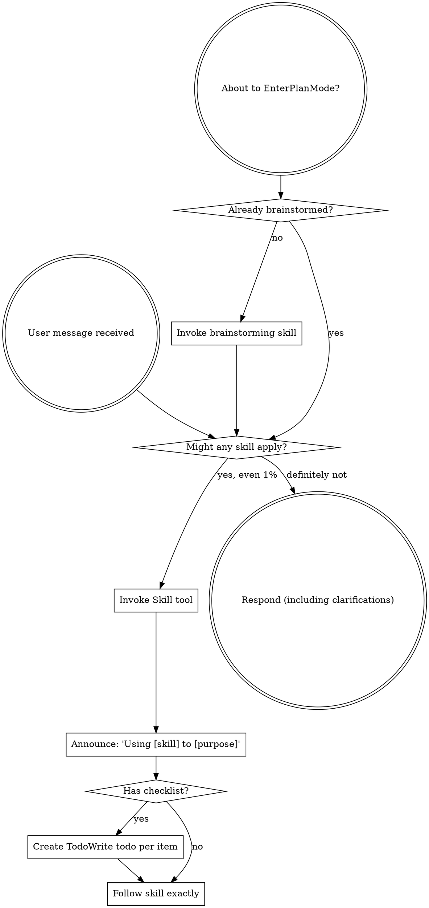

# Boundary Review — parley.nvim#201 (whole-issue close)

| field | value |
|-------|-------|
| issue | 201 — Reflow definition diagnostics at display width |
| repo | parley.nvim |
| issue file | workshop/issues/000201-reflow-definition-diagnostics-at-display-width.md |
| boundary | whole-issue close |
| milestone | — |
| window | eef7047fded5bf75a2b3a052f389f7f24c062a77..HEAD |
| command | sdlc close --issue 201 |
| reviewer | codex |
| timestamp | 2026-08-18T20:48:14-07:00 |
| verdict | FIX-THEN-SHIP |

## Review

Reading additional input from stdin...
OpenAI Codex v0.147.0
--------
workdir: /Users/xianxu/workspace/parley.nvim
model: gpt-5.6-sol
provider: openai
approval: never
sandbox: workspace-write [workdir, /tmp, $TMPDIR, /tmp] (network access enabled)
reasoning effort: medium
reasoning summaries: none
session id: 01a0181f-91cf-7a60-8661-532f9a4041b6
--------
user
# Code review — the one SDLC boundary review

You are conducting a fresh-context code review at a development boundary —
whole-issue close — in the **parley.nvim** repository.

- repository: parley.nvim   (root: /Users/xianxu/workspace/parley.nvim)
- issue:      parley.nvim#201   (file: workshop/issues/000201-reflow-definition-diagnostics-at-display-width.md)
- window:     Base: eef7047fded5bf75a2b3a052f389f7f24c062a77   Head: HEAD

Review the **parley.nvim** repo and its tracker — the ariadne base-layer repo itself (changes here propagate to dependent repos). Do not assume any
other repository or apply another repo's conventions.

You have no prior session context — that is the anti-collusion property. Verify
behavior against the issue's documented Spec/Plan and the code itself; do NOT
take the implementor's word in commit messages or docs at face value. Tools are
read-only: report findings precisely; the main agent (which has session context)
applies the fixes, commits, and re-runs.

Read the diff against the issue's Spec + Plan, then work the checklist below.
Categorize every finding by severity — not everything is Critical; a nitpick
marked Critical is noise.

  Critical (must fix before crossing the boundary)
    - correctness bugs; crashes / panics on unexpected input
    - behavior drift from stated contracts (for ports of existing code where
      byte-faithfulness was promised, diff against the source)
    - silent error swallowing where the source raised
  Important (fix before the boundary if cheap)
    - API design of newly-introduced internal packages (downstream work will
      consume them; is the surface stable?)
    - missing test coverage that would catch the kind of bug shipped
    - inconsistent error handling across the diff
  Minor (note for future)
    - style nits, naming, comment density; performance only if hot-path

## Review checklist

Code quality
  - Clean separation of concerns; edge cases handled (empty / nil / unexpected).
  - Proper error handling — no silent swallowing where the source raised.
  - No duplicated logic / copy-paste that should be a shared helper.

Testing
  - Tests pin real logic, not mocks reasserting the implementation.
  - The kind of bug this diff could ship is covered.
  - PURE entities tested without IO; INTEGRATION via injected fakes (see below).

Requirements traceability
  - Every Plan checklist item this boundary claims is actually delivered.
  - Implementation matches the Spec; no undeclared scope creep.
  - Breaking changes documented.

Production readiness
  - Migration / backward-compatibility considered where state or formats change.
  - Docs / atlas updated for new surface (see the Docs update gate).

## Plan-gate carry-forward (ariadne#187)

Read `workshop/plans/<issue-stem>-plan-gate.md` if it exists — the durable ledger of the
pre-implementation plan gate. It holds the findings that gate raised but deliberately did
NOT block on: Minor findings, and blocking ones demoted once the round cap was reached.
They were deferred to THIS boundary by design — that deferral is only safe because you
pick them up.

For each finding still listed under `## Open findings`, confirm the code either addresses
it or that it no longer applies. A still-valid deferred finding is a finding here, at its
original severity.

## Core concepts cross-check (if the plan has a Core concepts table)

The plan should list entities in a greppable table — name, kind
(PURE/INTEGRATION), file location, status (new/modified/deleted). For each row:
  - Verify the entity exists at the stated path (grep the diff or filesystem).
  - PURE: tests run without IO (no exec, net, mutable fs). If tests need mocks
    to run, it isn't really PURE — flag Critical and recommend promoting it to
    INTEGRATION.
  - INTEGRATION: injected into pure callers, not invoked directly from business
    logic.
  - "modified" / "deleted": the diff shows the expected change/removal at the
    stated location.
Any contradiction between table and code = Critical finding, plus a plan-revision
recommendation (a "## Revisions" entry so the plan stops claiming what the code
doesn't deliver).

## Docs update gate (atlas + README, per AGENTS.md §8)

The boundary should update user-facing docs for any new surface introduced:

  - **atlas/** — new architectural surface, flow, or terminology. Scan the diff
    for new entity types, subcommands, conventions, file-tree locations. Any
    present without corresponding atlas/ changes in the same range = Important
    finding ("atlas update appears missing for <surface>").
  - **README.md** — new user-facing surface a reader runs or types: subcommands,
    flags, keybindings, config keys, install/usage steps. If the diff adds or
    changes such surface and README.md is not updated in the same range =
    Important finding ("README update appears missing for <surface>"). This is the
    class of gap that used to surface only at the merge-time `specs` judge (#142);
    catch it here, at the earliest gate, before the close verdict is recorded.

## Architecture (the at-review backstop — these matter most long-term)

Work through each of ARCH-DRY, ARCH-PURE, ARCH-PURPOSE, ARCH-MOCK explicitly, applying its at-review lens. The
full principle definitions are delivered in the ARCHITECTURE PRINCIPLES block
right after this prompt — for EACH marker, state pass or flag, and cite the
marker (e.g. ARCH-DRY) in any finding. Architecture is where review has the
least training signal and the longest-delayed payoff, so be deliberate here, not
holistic.

## Verdict + output

Begin your response with this fenced verdict block — the machine-read handoff:

```verdict
verdict: <SHIP | FIX-THEN-SHIP | REWORK>
confidence: <high | medium | low>
```

  SHIP           ready; ship it
  FIX-THEN-SHIP  ship after addressing the findings (non-blocking at the gate)
  REWORK         blocking; needs rework before shipping — fix + re-run

The fenced ```` ```verdict ```` block above is the **authoritative machine-read
handoff** — emit it as the first thing in your response. (A prose
`VERDICT: <TOKEN>` first line still satisfies the legacy contract as a fallback,
but the block is what the binary trusts.)

After the verdict block: a 1-paragraph summary — what worked, what blocks SHIP if
it isn't — followed by:
  1. Strengths: 2-5 specific things done well (file:line where useful). Affirm
     validated approaches so the operator knows what's confirmed-good ground.
     Empty acceptable for trivial boundaries.
  2. Critical findings (file:line + fix sketch); empty if none.
  3. Important findings (same format).
  4. Minor findings (terse one-liners).
  5. Test coverage notes.
  6. Architectural notes for upcoming work.
  7. Plan revision recommendations: specific "## Revisions" entries the plan
     needs (empty if the plan still matches the code).


ARCHITECTURE PRINCIPLES — work through each of the 4 entries below explicitly, applying its `at-review` lens; cite the marker (e.g. ARCH-DRY) in any finding.

# Architecture principles (ARCH-*)

Injected architectural taste — the structural decisions whose payoff (or cost)
shows up many turns, often months, down the road. Agents are strong at local
tactics and weak here, so these are checked **at-plan** (when the design is being
made — highest leverage) and **at-review** (backstop, on the diff). Cite the
marker (e.g. `ARCH-DRY`) in plans, `## Log` entries, and review findings.

This file is the single source; it is embedded into the planning, plan-quality,
and code-review prompts. The human narrative lives in AGENTS.md "Core Design
Principles"; this is its machine-delivered companion.

## ARCH-DRY — Don't Repeat Yourself

- **principle:** Reuse before adding. One source of truth per fact/behavior; no
  duplicated logic, copy-pasted blocks, or parallel functions that should be one
  shared helper.
- **at-plan:** Flag a plan that re-implements something the codebase already has,
  or that will obviously duplicate logic across the new files instead of
  extracting a shared helper. Name the existing thing it should reuse.
- **at-review:** Flag duplicated logic / copy-pasted blocks / near-identical
  functions in the diff; point at the consolidation (file:line + the shared
  helper they should become).

## ARCH-PURE — Pure core, thin IO shell

- **principle:** The majority of code is pure functions (deterministic, no side
  effects); a thin "glue" layer at the boundary touches IO/UI/network/clock. Pure
  functions are unit-tested directly; the glue is kept small and injected.
- **at-plan:** Flag a design that buries business logic inside IO/handlers, or
  that will only be testable with heavy mocks (a sign logic isn't separated from
  IO). The plan should name what's pure vs the thin IO seam.
- **at-review:** Flag business logic mixed with IO in the diff; logic that should
  be a pure function injected into a thin caller. If a test needs mocks to run a
  "pure" entity, it isn't pure — recommend extracting the IO to the boundary.

## ARCH-PURPOSE — Serve the issue's actual purpose

- **principle:** Deliver the issue's stated purpose, not the easy subset of it. A
  single-source / "compiled to consumers" change is not done until **every
  consumer derives** from the source — the source is *enforced*, not just
  documentation a surface happens to restate; a hand-maintained restatement of the
  model is a deferred consumer, not a finished one. "Follow-up" is for separable
  extensions, never for the thing that is the point. This is the *opposite axis*
  from Simplicity-First/YAGNI: not "build for an imagined future," but "don't
  **under**-deliver the purpose you already committed to."
- **at-plan:** Flag a plan whose scope is a strict subset of the issue's stated
  goal / Done-when where the part deferred as "follow-up" *is* the purpose (e.g.
  wires one consumer + enforcement but leaves the consumers that motivated the
  issue as documentation that doesn't derive). Ask: does the plan fulfill the
  purpose, or just the cheap win? Name the deferred purpose.
- **at-review:** Does the diff *fulfill* the purpose or settle for the easy win?
  For a single-source change, run the **shadow-sweep** — enumerate the consumers,
  confirm each derives from the source, flag any remaining hand-maintained
  restatement of the model. A "follow-up" that is actually the deferred point of
  the issue is a finding, not a deferral.

## ARCH-MOCK — Stateful external doubles

- **principle:** Every external binary or service dependency the system relies on
  has a stateful fake behind the same seam, modeling our current understanding of
  the dependency's behavior across calls. For libraries, services, and binaries we
  own, the storage/backend layer is backed by a portable folder of files and/or
  database configuration, so the component can be spun up without depending on
  production configuration or production databases. Integration and end-to-end
  tests run against the fake; scheduled/live conformance checks compare the
  fake's modeled behavior with the real binary or service so drift is detected
  and corrected.
- **at-plan:** Flag a design that shells out to, or calls, an external binary or
  service without naming the seam and stateful fake. For owned libraries, services,
  and binaries, also flag any design whose storage/backend depends on production
  configuration or databases instead of a portable file folder and/or database
  configuration. The plan should identify the dependency surface consumed, the
  fake's persisted state model, the owned component's portable backend shape,
  the integration or end-to-end tests that run against it, and the live
  conformance check cadence.
  Examples include `git`, GitHub/`gh`, and Google OAuth.
- **at-review:** Flag direct external calls outside the seam, stateless mocks for
  stateful interactions, tests that cannot run the stack against the fake, owned
  components that cannot boot from portable non-production storage/backend
  configuration, or a missing live conformance check for behavior we depend on. A
  fake satisfies this only when production flow and test flow share the same
  boundary.


OUTPUT CONTRACT (machine-read — do not deviate). LEAD your response with the
fenced ```verdict block shown above — that is the authoritative handoff the binary
reads (its `verdict:` value is one of the listed tokens). Everything after the block
is advisory: a non-blocking verdict WITH findings still PASSES the gate. A bare
`VERDICT: <TOKEN>` line is accepted only as a FALLBACK when the block is absent.

Diff:
diff --git a/atlas/chat/inline_define.md b/atlas/chat/inline_define.md
index 499ffc6..9192b63 100644
--- a/atlas/chat/inline_define.md
+++ b/atlas/chat/inline_define.md
@@ -15,6 +15,9 @@ made the definition durable as a managed footnote; [#167](../../workshop/issues/
 narrowed the visible decoration to the selected term plus footnote reference;
 [#172](../../workshop/issues/000172-markdown-footnote-diagnostics.md)
 rehydrates persisted managed footnotes in all markdown buffers.
+[#201](../../workshop/issues/000201-reflow-definition-diagnostics-at-display-width.md)
+made definition storage and diagnostic payloads width-independent and moved
+display-cell wrapping to each rendered surface.
 
 ## Flow
 
@@ -47,10 +50,11 @@ rehydrates persisted managed footnotes in all markdown buffers.
    `DiffChange` (`skill_render.highlight_span`); **(c)** refreshes persisted
    footnote diagnostics (`skill_render.refresh_footnote_diagnostics`), which
    parses the managed footer and sets INFO `vim.diagnostic` entries on matching
-   inline `term[^id]` spans (`define.format_definition` →
-   `skill_render.format_diagnostic_message`) on the `parley_skill` namespace;
+   inline `term[^id]` spans with canonical, unwrapped messages from
+   `define.format_definition` on the `parley_skill` namespace;
    **(d)** records the undo/redo projection states.
-   `diag_display` opens a centered, non-focusable diagnostic float when the
+   `diag_display` wraps that semantic message in display cells at the float's
+   actual inner width and opens the centered, non-focusable float when the
    cursor is on the term/footnote anchor span. A no-`emit_definition` response,
    stale selection, cancellation, provider failure, or deleted buffer leaves no
    footnote reference/footer and no pending spinner.
@@ -72,17 +76,25 @@ watcher doesn't mistake it for a user edit.
 ## Pure core vs IO shell (ARCH-PURE)
 
 - **Pure** (`lua/parley/define.lua`, unit-tested with plain tables): `slice_selection`,
-  `context_for_selection`, `format_definition`, `bracket_edit` (plans the `[term]`
+  `context_for_selection`, `normalize_definition`, `format_definition`,
+  `bracket_edit` (plans the `[term]`
   wrap as a legacy set_lines edit), `diagnostic_span_after_bracket` (legacy range
   mapping), `apply_definition_footnote` (durable footer transform), and
   `strip_definition_footnote_footer` / `footnote_diagnostics` (treat the first
   markdown footnote definition line as the managed footer boundary).
+- **Pure display shaping** (`lua/parley/diagnostic_text.lua`): `wrap_rows`
+  preserves semantic newline rows while greedily wrapping horizontal prose by
+  an injected display-cell measurement. The same helper splits overlong UTF-8
+  tokens safely for review virtual lines and the definition float.
 - **IO shell** (`lua/parley/init.lua`): `define_visual`, `render_definition`;
   `lua/parley/selection_spinner.lua` owns immediate selection-anchored progress;
   `lua/parley/buffer_edit.lua` owns the full-buffer footnote rewrite;
   `lua/parley/skill_render.lua` publishes footnote diagnostics; and
   `lua/parley/highlighter.lua` refreshes them from chat and markdown lifecycle
-  hooks.
+  hooks. `lua/parley/skills/review/diag_display.lua` measures the narrowest
+  visible buffer window for shared virtual lines and the definition float's
+  inner width, then rerenders tracked buffers on cursor movement, window entry,
+  and `WinResized` without changing the diagnostic payload.
 - **External service** (Anthropic) exercised via the process-level fake reused
   from `skill_invoke_spec` (SSE tool-call injection).
 
@@ -159,15 +171,18 @@ tool-call args (`result.calls[1].input`), read in `on_done`.
 - `lua/parley/init.lua` — `define_visual`, `render_definition`, `chat_define` wiring.
 - `lua/parley/highlighter.lua` — chat/markdown buffer lifecycle refresh hooks.
 - `lua/parley/skill_render.lua` — footnote diagnostic refresh in the shared namespace.
+- `lua/parley/diagnostic_text.lua` — pure semantic-row/display-cell wrapper.
+- `lua/parley/skills/review/diag_display.lua` — measured virtual-line and definition-float rendering lifecycle.
 - `lua/parley/chat_respond.lua` — strips managed footnote footer from LLM messages.
 - `lua/parley/skills/define/init.lua` — the unforced `define` skill.
 - `lua/parley/tools/builtin/emit_definition.lua` — output-only structured tool.
 - `lua/parley/selection_spinner.lua` — immediate inline canonical spinner and idempotent teardown.
 - `lua/parley/skill_invoke.lua` — `opts.no_reload` / `opts.document`, optional detached progress, and terminal cleanup seams.
 - `lua/parley/config.lua`, `lua/parley/keybinding_registry.lua` — the `<M-CR>` split.
-- `tests/unit/define_spec.lua`, `tests/integration/define_spec.lua`, and
-  `tests/integration/skill_invoke_spec.lua` — pure, inline lifecycle, and shared
-  terminal coverage.
+- `tests/unit/define_spec.lua`, `tests/unit/diagnostic_text_spec.lua`,
+  `tests/integration/define_spec.lua`, `tests/integration/review_diag_display_spec.lua`,
+  and `tests/integration/skill_invoke_spec.lua` — pure, width/reflow, inline
+  lifecycle, and shared terminal coverage.
 
 ## Related
 
diff --git a/lua/parley/define.lua b/lua/parley/define.lua
index f7a5077..bdd3f4c 100644
--- a/lua/parley/define.lua
+++ b/lua/parley/define.lua
@@ -63,21 +63,26 @@ function M.context_for_selection(parsed_chat, sel_line, all_lines, find_exchange
     return table.concat(slice, "\n")
 end
 
---- Compose the diagnostic message ("TERM — definition"), hard-wrapped to width.
---- Delegates wrapping to skill_render's diagnostic formatter (the same wrap the
---- review path uses).
+--- Canonicalize a generated definition as one semantic paragraph.
+--- @param definition string|nil
+--- @return string
+function M.normalize_definition(definition)
+    local normalized = tostring(definition or ""):gsub("%s+", " ")
+    normalized = normalized:gsub("^%s+", ""):gsub("%s+$", "")
+    if normalized == "" then
+        return "(no definition)"
+    end
+    return normalized
+end
+
+--- Compose the semantic diagnostic message ("TERM — definition"). Presentation
+--- wrapping belongs to the display surface because its available width can
+--- change independently of diagnostic creation.
 --- @param term string|nil
 --- @param definition string|nil
---- @param width integer|nil
 --- @return string
-function M.format_definition(term, definition, width)
-    definition = definition or ""
-    definition = (definition:gsub("%s+$", "")) -- parens → keep only the string
-    if definition == "" then
-        definition = "(no definition)"
-    end
-    local head = tostring(term or "") .. " — " .. definition
-    return require("parley.skill_render").format_diagnostic_message(head, width)
+function M.format_definition(term, definition)
+    return tostring(term or "") .. " — " .. M.normalize_definition(definition)
 end
 
 --- Plan the reference-bracket wrap of the selection ([term]) as a set_lines edit
@@ -152,11 +157,7 @@ end
 --- @param definition string|nil
 --- @return string
 function M.format_footnote_line(id, definition)
-    definition = trim(definition)
-    if definition == "" then
-        definition = "(no definition)"
-    end
-    return string.format("[^%s]: %s", id, definition)
+    return string.format("[^%s]: %s", id, M.normalize_definition(definition))
 end
 
 local function is_divider(line)
@@ -216,11 +217,7 @@ local function parse_footnote_line(line)
     if not id then
         return nil
     end
-    definition = trim(definition)
-    if definition == "" then
-        definition = "(no definition)"
-    end
-    return id, definition
+    return id, M.normalize_definition(definition)
 end
 
 local function parse_structured_definition(definition)
@@ -229,13 +226,9 @@ local function parse_structured_definition(definition)
         term, body = definition:match("^`([^`]+)`%s*%.?%s*(.*)$")
     end
     if not term then
-        return nil, definition
+        return nil, M.normalize_definition(definition)
     end
-    body = trim(body)
-    if body == "" then
-        body = "(no definition)"
-    end
-    return term, body
+    return term, M.normalize_definition(body)
 end
 
 local function is_term_byte(ch)
@@ -451,10 +444,7 @@ function M.apply_definition_footnote(lines, l1, c1, l2, c2, term, definition)
         end
     end
     out = replace_or_append_footnote(out, id, definition)
-    local normalized_definition = trim(definition)
-    if normalized_definition == "" then
-        normalized_definition = "(no definition)"
-    end
+    local normalized_definition = M.normalize_definition(definition)
     return {
         lines = out,
         id = id,
diff --git a/lua/parley/diagnostic_text.lua b/lua/parley/diagnostic_text.lua
new file mode 100644
index 0000000..d6fe2e0
--- /dev/null
+++ b/lua/parley/diagnostic_text.lua
@@ -0,0 +1,76 @@
+-- Pure display-row shaping for semantic diagnostic messages.
+-- Neovim-specific width measurement is injected by the UI shell.
+
+local M = {}
+
+local function utf8_chars(text)
+    return text:gmatch("[%z\1-\127\194-\244][\128-\191]*")
+end
+
+local function split_token(token, width, display_width)
+    local fragments = {}
+    local current = ""
+    for char in utf8_chars(token) do
+        local candidate = current .. char
+        if current ~= "" and display_width(candidate) > width then
+            fragments[#fragments + 1] = current
+            current = char
+        else
+            current = candidate
+        end
+    end
+    if current ~= "" then
+        fragments[#fragments + 1] = current
+    end
+    return fragments
+end
+
+local function wrap_semantic_row(row, width, display_width)
+    local rows = {}
+    local current = ""
+    local found_word = false
+
+    for token in row:gmatch("%S+") do
+        found_word = true
+        local fragments = split_token(token, width, display_width)
+        for index, fragment in ipairs(fragments) do
+            local separator = index == 1 and current ~= "" and " " or ""
+            local candidate = current .. separator .. fragment
+            if current ~= "" and display_width(candidate) > width then
+                rows[#rows + 1] = current
+                current = fragment
+            else
+                current = candidate
+            end
+        end
+    end
+
+    if not found_word then
+        return { "" }
+    end
+    rows[#rows + 1] = current
+    return rows
+end
+
+--- Convert semantic text into rows bounded by a display-cell width.
+--- Explicit newlines remain row boundaries; horizontal whitespace is rendered
+--- as a single space. Width measurement is injected so this module stays pure.
+--- @param text string|nil
+--- @param width integer|nil
+--- @param display_width fun(text:string):integer
+--- @return string[]
+function M.wrap_rows(text, width, display_width)
+    assert(type(display_width) == "function", "display_width must be a function")
+    width = math.max(2, math.floor(tonumber(width) or 2))
+
+    local rows = {}
+    for semantic_row in (tostring(text or "") .. "\n"):gmatch("(.-)\n") do
+        local wrapped = wrap_semantic_row(semantic_row, width, display_width)
+        for _, row in ipairs(wrapped) do
+            rows[#rows + 1] = row
+        end
+    end
+    return rows
+end
+
+return M
diff --git a/lua/parley/skill_render.lua b/lua/parley/skill_render.lua
index 2450fa9..ab84760 100644
--- a/lua/parley/skill_render.lua
+++ b/lua/parley/skill_render.lua
@@ -49,66 +49,6 @@ function M.diag_namespace()
     return diag_ns_id
 end
 
---- Hard-wrap text to `width` columns at word boundaries (greedy), preserving any
---- existing newlines. PURE. Lets `virtual_lines` render a long "why" as multiple
---- wrapped rows (nvim doesn't soft-wrap virtual text). A word longer than width
---- stays on its own (overflowing) line rather than being split. (#133 M6)
---- @param text string
---- @param width number|nil  default 76
---- @return string
-function M.wrap(text, width)
-    width = width or 76
-    local out = {}
-    for para in (tostring(text) .. "\n"):gmatch("(.-)\n") do
-        if para == "" then
-            table.insert(out, "")
-        else
-            local line = ""
-            for word in para:gmatch("%S+") do
-                if line == "" then
-                    line = word
-                elseif #line + 1 + #word <= width then
-                    line = line .. " " .. word
-                else
-                    table.insert(out, line)
-                    line = word
-                end
-            end
-            table.insert(out, line)
-        end
-    end
-    return table.concat(out, "\n")
-end
-
--- Usable wrap width for the virtual_lines "why": the window's text columns
--- (total width minus the number/sign/fold gutter, via getwininfo.textoff) minus
--- a margin for the indent + connector nvim renders under the line. Wrapping to a
--- fixed 76 overflowed the indented virtual_lines and truncated the right edge
--- (#133 review). Falls back to 76 with no window.
-local function diag_wrap_width()
-    local ok, info = pcall(function()
-        return vim.fn.getwininfo(vim.api.nvim_get_current_win())[1]
-    end)
-    if not ok or type(info) ~= "table" then
-        return 76
-    end
-    return math.max(30, (info.width or 80) - (info.textoff or 0) - 10)
-end
-
---- Current usable wrap width for Parley diagnostic virtual lines.
---- @return integer
-function M.diagnostic_wrap_width()
-    return diag_wrap_width()
-end
-
---- Format a diagnostic message for Neovim virtual_lines display.
---- @param text string
---- @param width number|nil default current diagnostic display width
---- @return string
-function M.format_diagnostic_message(text, width)
-    return M.wrap(text, width or M.diagnostic_wrap_width())
-end
-
 local function is_footnote_diagnostic(diagnostic)
     local user_data = diagnostic.user_data or {}
     return diagnostic.source == FOOTNOTE_SOURCE or user_data.parley_kind == "footnote"
@@ -139,7 +79,6 @@ function M.refresh_footnote_diagnostics(buf, opts)
     local define = require("parley.define")
     local reader = opts.reader or require("parley.line_reader").for_buffer(buf)
     local lines = reader:lines(0, -1, false)
-    local width = M.diagnostic_wrap_width()
     local diagnostics = {}
     vim.api.nvim_buf_clear_namespace(buf, footnote_hl_ns_id, 0, -1)
 
@@ -156,7 +95,7 @@ function M.refresh_footnote_diagnostics(buf, opts)
             col = footnote.col,
             end_lnum = footnote.end_lnum or footnote.lnum,
             end_col = footnote.end_col,
-            message = define.format_definition(footnote.term or footnote.id, footnote.definition, width),
+            message = define.format_definition(footnote.term or footnote.id, footnote.definition),
             severity = vim.diagnostic.severity.INFO,
             source = FOOTNOTE_SOURCE,
             user_data = { parley_kind = "footnote" },
@@ -185,14 +124,12 @@ end
 
 --- Attach INFO diagnostics from edit explanations. Each diagnostic spans the
 --- edit's line range (lnum..end_lnum) so "cursor in the region" matches, and its
---- message is hard-wrapped to the window's usable width for `virtual_lines`
---- display (no right-edge truncation). (#133 M6)
+--- message remains semantic; each consumer wraps it to its actual display width.
 --- @param buf number
 --- @param edits table[]  applied edits with {pos, explain, new_string?}
 --- @param original_content string  file content before edits
 function M.attach_diagnostics(buf, edits, original_content)
     ensure_namespaces()
-    local width = M.diagnostic_wrap_width()
     local diagnostics = {}
     for _, edit in ipairs(edits) do
         local line_num = 0
@@ -209,7 +146,7 @@ function M.attach_diagnostics(buf, edits, original_content)
             lnum = line_num,
             end_lnum = line_num + span,
             col = 0,
-            message = M.format_diagnostic_message(edit.explain or "edit applied", width),
+            message = tostring(edit.explain or "edit applied"),
             severity = vim.diagnostic.severity.INFO,
             source = "parley-skill",
         })
diff --git a/lua/parley/skills/review/diag_display.lua b/lua/parley/skills/review/diag_display.lua
index 9447db2..bc053ac 100644
--- a/lua/parley/skills/review/diag_display.lua
+++ b/lua/parley/skills/review/diag_display.lua
@@ -22,6 +22,9 @@ local display_ns_id
 local display_augroup
 local float_win
 local float_buf
+local float_owner_buf
+local tracked_buffers = {}
+local lifecycle_registered = false
 
 -- Parley's review diagnostic namespace — single-sourced from skill_render (which
 -- owns the namespace) so the identity isn't a duplicated literal (#133 M6 review).
@@ -38,6 +41,7 @@ local function close_float()
     end
     float_win = nil
     float_buf = nil
+    float_owner_buf = nil
 end
 
 local function ensure_display()
@@ -53,24 +57,56 @@ end
 
 local function clear(buf)
     ensure_display()
-    close_float()
+    if float_owner_buf == buf then
+        close_float()
+    end
     if vim.api.nvim_buf_is_valid(buf) then
         vim.api.nvim_buf_clear_namespace(buf, display_ns_id, 0, -1)
-        pcall(vim.api.nvim_clear_autocmds, { group = display_augroup, buffer = buf })
     end
 end
 
-local function current_pos_for(buf)
-    if vim.api.nvim_get_current_buf() ~= buf then
+local function windows_for_buffer(buf)
+    local wins = {}
+    for _, win in ipairs(vim.api.nvim_tabpage_list_wins(0)) do
+        if vim.api.nvim_win_is_valid(win) and vim.api.nvim_win_get_buf(win) == buf then
+            wins[#wins + 1] = win
+        end
+    end
+    return wins
+end
+
+local function position_for_buffer(buf)
+    local current = vim.api.nvim_get_current_win()
+    local win = vim.api.nvim_win_get_buf(current) == buf and current or windows_for_buffer(buf)[1]
+    if not win then
         return nil
     end
-    local pos = vim.api.nvim_win_get_cursor(0)
-    return pos[1] - 1, pos[2]
+    local pos = vim.api.nvim_win_get_cursor(win)
+    return pos[1] - 1, pos[2], win
 end
 
-local function diagnostic_message_lines(diagnostic)
+local function virtual_line_width(buf)
+    local width
+    for _, win in ipairs(windows_for_buffer(buf)) do
+        local info = vim.fn.getwininfo(win)[1] or {}
+        local usable = math.max(2, (info.width or vim.api.nvim_win_get_width(win)) - (info.textoff or 0) - DISPLAY_COL)
+        width = width and math.min(width, usable) or usable
+    end
+    return width or 76
+end
+
+--- Shape one diagnostic for the custom virtual-line display.
+--- @param diagnostic table
+--- @param width integer
+--- @return table[]
+function M.diagnostic_message_lines(diagnostic, width)
     local lines = {}
-    for _, line in ipairs(vim.split(tostring(diagnostic.message or ""), "\n", { plain = true })) do
+    local rows = require("parley.diagnostic_text").wrap_rows(
+        diagnostic.message or "",
+        width,
+        vim.fn.strdisplaywidth
+    )
+    for _, line in ipairs(rows) do
         table.insert(lines, { { line ~= "" and line or " ", MESSAGE_HL } })
     end
     if #lines == 0 then
@@ -79,10 +115,15 @@ local function diagnostic_message_lines(diagnostic)
     return lines
 end
 
-local function diagnostic_float_lines(diagnostics)
+local function diagnostic_float_lines(diagnostics, width)
     local lines = { "Diagnostics:" }
     for _, diagnostic in ipairs(diagnostics or {}) do
-        for _, line in ipairs(vim.split(tostring(diagnostic.message or ""), "\n", { plain = true })) do
+        local rows = require("parley.diagnostic_text").wrap_rows(
+            diagnostic.message or "",
+            width,
+            vim.fn.strdisplaywidth
+        )
+        for _, line in ipairs(rows) do
             table.insert(lines, line ~= "" and line or " ")
         end
     end
@@ -117,18 +158,22 @@ local function diagnostic_visible_at(diagnostic, line, col)
     return diagnostic_contains_line(diagnostic, line)
 end
 
-local function float_config(win, line_count)
+local function float_content_width(win)
+    local win_width = vim.api.nvim_win_get_width(win)
+    return math.max(2, math.min(math.floor(win_width * 0.8), win_width - 2))
+end
+
+local function float_config(win, width, line_count)
     local win_width = vim.api.nvim_win_get_width(win)
     local win_height = vim.api.nvim_win_get_height(win)
-    local width = math.max(1, math.floor(win_width * 0.8))
     local height = math.max(1, math.min(line_count, math.max(1, win_height - 2)))
     return {
         relative = "win",
         win = win,
         width = width,
         height = height,
-        row = math.min(vim.fn.winline(), math.max(0, win_height - height)),
-        col = math.floor((win_width - width) / 2),
+        row = math.min(vim.fn.winline(), math.max(0, win_height - height - 2)),
+        col = math.max(0, math.floor((win_width - width - 2) / 2)),
         style = "minimal",
         border = "rounded",
         focusable = false,
@@ -137,21 +182,22 @@ local function float_config(win, line_count)
     }
 end
 
-local function show_float(diagnostics)
+local function show_float(buf, diagnostics, win)
     close_float()
     if #diagnostics == 0 then
         return
     end
-    local win = vim.api.nvim_get_current_win()
-    local lines = diagnostic_float_lines(diagnostics)
+    local width = float_content_width(win)
+    local lines = diagnostic_float_lines(diagnostics, width)
     float_buf = vim.api.nvim_create_buf(false, true)
     vim.api.nvim_buf_set_option(float_buf, "buftype", "nofile")
     vim.api.nvim_buf_set_option(float_buf, "bufhidden", "wipe")
     vim.api.nvim_buf_set_option(float_buf, "modifiable", true)
     require("parley.buffer_edit").replace_all_lines(float_buf, lines)
     vim.api.nvim_buf_set_option(float_buf, "modifiable", false)
-    float_win = vim.api.nvim_open_win(float_buf, false, float_config(win, #lines))
-    vim.api.nvim_win_set_option(float_win, "wrap", true)
+    float_win = vim.api.nvim_open_win(float_buf, false, float_config(win, width, #lines))
+    float_owner_buf = buf
+    vim.api.nvim_win_set_option(float_win, "wrap", false)
     vim.api.nvim_win_set_option(float_win, "winhl", "NormalFloat:NormalFloat,FloatBorder:FloatBorder")
 end
 
@@ -161,13 +207,16 @@ local function render(buf, diagnostics, current_line_only)
         return
     end
     vim.api.nvim_buf_clear_namespace(buf, display_ns_id, 0, -1)
-    close_float()
 
-    local line, col
+    local line, col, position_win
     if current_line_only then
-        line, col = current_pos_for(buf)
+        line, col, position_win = position_for_buffer(buf)
     end
-    if current_line_only and not line then
+    local is_current = vim.api.nvim_get_current_buf() == buf
+    if is_current or float_owner_buf == buf then
+        close_float()
+    end
+    if current_line_only and line == nil then
         return
     end
 
@@ -186,15 +235,18 @@ local function render(buf, diagnostics, current_line_only)
     table.sort(footnote_diagnostics, function(a, b)
         return (a.col or 0) < (b.col or 0)
     end)
-    show_float(footnote_diagnostics)
+    if is_current then
+        show_float(buf, footnote_diagnostics, position_win or vim.api.nvim_get_current_win())
+    end
 
+    local width = virtual_line_width(buf)
     for lnum, line_diagnostics in pairs(by_line) do
         table.sort(line_diagnostics, function(a, b)
             return (a.col or 0) < (b.col or 0)
         end)
         local virt_lines = { { { "Diagnostics:", HEADER_HL } } }
         for _, diagnostic in ipairs(line_diagnostics) do
-            vim.list_extend(virt_lines, diagnostic_message_lines(diagnostic))
+            vim.list_extend(virt_lines, M.diagnostic_message_lines(diagnostic, width))
         end
         vim.api.nvim_buf_set_extmark(buf, display_ns_id, lnum, DISPLAY_COL, {
             virt_lines = virt_lines,
@@ -203,6 +255,63 @@ local function render(buf, diagnostics, current_line_only)
     end
 end
 
+local function refresh_tracked(buf)
+    if M.enabled and tracked_buffers[buf] and vim.api.nvim_buf_is_valid(buf) then
+        render(buf, vim.diagnostic.get(buf, { namespace = ns() }), true)
+    end
+end
+
+local function ensure_lifecycle()
+    ensure_display()
+    if lifecycle_registered then
+        return
+    end
+    lifecycle_registered = true
+    vim.api.nvim_create_autocmd({ "CursorMoved", "WinEnter", "WinResized", "BufWipeout" }, {
+        group = display_augroup,
+        callback = function(args)
+            if args.event == "BufWipeout" then
+                tracked_buffers[args.buf] = nil
+                if float_owner_buf == args.buf then
+                    close_float()
+                end
+                return
+            end
+
+            if args.event == "WinEnter" and float_owner_buf
+                and float_owner_buf ~= vim.api.nvim_get_current_buf()
+            then
+                close_float()
+            end
+
+            if args.event == "WinResized" then
+                local affected = {}
+                for _, win in ipairs((vim.v.event or {}).windows or {}) do
+                    if vim.api.nvim_win_is_valid(win) then
+                        affected[vim.api.nvim_win_get_buf(win)] = true
+                    end
+                end
+                if next(affected) == nil then
+                    affected = tracked_buffers
+                end
+                for buf in pairs(affected) do
+                    refresh_tracked(buf)
+                end
+                return
+            end
+
+            refresh_tracked(vim.api.nvim_get_current_buf())
+        end,
+    })
+end
+
+local function stop_lifecycle()
+    if display_augroup then
+        pcall(vim.api.nvim_clear_autocmds, { group = display_augroup })
+    end
+    lifecycle_registered = false
+end
+
 local function register_handler()
     ensure_display()
     vim.diagnostic.handlers[HANDLER_NAME] = {
@@ -215,13 +324,7 @@ local function register_handler()
             local current_line_only = handler_opts.current_line == true
             clear(bufnr)
             if current_line_only then
-                vim.api.nvim_create_autocmd("CursorMoved", {
-                    buffer = bufnr,
-                    group = display_augroup,
-                    callback = function()
-                        render(bufnr, diagnostics, true)
-                    end,
-                })
+                tracked_buffers[bufnr] = true
             end
             render(bufnr, diagnostics, current_line_only)
         end,
@@ -229,7 +332,9 @@ local function register_handler()
             if namespace ~= ns() then
                 return
             end
-            clear(vim._resolve_bufnr(bufnr))
+            bufnr = vim._resolve_bufnr(bufnr)
+            tracked_buffers[bufnr] = nil
+            clear(bufnr)
         end,
     }
 end
@@ -239,6 +344,7 @@ function M.refresh(buf)
         return
     end
     buf = buf or vim.api.nvim_get_current_buf()
+    tracked_buffers[buf] = true
     render(buf, vim.diagnostic.get(buf, { namespace = ns() }), true)
 end
 
@@ -247,6 +353,9 @@ end
 function M.set(on)
     M.enabled = on and true or false
     register_handler()
+    if M.enabled then
+        ensure_lifecycle()
+    end
     vim.diagnostic.config({
         [HANDLER_NAME] = M.enabled and { current_line = true } or false,
         virtual_lines = false,
@@ -258,6 +367,8 @@ function M.set(on)
         for _, buf in ipairs(vim.api.nvim_list_bufs()) do
             clear(buf)
         end
+        tracked_buffers = {}
+        stop_lifecycle()
     end
 end
 
diff --git a/tests/integration/define_spec.lua b/tests/integration/define_spec.lua
index f01ab47..4f76b7f 100644
--- a/tests/integration/define_spec.lua
+++ b/tests/integration/define_spec.lua
@@ -503,19 +503,19 @@ describe("define_visual + render_definition (#161)", function()
             vim.api.nvim_buf_get_lines(buf, 2, 3, false)[1])
     end)
 
-    it("word-wraps long define diagnostics to the diagnostic display width", function()
+    it("keeps long define diagnostics canonical across creation widths", function()
         local prior_win = vim.api.nvim_get_current_win()
         vim.cmd("vsplit")
         local narrow_win = vim.api.nvim_get_current_win()
         vim.cmd("vertical resize 45")
-        local expected_width = require("parley.skill_render").diagnostic_wrap_width()
+        local definition = table.concat({
+            "alpha", "beta", "gamma", "delta", "epsilon", "zeta",
+            "eta", "theta", "iota", "kappa", "lambda", "mu",
+        }, " ")
         parley.dispatcher.query = function(_b, _p, _payload, _h, on_exit)
             query_called = true
             tasker.set_query("qid_dv_long", {
-                raw_response = emit_definition_sse("ASIN", table.concat({
-                    "alpha", "beta", "gamma", "delta", "epsilon", "zeta",
-                    "eta", "theta", "iota", "kappa", "lambda", "mu",
-                }, " ")),
+                raw_response = emit_definition_sse("ASIN", definition),
             })
             vim.schedule(function() on_exit("qid_dv_long") end)
         end
@@ -530,11 +530,10 @@ describe("define_visual + render_definition (#161)", function()
         pcall(vim.api.nvim_win_close, narrow_win, true)
 
         local msg = vim.diagnostic.get(buf, { namespace = ns })[1].message
-        assert.is_truthy(msg:find("\n", 1, true), "long define diagnostic did not wrap")
-        for _, line in ipairs(vim.split(msg, "\n", { plain = true })) do
-            assert.is_true(#line <= expected_width or not line:find(" ", 1, true),
-                "wrapped define diagnostic exceeds display width: " .. line)
-        end
+        assert.equals("ASIN — " .. definition, msg)
+        assert.is_nil(msg:find("\n", 1, true))
+        assert.equals("[^asin]: " .. definition,
+            vim.api.nvim_buf_get_lines(buf, -2, -1, false)[1])
     end)
 
     it("re-defining a footnoted term updates the footer without duplicating the inline reference", function()
diff --git a/tests/integration/review_diag_display_spec.lua b/tests/integration/review_diag_display_spec.lua
index c7f14eb..fba6a9f 100644
--- a/tests/integration/review_diag_display_spec.lua
+++ b/tests/integration/review_diag_display_spec.lua
@@ -22,6 +22,16 @@ local function diagnostic_floats()
     return floats
 end
 
+local function virtual_rows(mark)
+    local rows = {}
+    for index, chunks in ipairs(mark[4].virt_lines or {}) do
+        if index > 1 then
+            rows[#rows + 1] = chunks[1][1]
+        end
+    end
+    return rows
+end
+
 describe("review.diag_display", function()
     after_each(function()
         dd.set(true) -- restore default for other specs
@@ -51,6 +61,32 @@ describe("review.diag_display", function()
         assert.is_false(ns_cfg()["parley/virtual_lines"])
     end)
 
+    it("keeps one deduplicated global display lifecycle", function()
+        dd.set(true)
+        local first = vim.api.nvim_get_autocmds({ group = "parley_diagnostic_virtual_lines" })
+        dd.set(true)
+        local second = vim.api.nvim_get_autocmds({ group = "parley_diagnostic_virtual_lines" })
+        assert.are.equal(4, #first)
+        assert.are.equal(#first, #second)
+
+        dd.set(false)
+        assert.are.equal(0, #vim.api.nvim_get_autocmds({ group = "parley_diagnostic_virtual_lines" }))
+    end)
+
+    it("shapes diagnostic rows by display cells while preserving semantic rows", function()
+        local message = "alpha beta gamma delta\n\n界界界"
+        local lines = dd.diagnostic_message_lines({ message = message }, 10)
+        local rows = {}
+        for _, chunks in ipairs(lines) do
+            rows[#rows + 1] = chunks[1][1]
+        end
+        assert.are.same({ "alpha beta", "gamma", "delta", " ", "界界界" }, rows)
+        for _, row in ipairs(rows) do
+            assert.is_true(vim.fn.strdisplaywidth(row) <= 10)
+        end
+        assert.are.equal(message, ({ message = message }).message)
+    end)
+
     it("renders footnote diagnostics in a centered non-focusable float without moving the diagnostic span", function()
         local skill_render = require("parley.skill_render")
         local diag_ns = skill_render.diag_namespace()
@@ -81,10 +117,11 @@ describe("review.diag_display", function()
         assert.are.equal(0, #display_marks(buf))
         local floats = diagnostic_floats()
         assert.are.equal(1, #floats)
-        local expected_width = math.max(1, math.floor(parent_width * 0.8))
+        local expected_width = math.max(2, math.min(math.floor(parent_width * 0.8), parent_width - 2))
         assert.are.equal(expected_width, floats[1].config.width)
-        assert.are.equal(math.floor((parent_width - expected_width) / 2), floats[1].config.col)
+        assert.are.equal(math.max(0, math.floor((parent_width - expected_width - 2) / 2)), floats[1].config.col)
         assert.is_false(floats[1].config.focusable)
+        assert.is_false(vim.wo[floats[1].win].wrap)
         local lines = vim.api.nvim_buf_get_lines(floats[1].buf, 0, -1, false)
         assert.are.equal("Diagnostics:", lines[1])
         assert.are.equal("ACOS — Advertising Cost of Sales.", lines[2])
@@ -102,6 +139,155 @@ describe("review.diag_display", function()
         assert.are.equal(1, #vim.diagnostic.get(buf, { namespace = diag_ns }))
     end)
 
+    it("reflows virtual lines to the narrowest visible window and on resize without changing the payload", function()
+        local skill_render = require("parley.skill_render")
+        local diag_ns = skill_render.diag_namespace()
+        local buf = vim.api.nvim_create_buf(false, true)
+        vim.api.nvim_set_current_buf(buf)
+        vim.api.nvim_buf_set_lines(buf, 0, -1, false, { "reviewed text" })
+        vim.api.nvim_win_set_width(0, 70)
+        vim.cmd("rightbelow vsplit")
+        local narrow_win = vim.api.nvim_get_current_win()
+        vim.api.nvim_win_set_buf(narrow_win, buf)
+        vim.api.nvim_win_set_width(narrow_win, 30)
+        local message = "alpha beta gamma delta epsilon zeta eta theta iota kappa lambda"
+
+        dd.set(true)
+        vim.diagnostic.set(diag_ns, buf, { {
+            lnum = 0,
+            col = 0,
+            end_lnum = 0,
+            end_col = 13,
+            message = message,
+            severity = vim.diagnostic.severity.INFO,
+            source = "parley-skill",
+        } })
+
+        local marks = display_marks(buf)
+        assert.are.equal(1, #marks)
+        local narrow_rows = virtual_rows(marks[1])
+        assert.is_true(#narrow_rows > 1)
+        local info = vim.fn.getwininfo(narrow_win)[1]
+        local narrow_width = math.max(2, info.width - info.textoff - 2)
+        for _, row in ipairs(narrow_rows) do
+            assert.is_true(vim.fn.strdisplaywidth(row) <= narrow_width)
+        end
+
+        vim.cmd("close")
+        vim.api.nvim_exec_autocmds("WinResized", {})
+        local wider_rows = virtual_rows(display_marks(buf)[1])
+        assert.is_true(#wider_rows < #narrow_rows)
+        assert.are.equal(message, vim.diagnostic.get(buf, { namespace = diag_ns })[1].message)
+    end)
+
+    it("rerenders a visible non-current buffer on WinResized without opening a float", function()
+        local diag_ns = require("parley.skill_render").diag_namespace()
+        local review_buf = vim.api.nvim_create_buf(false, true)
+        vim.api.nvim_set_current_buf(review_buf)
+        vim.api.nvim_buf_set_lines(review_buf, 0, -1, false, { "reviewed text" })
+        local review_win = vim.api.nvim_get_current_win()
+        vim.cmd("rightbelow vsplit")
+        local other_win = vim.api.nvim_get_current_win()
+        local other_buf = vim.api.nvim_create_buf(false, true)
+        vim.api.nvim_win_set_buf(other_win, other_buf)
+        vim.api.nvim_win_set_width(review_win, 25)
+        local message = "alpha beta gamma delta epsilon zeta eta theta iota kappa"
+
+        dd.set(true)
+        vim.diagnostic.set(diag_ns, review_buf, { {
+            lnum = 0,
+            col = 0,
+            end_lnum = 0,
+            end_col = 13,
+            message = message,
+            severity = vim.diagnostic.severity.INFO,
+            source = "parley-skill",
+        } })
+        local narrow_rows = virtual_rows(display_marks(review_buf)[1])
+
+        vim.api.nvim_win_set_width(review_win, 45)
+        vim.api.nvim_exec_autocmds("WinResized", {})
+        local wider_rows = virtual_rows(display_marks(review_buf)[1])
+        assert.is_true(#wider_rows < #narrow_rows)
+        assert.are.equal(0, #diagnostic_floats())
+        assert.are.equal(message, vim.diagnostic.get(review_buf, { namespace = diag_ns })[1].message)
+
+        vim.api.nvim_set_current_win(other_win)
+        vim.cmd("close")
+    end)
+
+    it("opens and closes definition floats as WinEnter changes the current buffer", function()
+        local diag_ns = require("parley.skill_render").diag_namespace()
+        local definition_buf = vim.api.nvim_create_buf(false, true)
+        vim.api.nvim_set_current_buf(definition_buf)
+        vim.api.nvim_buf_set_lines(definition_buf, 0, -1, false, { "ACOS[^acos]" })
+        local definition_win = vim.api.nvim_get_current_win()
+        vim.api.nvim_win_set_cursor(definition_win, { 1, 2 })
+        vim.cmd("rightbelow vsplit")
+        local other_win = vim.api.nvim_get_current_win()
+        vim.api.nvim_win_set_buf(other_win, vim.api.nvim_create_buf(false, true))
+
+        dd.set(true)
+        vim.diagnostic.set(diag_ns, definition_buf, { {
+            lnum = 0,
+            col = 0,
+            end_lnum = 0,
+            end_col = 11,
+            message = "ACOS — Advertising Cost of Sales.",
+            severity = vim.diagnostic.severity.INFO,
+            source = "parley-footnote",
+        } })
+        assert.are.equal(0, #diagnostic_floats())
+
+        vim.api.nvim_set_current_win(definition_win)
+        vim.api.nvim_exec_autocmds("WinEnter", {})
+        assert.are.equal(1, #diagnostic_floats())
+        vim.api.nvim_set_current_win(other_win)
+        vim.api.nvim_exec_autocmds("WinEnter", {})
+        assert.are.equal(0, #diagnostic_floats())
+
+        vim.cmd("close")
+    end)
+
+    it("leaves canonical payloads for Neovim's built-in diagnostic float to wrap", function()
+        local diag_ns = require("parley.skill_render").diag_namespace()
+        local buf = vim.api.nvim_create_buf(false, true)
+        vim.api.nvim_set_current_buf(buf)
+        vim.api.nvim_buf_set_lines(buf, 0, -1, false, { "reviewed text" })
+        local message = "alpha beta gamma delta epsilon zeta eta theta iota kappa lambda"
+        vim.diagnostic.set(diag_ns, buf, { {
+            lnum = 0,
+            col = 0,
+            end_lnum = 0,
+            end_col = 13,
+            message = message,
+            severity = vim.diagnostic.severity.INFO,
+            source = "parley-skill",
+        } })
+
+        local narrow_buf, narrow_win = vim.diagnostic.open_float(buf, {
+            namespace = diag_ns,
+            scope = "buffer",
+            max_width = 20,
+            border = "single",
+        })
+        assert.is_true(vim.api.nvim_win_is_valid(narrow_win))
+        assert.is_true(vim.api.nvim_win_get_config(narrow_win).width <= 20)
+        assert.is_true(vim.wo[narrow_win].wrap)
+        vim.api.nvim_win_close(narrow_win, true)
+        assert.is_false(vim.api.nvim_buf_is_valid(narrow_buf))
+
+        local _, wide_win = vim.diagnostic.open_float(buf, {
+            namespace = diag_ns,
+            scope = "buffer",
+            max_width = 40,
+            border = "single",
+        })
+        assert.is_true(vim.api.nvim_win_get_config(wide_win).width > 20)
+        assert.are.equal(message, vim.diagnostic.get(buf, { namespace = diag_ns })[1].message)
+        vim.api.nvim_win_close(wide_win, true)
+    end)
+
     it("shows footnote diagnostics only while the cursor is inside the anchor span", function()
         local skill_render = require("parley.skill_render")
         local diag_ns = skill_render.diag_namespace()
diff --git a/tests/unit/define_spec.lua b/tests/unit/define_spec.lua
index 9a070ea..35296d6 100644
--- a/tests/unit/define_spec.lua
+++ b/tests/unit/define_spec.lua
@@ -65,32 +65,22 @@ describe("define.context_for_selection", function()
 end)
 
 describe("define.format_definition", function()
+    it("canonicalizes arbitrary definition whitespace into one paragraph", function()
+        assert.equals("alpha beta gamma", define.normalize_definition("  alpha\n\n beta\t gamma  "))
+        assert.equals("(no definition)", define.normalize_definition(" \n\t "))
+        assert.equals("alpha beta gamma", define.normalize_definition("alpha beta gamma"))
+    end)
+
     it("composes 'TERM — definition'", function()
         local msg = define.format_definition("ASIN", "Amazon Standard Identification Number.", 200)
         assert.equals("ASIN — Amazon Standard Identification Number.", msg)
     end)
 
-    it("hard-wraps to width", function()
-        local msg = define.format_definition("X", string.rep("word ", 30), 40)
-        for _, l in ipairs(vim.split(msg, "\n", { plain = true })) do
-            assert.is_true(#l <= 40)
-        end
-    end)
-
-    it("passes nil width through to the shared diagnostic formatter", function()
-        local skill_render = require("parley.skill_render")
-        local orig = skill_render.format_diagnostic_message
-        local captured_width
-        skill_render.format_diagnostic_message = function(text, width)
-            captured_width = width
-            return text
-        end
-        local ok, err = pcall(function()
-            assert.equals("X — word", define.format_definition("X", "word"))
-        end)
-        skill_render.format_diagnostic_message = orig
-        if not ok then error(err) end
-        assert.is_nil(captured_width)
+    it("keeps semantic text independent of presentation width", function()
+        local definition = string.rep("word ", 30)
+        assert.equals(define.format_definition("X", definition, 20),
+            define.format_definition("X", definition, 200))
+        assert.is_nil(define.format_definition("X", definition):find("\n", 1, true))
     end)
 
     it("trims a nil/blank definition to a safe string", function()
@@ -169,6 +159,21 @@ describe("define durable footnotes", function()
         assert.equals("Amazon Standard Identification Number.", result.definition)
     end)
 
+    it("stores arbitrary definition whitespace as one physical footnote line", function()
+        local result = define.apply_definition_footnote(
+            { "here is term in context" },
+            1, 8, 1, 11,
+            "term",
+            "  alpha\n\n beta\t gamma  "
+        )
+
+        assert.equals("alpha beta gamma", result.definition)
+        assert.equals("[^term]: alpha beta gamma", result.lines[#result.lines])
+        for _, line in ipairs(result.lines) do
+            assert.is_nil(line:find("\n", 1, true))
+        end
+    end)
+
     it("updates an existing managed footnote instead of duplicating it", function()
         local result = define.apply_definition_footnote(
             {
@@ -346,6 +351,16 @@ describe("define durable footnotes", function()
         } }, diagnostics)
     end)
 
+    it("canonicalizes rehydrated definition whitespace", function()
+        local diagnostics = define.footnote_diagnostics({
+            "here is term[^term] in context",
+            "",
+            "[^term]: alpha   beta\t gamma",
+        })
+
+        assert.equals("alpha beta gamma", diagnostics[1].definition)
+    end)
+
     it("uses a leading quoted footnote term to span a multi-word persisted anchor", function()
         local diagnostics = define.footnote_diagnostics({
             "We optimize against Advertising Cost of Sales[^acos] in the policy.",
diff --git a/tests/unit/diagnostic_text_spec.lua b/tests/unit/diagnostic_text_spec.lua
new file mode 100644
index 0000000..f85a11b
--- /dev/null
+++ b/tests/unit/diagnostic_text_spec.lua
@@ -0,0 +1,41 @@
+local diagnostic_text = require("parley.diagnostic_text")
+
+local function wrap(text, width)
+    return diagnostic_text.wrap_rows(text, width, vim.fn.strdisplaywidth)
+end
+
+describe("diagnostic_text.wrap_rows", function()
+    it("wraps semantic text at word boundaries by display width", function()
+        assert.are.same({ "alpha beta", "gamma", "delta" }, wrap("alpha beta gamma delta", 10))
+    end)
+
+    it("preserves explicit semantic rows, including empty trailing rows", function()
+        assert.are.same({ "alpha", "", "beta", "" }, wrap("alpha\n\nbeta\n", 20))
+    end)
+
+    it("normalizes horizontal display whitespace without joining semantic rows", function()
+        assert.are.same({ "alpha beta", "gamma" }, wrap("  alpha\t  beta  \n gamma ", 20))
+    end)
+
+    it("measures wide characters in display cells", function()
+        local rows = wrap("界界 界界", 5)
+        assert.are.same({ "界界", "界界" }, rows)
+        for _, row in ipairs(rows) do
+            assert.is_true(vim.fn.strdisplaywidth(row) <= 5)
+        end
+    end)
+
+    it("splits overlong UTF-8 tokens at valid accumulated-width boundaries", function()
+        local combined = "e\204\129"
+        local rows = wrap(combined .. combined .. combined, 2)
+        assert.are.same({ combined .. combined, combined }, rows)
+        assert.are.equal(combined .. combined .. combined, table.concat(rows))
+        for _, row in ipairs(rows) do
+            assert.is_true(vim.fn.strdisplaywidth(row) <= 2)
+        end
+    end)
+
+    it("uses a minimum effective width of two display cells", function()
+        assert.are.same({ "界", "界" }, wrap("界界", 0))
+    end)
+end)
diff --git a/tests/unit/skill_render_spec.lua b/tests/unit/skill_render_spec.lua
index 22fefc4..f975f8c 100644
--- a/tests/unit/skill_render_spec.lua
+++ b/tests/unit/skill_render_spec.lua
@@ -63,34 +63,29 @@ describe("skill_render", function()
         assert.are.equal(0, #marks)
     end)
 
-    it("wrap hard-wraps at word boundaries to the given width", function()
-        local w = skill_render.wrap("the quick brown fox jumps over the lazy dog", 12)
-        assert.is_truthy(w:find("\n"), "wrapped into multiple lines")
-        for line in (w .. "\n"):gmatch("(.-)\n") do
-            assert.is_true(#line <= 12 or not line:find(" ", 1, true), "within width or single long word: " .. line)
-        end
-    end)
-
-    it("format_diagnostic_message word-wraps display text at the requested width", function()
-        local msg = skill_render.format_diagnostic_message("alpha beta gamma delta epsilon zeta", 16)
-        assert.is_truthy(msg:find("\n", 1, true), "diagnostic message did not wrap")
-        for _, line in ipairs(vim.split(msg, "\n", { plain = true })) do
-            assert.is_true(#line <= 16 or not line:find(" ", 1, true),
-                "wrapped line exceeds width: " .. line)
-        end
-    end)
-
-    it("attach_diagnostics wraps the message + spans the edit's lines (end_lnum)", function()
+    it("attach_diagnostics preserves semantic messages + spans the edit's lines (end_lnum)", function()
         local buf = scratch({ "a", "b", "c", "d" })
         local original = "a\nb\nc\nd"
         local pos = original:find("b")
+        local explanation = string.rep("word ", 30) .. "\nsemantic row"
         skill_render.attach_diagnostics(buf, {
-            { pos = pos, explain = string.rep("word ", 30), new_string = "x\ny" },
+            { pos = pos, explain = explanation, new_string = "x\ny" },
         }, original)
         local d = vim.diagnostic.get(buf)[1]
         assert.are.equal(1, d.lnum) -- 0-based line of "b"
         assert.are.equal(2, d.end_lnum) -- spans the 2-line new_string
-        assert.is_truthy(d.message:find("\n"), "long message is wrapped")
+        assert.are.equal(explanation, d.message)
+    end)
+
+    it("refresh_footnote_diagnostics publishes an unwrapped canonical message", function()
+        local definition = table.concat(vim.tbl_map(function(i)
+            return "word" .. i
+        end, vim.fn.range(1, 30)), " ")
+        local buf = scratch({ "ASIN[^asin]", "", "[^asin]: " .. definition })
+        skill_render.refresh_footnote_diagnostics(buf)
+        local d = vim.diagnostic.get(buf, { namespace = skill_render.diag_namespace() })[1]
+        assert.are.equal("ASIN — " .. definition, d.message)
+        assert.is_nil(d.message:find("\n", 1, true))
     end)
 
     it("snapshot captures highlights + diagnostics; apply_snapshot restores them", function()
diff --git a/workshop/plans/000201-reflow-definition-diagnostics-at-display-width-plan-gate.md b/workshop/plans/000201-reflow-definition-diagnostics-at-display-width-plan-gate.md
new file mode 100644
index 0000000..b361de5
--- /dev/null
+++ b/workshop/plans/000201-reflow-definition-diagnostics-at-display-width-plan-gate.md
@@ -0,0 +1,63 @@
+---
+gate: plan-quality
+issue: 201
+id_prefix: PQ
+rounds:
+    - "n": 1
+      timestamp: "2026-08-18T20:24:13-07:00"
+      agent: codex
+      findings:
+        - id: PQ-1
+          severity: Important
+          title: Compress the test inventory and procedural diff into function-level strategies
+          detail: The plan enumerates exact cases, assertions, fixture cleanup, and implementation statements across Tasks 1, 2, 4, and 5. Retain the named functions and acceptance surfaces, but replace this stale-on-arrival detail with one adversarial-input class and mechanical guard per risky function, as required by the plan gate.
+          round: 1
+      blocked: true
+    - "n": 2
+      timestamp: "2026-08-18T20:27:38-07:00"
+      agent: codex
+      dispose:
+        - id: PQ-1
+          disposition: not-addressed
+          note: Tasks 1, 2, 4, and 5 still contain enumerated test inventories and procedural implementation scripts instead of only one adversarial-input class and mechanical guard per risky function.
+          round: 2
+      blocked: true
+    - "n": 3
+      timestamp: "2026-08-18T20:29:32-07:00"
+      agent: codex
+      dispose:
+        - id: PQ-1
+          disposition: addressed
+          note: Tasks 1–5 now use named function surfaces with one adversarial-input class and mechanical guard per risky function.
+          round: 3
+      blocked: false
+content_hash: 76679522032466c78cfbc4c2be7914c8e3c1d239beeac6926094eb38e13dc385
+---
+
+# Gate ledger — parley.nvim#201 (plan-quality)
+
+Findings this gate raised, the stable ids the binary assigned them, and how
+later rounds disposed of them. Generated — edit the gate, not this file.
+
+## Round 1 — 2026-08-18T20:24:13-07:00 (codex) — BLOCKED
+
+### Raised
+
+- **PQ-1** [Important] Compress the test inventory and procedural diff into function-level strategies
+  The plan enumerates exact cases, assertions, fixture cleanup, and implementation statements across Tasks 1, 2, 4, and 5. Retain the named functions and acceptance surfaces, but replace this stale-on-arrival detail with one adversarial-input class and mechanical guard per risky function, as required by the plan gate.
+
+## Round 2 — 2026-08-18T20:27:38-07:00 (codex) — BLOCKED
+
+### Disposed
+
+- PQ-1 — not-addressed — Tasks 1, 2, 4, and 5 still contain enumerated test inventories and procedural implementation scripts instead of only one adversarial-input class and mechanical guard per risky function.
+
+## Round 3 — 2026-08-18T20:29:32-07:00 (codex) — passed
+
+### Disposed
+
+- PQ-1 — addressed — Tasks 1–5 now use named function surfaces with one adversarial-input class and mechanical guard per risky function.
+
+## Open findings
+
+(none — every finding has been disposed)
diff --git a/workshop/plans/000201-reflow-definition-diagnostics-at-display-width-plan.md b/workshop/plans/000201-reflow-definition-diagnostics-at-display-width-plan.md
index 59c6455..1ced257 100644
--- a/workshop/plans/000201-reflow-definition-diagnostics-at-display-width-plan.md
+++ b/workshop/plans/000201-reflow-definition-diagnostics-at-display-width-plan.md
@@ -44,268 +44,63 @@
 
 `ARCH-PURPOSE`: the plan covers the custom inline renderer, centered definition float, persisted footnote, and Neovim built-in diagnostic float. `ARCH-MOCK`: there is no new external dependency; the existing definition provider fake is unchanged.
 
-## Chunk 1: Canonical payloads and shared wrapping
-
-### Task 1: Canonicalize fresh and rehydrated definitions once
-
-**Files:**
-- Modify: `lua/parley/define.lua`
-- Test: `tests/unit/define_spec.lua`
-- Test: `tests/integration/define_spec.lua`
-
-- [ ] **Step 1: Write the failing direct canonicalizer test**
-
-Add:
-
-```lua
-it("canonicalizes definition whitespace into one paragraph", function()
-    assert.equals("alpha beta gamma", define.normalize_definition("  alpha\n\n beta\t gamma  "))
-    assert.equals("(no definition)", define.normalize_definition(" \n\t "))
-end)
-```
-
-- [ ] **Step 2: Run the unit spec and verify RED**
-
-Run:
-
-```bash
-nvim -n --headless --noplugin -u tests/minimal_init.vim -c "PlenaryBustedFile tests/unit/define_spec.lua" -c "qa!"
-```
-
-Expected: FAIL with `attempt to call field 'normalize_definition' (a nil value)`.
-
-- [ ] **Step 3: Implement the canonicalizer and verify the direct test GREEN**
-
-Add the public pure helper:
-
-```lua
-function M.normalize_definition(definition)
-    local normalized = tostring(definition or ""):gsub("%s+", " ")
-    normalized = normalized:gsub("^%s+", ""):gsub("%s+$", "")
-    return normalized ~= "" and normalized or "(no definition)"
-end
-```
-
-Run the Step 2 command. Expected: the new direct case PASS (older width-based cases may still fail until Step 6).
-
-- [ ] **Step 4: Replace stale formatter tests and write failing fresh/rehydrated tests**
-
-Replace the existing `format_definition` hard-wrap/delegation cases with assertions that the returned message is canonical unwrapped semantic text regardless of an obsolete extra width argument. Add one `apply_definition_footnote` case whose definition is `" alpha\n beta\t gamma "`; assert `result.definition == "alpha beta gamma"`, every returned array item contains no `\n`, and the footer is exactly `[^term]: alpha beta gamma`. Add one `footnote_diagnostics` case with `[^term]: alpha   beta\t gamma` and assert its extracted `definition == "alpha beta gamma"`.
-
-In the real define integration, return `" alpha\n beta\t gamma "` from `emit_definition`, create it in a narrow split, and assert the footer is one physical line and `diagnostic.message` is canonical unwrapped text.
-
-- [ ] **Step 5: Run the unit spec and verify the second RED**
-
-Run the Step 2 command and the equivalent `PlenaryBustedFile tests/integration/define_spec.lua` command independently. Expected: both FAIL because fresh storage/rehydration remain trim-only and the real path retains multiline definition whitespace.
-
-- [ ] **Step 6: Route every definition boundary through the canonicalizer**
-
-Make `format_footnote_line`, `format_definition`, `apply_definition_footnote`'s returned `definition`, and `parse_footnote_line` call `M.normalize_definition`. Let `parse_structured_definition` normalize the parsed body through the same helper. Change `format_definition(term, definition)` to compose only semantic text and remove its width argument/display formatter call.
-
-- [ ] **Step 7: Run the unit spec and verify GREEN**
-
-Run both commands from Step 5. Expected: all unit and integration define cases PASS.
-
-- [ ] **Step 8: Commit the canonical payload change**
-
-```bash
-git add lua/parley/define.lua tests/unit/define_spec.lua tests/integration/define_spec.lua
-git commit -m "diagnostics: #201 canonicalize definition payloads"
-```
-
-### Task 2: Add a focused display-cell row wrapper
-
-**Files:**
-- Create: `lua/parley/diagnostic_text.lua`
-- Create: `tests/unit/diagnostic_text_spec.lua`
-
-- [ ] **Step 1: Write the failing row/whitespace tests**
-
-Create the spec requiring `parley.diagnostic_text` and assert:
-
-```lua
-assert.same({ "alpha beta", "gamma" }, text.wrap_rows("alpha beta gamma", 10, string.len))
-assert.same({ "", "alpha beta", "", "" }, text.wrap_rows("\t\nalpha\tbeta\n\n", 20, string.len))
-```
-
-Also retain the input in a local and assert it is unchanged after the call.
-
-- [ ] **Step 2: Run the new spec and verify RED**
-
-Run:
-
-```bash
-nvim -n --headless --noplugin -u tests/minimal_init.vim -c "PlenaryBustedFile tests/unit/diagnostic_text_spec.lua" -c "qa!"
-```
-
-Expected: FAIL because module `parley.diagnostic_text` does not exist.
-
-- [ ] **Step 3: Implement semantic-row preservation and ordinary greedy wrapping**
-
-Create `diagnostic_text.wrap_rows(text, width, display_width)`. Require the measurement function, coerce width with `math.max(2, tonumber(width) or 76)`, split `(tostring(text) .. "\n")` using `(.-)\n` so empty edge rows survive, tokenize nonempty rows with `%S+`, normalize separators to one space, and greedily build rows using `display_width(candidate)`.
-
-- [ ] **Step 4: Run the new spec and verify the first GREEN**
-
-Run the Step 2 command. Expected: row/whitespace cases PASS.
-
-- [ ] **Step 5: Write failing Unicode token-splitting tests**
-
-Use production `vim.fn.strdisplaywidth`, not a width table. Assert width `1` is treated as `2`; `"界界ab"` becomes `{ "界", "界", "ab" }`; `"abcdef"` becomes `{ "ab", "cd", "ef" }`; and `"a\u{0301}bc"` becomes `{ "a\u{0301}b", "c" }`. Assert concatenating the rows recreates each source token byte-for-byte and every nonempty row has `vim.fn.strdisplaywidth(row) <= 2`.
+### Non-goals
 
-- [ ] **Step 6: Run the new spec and verify the Unicode RED**
+- Do not change definition prompting/provider behavior, footnote grammar, or diagnostic anchor spans.
+- Do not introduce per-window decoration providers; buffer-scoped virtual lines deliberately use the narrowest visible width.
+- Do not replace or customize Neovim's built-in diagnostic float.
 
-Run the Step 2 command. Expected: FAIL because an overlong token is still emitted whole.
-
-- [ ] **Step 7: Implement accumulation-based UTF-8 splitting**
-
-Add this focused helper and feed its fragments through the ordinary greedy row builder:
+## Chunk 1: Canonical payloads and shared wrapping
 
-```lua
-local UTF8_CHAR = "[%z\1-\127\194-\244][\128-\191]*"
+### Task 1: Canonicalize definitions
 
-local function split_word(word, width, display_width)
-    local fragments = {}
-    local fragment = ""
-    for char in word:gmatch(UTF8_CHAR) do
-        local candidate = fragment .. char
-        if fragment ~= "" and display_width(candidate) > width then
-            fragments[#fragments + 1] = fragment
-            fragment = char
-        else
-            fragment = candidate
-        end
-    end
-    if fragment ~= "" then
-        fragments[#fragments + 1] = fragment
-    end
-    return fragments
-end
-```
+**Files:** `lua/parley/define.lua`, `tests/unit/define_spec.lua`, `tests/integration/define_spec.lua`
 
-Measuring `fragment .. char`, never an isolated combining character, keeps `a\u{0301}` together under production `strdisplaywidth`. `wrap_rows` passes through words that already fit, otherwise inserts each returned fragment using the same row append/flush path, and returns rows rather than a joined string.
+- [ ] Test `define.normalize_definition`, `format_definition`, `apply_definition_footnote`, and `footnote_diagnostics`: arbitrary fresh/rehydrated whitespace forms → canonical idempotent one-paragraph messages and one-line footnotes.
+- [ ] Run the define unit and integration specs; expect RED from the missing shared canonicalizer and width-dependent formatter.
+- [ ] Implement `normalize_definition` ownership across the named definition functions.
+- [ ] Rerun both specs; expect GREEN.
+- [ ] Commit `diagnostics: #201 canonicalize definition payloads` with only the named code/tests.
 
-- [ ] **Step 8: Run the new spec and verify GREEN**
+### Task 2: Add pure display-cell wrapping
 
-Run the Step 2 command. Expected: all `tests/unit/diagnostic_text_spec.lua` cases PASS.
+**Files:** `lua/parley/diagnostic_text.lua`, `tests/unit/diagnostic_text_spec.lua`
 
-- [ ] **Step 9: Commit the wrapper change**
-
-```bash
-git add lua/parley/diagnostic_text.lua tests/unit/diagnostic_text_spec.lua
-git commit -m "diagnostics: #201 wrap semantic text by display cells"
-```
+- [ ] Test `diagnostic_text.wrap_rows`: arbitrary semantic-row structure and valid UTF-8 tokens under injected display widths → preserve input bytes/semantic rows and bound every rendered row without separating combining sequences.
+- [ ] Run the new unit spec; expect RED because the module is absent.
+- [ ] Implement `wrap_rows` and its private accumulated-width UTF-8 token splitter.
+- [ ] Rerun the unit spec; expect GREEN.
+- [ ] Commit `diagnostics: #201 wrap semantic text by display cells` with only the new module/spec.
 
 ## Chunk 2: Render-time reflow and lifecycle
 
-### Task 3: Publish width-independent diagnostics
-
-**Files:**
-- Modify: `lua/parley/skill_render.lua`
-- Modify: `tests/unit/skill_render_spec.lua`
-- Modify: `tests/integration/define_spec.lua`
-
-- [ ] **Step 1: Write the failing publication regression**
-
-In a 30-column window, assert `attach_diagnostics` preserves `"alpha beta gamma delta epsilon zeta\nparagraph two"` exactly in `diagnostic.message`: the long first semantic row must receive no additional creation-time newline, while the explicit paragraph newline remains.
-
-- [ ] **Step 2: Run the unit spec and verify its RED**
-
-```bash
-nvim -n --headless --noplugin -u tests/minimal_init.vim -c "PlenaryBustedFile tests/unit/skill_render_spec.lua" -c "qa!"
-```
+### Task 3: Publish semantic messages
 
-Expected: FAIL because `attach_diagnostics` stores creation-time wrapping.
+**Files:** `lua/parley/skill_render.lua`, `tests/unit/skill_render_spec.lua`, `tests/integration/define_spec.lua`
 
-- [ ] **Step 3: Remove creation-time presentation logic**
+- [ ] Test `skill_render.attach_diagnostics` and `refresh_footnote_diagnostics`: long semantic payloads under arbitrary creation widths → preserve semantic newlines and add no presentation newlines.
+- [ ] Run the skill-render spec; expect RED from creation-time wrapping.
+- [ ] Make the named publishers width-independent and remove obsolete creation-time formatting APIs.
+- [ ] Rerun focused specs and shadow-search obsolete APIs; expect GREEN/no consumers.
+- [ ] Commit `diagnostics: #201 publish semantic messages` with only the named code/tests.
 
-In `refresh_footnote_diagnostics`, remove width measurement and publish `define.format_definition(term, definition)` directly. In `attach_diagnostics`, publish `tostring(edit.explain or "edit applied")` directly. Remove `diagnostic_wrap_width` and `format_diagnostic_message` once repository search confirms no remaining consumer; wrapping now belongs exclusively to display.
+### Task 4: Reflow custom displays
 
-- [ ] **Step 4: Run the focused spec and verify GREEN**
+**Files:** `lua/parley/skills/review/diag_display.lua`, `tests/integration/review_diag_display_spec.lua`
 
-Run the Step 2 command. Expected: PASS. Then run `rg -n "diagnostic_wrap_width|format_diagnostic_message" lua tests`; expected: no production consumer or stale test remains. The real definition integration coverage already went RED/GREEN in Task 1.
+- [ ] Test `diagnostic_message_lines`, float geometry/rendering, and display lifecycle: adversarial text geometry plus same/different-buffer window-event sequences → target-width rows, border-safe placement, narrowest-visible virtual width, immutable payloads, and exactly one leak-free global lifecycle.
+- [ ] Run the diagnostic-display integration spec; expect RED from stale rows/geometry/lifecycle.
+- [ ] Implement the named render-time width, geometry, and global cursor/window lifecycle surfaces using `diagnostic_text.wrap_rows`.
+- [ ] Rerun the integration spec; expect GREEN.
+- [ ] Commit `diagnostics: #201 reflow at render width` with only the named code/tests.
 
-- [ ] **Step 5: Commit width-independent publication**
+### Task 5: Verify the built-in consumer
 
-```bash
-git add lua/parley/skill_render.lua tests/unit/skill_render_spec.lua tests/integration/define_spec.lua
-git commit -m "diagnostics: #201 publish semantic messages"
-```
-
-### Task 4: Reflow each custom display at its measured width
-
-**Files:**
-- Modify: `lua/parley/skills/review/diag_display.lua`
-- Test: `tests/integration/review_diag_display_spec.lua`
+**Files:** `tests/integration/review_diag_display_spec.lua`
 
-- [ ] **Step 1: Write failing renderer and geometry tests**
-
-Add real Neovim-window tests proving:
-
-1. One canonical long footnote message produces different balanced row sets in narrow and wide floats.
-2. Float buffer rows are `Diagnostics:` plus rows wrapped to the configured float content width; height equals row count when it fits.
-3. Horizontal geometry uses `col = max(0, floor((parent_width - content_width - 2) / 2))`; when the parent can contain borders, assert `col + content_width + 2 <= parent_width`.
-4. The unclamped vertical anchor is `winline() - 1`; bottom placement clamps so `row + height + 2 <= parent_height` when borders fit.
-5. For parents smaller than three columns/rows, content width/height remain at least one and row/column remain nonnegative; border containment is explicitly impossible and is not asserted.
-6. Two windows showing one buffer make review virtual lines use the narrowest usable text width. Resize the non-current window across the minimum-width boundary, fire `WinResized`, and assert rows reflow while the underlying diagnostic is unchanged.
-7. A non-current resized window showing a different buffer causes that buffer's visible virtual-line diagnostic to reflow as well; no current-buffer shortcut may satisfy this case.
-8. Enter the other window with `WinEnter` and assert width is remeasured without diagnostic recreation.
-9. Review leading/interior/trailing empty rows remain distinct and tabs render as a single separator.
-10. Calling `dd.set(true)` repeatedly and repeatedly publishing with `vim.diagnostic.set` keeps the lifecycle augroup count exactly three; `dd.set(false)` reduces it to zero and closes display floats/marks.
-
-In `before_each`, record the original window id/width/height. Track every created split, float, and scratch buffer. In `after_each`, call `dd.set(false)`, close tracked windows/buffers if valid, restore the original window and dimensions, then call `dd.set(true)`. This cleanup is part of each real-window test, not optional test hygiene.
-
-- [ ] **Step 2: Run the display integration spec and verify RED**
-
-Run:
-
-```bash
-nvim -n --headless --noplugin -u tests/minimal_init.vim -c "PlenaryBustedFile tests/integration/review_diag_display_spec.lua" -c "qa!"
-```
-
-Expected: FAIL because the controller splits stored newlines, measures no target width, computes height before soft wrapping, and has no resize rerender.
-
-- [ ] **Step 3: Implement render-time measurement and wrapping**
-
-In `diag_display.lua`:
-
-- Add `VIRTUAL_LINE_MARGIN = DISPLAY_COL + 2` (two cells for the diagnostic connector) and `usable_width_for_win(win)` using `getwininfo(win)[1].width - textoff - VIRTUAL_LINE_MARGIN`, clamped to at least two. Pin this exact derivation in a test.
-- Add `shared_virtual_width(buf)` over `vim.fn.win_findbuf(buf)`, choosing the minimum valid usable width.
-- Change `diagnostic_message_lines(diagnostic, width)` to call `diagnostic_text.wrap_rows(message, width, vim.fn.strdisplaywidth)` before constructing highlighted virtual rows.
-- Compute float geometry first: `available_width = math.max(1, parent_width - 2)`, `content_width = math.min(math.max(2, floor(parent_width * 0.8)), available_width)`, and `col = math.max(0, floor((parent_width - content_width - 2) / 2))`. Use that exact content width for `wrap_rows`.
-- Count `Diagnostics:` plus all wrapped/blank rows; set `height = math.min(row_count, math.max(1, parent_height - 2))`; set `row = math.max(0, math.min(vim.fn.winline() - 1, parent_height - height - 2))`. Recompute width, rows, height, row, and column on every render.
-- Populate the float buffer with the explicit wrapped rows and set window `wrap=false`; those rows, rather than implicit soft wrap, own geometry.
-- Replace per-buffer lifecycle registration with one global augroup owned by `diag_display`. `set(true)` clears and installs exactly one callback for each of `CursorMoved`, `WinEnter`, and `WinResized`; handler `show` never creates autocmds. Cursor/enter callbacks rerender their current buffer. The resize callback reads window ids from `vim.v.event.windows` (falling back to the current window when absent), maps valid resized windows to their buffers, deduplicates those buffers, and rerenders each with a representative visible window/cursor. `render` accepts that anchor window for position/width measurement, but opens a footnote float only for the actual current window; non-current buffers update only their buffer-scoped virtual lines. `set(false)` clears the whole lifecycle augroup and all display artifacts.
-
-- [ ] **Step 4: Run the display integration spec and verify GREEN**
-
-Run the Step 2 command. Expected: all display integration cases PASS.
-
-- [ ] **Step 5: Commit renderer reflow**
-
-```bash
-git add lua/parley/skills/review/diag_display.lua tests/integration/review_diag_display_spec.lua
-git commit -m "diagnostics: #201 reflow at render width"
-```
-
-### Task 5: Verify Neovim's built-in float consumes canonical text
-
-**Files:**
-- Modify: `tests/integration/review_diag_display_spec.lua`
-
-- [ ] **Step 1: Add a built-in-float integration regression**
-
-Make the parent at least 100 columns wide. Publish a long canonical footnote diagnostic, disable Parley's custom display temporarily, and capture the `(float_bufnr, winid)` returned by `vim.diagnostic.open_float(buf, { scope = "cursor", width = 30 })`. Inspect those exact objects: assert configured width equals 30, the diagnostic prose remains one logical buffer line, the float's window-local `wrap` option is true, and the underlying `diagnostic.message` is unchanged. Close the returned window/buffer explicitly, reopen at width 70, assert configured width equals 70 and the same canonical message remains unchanged, then close it and restore `dd.set(true)`.
-
-- [ ] **Step 2: Run the display integration spec**
-
-Run the Task 4 Step 2 command. Expected: PASS; if it fails, adjust only Parley's canonical publication/display configuration, not Neovim internals.
-
-- [ ] **Step 3: Commit built-in consumer coverage**
-
-```bash
-git add tests/integration/review_diag_display_spec.lua
-git commit -m "test: #201 cover built-in diagnostic reflow"
-```
+- [ ] Test `vim.diagnostic.open_float`: one canonical payload across arbitrary float widths → Neovim owns wrapping while the underlying message stays unchanged and returned float objects are cleaned up.
+- [ ] Run the diagnostic-display integration spec; expect GREEN because Tasks 1–4 established the contract.
+- [ ] Commit `test: #201 cover built-in diagnostic reflow`.
 
 ## Chunk 3: Documentation and verification
 
@@ -379,3 +174,10 @@ Do not hand-enter actual hours or bypass the atlas gate: the explicit atlas upda
 - Moved issue checkbox/log finalization after verification, added
   `make test-changed`, made close evidence concrete, and specified post-verdict
   fix/commit handling without atlas bypass.
+
+### 2026-08-18 — resolve plan-quality gate PQ-1
+
+- Compressed enumerated fixtures and procedural diff descriptions into named
+  function surfaces with adversarial input classes and mechanical invariants.
+- Added explicit non-goals for provider behavior, footnote grammar, per-window
+  decoration ownership, and Neovim's built-in float.


codex
I’m applying the repository’s SDLC review workflow and fresh-context review discipline. I’ll inspect the issue, plan ledger, complete diff, and verification evidence read-only; no files will be changed.
exec
/bin/zsh -lc "sed -n '1,240p' .agents/skills/superpowers-using-superpowers/SKILL.md && sed -n '1,280p' .agents/skills/xx-sdlc/SKILL.md && sdlc --help && sed -n '1,240p' workshop/lessons.md" in /Users/xianxu/workspace/parley.nvim
 succeeded in 0ms:
---
name: superpowers-using-superpowers
description: Use when starting any conversation - establishes how to find and use skills, requiring Skill tool invocation before ANY response including clarifying questions
---

<SUBAGENT-STOP>
If you were dispatched as a subagent to execute a specific task, skip this skill.
</SUBAGENT-STOP>

<EXTREMELY-IMPORTANT>
If you think there is even a 1% chance a skill might apply to what you are doing, you ABSOLUTELY MUST invoke the skill.

IF A SKILL APPLIES TO YOUR TASK, YOU DO NOT HAVE A CHOICE. YOU MUST USE IT.

This is not negotiable. This is not optional. You cannot rationalize your way out of this.
</EXTREMELY-IMPORTANT>

## Instruction Priority

> **Ariadne note:** AGENTS.md Section 3 governs subagent strategy and overrides skills that mandate subagent-driven-development as the default execution path.

Superpowers skills override default system prompt behavior, but **user instructions always take precedence**:

1. **User's explicit instructions** (CLAUDE.md, GEMINI.md, AGENTS.md, direct requests) — highest priority
2. **Superpowers skills** — override default system behavior where they conflict
3. **Default system prompt** — lowest priority

If CLAUDE.md, GEMINI.md, or AGENTS.md says "don't use TDD" and a skill says "always use TDD," follow the user's instructions. The user is in control.

## How to Access Skills

**In Claude Code:** Use the `Skill` tool. When you invoke a skill, its content is loaded and presented to you—follow it directly. Never use the Read tool on skill files.

**In Gemini CLI:** Skills activate via the `activate_skill` tool. Gemini loads skill metadata at session start and activates the full content on demand.

**In other environments:** Check your platform's documentation for how skills are loaded.

## Platform Adaptation

Skills use Claude Code tool names. Non-CC platforms: see `references/codex-tools.md` (Codex) for tool equivalents. Gemini CLI users get the tool mapping loaded automatically via GEMINI.md.

# Using Skills

## The Rule

**Invoke relevant or requested skills BEFORE any response or action.** Even a 1% chance a skill might apply means that you should invoke the skill to check. If an invoked skill turns out to be wrong for the situation, you don't need to use it.



## Red Flags

These thoughts mean STOP—you're rationalizing:

| Thought | Reality |
|---------|---------|
| "This is just a simple question" | Questions are tasks. Check for skills. |
| "I need more context first" | Skill check comes BEFORE clarifying questions. |
| "Let me explore the codebase first" | Skills tell you HOW to explore. Check first. |
| "I can check git/files quickly" | Files lack conversation context. Check for skills. |
| "Let me gather information first" | Skills tell you HOW to gather information. |
| "This doesn't need a formal skill" | If a skill exists, use it. |
| "I remember this skill" | Skills evolve. Read current version. |
| "This doesn't count as a task" | Action = task. Check for skills. |
| "The skill is overkill" | Simple things become complex. Use it. |
| "I'll just do this one thing first" | Check BEFORE doing anything. |
| "This feels productive" | Undisciplined action wastes time. Skills prevent this. |
| "I know what that means" | Knowing the concept ≠ using the skill. Invoke it. |

## Skill Priority

When multiple skills could apply, use this order:

1. **Process skills first** (brainstorming, debugging) - these determine HOW to approach the task
2. **Implementation skills second** (frontend-design, mcp-builder) - these guide execution

"Let's build X" → brainstorming first, then implementation skills.
"Fix this bug" → debugging first, then domain-specific skills.

## Skill Types

**Rigid** (TDD, debugging): Follow exactly. Don't adapt away discipline.

**Flexible** (patterns): Adapt principles to context.

The skill itself tells you which.

## User Instructions

Instructions say WHAT, not HOW. "Add X" or "Fix Y" doesn't mean skip workflows.
---
name: sdlc
description: Use when at an SDLC checkpoint — starting work, closing an issue or milestone, opening/merging a PR, or recovering workflow state after compaction. The `sdlc` binary owns the gates between workflow stages and refuses transitions that lack required evidence.
---

# sdlc — SDLC checkpoint binary

`sdlc` owns the gates between SDLC workflow stages (claim → change-code → pr →
merge, plus close, milestone-close, judge). It requires evidence at each gate,
mutates state, logs the transition, and refuses transitions that lack the
evidence — that is the shape of a "checkpoint guard."

The binary is the single source of truth. This skill is a static pointer and
intentionally carries no copy of the contract, so it can never drift:

- **`sdlc --help`** — the workflow contract: the start-of-work runbook,
  conventions, and the verb list.
- **`sdlc <verb> --help`** — one checkpoint's full contract, flags, and examples.

Read those instead of relying on memory; the binary's help is always current.
sdlc collects ariadne's SDLC checkpoint guards into one binary. Each subcommand
owns one checkpoint: it requires evidence at the gate, mutates state, logs the
transition, and refuses transitions that lack it. We don't model the SDLC as a
state machine — stages stay prose; we codify the gates between them where drift
recurs. `sdlc` manages the development life cycle; prefer it over `git`/`gh`.

BEFORE WORK
  - `sdlc claim --issue N` — the single start-of-work gesture, a CHEAP LOCK.
    Flips an *open* issue to `working` and publishes the claim to origin/main so
    peer agents see it. No estimate demanded (#113) — claim early, the moment an
    idea crystallizes. `--no-start` suppresses the flip.
  - Do NOT hand-edit an issue's `status:` — let `sdlc claim` or `sdlc issue
    set-status` own that transition (it carries the reopen/`→ done` guards).

ENTER IMPLEMENTATION
  - After plan approval, before editing code, run `sdlc change-code`. It owns the
    branching decision (in-place branch by default; `--worktree=yes` for an
    isolated worktree), the plan-quality check, and the `estimate_hours` gate
    (relocated here from claim, #113). Don't start coding without it.

PUBLISH
  - Publishing goes through a PR: `sdlc pr` → `sdlc merge`. Direct `sdlc push`
    if working directly on main.
  - Publish ONCE at issue close, not per milestone — and do NOT reuse a branch
    name that already has a merged PR. `sdlc merge` refuses (#148) when a branch
    has commits not in main despite a merged PR (a reused name would otherwise
    silently strand the new commits); rename to a fresh branch, `sdlc pr`, retry.

RECOVER
  - After a compaction or session resume, run `sdlc state` to recover where you
    are instead of re-inferring from issue files.

LOCAL REPO TRANSACTION LOCK
  - Mutating verbs take an SDLC-owned repo transaction lock at
    `.git/sdlc.lock` before reading/writing issue state, committing, changing
    branches, or pushing. The lock is local to the Git common dir, so linked
    worktrees of the same repo serialize with each other.
  - Wait messages identify the holder pid and command when metadata is
    available. `close` and `milestone-close` release the lock while the external
    boundary-review subprocess runs, then reacquire before finalization; if HEAD
    or the issue/project file state they prepared changed meanwhile, they refuse
    to finalize and tell you to rerun. `change-code`, `merge`, and `push` can still hold the lock during
    long-running review/ship transactions; wait or retry rather than removing
    the lock while that process is alive.
  - A dead same-host holder is reclaimed automatically; initializing metadata
    is waited through. Other stale/timeout errors tell you how to inspect
    `.git/sdlc.lock`. Remote push/ref races are separate: the local lock
    serializes this checkout, not another machine or clone.

WHEN A VERB ERRORS
  Do NOT route around it with hand-rolled `git`/`gh`. Its errors are next-action
  specs. The fix is one of two things:
    (a) satisfy the precondition it names and re-run the same verb (e.g. `sdlc
        merge` saying "no upstream" → run `sdlc pr` first, then `sdlc merge`); or
    (b) if the error is a genuine gap in `sdlc` itself, fix that edge case in the
        source and re-run. We're still ironing out edge cases.
  Only drop to manual when a verb genuinely cannot express the need — say so.

These gates sit inside a wider prose arc the binary does NOT own: ideation
(parley/pensive) → brainstorm → plan → build → milestone review (`sdlc judge`,
auto-dispatched) → close/ship → postmortem.

CONVENTIONS

  --issue vs --github-issue — `--issue N` always means workshop/issues
  (6-digit ID). `--github-issue N` means a GitHub issue number. Bare `--issue`
  never means a GitHub issue.

  Form vs essence — checkpoint guards (close, milestone-close, push, merge)
  defend against *omission* via required-evidence flags; `sdlc judge` defends
  against *theater* via fresh-context review. Form runs first; judge second.

The verb list + per-verb help (`sdlc <verb> --help`) follow below.

Usage:
  sdlc [flags]
  sdlc [command]

Available Commands:
  claim           Start work: flip an open issue to working + broadcast the claim
  start-plan      Enter planning: deliver the architecture principles to design against (#75)
  change-code     Enter implementation after the structural + plan-quality gates
  issue           Create + manage issues (new / set-status / list / show)
  project         Create + manage projects (new / list / show / set-status / validate)
  actual          Compute an issue's focused dev-hours via active-time-v3 (#68)
  active-time     Per-issue active-time attribution table (the v3 engine, standalone)
  close           Close an issue or milestone (ACTUAL + VERIFIED + atlas/project sweep)
  milestone-close Close one milestone + auto-dispatch its review
  pr              Open a pull request from a feature branch
  merge           Merge the PR, archive done issues, clean up
  push            Ship from main (clean tree + pre-merge judges + archive)
  state           Inspect workflow state (branch, working issues, drift)
  resolve         Resolve a symbolic artifact ref (ariadne#11, #15 M4) to its current path(s) — read-only
  open            Resolve a ref and open the primary artifact in $EDITOR
  migrate         Move a markdown artifact to a peer repo, rewriting refs (#179)
  judge           Run an LLM-judge check against the diff (fresh-context)
  arch-principles Print the ARCH-* architecture principles (single source; pull for non-gate work)
  estimate-source Name the shared estimate method + the repo-local calibration source (pull)
  process-manual  Unroll every injection source into a linked process manual (#153)
  propagate-base  Re-weave every recursive dependent of this repo (foundation-first)
  help            Help about any command

Flags:
  -h, --help   help for sdlc

Use "sdlc [command] --help" for more information about a command.
# Lessons

## 2026-07-19 (#196)

- **A value cached at attach/init goes stale when its inputs are recognized
  later; if a sibling path recomputes the same value live, the two silently
  diverge.** Path typeahead froze the neighborhood policy in
  `vim.b[buf].parley_root_policy` at completion-attach, while tool execution
  recomputed `policy_for_buf` fresh each submit — so once the repo was
  recognized *after* attach, completion offered a narrower root than submission
  resolved. Rule: when two consumers must agree on a derived value, have them
  share the derivation *at use time*, not a snapshot; only cache a derivation
  whose inputs are immutable after capture, else invalidate on the exact inputs
  that change it (here `config.repo_root` / `chat_roots`). One owner, evaluated
  consistently (`ARCH-DRY`).
- **A regression test that plants the very state the fix removes guards the
  implementation line, not the behavior.** The first #196 test set
  `parley_root_policy` directly — a var production no longer reads — so it
  pinned one code path and would miss a freeze re-added under a different name.
  Rule: drive the real state transition through the production entry point
  (attach-before-recognition → recognize → assert the live result), so the test
  survives refactors of *how* the value is derived (`ARCH-PURPOSE`).

## 2026-07-17 (#194)

- **A revision that changes a contract must update the normative Spec, not only
  append historical rationale.** #195 intentionally made initial hydration the
  sole `zE` boundary, but the original Spec still said Parley never clears
  document-wide folds. Rule: after every behavioral plan revision, shadow-sweep
  the Spec, Done-when, plan goal, atlas, and header comments for superseded
  absolutes (`ARCH-PURPOSE`).

- **A checked plan edge-case list must map to explicit production tests, not
  merely to helper-level coverage or nearby happy paths.** The close review
  found that end submission promised no/one/multiple trailing blanks and a
  final-line marker, while its integration tests instantiated only the first
  two shapes. Rule: before ticking a plan step, enumerate every named fixture
  variant against the production entry-point tests; adjacent coverage does not
  satisfy a promised slice (`ARCH-PURPOSE`).
- **Whole-buffer replacement is observable UI state destruction even when the
  resulting text is identical.** Neovim manual folds are attached to buffer
  ranges, so rewriting the transcript can erase or migrate folds into unrelated
  questions. Rule: plan semantic transforms as original-coordinate edits and
  apply them bottom-to-top through bounded buffer mutations; test both fold text
  and gutter visibility through the production entry point (`ARCH-PURE`).

## 2026-07-16 (#191)

- **Moving an artifact into a typed archive subdirectory is also a consumer
  configuration migration.** The filesystem move to
  `workshop/history/issues/` landed while Parley's `history_dir` default still
  named the parent container, so non-recursive Issue Finder and next-ID scans
  silently returned no archived records. Rule: for every archive-layout move,
  shadow-sweep configured defaults, ordinary and super-repo expansion, ID
  allocation, neighborhood classification, tests, and atlas; keep one new
  canonical path rather than adding legacy fallback traversal (`ARCH-DRY`,
  `ARCH-PURPOSE`).

## 2026-07-16 (#189)

- **A finder-local comparator must stop at its actual primary fields.** Issue
  and Vision compared native IO paths after equal status/ID or file-level
  values, so the shared sorter never reached its canonical identity tie-break.
  Rule: when a shared sorter owns deterministic ties, local comparators return
  `false` after their primary fields tie; add an adversarial fixture whose
  native paths and canonical identities sort in opposite directions
  (`ARCH-DRY`, `ARCH-PURPOSE`).
- **A derived metadata view must consume the canonical grammar, not reproduce
  its convenient subset.** Chat Finder's pure record adapter copied delimiter,
  key-prefix, and tag parsing from `chat_parser`, leaving two owners that could
  drift. Rule: when a finder needs metadata from an existing document format,
  export the smallest pure parser seam from the format owner and add parity
  fixtures for legacy and current syntax (`ARCH-DRY`).
- **A joinable raw outcome needs a policy-divergence test, not only a join-count
  test.** One opener joining a prewarm proved scan reuse but did not prove that
  multiple subscribers could independently apply recency to the same records.
  Rule: shared async-result tests must bind at least two subscribers with
  different materialization policies and assert both projections.
- **A scheduled controller is INTEGRATION even when its decisions are
  deterministic.** `SliceBatcher` owns mutable progress and yields through an
  injected scheduler/clock, so classifying it as PURE hid the event-loop seam.
  Rule: classify the whole named symbol, not just its normalization policy
  (`ARCH-PURE`).
- **Async adapter and filesystem results must be validated at their consumer
  boundaries.** A `{kind="record"}` with a nil payload crashed a scheduled
  producer callback, while a successful stat could still identify a directory
  reached through a tracked symlink. Rule: validate record payload shape before
  storage and require the exact filesystem object type promised by the finder.
- **A production loading test must cross both the real process and real picker
  boundaries.** Unit lifecycle tests missed settlement running in a libuv fast
  event, where querying the prompt raised `E5560` and left `scanning…` stranded.
  Rule: for async UI, delay a real process, prove a real spinner frame advances,
  and assert the real picker replaces it after settlement.
- **Protocol coverage must instantiate every object named by the plan.** A
  nested repository is not evidence for submodule opacity. Rule: when a plan
  promises real Git edge cases, construct and assert each distinct Git object
  explicitly.
- **A process-stream error is a terminal event for that stream.** Killing the
  child does not guarantee another EOF callback, so waiting on an unretired pipe
  can strand the whole lifecycle. Rule: on read error, stop/close that side,
  mark it terminal, and test settlement after child exit for stdout and stderr.
- **A byte cap constrains retained state, not only the failure threshold.**
  Appending a whole chunk and checking afterward can retain arbitrarily more
  than the advertised maximum. Rule: parse framed chunks incrementally and
  reject before concatenation would cross the cap; ignore later callbacks from
  the retired stream.
- **Canonical comparison identity and native IO location are different path
  fields.** Separator normalization makes ordering portable but corrupts legal
  POSIX backslashes if reused for file opening. Rule: use canonical keys only
  for dedup/sort and preserve resolved/unresolved native paths for IO.
- **An asynchronous acquisition event is untrusted until its whole schema is
  validated.** Checking only the table and ordinal lets bad failure kinds or
  list shapes reach asserting reducers after the producer call has returned,
  escaping synchronous containment and stranding UI. Rule: validate ordinal,
  status, list shape, and registered kinds before any accumulator mutation;
  collapse violations to one static bounded outcome.
- **Framed protocols must reject EOF with a pending fragment.** Exit zero does
  not make a missing final NUL valid; silently dropping it converts corruption
  into empty success. Rule: at EOF, require the framing buffer to be empty and
  test a below-cap truncated record separately from overflow.
- **Compatibility tests must assert presentation, not only row cardinality.**
  Invalid super-repo labels still produced two rows, but new `{}` prefixes
  changed display/search semantics. Rule: for fallback records, pin visible and
  searchable text alongside count.

## 2026-07-15 (#190)

- **A persisted path key is an identity boundary, so its normalization must have
  one owner.** #190 initially repeated `expand → resolve → trim trailing slash`
  in toggle persistence, startup restoration, and transient-root filtering;
  the close review found that a later change could make reads and writes use
  different keys. Rule: whenever a path becomes a durable map key, centralize
  normalization before the first consumer and add an architecture check that
  forbids parallel normalization expressions (`ARCH-DRY`).

## 2026-07-14 (#187)

- **A changed user-facing command needs a README discoverability check even when
  README has no stale sentence to grep.** #187 updated Markdown Finder's facet
  and query behavior and corrected every atlas consumer, but the close review
  found that README did not mention `:ParleyMarkdownFinder` / `<C-g>m` at all.
  Rule: for every visible command or keybinding changed, search README for the
  command and key; absence is a documentation gap, not evidence that no update
  is needed.
- **A readiness file is ready only when its payload validates, not merely when
  it exists.** The close review's full suite intermittently observed the fake
  SSE server's port file after `open()` but before its write/close, producing a
  readable empty file and `port=nil`; a clean retry passed. Rule: process-fixture
  readiness polling must parse and validate the announced value inside the wait
  predicate before consumers proceed.

## 2026-07-12 (#170)
- **Making terminal failure explicit in an async callback changes every consumer contract.** `generate_topic` began calling `callback(nil, reason)` on abort/empty so the response leg could finalize exactly once, but `ChatPrune` still concatenated its callback argument as a guaranteed string. Rule: whenever a callback gains a failure invocation or return shape, grep every consumer and add one real-entry-point test per terminal outcome; shared-producer tests do not prove consumer glue handles the new contract.
- **A bounded-work API must measure actual traversal/copying, not merely report a bounded logical row count.** A successful one-row structural replacement reported one row while deep-copying arrays proportional to the whole document, and reasoning openers each rescanned a suffix. Rule: performance tests must pin implementation-observable visits/sharing at multiple document sizes and adversarial repeated-marker fixtures; use persistent sharing and linear indexing where derived state is unchanged.
- **Canonical grammar ownership requires a repository shadow search, including private helpers.** Exporting the managed-footnote predicate did not prevent `chat_respond` from retaining a stricter untrimmed regex. Rule: after centralizing grammar, add an architecture search forbidding old helper names/patterns and test whitespace/edge parity through every consumer.

## 2026-07-10 (#177)
- **A durable plan filename must use the issue's exact canonical slug, not a shortened equivalent.** The first `sdlc change-code` review saw only #177's summary checklist because `workshop/plans/000177-sticky-issue-finder-query-plan.md` did not match the issue filename; the detailed plan existed but was undiscoverable. Rule: derive the plan path by appending `-plan.md` to the complete issue basename (`NNNNNN-<issue-slug>`), then confirm the gate's review prompt includes the separate plan before trusting its verdict.

## 2026-06-10
- A config→data mapping written as an inline IIFE/closure in glue code is invisible to tests — a dropped or typo'd key silently degrades behavior. Extract it to a small *pure* named helper (`f(cfg) -> data`) and unit-test the mapping. (#127: the `chat_boundaries` prefix list started as an inline closure in `chat_respond`; the boundary review flagged the untested surface.)
- Pure-but-IO-adjacent helpers belong in the *pure* module taking the config table as a param, not requiring config — keeps the core testable while quarantining the field-name knowledge in one place.
- A template placeholder added for one creation path must be rendered through a shared helper before touching call sites. #135 added `{{status}}` to `ISSUE_TEMPLATE` and updated `create_issue`, but `cmd_issue_decompose` still called the template directly; the boundary review caught child issues that would be written with literal `status: {{status}}`. Rule: when a template gains a placeholder, grep every direct template use, extract one renderer, and test the renderer with a non-default/fake value so every creation path proves it uses the same substitution.

## 2026-06-26
- Any tool that shells out with LLM-controlled inputs must use argv-list execution and typed validation for every field before process launch. Shell-quoting only some fields is not enough: unquoted numeric/count fields can reintroduce command injection even when pattern/path strings are quoted. After hardening one shell-out family, run a sibling-tool sweep for `vim.fn.system(<string>)` and either fold matching tools into scope or file a follow-up immediately.

## 2026-05-30
- **A "line-bounded" parser's line bound is often a load-bearing blast-radius cap, not just a limitation.** `parse_markers` was line-bounded only because it fed `parse_marker_sections` one line at a time — `find_matching_bracket` itself already scanned across `\n` (drill_in relied on that). So "make it multi-line" was really "stop slicing per-line + add a bound back in." Before removing a bound that looks accidental, ask what it was silently protecting: here, an unmatched `🤖{` could only ruin one line; unbounded it would swallow to EOF. The fix kept the protection as an explicit per-section newline budget (#125).
- **Extend a shared parser via an optional opts arg that defaults to the historical behavior — then existing callers are provably untouched.** `find_matching_bracket(text, start, open, close, opts)` with `opts.budget`/`opts.is_excluded`; `opts or {}` → `budget == nil` → unbounded, exactly as before. Only the new caller (`parse_markers`) opts in. This sidesteps the lesson-#7 trap (2-arg call sites silently losing a new return) because there's no new *return* and no signature change at the call sites — highlighter and drill_in still pass 3 args. Grep-confirm the call sites anyway.
- **When a per-iteration budget resets, the per-marker total ≠ the budget.** A reviewer caught that the 50-line ceiling resets at each opening bracket, so a well-formed `🤖<…>[…]{…}` can span ~150 lines even though each *section* is ≤50. The runaway guarantee (a single *stray* opener is bounded) still holds, but the comment/docs claiming "~50 lines per marker" were wrong. Name the unit precisely in comments ("per section") and pin it with a test so nobody "tightens" it into a per-marker cap later.

## 2026-05-07
- **A parser shared across two semantic layers can hide an ambiguity for months.** The `🤖` marker family was used by two features (review skill / drill-in) with overlapping syntax (`🤖{T}[Q]` vs `🤖{agent}[user]`). The parser couldn't distinguish them, so each caller patched its own "is this drill-in?" heuristic (drill_in: "first section is non-empty `{}`?"). When you spot a caller-side disambiguator like that, a *third syntactic slot* (here: `<>`) is usually cleaner than a smarter heuristic. #123 introduced `<T>` as the unambiguous quoted-body marker; the heuristic disappeared and the whole strip pipeline simplified. Rule: if two callers of the same parser need to read the same parsed shape differently, the grammar is wrong, not the callers.
- **`find_matching_bracket` only depth-tracks one bracket pair.** When extending a bracket-based grammar with a new pair (`<>`), test cross-pair interactions: `🤖<a [b> c]` parses with quoted = "a [b" because the `>` inside `[]` still closes the `<>`. If that's acceptable, **pin the behavior with a test** so a future "fix" doesn't silently change it. If not, write a parser that maintains a stack across all bracket kinds.
- **Normalize empty-vs-absent at one boundary.** Parser produced `quoted = { text = "" }` for `🤖<>[U]`. Every downstream consumer (gather/strip/format/resolve) had to choose: treat empty as a real quote or ignore it? Picking *one* normalization site (drill_in.M.parse → `quoted = nil` when empty) lets every caller stay simple. Doing it at the parser level would be wrong (review may want to see the empty `<>` as parser truth); doing it at each consumer is duplicated logic. Drill-in is the *interpretation* layer — that's where the normalization belongs.
- **Adding a third return value to a shared API is silently lossy at 2-arg call sites.** `_parse_marker_sections` went from `(sections, end_pos)` to `(sections, end_pos, quoted)`. Lua truncates extra returns at assignment sites, so existing callers (`local sections, end_pos = parse(...)`) keep compiling and silently miss the new info. Grep every caller and decide explicitly whether to ignore or consume the new return. Caught the highlighter via grep; missing it would have meant `<T>` spans never highlighted.

## 2026-05-04
- **Vim ex-commands that take an implicit current-buffer arg (`:undojoin`, `:write`, `:edit`, etc.) silently target the wrong buffer when called from async/scheduled callbacks.** `helpers.undojoin(buf)` accepted a buf param but called `vim.cmd.undojoin` directly — `:undojoin` operates on the current buffer, ignoring the param. The streaming path looked like it worked because users stay focused on the chat buffer during streaming; the longer-cadence spinner timer was more likely to fire during transient focus changes (autocmds, window switches), and its joins silently went to the wrong buffer. Fix: wrap in `vim.api.nvim_buf_call(buf, function() vim.cmd.undojoin() end)`. Rule: any helper that takes a `buf` parameter and dispatches a Vim ex-command must use `nvim_buf_call` — passing the param to the helper without enforcing buffer context is a contract the helper isn't actually upholding. Spotted in #80 second-pass debugging.
- **Sanitized snapshot in `M.get_agent` (init.lua:3570) is an allow-list, not a passthrough.** Every new field added to the agent config schema must also be appended to this snapshot, or it is silently dropped before `agent_info.resolve` ever sees it. This bit #81 (tools/max_tool_iterations/tool_result_max_bytes) and bit #118 again (synthetic_system_prompt/synthetic_system_prompt_ack) — same vector. Rule: when adding a new agent-config field, grep for `M.get_agent = function` and add it there too; ship a regression test that walks `agent record → get_agent → get_agent_info → final usage` (see `tests/unit/config_tools_spec.lua` "get_agent forwards synthetic_system_prompt config" for the pattern).

## 2026-04-27
- **`string.gsub` returns 2 values; `table.insert(t, str:gsub(...))` blows up.** Lua expands the last argument of a call to all its return values. So `table.insert(out, "abc":gsub("c","d"))` passes three args (`out`, `"abd"`, `1`) and triggers `bad argument #2 to 'insert' (number expected, got string)` because the 3-arg form expects `(table, pos, value)`. The bug is silent in single-value contexts (`local x = s:gsub(...)`, concat with `..`) but bites the moment you pass the result through a variadic-aware API. Fix: bind to a local first (`local out = s:gsub(...); return out`) or wrap in parens (`return (s:gsub(...))`). Same shape applies to any function returning multiple values that ends a call's argument list.

## 2026-04-11
- **AGENTS.md overrides skill boilerplate.** The `writing-plans` skill template includes "REQUIRED: Use superpowers:subagent-driven-development" in plan headers. AGENTS.md explicitly says "Do NOT default to skills like `superpowers:subagent-driven-development`." User instructions are highest priority per the skill priority chain. Always check AGENTS.md for conflicts before copying skill boilerplate into artifacts.
- **In autocmd callbacks, use `nvim_buf_get_name(buf)` not `ev.file`.** `ev.file` can be a relative path when the user opened the file with a relative path (e.g. `nvim workshop/file.md`). `nvim_buf_get_name(buf)` always returns the absolute path. This caused `not_chat()` to fail silently because `find_chat_root` couldn't match the relative path against configured roots.
- **After `nvim_buf_set_name` + rename, do `write!` then `edit!`.** `nvim_buf_set_name` marks the buffer as a "new file" at the new path. Without `edit!` to reload, the next manual `:w` warns "file already exists". The `write!` forces the initial write, and `edit!` clears the new-file flag.

## 2026-04-10
- **The exchange_model is the ONLY source of truth for buffer positions.** NEVER compute positions by scanning lines, using foldexpr with backward lookups, or querying `foldlevel()`. The model knows every block's kind, size, start, and end. Any feature that needs positional information (folding, highlighting, insertion, deletion) MUST use the model. This was violated 4 times in one session: foldexpr with backward scan, foldlevel() dependency, `last_content_line()` for prompt append, re-parsing buffer on recursive calls. Every time, the model-based approach was simpler and correct.
- **Don't commit before user tests.** When fixing a bug that requires manual verification (especially buffer layout, margins, folding), wait for user confirmation before committing. Premature commits require reverts and pollute git history.
- **Lua empty table `{}` encodes as JSON `[]` (array), not `{}` (object).** Use `vim.empty_dict()` when an empty dict is required (e.g., Anthropic tool_use.input). This bit us when `parse_call` returned empty input for condensed tool blocks.
- **Parser's `line_start`/`line_end` must not include margins.** Trailing and leading blank lines are margins owned by the model, not block content. The parser must trim them so `from_parsed_chat` computes correct sizes. Also applies to `🧠:`/`📝:` lines — they must be fed to `cb_append_line` so the content_blocks state machine tracks them.

## 2026-04-09
- Parley test files hardcode `/tmp/parley-*` paths (`dispatcher_spec.lua:7`, `tree_export_spec.lua:22`, etc.). Under Claude Code sandbox, `/tmp` is narrowed to `/tmp/claude` regardless of user `allowWrite` config, so all these tests fail at setup with `Vim:E739: Cannot create directory`. Fix: use `vim.fn.tempname()` or `os.getenv("TMPDIR")` instead of hardcoded `/tmp/` — it's both sandbox-friendly AND more portable. Tracked for future cleanup (not in #81 scope).
- When adding ONLY new files (no modifications to existing code), regression risk in untouched modules is zero. A full `make test` regression gate is belt-and-suspenders, not load-bearing — individual file verification suffices if you can't run the full suite.
- **Never have two code paths (legacy + new) coexisting in the same function for the same operation.** #90 attempted to add a model-based insert path alongside the legacy absolute-line path in `chat_respond.M.respond`. The two paths shared closure variables (`response_line`, `progress_line`) and produced conflicting buffer states. THREE rounds of "targeted fix" attempts each made things worse. Rule: if you're replacing an algorithm, REPLACE it — don't add a parallel path gated by a condition. The old path must be deleted, not left as a fallback.
- **Use SIZE not POSITION for tracking buffer layout.** Absolute line numbers are invalidated by any insert/delete. Size-based models (exchange_model.lua) compute positions on demand from accumulated sizes, so they're always correct regardless of concurrent edits. When building buffer-mutation infrastructure, make the model the single source of truth and have callers ask "where does section K go?" rather than computing offsets themselves.
- **When adding a new state to code that already has fragile line-offset arithmetic, refactor first — don't stack another branch.** #81 M2 Task 2.7 needed to insert a tool-loop recursion branch into `chat_respond.M.respond`'s imperative line-position chain (`response_line / response_block_lines / progress_line / response_start_line / raw_request_offset`). Each new branch added an `if recursion then +1 else +3` magic-number offset. Three manual test rounds, three distinct offset bugs (progress_line mismatch, stuck-spinner cleanup failure, suspected buffer-state corruption causing an Anthropic "assistant message prefill" rejection on a payload that looked spec-correct). The third bug was the trigger to stop patching and refactor — filed #90 to extract a pure `exchange → lines` + `positions` layer with a single mutation entry point. Rule: when you notice you're adding the Nth `+K vs +M` branch to the same code path, stop and refactor. The cost of one refactor < the cost of N+1 offset patches + the debug sessions between them.
- **Integration tests at the wiring layer catch bugs unit tests cannot.** During #81 M1 Task 1.8 manual verification, `M.get_agent()` was found to return a sanitized agent snapshot without the `tools`/`max_tool_iterations`/`tool_result_max_bytes` fields. Each hop was unit-tested in isolation (`get_agent_info` with a fake agent table that already had `tools`; `prepare_payload` with an explicit `agent_tools` arg) but no test exercised the full chain `M.agents → get_agent → get_agent_info → prepare_payload`. The bug was caught only by inspecting a real query cache JSON after a real user interaction. Rule: for any multi-hop data flow through module boundaries, write at least one test that exercises the FULL chain with the actual modules wired up, not just mocks at each hop. For any field added to an entity (here: `agent.tools`), grep all the read-sides (functions that build derived objects from the entity) and verify each forwards the field.

## 2026-03-07
- No escaped-quote init in Makefile recipes — use newline-producing helpers + `for` loops
- Run new Make targets against real inputs before closing

## 2026-03-08
- Run `make test-changed` after spec doc changes
- Verify provider capabilities against provider's own docs
- Capability rules go in `provider_params.lua`, not transport code
- Write plan in `tasks/todo.md` before non-trivial work
- Run `make lint` after every change; warnings = failures

## 2026-03-09
- Fast-event callbacks: no direct `nvim_*` APIs — use `vim.schedule`
- Progress UI must handle `reasoning_content` not just tool events
- Normalize provider progress events to shared shape (`kind`/`phase`/`message`)
- Propagate raw progress text for display, not just coarse labels
- `git stash` changing behavior = strong causality signal — diff the stash
- Prefer semantic header keys (`system_prompt`) over overloaded ones (`role`)
- Global whitespace trim can eat required terminal newlines — handle post-trim
- When one path is fixed, narrow focus to remaining failures
- Bottom-anchored picker: verify `scrolloff` + buffer line count, not just window height
- Separate initial placement logic from keyboard navigation scrolling

## 2026-03-11
- UI bugs in live-only: add runtime tracing, don't stop at unit tests
- Bottom-anchored pickers: verify visual-row vs logical-index mapping

## 2026-03-13
- ChatFinder move bugs: instrument full lifecycle in live path, not just helpers

## 2026-03-25
- Read the full existing implementation before adding a variant
- Always handle `~/` expansion in file path resolution
- Strip empty-content messages before sending to LLM — Anthropic rejects them
- Sanitize inputs when extracting reusable functions (strip `cache_control`, etc.)
- Programmatic buffer inserts don't fire `BufEnter` — trigger renders manually

exec
/bin/zsh -lc "sed -n '1,280p' workshop/issues/000201-reflow-definition-diagnostics-at-display-width.md && sed -n '1,260p' workshop/plans/000201-reflow-definition-diagnostics-at-display-width-plan.md && sed -n '1,180p' workshop/plans/000201-reflow-definition-diagnostics-at-display-width-plan-gate.md && git status --short && git diff --stat eef7047fded5bf75a2b3a052f389f7f24c062a77..HEAD && git log --oneline --decorate eef7047fded5bf75a2b3a052f389f7f24c062a77..HEAD" in /Users/xianxu/workspace/parley.nvim
 succeeded in 0ms:
---
id: 000201
status: working
deps: []
github_issue:
created: 2026-08-18
updated: 2026-08-18
estimate_hours: 2.12
started: 2026-08-18T17:17:25-07:00
---

# Reflow definition diagnostics at display width

## Problem

Definition diagnostics are hard-wrapped when they are created, using the
current editor window's width. The resulting newline characters become part of
the persisted diagnostic message. When the same message is later shown in the
centered diagnostic float, whose width differs from the editor window, those
stale breaks cannot reflow: short fragments and uneven line lengths remain even
though the float has more or less room. The managed footnote itself is one
logical Markdown line and soft-wraps correctly, so storage and popup presentation
currently have inconsistent width semantics.

## Spec

- Diagnostic payloads are semantic text, not a snapshot of one presentation
  width. No editor-width hard wrapping is stored in `diagnostic.message`.
- Definition output is canonical single-paragraph prose: leading/trailing
  whitespace is removed and every internal whitespace run (spaces, tabs,
  single newlines, and blank lines from `emit_definition`) becomes one ASCII
  space before both footnote storage and diagnostic publication. This keeps the
  managed Markdown footnote on one physical line and makes that persisted line
  the diagnostic's reconstructable source of truth.
- Review explanations are not persisted as Markdown footnotes. Their explicit
  newline boundaries remain semantic display boundaries; wrapping operates
  independently within each newline-delimited row and does not merge rows.
- Each display consumer wraps at render time using its own available width:
  - Parley's inline virtual-line renderer wraps review explanations to the
    current window's usable text-column width. Because extmarks are
    buffer-scoped, when the same buffer is visible in multiple windows the
    narrowest usable width among those windows is the shared safe width.
  - The centered definition float wraps definitions to its actual inner width
    and derives its height from the resulting display rows, so the whole message
    is visible without stale short lines or clipped soft-wrapped rows when the
    rows fit the parent window.
- Definition canonicalization occurs upstream of display. The pure wrapper
  accepts semantic text (including review newlines), a display-cell width, and
  an injected display-width function. It greedily wraps each newline-delimited
  row at word boundaries, preserves leading/interior/trailing empty rows, and
  treats horizontal whitespace (including review tabs) as a separator rendered
  as one ordinary space; it does not mutate the canonical diagnostic payload.
- The wrapper coerces its supported width to at least two display cells, the
  maximum width of one ordinary terminal glyph. It splits an overlong token only
  at valid UTF-8 character boundaries, keeping zero-cell combining characters
  adjacent to their preceding character, so every emitted nonempty row fits the
  effective width. Production uses Neovim's display-width semantics, covering
  tabs and wide Unicode rather than Lua byte length.
- Width is remeasured and visible diagnostics are rerendered on initial display,
  cursor-driven refresh, window entry, and `WinResized`. Explicit option changes
  that alter gutters take effect on the next existing diagnostic refresh or
  cursor movement; no width is cached in the diagnostic record.
- Float width is measured before wrapping. Its content rows are the
  `Diagnostics:` header plus every wrapped diagnostic row, including preserved
  blank rows. Float height is the lesser of that row count and the available
  parent-window height after border space. If unusually long content exceeds
  the screen capacity, the buffer retains all rows while the float clips to the
  available height; ordinary concise definitions must show every row.
- The float is horizontally centered. Vertically, its top row is anchored at
  the cursor's screen row and clamped on every render/re-render so the content
  height plus the top and bottom border rows stays inside the parent window.
- Managed definition footnotes remain one logical Markdown definition line.
  Width-dependent line breaks are presentation only and are never written into
  the document.
- The pure wrapping helper remains the single implementation used by both
  renderers (`ARCH-DRY`, `ARCH-PURE`). The Neovim window measurement and buffer
  rendering stay in the thin diagnostic-display shell.
- This change introduces no external dependency or service seam
  (`ARCH-MOCK`). It covers every Parley consumer of the shared diagnostic
  message rather than fixing only the definition float (`ARCH-PURPOSE`). Neovim's
  built-in diagnostic float (`<C-W>d`) receives the same canonical unwrapped
  message and keeps using Neovim's own width-aware rendering.

## Done when

- A long definition generated in one window width is displayed with balanced
  wrapping in a differently sized diagnostic float.
- Narrower and wider diagnostic floats reflow from the same canonical message,
  and their height accounts for every rendered row.
- An already visible definition float and inline review display reflow after a
  window resize without requiring diagnostic recreation.
- Review virtual-line explanations remain width-bounded after diagnostic
  messages stop carrying creation-time hard breaks.
- Managed footnotes remain single physical Markdown lines; generated definition
  whitespace is canonicalized consistently for fresh and rehydrated diagnostics.
- Wide Unicode, tabs, and overlong tokens obey display-cell width bounds, and
  Neovim's built-in diagnostic float receives canonical unwrapped text.
- Two windows showing the same buffer use their narrowest available text width;
  leading/interior/trailing empty review rows remain distinct, and float
  placement remains inside the parent after reflow changes its height.
- Focused unit/integration regressions, lint, and the full test suite pass.

## Estimate

```estimate
model: estimate-logic-v3.1
familiarity: 1.0
item: issue-spec design=0.8 impl=0.08
item: lua-neovim design=0.4 impl=0.4
item: atlas-docs design=0.02 impl=0.04
item: milestone-review design=0.05 impl=0.14
design-buffer: 0.15
total: 2.12
```

*Produced via `brain/data/life/42shots/velocity/estimate-logic-v3.1.md`
against `baseline-v3.1.md`. Method A only. The Lua/Neovim design uses the
thorough-spec discount; v3.1 implementation values are 40% of the v2/v2.1
primitive calibration.*

## Plan

- [x] Canonicalize generated definitions once for footnote storage and diagnostics.
- [x] Make the shared wrapper display-cell aware, row-preserving, and Unicode-safe.
- [x] Publish semantic diagnostic messages without creation-time hard wrapping.
- [x] Reflow custom virtual-line and float displays at their measured widths and on resize.
- [x] Cover Neovim's built-in diagnostic float, update atlas documentation, and verify.

## Log

### 2026-08-18

- Root cause traced through `define.format_definition` →
  `skill_render.format_diagnostic_message` → `diag_display`: messages are
  hard-wrapped at diagnostic creation using the current editor width, then the
  float preserves those embedded newlines at its different width. Design keeps
  messages canonical and moves width-dependent wrapping to the renderers
  (`ARCH-DRY`, `ARCH-PURE`, `ARCH-PURPOSE`).
- RED: `tests/unit/define_spec.lua` failed four canonicalization/width-independence
  assertions; `tests/integration/define_spec.lua` showed the stored diagnostic
  retained creation-width newlines; `tests/unit/diagnostic_text_spec.lua` failed
  because the pure wrapper did not exist; `tests/unit/skill_render_spec.lua`
  showed review messages were still hard-wrapped; and
  `tests/integration/review_diag_display_spec.lua` showed absent display-cell
  shaping, border-unaware float placement, and no resize reflow.
- GREEN: the focused define, diagnostic-text, skill-render, define-integration,
  and diagnostic-display specs pass (95 assertions). Coverage includes fresh
  and rehydrated footnotes, semantic review rows, wide/combining Unicode,
  overlong tokens, narrowest-of-two-window virtual lines, current and
  non-current `WinResized`, `WinEnter` float ownership, border-aware explicit
  float rows/heights, lifecycle deduplication/cleanup, immutable payloads, and
  Neovim's built-in diagnostic float.
- Verification: `make test-changed` passes; `make lint` reports zero warnings
  and errors in 328 files; and the pinned-ripgrep `make test` passes. Its first
  run hit the unrelated `chat_progress_process_spec.lua` temporary-port flake
  (`port` was nil); that spec passed in isolation and the complete pinned suite
  then passed on rerun. `git diff --check` is clean for all #201 files.
- Outcome: definitions and their managed footnotes now have one canonical
  paragraph source of truth, while the pure `diagnostic_text.wrap_rows` helper
  is shared by both custom renderers (`ARCH-DRY`, `ARCH-PURE`). All four message
  consumers—footnote storage, diagnostic publication, Parley's virtual
  lines/definition float, and Neovim's built-in float—retain their intended
  width semantics (`ARCH-PURPOSE`).

## Revisions

### 2026-08-18 — resolve first spec-review findings

- Defined generated definitions as canonical single-paragraph footnote text and
  distinguished them from newline-preserving review explanations.
- Defined wrapping in display cells, long-token splitting, multi-window width
  ownership, resize refresh triggers, float row/height accounting, overflow,
  and compatibility with Neovim's built-in diagnostic float.

### 2026-08-18 — resolve second spec-review findings

- Clarified that definition normalization happens upstream while the shared
  wrapper consumes semantic row-preserving text, normalizes horizontal display
  whitespace only in its output, and leaves diagnostic payloads unchanged.
- Added the two-cell minimum, UTF-8/combining-character split behavior, and
  border-aware vertical placement on every float rerender.
# Display-Width Diagnostic Reflow Implementation Plan

> **For agentic workers:** Consult AGENTS.md Section 3 (Subagent Strategy) to determine the appropriate execution approach: use superpowers-subagent-driven-development (if subagents are suitable per AGENTS.md) or superpowers-executing-plans to implement this plan. Steps use checkbox (`- [ ]`) syntax for tracking.

**Goal:** Keep Parley diagnostic payloads width-independent and reflow definition floats and review virtual lines to the width of their actual display surface.

**Architecture:** `define.lua` canonicalizes generated definitions into one persisted paragraph, while a focused `diagnostic_text.lua` pure module converts semantic messages into display-cell-bounded rows. `skill_render.lua` publishes canonical diagnostic messages without presentation newlines. `diag_display.lua` is the thin UI shell: it measures visible windows/float geometry, injects Neovim's display-width function into the pure wrapper, and rerenders through one global lifecycle after width-changing window events. No external-service behavior changes.

**Tech Stack:** Lua, Neovim diagnostic/extmark/float APIs, Plenary/Busted tests, luacheck.

---

## Core concepts

### Pure entities

| Name | Lives in | Status |
|------|----------|--------|
| Definition canonicalizer | `lua/parley/define.lua` | modified |
| Diagnostic row wrapper | `lua/parley/diagnostic_text.lua` | new |

- **Definition canonicalizer** — converts model output into one stable Markdown-footnote paragraph by trimming and collapsing every whitespace run to one ASCII space.
  - **Relationships:** N:1 from fresh tool output and rehydrated footer text to the canonical definition string used by both storage and diagnostics.
  - **DRY rationale:** `format_footnote_line`, `format_definition`, and `apply_definition_footnote` currently normalize independently; one function prevents stored and displayed definitions from diverging (`ARCH-DRY`).
  - **Future extensions:** Definition-specific escaping or length policy belongs at this boundary, not in renderers.
- **Diagnostic row wrapper** — transforms semantic text plus an effective display-cell width and injected measurement function into width-bounded rows, preserving explicit newline rows while normalizing horizontal display whitespace.
  - **Relationships:** 1:N from one diagnostic payload to rendered rows; both inline virtual lines and definition floats consume it.
  - **DRY rationale:** It is the sole wrapping algorithm for both display surfaces (`ARCH-DRY`, `ARCH-PURE`).
  - **Future extensions:** Hyphenation or alternative break policy widens this pure API without changing diagnostic storage.

### Integration points

| Name | Lives in | Status | Wraps |
|------|----------|--------|-------|
| Diagnostic publication | `lua/parley/skill_render.lua` | modified | Neovim diagnostic state |
| Diagnostic display controller | `lua/parley/skills/review/diag_display.lua` | modified | Neovim windows, extmarks, floats, and autocmds |

- **Diagnostic publication** — publishes canonical definition/review messages without width-dependent newlines.
  - **Injected into:** The diagnostic row wrapper is not called here; renderers consume published messages later.
  - **Future extensions:** Other diagnostic consumers automatically receive semantic payloads.
- **Diagnostic display controller** — measures the narrowest usable text width for buffer-scoped virtual lines and the actual float content width, renders rows, and refreshes on cursor/window events.
  - **Injected into:** It supplies `vim.fn.strdisplaywidth` to the pure wrapper and owns all UI side effects (`ARCH-PURE`).
  - **Future extensions:** A per-window decoration provider could replace narrowest-window sharing if Neovim gains a simpler window-local virtual-line seam.

`ARCH-PURPOSE`: the plan covers the custom inline renderer, centered definition float, persisted footnote, and Neovim built-in diagnostic float. `ARCH-MOCK`: there is no new external dependency; the existing definition provider fake is unchanged.

### Non-goals

- Do not change definition prompting/provider behavior, footnote grammar, or diagnostic anchor spans.
- Do not introduce per-window decoration providers; buffer-scoped virtual lines deliberately use the narrowest visible width.
- Do not replace or customize Neovim's built-in diagnostic float.

## Chunk 1: Canonical payloads and shared wrapping

### Task 1: Canonicalize definitions

**Files:** `lua/parley/define.lua`, `tests/unit/define_spec.lua`, `tests/integration/define_spec.lua`

- [ ] Test `define.normalize_definition`, `format_definition`, `apply_definition_footnote`, and `footnote_diagnostics`: arbitrary fresh/rehydrated whitespace forms → canonical idempotent one-paragraph messages and one-line footnotes.
- [ ] Run the define unit and integration specs; expect RED from the missing shared canonicalizer and width-dependent formatter.
- [ ] Implement `normalize_definition` ownership across the named definition functions.
- [ ] Rerun both specs; expect GREEN.
- [ ] Commit `diagnostics: #201 canonicalize definition payloads` with only the named code/tests.

### Task 2: Add pure display-cell wrapping

**Files:** `lua/parley/diagnostic_text.lua`, `tests/unit/diagnostic_text_spec.lua`

- [ ] Test `diagnostic_text.wrap_rows`: arbitrary semantic-row structure and valid UTF-8 tokens under injected display widths → preserve input bytes/semantic rows and bound every rendered row without separating combining sequences.
- [ ] Run the new unit spec; expect RED because the module is absent.
- [ ] Implement `wrap_rows` and its private accumulated-width UTF-8 token splitter.
- [ ] Rerun the unit spec; expect GREEN.
- [ ] Commit `diagnostics: #201 wrap semantic text by display cells` with only the new module/spec.

## Chunk 2: Render-time reflow and lifecycle

### Task 3: Publish semantic messages

**Files:** `lua/parley/skill_render.lua`, `tests/unit/skill_render_spec.lua`, `tests/integration/define_spec.lua`

- [ ] Test `skill_render.attach_diagnostics` and `refresh_footnote_diagnostics`: long semantic payloads under arbitrary creation widths → preserve semantic newlines and add no presentation newlines.
- [ ] Run the skill-render spec; expect RED from creation-time wrapping.
- [ ] Make the named publishers width-independent and remove obsolete creation-time formatting APIs.
- [ ] Rerun focused specs and shadow-search obsolete APIs; expect GREEN/no consumers.
- [ ] Commit `diagnostics: #201 publish semantic messages` with only the named code/tests.

### Task 4: Reflow custom displays

**Files:** `lua/parley/skills/review/diag_display.lua`, `tests/integration/review_diag_display_spec.lua`

- [ ] Test `diagnostic_message_lines`, float geometry/rendering, and display lifecycle: adversarial text geometry plus same/different-buffer window-event sequences → target-width rows, border-safe placement, narrowest-visible virtual width, immutable payloads, and exactly one leak-free global lifecycle.
- [ ] Run the diagnostic-display integration spec; expect RED from stale rows/geometry/lifecycle.
- [ ] Implement the named render-time width, geometry, and global cursor/window lifecycle surfaces using `diagnostic_text.wrap_rows`.
- [ ] Rerun the integration spec; expect GREEN.
- [ ] Commit `diagnostics: #201 reflow at render width` with only the named code/tests.

### Task 5: Verify the built-in consumer

**Files:** `tests/integration/review_diag_display_spec.lua`

- [ ] Test `vim.diagnostic.open_float`: one canonical payload across arbitrary float widths → Neovim owns wrapping while the underlying message stays unchanged and returned float objects are cleaned up.
- [ ] Run the diagnostic-display integration spec; expect GREEN because Tasks 1–4 established the contract.
- [ ] Commit `test: #201 cover built-in diagnostic reflow`.

## Chunk 3: Documentation and verification

### Task 6: Update the codebase map and issue evidence

**Files:**
- Modify: `atlas/chat/inline_define.md`
- Modify: `workshop/issues/000201-reflow-definition-diagnostics-at-display-width.md`

- [ ] **Step 1: Update the inline-definition flow map**

Document that the managed footnote and diagnostic payload are canonical single-paragraph text, while `diag_display` performs display-cell wrapping at actual float/virtual-line width and refreshes on window resize. Remove the stale statement that `define.format_definition` calls creation-time `skill_render.format_diagnostic_message`.

- [ ] **Step 2: Run atlas traceability verification**

Run `make test-changed`. Expected: the inline-definition traceability mapping and mapped specs PASS.

- [ ] **Step 3: Run focused tests and lint**

```bash
for spec in tests/unit/define_spec.lua tests/unit/diagnostic_text_spec.lua tests/unit/skill_render_spec.lua tests/integration/define_spec.lua tests/integration/review_diag_display_spec.lua; do
  nvim -n --headless --noplugin -u tests/minimal_init.vim -c "PlenaryBustedFile $spec" -c "qa!" || exit 1
done
make lint
git diff --check
```

Expected: all focused specs PASS, lint reports zero warnings/errors, and `git diff --check` is silent.

- [ ] **Step 4: Run the full suite in the repository's pinned ripgrep environment**

```bash
env PATH=/opt/homebrew/Cellar/ripgrep/15.1.0/bin:/Users/xianxu/.luarocks/bin:/opt/homebrew/bin:/usr/bin:/bin make test
```

Expected: all lint, unit, architecture, and integration checks PASS.

- [ ] **Step 5: Record verified implementation evidence**

Only after Steps 2–4 succeed, tick each existing issue-plan summary checkbox without changing its wording. Append a dated `## Log` entry with the exact RED/GREEN commands, focused/full verification, root-cause confirmation, all display consumers covered, and `ARCH-DRY`/`ARCH-PURE`/`ARCH-PURPOSE` outcomes. Preserve all prior log and revision text.

Run `git diff --check` again after these issue/atlas edits. Expected: silent, so the final committed state—not only the pre-log code state—is whitespace-clean.

- [ ] **Step 6: Commit docs and verified issue evidence**

```bash
git add atlas/chat/inline_define.md workshop/issues/000201-reflow-definition-diagnostics-at-display-width.md
git commit -m "docs: #201 map display-time diagnostic reflow"
```

- [ ] **Step 7: Close through the SDLC gate**

Run `sdlc actual --issue 201`, inspect its attribution, then run:

```bash
sdlc close --issue 201 --verified 'Focused define/diagnostic-text/skill-render/diagnostic-display specs pass; real narrow/wide/two-window/WinEnter/WinResized/built-in-float regressions pass; make test-changed, make lint, pinned-ripgrep full make test, and git diff --check pass.'
```

Do not hand-enter actual hours or bypass the atlas gate: the explicit atlas update must satisfy it. The close command owns the fresh-context boundary review and does not commit. On SHIP, run `git diff --check` over its generated mutations, then commit those #201 issue/review artifacts. On FIX-THEN-SHIP, implement every Critical/Important finding before committing (add a failing regression first for behavior changes), rerun affected focused/full verification, update `## Log`, run `git diff --check`, and bundle fixes plus close-generated issue/bookkeeping mutations into one commit; do **not** rerun close. Only if fixes must land after that close commit should `sdlc close` be rerun to review the new delta and advance the anchor. Preserve unrelated user-owned working-tree files in every commit.

## Revisions

### 2026-08-18 — resolve chunk plan reviews

- Moved wrapping into focused pure `diagnostic_text.lua`, added exact fresh and
  rehydrated normalization tests, and changed combining-mark handling to
  context-sensitive accumulated display-width measurement.
- Defined one deduplicated global display lifecycle, non-current resize and
  `WinEnter` coverage, exact border-aware geometry, tiny-parent behavior, and
  complete window/buffer cleanup.
- Moved issue checkbox/log finalization after verification, added
  `make test-changed`, made close evidence concrete, and specified post-verdict
  fix/commit handling without atlas bypass.

### 2026-08-18 — resolve plan-quality gate PQ-1

- Compressed enumerated fixtures and procedural diff descriptions into named
  function surfaces with adversarial input classes and mechanical invariants.
- Added explicit non-goals for provider behavior, footnote grammar, per-window
  decoration ownership, and Neovim's built-in float.
---
gate: plan-quality
issue: 201
id_prefix: PQ
rounds:
    - "n": 1
      timestamp: "2026-08-18T20:24:13-07:00"
      agent: codex
      findings:
        - id: PQ-1
          severity: Important
          title: Compress the test inventory and procedural diff into function-level strategies
          detail: The plan enumerates exact cases, assertions, fixture cleanup, and implementation statements across Tasks 1, 2, 4, and 5. Retain the named functions and acceptance surfaces, but replace this stale-on-arrival detail with one adversarial-input class and mechanical guard per risky function, as required by the plan gate.
          round: 1
      blocked: true
    - "n": 2
      timestamp: "2026-08-18T20:27:38-07:00"
      agent: codex
      dispose:
        - id: PQ-1
          disposition: not-addressed
          note: Tasks 1, 2, 4, and 5 still contain enumerated test inventories and procedural implementation scripts instead of only one adversarial-input class and mechanical guard per risky function.
          round: 2
      blocked: true
    - "n": 3
      timestamp: "2026-08-18T20:29:32-07:00"
      agent: codex
      dispose:
        - id: PQ-1
          disposition: addressed
          note: Tasks 1–5 now use named function surfaces with one adversarial-input class and mechanical guard per risky function.
          round: 3
      blocked: false
content_hash: 76679522032466c78cfbc4c2be7914c8e3c1d239beeac6926094eb38e13dc385
---

# Gate ledger — parley.nvim#201 (plan-quality)

Findings this gate raised, the stable ids the binary assigned them, and how
later rounds disposed of them. Generated — edit the gate, not this file.

## Round 1 — 2026-08-18T20:24:13-07:00 (codex) — BLOCKED

### Raised

- **PQ-1** [Important] Compress the test inventory and procedural diff into function-level strategies
  The plan enumerates exact cases, assertions, fixture cleanup, and implementation statements across Tasks 1, 2, 4, and 5. Retain the named functions and acceptance surfaces, but replace this stale-on-arrival detail with one adversarial-input class and mechanical guard per risky function, as required by the plan gate.

## Round 2 — 2026-08-18T20:27:38-07:00 (codex) — BLOCKED

### Disposed

- PQ-1 — not-addressed — Tasks 1, 2, 4, and 5 still contain enumerated test inventories and procedural implementation scripts instead of only one adversarial-input class and mechanical guard per risky function.

## Round 3 — 2026-08-18T20:29:32-07:00 (codex) — passed

### Disposed

- PQ-1 — addressed — Tasks 1–5 now use named function surfaces with one adversarial-input class and mechanical guard per risky function.

## Open findings

(none — every finding has been disposed)
 M workshop/issues/000200-user-question-is-folded.md
 D workshop/parley/2026-05-03.22-29-53.828_global-warming-overview.md
?? docs/parley.nvim.md
?? docs/parley.nvim.md.parley-backup.1
?? workshop/parley/2026-05-03.22-29-53.828_discussion-around-parley.md
?? workshop/parley/2026-08-15.16-56-51.344_software-similar-parley.md
 atlas/chat/inline_define.md                        |  31 ++-
 lua/parley/define.lua                              |  54 ++--
 lua/parley/diagnostic_text.lua                     |  76 ++++++
 lua/parley/skill_render.lua                        |  69 +----
 lua/parley/skills/review/diag_display.lua          | 177 ++++++++++---
 tests/integration/define_spec.lua                  |  21 +-
 tests/integration/review_diag_display_spec.lua     | 190 +++++++++++++-
 tests/unit/define_spec.lua                         |  57 ++--
 tests/unit/diagnostic_text_spec.lua                |  41 +++
 tests/unit/skill_render_spec.lua                   |  35 ++-
 ...flow-definition-diagnostics-at-display-width.md |  55 +++-
 ...ition-diagnostics-at-display-width-plan-gate.md |  63 +++++
 ...definition-diagnostics-at-display-width-plan.md | 288 ++++-----------------
 13 files changed, 715 insertions(+), 442 deletions(-)
10c1c3b (HEAD -> 000201-reflow-definition-diagnostics-at-display-width) docs: #201 map display-time diagnostic reflow
0bc7911 test: #201 cover built-in diagnostic reflow
bfab688 diagnostics: #201 reflow at render width
08e3038 diagnostics: #201 publish semantic messages
bc49bd8 diagnostics: #201 wrap semantic text by display cells
d00c707 diagnostics: #201 canonicalize definition text
3e8a479 diagnostics: #201 pass implementation gate

codex
The plan ledger has no open carry-forward findings, and all four declared core entities exist at their stated paths. I’m now probing the width/geometry edge cases and lifecycle behavior against the exact Spec rather than relying on the recorded green run.
exec
/bin/zsh -lc "nl -ba lua/parley/diagnostic_text.lua | sed -n '1,180p'; nl -ba lua/parley/skills/review/diag_display.lua | sed -n '1,430p'; rg -n \"diagnostic_wrap_width|format_diagnostic_message|skill_render\\.wrap|wrap_rows|format_definition\\(\" lua tests --glob '*.lua'; rg -n \"diag_display|diagnostic|<C-W>d|define\" README.md | head -80; git diff --check eef7047fded5bf75a2b3a052f389f7f24c062a77..HEAD" in /Users/xianxu/workspace/parley.nvim
 succeeded in 0ms:
     1	-- Pure display-row shaping for semantic diagnostic messages.
     2	-- Neovim-specific width measurement is injected by the UI shell.
     3	
     4	local M = {}
     5	
     6	local function utf8_chars(text)
     7	    return text:gmatch("[%z\1-\127\194-\244][\128-\191]*")
     8	end
     9	
    10	local function split_token(token, width, display_width)
    11	    local fragments = {}
    12	    local current = ""
    13	    for char in utf8_chars(token) do
    14	        local candidate = current .. char
    15	        if current ~= "" and display_width(candidate) > width then
    16	            fragments[#fragments + 1] = current
    17	            current = char
    18	        else
    19	            current = candidate
    20	        end
    21	    end
    22	    if current ~= "" then
    23	        fragments[#fragments + 1] = current
    24	    end
    25	    return fragments
    26	end
    27	
    28	local function wrap_semantic_row(row, width, display_width)
    29	    local rows = {}
    30	    local current = ""
    31	    local found_word = false
    32	
    33	    for token in row:gmatch("%S+") do
    34	        found_word = true
    35	        local fragments = split_token(token, width, display_width)
    36	        for index, fragment in ipairs(fragments) do
    37	            local separator = index == 1 and current ~= "" and " " or ""
    38	            local candidate = current .. separator .. fragment
    39	            if current ~= "" and display_width(candidate) > width then
    40	                rows[#rows + 1] = current
    41	                current = fragment
    42	            else
    43	                current = candidate
    44	            end
    45	        end
    46	    end
    47	
    48	    if not found_word then
    49	        return { "" }
    50	    end
    51	    rows[#rows + 1] = current
    52	    return rows
    53	end
    54	
    55	--- Convert semantic text into rows bounded by a display-cell width.
    56	--- Explicit newlines remain row boundaries; horizontal whitespace is rendered
    57	--- as a single space. Width measurement is injected so this module stays pure.
    58	--- @param text string|nil
    59	--- @param width integer|nil
    60	--- @param display_width fun(text:string):integer
    61	--- @return string[]
    62	function M.wrap_rows(text, width, display_width)
    63	    assert(type(display_width) == "function", "display_width must be a function")
    64	    width = math.max(2, math.floor(tonumber(width) or 2))
    65	
    66	    local rows = {}
    67	    for semantic_row in (tostring(text or "") .. "\n"):gmatch("(.-)\n") do
    68	        local wrapped = wrap_semantic_row(semantic_row, width, display_width)
    69	        for _, row in ipairs(wrapped) do
    70	            rows[#rows + 1] = row
    71	        end
    72	    end
    73	    return rows
    74	end
    75	
    76	return M
     1	-- diag_display.lua — inline display of Parley diagnostics (#133 M6, #173).
     2	--
     3	-- Controls how parley's review explanations render, scoped to parley's OWN
     4	-- diagnostic namespace (never touches the user's LSP / global diagnostics).
     5	-- Default ON: a custom diagnostic handler renders text-column virtual lines for
     6	-- the cursor's current diagnostic region, so long wrapped prose doesn't hide
     7	-- messages behind stock virtual-lines column indentation. `:ParleyShowDiagnostics`
     8	-- toggles it.
     9	
    10	local M = {}
    11	
    12	M.enabled = true -- default on (cursor-region auto-show)
    13	
    14	local HANDLER_NAME = "parley/virtual_lines"
    15	local DISPLAY_NS = "parley_diagnostic_virtual_lines"
    16	local DISPLAY_AUGROUP = "parley_diagnostic_virtual_lines"
    17	local HEADER_HL = "ParleyDiagnosticVirtualLineHeader"
    18	local MESSAGE_HL = "ParleyDiagnosticVirtualLine"
    19	local DISPLAY_COL = 2
    20	
    21	local display_ns_id
    22	local display_augroup
    23	local float_win
    24	local float_buf
    25	local float_owner_buf
    26	local tracked_buffers = {}
    27	local lifecycle_registered = false
    28	
    29	-- Parley's review diagnostic namespace — single-sourced from skill_render (which
    30	-- owns the namespace) so the identity isn't a duplicated literal (#133 M6 review).
    31	local function ns()
    32	    return require("parley.skill_render").diag_namespace()
    33	end
    34	
    35	local function close_float()
    36	    if float_win and vim.api.nvim_win_is_valid(float_win) then
    37	        pcall(vim.api.nvim_win_close, float_win, true)
    38	    end
    39	    if float_buf and vim.api.nvim_buf_is_valid(float_buf) then
    40	        pcall(vim.api.nvim_buf_delete, float_buf, { force = true })
    41	    end
    42	    float_win = nil
    43	    float_buf = nil
    44	    float_owner_buf = nil
    45	end
    46	
    47	local function ensure_display()
    48	    if not display_ns_id then
    49	        display_ns_id = vim.api.nvim_create_namespace(DISPLAY_NS)
    50	    end
    51	    if not display_augroup then
    52	        display_augroup = vim.api.nvim_create_augroup(DISPLAY_AUGROUP, { clear = true })
    53	    end
    54	    vim.api.nvim_set_hl(0, HEADER_HL, { link = "DiagnosticInfo" })
    55	    vim.api.nvim_set_hl(0, MESSAGE_HL, { link = "DiagnosticFloatingInfo" })
    56	end
    57	
    58	local function clear(buf)
    59	    ensure_display()
    60	    if float_owner_buf == buf then
    61	        close_float()
    62	    end
    63	    if vim.api.nvim_buf_is_valid(buf) then
    64	        vim.api.nvim_buf_clear_namespace(buf, display_ns_id, 0, -1)
    65	    end
    66	end
    67	
    68	local function windows_for_buffer(buf)
    69	    local wins = {}
    70	    for _, win in ipairs(vim.api.nvim_tabpage_list_wins(0)) do
    71	        if vim.api.nvim_win_is_valid(win) and vim.api.nvim_win_get_buf(win) == buf then
    72	            wins[#wins + 1] = win
    73	        end
    74	    end
    75	    return wins
    76	end
    77	
    78	local function position_for_buffer(buf)
    79	    local current = vim.api.nvim_get_current_win()
    80	    local win = vim.api.nvim_win_get_buf(current) == buf and current or windows_for_buffer(buf)[1]
    81	    if not win then
    82	        return nil
    83	    end
    84	    local pos = vim.api.nvim_win_get_cursor(win)
    85	    return pos[1] - 1, pos[2], win
    86	end
    87	
    88	local function virtual_line_width(buf)
    89	    local width
    90	    for _, win in ipairs(windows_for_buffer(buf)) do
    91	        local info = vim.fn.getwininfo(win)[1] or {}
    92	        local usable = math.max(2, (info.width or vim.api.nvim_win_get_width(win)) - (info.textoff or 0) - DISPLAY_COL)
    93	        width = width and math.min(width, usable) or usable
    94	    end
    95	    return width or 76
    96	end
    97	
    98	--- Shape one diagnostic for the custom virtual-line display.
    99	--- @param diagnostic table
   100	--- @param width integer
   101	--- @return table[]
   102	function M.diagnostic_message_lines(diagnostic, width)
   103	    local lines = {}
   104	    local rows = require("parley.diagnostic_text").wrap_rows(
   105	        diagnostic.message or "",
   106	        width,
   107	        vim.fn.strdisplaywidth
   108	    )
   109	    for _, line in ipairs(rows) do
   110	        table.insert(lines, { { line ~= "" and line or " ", MESSAGE_HL } })
   111	    end
   112	    if #lines == 0 then
   113	        table.insert(lines, { { " ", MESSAGE_HL } })
   114	    end
   115	    return lines
   116	end
   117	
   118	local function diagnostic_float_lines(diagnostics, width)
   119	    local lines = { "Diagnostics:" }
   120	    for _, diagnostic in ipairs(diagnostics or {}) do
   121	        local rows = require("parley.diagnostic_text").wrap_rows(
   122	            diagnostic.message or "",
   123	            width,
   124	            vim.fn.strdisplaywidth
   125	        )
   126	        for _, line in ipairs(rows) do
   127	            table.insert(lines, line ~= "" and line or " ")
   128	        end
   129	    end
   130	    return lines
   131	end
   132	
   133	local function diagnostic_contains_line(diagnostic, line)
   134	    local start_line = diagnostic.lnum or 0
   135	    local end_line = diagnostic.end_lnum or start_line
   136	    return line >= start_line and line <= end_line
   137	end
   138	
   139	local function diagnostic_contains_position(diagnostic, line, col)
   140	    if not diagnostic_contains_line(diagnostic, line) then
   141	        return false
   142	    end
   143	    local start_line = diagnostic.lnum or 0
   144	    local end_line = diagnostic.end_lnum or start_line
   145	    if line == start_line and col < (diagnostic.col or 0) then
   146	        return false
   147	    end
   148	    if line == end_line and col >= (diagnostic.end_col or diagnostic.col or 0) then
   149	        return false
   150	    end
   151	    return true
   152	end
   153	
   154	local function diagnostic_visible_at(diagnostic, line, col)
   155	    if diagnostic.source == "parley-footnote" then
   156	        return diagnostic_contains_position(diagnostic, line, col)
   157	    end
   158	    return diagnostic_contains_line(diagnostic, line)
   159	end
   160	
   161	local function float_content_width(win)
   162	    local win_width = vim.api.nvim_win_get_width(win)
   163	    return math.max(2, math.min(math.floor(win_width * 0.8), win_width - 2))
   164	end
   165	
   166	local function float_config(win, width, line_count)
   167	    local win_width = vim.api.nvim_win_get_width(win)
   168	    local win_height = vim.api.nvim_win_get_height(win)
   169	    local height = math.max(1, math.min(line_count, math.max(1, win_height - 2)))
   170	    return {
   171	        relative = "win",
   172	        win = win,
   173	        width = width,
   174	        height = height,
   175	        row = math.min(vim.fn.winline(), math.max(0, win_height - height - 2)),
   176	        col = math.max(0, math.floor((win_width - width - 2) / 2)),
   177	        style = "minimal",
   178	        border = "rounded",
   179	        focusable = false,
   180	        title = { { "Diagnostics", HEADER_HL } },
   181	        title_pos = "left",
   182	    }
   183	end
   184	
   185	local function show_float(buf, diagnostics, win)
   186	    close_float()
   187	    if #diagnostics == 0 then
   188	        return
   189	    end
   190	    local width = float_content_width(win)
   191	    local lines = diagnostic_float_lines(diagnostics, width)
   192	    float_buf = vim.api.nvim_create_buf(false, true)
   193	    vim.api.nvim_buf_set_option(float_buf, "buftype", "nofile")
   194	    vim.api.nvim_buf_set_option(float_buf, "bufhidden", "wipe")
   195	    vim.api.nvim_buf_set_option(float_buf, "modifiable", true)
   196	    require("parley.buffer_edit").replace_all_lines(float_buf, lines)
   197	    vim.api.nvim_buf_set_option(float_buf, "modifiable", false)
   198	    float_win = vim.api.nvim_open_win(float_buf, false, float_config(win, width, #lines))
   199	    float_owner_buf = buf
   200	    vim.api.nvim_win_set_option(float_win, "wrap", false)
   201	    vim.api.nvim_win_set_option(float_win, "winhl", "NormalFloat:NormalFloat,FloatBorder:FloatBorder")
   202	end
   203	
   204	local function render(buf, diagnostics, current_line_only)
   205	    ensure_display()
   206	    if not vim.api.nvim_buf_is_valid(buf) then
   207	        return
   208	    end
   209	    vim.api.nvim_buf_clear_namespace(buf, display_ns_id, 0, -1)
   210	
   211	    local line, col, position_win
   212	    if current_line_only then
   213	        line, col, position_win = position_for_buffer(buf)
   214	    end
   215	    local is_current = vim.api.nvim_get_current_buf() == buf
   216	    if is_current or float_owner_buf == buf then
   217	        close_float()
   218	    end
   219	    if current_line_only and line == nil then
   220	        return
   221	    end
   222	
   223	    local by_line = {}
   224	    local footnote_diagnostics = {}
   225	    for _, diagnostic in ipairs(diagnostics or {}) do
   226	        if not current_line_only or diagnostic_visible_at(diagnostic, line, col) then
   227	            if diagnostic.source == "parley-footnote" then
   228	                table.insert(footnote_diagnostics, diagnostic)
   229	            else
   230	                by_line[diagnostic.lnum] = by_line[diagnostic.lnum] or {}
   231	                table.insert(by_line[diagnostic.lnum], diagnostic)
   232	            end
   233	        end
   234	    end
   235	    table.sort(footnote_diagnostics, function(a, b)
   236	        return (a.col or 0) < (b.col or 0)
   237	    end)
   238	    if is_current then
   239	        show_float(buf, footnote_diagnostics, position_win or vim.api.nvim_get_current_win())
   240	    end
   241	
   242	    local width = virtual_line_width(buf)
   243	    for lnum, line_diagnostics in pairs(by_line) do
   244	        table.sort(line_diagnostics, function(a, b)
   245	            return (a.col or 0) < (b.col or 0)
   246	        end)
   247	        local virt_lines = { { { "Diagnostics:", HEADER_HL } } }
   248	        for _, diagnostic in ipairs(line_diagnostics) do
   249	            vim.list_extend(virt_lines, M.diagnostic_message_lines(diagnostic, width))
   250	        end
   251	        vim.api.nvim_buf_set_extmark(buf, display_ns_id, lnum, DISPLAY_COL, {
   252	            virt_lines = virt_lines,
   253	            virt_lines_above = false,
   254	        })
   255	    end
   256	end
   257	
   258	local function refresh_tracked(buf)
   259	    if M.enabled and tracked_buffers[buf] and vim.api.nvim_buf_is_valid(buf) then
   260	        render(buf, vim.diagnostic.get(buf, { namespace = ns() }), true)
   261	    end
   262	end
   263	
   264	local function ensure_lifecycle()
   265	    ensure_display()
   266	    if lifecycle_registered then
   267	        return
   268	    end
   269	    lifecycle_registered = true
   270	    vim.api.nvim_create_autocmd({ "CursorMoved", "WinEnter", "WinResized", "BufWipeout" }, {
   271	        group = display_augroup,
   272	        callback = function(args)
   273	            if args.event == "BufWipeout" then
   274	                tracked_buffers[args.buf] = nil
   275	                if float_owner_buf == args.buf then
   276	                    close_float()
   277	                end
   278	                return
   279	            end
   280	
   281	            if args.event == "WinEnter" and float_owner_buf
   282	                and float_owner_buf ~= vim.api.nvim_get_current_buf()
   283	            then
   284	                close_float()
   285	            end
   286	
   287	            if args.event == "WinResized" then
   288	                local affected = {}
   289	                for _, win in ipairs((vim.v.event or {}).windows or {}) do
   290	                    if vim.api.nvim_win_is_valid(win) then
   291	                        affected[vim.api.nvim_win_get_buf(win)] = true
   292	                    end
   293	                end
   294	                if next(affected) == nil then
   295	                    affected = tracked_buffers
   296	                end
   297	                for buf in pairs(affected) do
   298	                    refresh_tracked(buf)
   299	                end
   300	                return
   301	            end
   302	
   303	            refresh_tracked(vim.api.nvim_get_current_buf())
   304	        end,
   305	    })
   306	end
   307	
   308	local function stop_lifecycle()
   309	    if display_augroup then
   310	        pcall(vim.api.nvim_clear_autocmds, { group = display_augroup })
   311	    end
   312	    lifecycle_registered = false
   313	end
   314	
   315	local function register_handler()
   316	    ensure_display()
   317	    vim.diagnostic.handlers[HANDLER_NAME] = {
   318	        show = function(namespace, bufnr, diagnostics, opts)
   319	            if namespace ~= ns() then
   320	                return
   321	            end
   322	            bufnr = vim._resolve_bufnr(bufnr)
   323	            local handler_opts = opts and opts[HANDLER_NAME] or {}
   324	            local current_line_only = handler_opts.current_line == true
   325	            clear(bufnr)
   326	            if current_line_only then
   327	                tracked_buffers[bufnr] = true
   328	            end
   329	            render(bufnr, diagnostics, current_line_only)
   330	        end,
   331	        hide = function(namespace, bufnr)
   332	            if namespace ~= ns() then
   333	                return
   334	            end
   335	            bufnr = vim._resolve_bufnr(bufnr)
   336	            tracked_buffers[bufnr] = nil
   337	            clear(bufnr)
   338	        end,
   339	    }
   340	end
   341	
   342	function M.refresh(buf)
   343	    if not M.enabled then
   344	        return
   345	    end
   346	    buf = buf or vim.api.nvim_get_current_buf()
   347	    tracked_buffers[buf] = true
   348	    render(buf, vim.diagnostic.get(buf, { namespace = ns() }), true)
   349	end
   350	
   351	--- Apply the inline-display config for parley's review namespace.
   352	--- @param on boolean
   353	function M.set(on)
   354	    M.enabled = on and true or false
   355	    register_handler()
   356	    if M.enabled then
   357	        ensure_lifecycle()
   358	    end
   359	    vim.diagnostic.config({
   360	        [HANDLER_NAME] = M.enabled and { current_line = true } or false,
   361	        virtual_lines = false,
   362	        virtual_text = false,
   363	    }, ns())
   364	    if M.enabled then
   365	        M.refresh()
   366	    else
   367	        for _, buf in ipairs(vim.api.nvim_list_bufs()) do
   368	            clear(buf)
   369	        end
   370	        tracked_buffers = {}
   371	        stop_lifecycle()
   372	    end
   373	end
   374	
   375	--- Toggle inline display; returns the new state.
   376	--- @return boolean
   377	function M.toggle()
   378	    M.set(not M.enabled)
   379	    return M.enabled
   380	end
   381	
   382	--- Is inline display currently enabled?
   383	--- @return boolean
   384	function M.is_enabled()
   385	    return M.enabled
   386	end
   387	
   388	return M
lua/parley/define.lua:84:function M.format_definition(term, definition)
tests/unit/diagnostic_text_spec.lua:4:    return diagnostic_text.wrap_rows(text, width, vim.fn.strdisplaywidth)
tests/unit/diagnostic_text_spec.lua:7:describe("diagnostic_text.wrap_rows", function()
lua/parley/diagnostic_text.lua:62:function M.wrap_rows(text, width, display_width)
lua/parley/skills/review/diag_display.lua:104:    local rows = require("parley.diagnostic_text").wrap_rows(
lua/parley/skills/review/diag_display.lua:121:        local rows = require("parley.diagnostic_text").wrap_rows(
lua/parley/skill_render.lua:98:            message = define.format_definition(footnote.term or footnote.id, footnote.definition),
tests/unit/define_spec.lua:75:        local msg = define.format_definition("ASIN", "Amazon Standard Identification Number.", 200)
tests/unit/define_spec.lua:81:        assert.equals(define.format_definition("X", definition, 20),
tests/unit/define_spec.lua:82:            define.format_definition("X", definition, 200))
tests/unit/define_spec.lua:83:        assert.is_nil(define.format_definition("X", definition):find("\n", 1, true))
tests/unit/define_spec.lua:87:        assert.equals("X — (no definition)", define.format_definition("X", nil, 80))
146:- `<M-CR>` respond (normal/insert); **visual-select a phrase + `<M-CR>`** → inline term definition — immediately shows a spinner after the selection, then on success replaces it with a markdown footnote reference/footer and centered diagnostic float, honoring `:ToggleWebSearch` for unfamiliar terms

exec
/bin/zsh -lc "sed -n '1,380p' tests/integration/review_diag_display_spec.lua && sed -n '1,180p' tests/unit/diagnostic_text_spec.lua && git show eef7047fded5bf75a2b3a052f389f7f24c062a77:lua/parley/skills/review/diag_display.lua | nl -ba | sed -n '1,300p'" in /Users/xianxu/workspace/parley.nvim
 succeeded in 0ms:
-- Integration tests for the review-diagnostic inline display toggle (#133 M6).

local dd = require("parley.skills.review.diag_display")

local function ns_cfg()
    return vim.diagnostic.config(nil, require("parley.skill_render").diag_namespace())
end

local function display_marks(buf)
    local display_ns = vim.api.nvim_create_namespace("parley_diagnostic_virtual_lines")
    return vim.api.nvim_buf_get_extmarks(buf, display_ns, 0, -1, { details = true })
end

local function diagnostic_floats()
    local floats = {}
    for _, win in ipairs(vim.api.nvim_list_wins()) do
        local cfg = vim.api.nvim_win_get_config(win)
        if cfg.relative ~= "" and cfg.focusable == false and cfg.title and cfg.title[1][1] == "Diagnostics" then
            table.insert(floats, { win = win, config = cfg, buf = vim.api.nvim_win_get_buf(win) })
        end
    end
    return floats
end

local function virtual_rows(mark)
    local rows = {}
    for index, chunks in ipairs(mark[4].virt_lines or {}) do
        if index > 1 then
            rows[#rows + 1] = chunks[1][1]
        end
    end
    return rows
end

describe("review.diag_display", function()
    after_each(function()
        dd.set(true) -- restore default for other specs
        for _, buf in ipairs(vim.api.nvim_list_bufs()) do
            if vim.api.nvim_buf_is_valid(buf) then
                pcall(vim.diagnostic.reset, require("parley.skill_render").diag_namespace(), buf)
            end
        end
    end)

    it("toggles the enabled state", function()
        dd.set(true)
        assert.is_true(dd.is_enabled())
        assert.is_false(dd.toggle())
        assert.is_false(dd.is_enabled())
        assert.is_true(dd.toggle())
        assert.is_true(dd.is_enabled())
    end)

    it("configures Parley's custom current-line display on its namespace when on; off when disabled", function()
        dd.set(true)
        local on = ns_cfg()
        assert.is_false(on.virtual_lines) -- Parley owns its virtual-lines renderer.
        assert.is_truthy(on["parley/virtual_lines"])
        assert.is_false(on.virtual_text) -- inline single-line is never used
        dd.set(false)
        assert.is_false(ns_cfg()["parley/virtual_lines"])
    end)

    it("keeps one deduplicated global display lifecycle", function()
        dd.set(true)
        local first = vim.api.nvim_get_autocmds({ group = "parley_diagnostic_virtual_lines" })
        dd.set(true)
        local second = vim.api.nvim_get_autocmds({ group = "parley_diagnostic_virtual_lines" })
        assert.are.equal(4, #first)
        assert.are.equal(#first, #second)

        dd.set(false)
        assert.are.equal(0, #vim.api.nvim_get_autocmds({ group = "parley_diagnostic_virtual_lines" }))
    end)

    it("shapes diagnostic rows by display cells while preserving semantic rows", function()
        local message = "alpha beta gamma delta\n\n界界界"
        local lines = dd.diagnostic_message_lines({ message = message }, 10)
        local rows = {}
        for _, chunks in ipairs(lines) do
            rows[#rows + 1] = chunks[1][1]
        end
        assert.are.same({ "alpha beta", "gamma", "delta", " ", "界界界" }, rows)
        for _, row in ipairs(rows) do
            assert.is_true(vim.fn.strdisplaywidth(row) <= 10)
        end
        assert.are.equal(message, ({ message = message }).message)
    end)

    it("renders footnote diagnostics in a centered non-focusable float without moving the diagnostic span", function()
        local skill_render = require("parley.skill_render")
        local diag_ns = skill_render.diag_namespace()
        local buf = vim.api.nvim_create_buf(false, true)
        vim.api.nvim_set_current_buf(buf)
        vim.api.nvim_win_set_width(0, 100)
        local parent_width = vim.api.nvim_win_get_width(0)
        vim.api.nvim_buf_set_lines(buf, 0, -1, false, {
            string.rep("x", 120) .. " ACOS[^acos]",
        })
        vim.api.nvim_win_set_cursor(0, { 1, 122 })

        dd.set(true)
        vim.diagnostic.set(diag_ns, buf, { {
            lnum = 0,
            col = 121,
            end_lnum = 0,
            end_col = 132,
            message = "ACOS — Advertising Cost of Sales.",
            severity = vim.diagnostic.severity.INFO,
            source = "parley-footnote",
        } })

        vim.wait(100, function()
            return #diagnostic_floats() == 1
        end)

        assert.are.equal(0, #display_marks(buf))
        local floats = diagnostic_floats()
        assert.are.equal(1, #floats)
        local expected_width = math.max(2, math.min(math.floor(parent_width * 0.8), parent_width - 2))
        assert.are.equal(expected_width, floats[1].config.width)
        assert.are.equal(math.max(0, math.floor((parent_width - expected_width - 2) / 2)), floats[1].config.col)
        assert.is_false(floats[1].config.focusable)
        assert.is_false(vim.wo[floats[1].win].wrap)
        local lines = vim.api.nvim_buf_get_lines(floats[1].buf, 0, -1, false)
        assert.are.equal("Diagnostics:", lines[1])
        assert.are.equal("ACOS — Advertising Cost of Sales.", lines[2])

        local diagnostics = vim.diagnostic.get(buf, { namespace = diag_ns })
        assert.are.equal(1, #diagnostics)
        assert.are.equal(0, diagnostics[1].lnum)
        assert.are.equal(121, diagnostics[1].col)
        assert.are.equal(0, diagnostics[1].end_lnum)
        assert.are.equal(132, diagnostics[1].end_col)

        dd.set(false)
        assert.are.equal(0, #display_marks(buf))
        assert.are.equal(0, #diagnostic_floats())
        assert.are.equal(1, #vim.diagnostic.get(buf, { namespace = diag_ns }))
    end)

    it("reflows virtual lines to the narrowest visible window and on resize without changing the payload", function()
        local skill_render = require("parley.skill_render")
        local diag_ns = skill_render.diag_namespace()
        local buf = vim.api.nvim_create_buf(false, true)
        vim.api.nvim_set_current_buf(buf)
        vim.api.nvim_buf_set_lines(buf, 0, -1, false, { "reviewed text" })
        vim.api.nvim_win_set_width(0, 70)
        vim.cmd("rightbelow vsplit")
        local narrow_win = vim.api.nvim_get_current_win()
        vim.api.nvim_win_set_buf(narrow_win, buf)
        vim.api.nvim_win_set_width(narrow_win, 30)
        local message = "alpha beta gamma delta epsilon zeta eta theta iota kappa lambda"

        dd.set(true)
        vim.diagnostic.set(diag_ns, buf, { {
            lnum = 0,
            col = 0,
            end_lnum = 0,
            end_col = 13,
            message = message,
            severity = vim.diagnostic.severity.INFO,
            source = "parley-skill",
        } })

        local marks = display_marks(buf)
        assert.are.equal(1, #marks)
        local narrow_rows = virtual_rows(marks[1])
        assert.is_true(#narrow_rows > 1)
        local info = vim.fn.getwininfo(narrow_win)[1]
        local narrow_width = math.max(2, info.width - info.textoff - 2)
        for _, row in ipairs(narrow_rows) do
            assert.is_true(vim.fn.strdisplaywidth(row) <= narrow_width)
        end

        vim.cmd("close")
        vim.api.nvim_exec_autocmds("WinResized", {})
        local wider_rows = virtual_rows(display_marks(buf)[1])
        assert.is_true(#wider_rows < #narrow_rows)
        assert.are.equal(message, vim.diagnostic.get(buf, { namespace = diag_ns })[1].message)
    end)

    it("rerenders a visible non-current buffer on WinResized without opening a float", function()
        local diag_ns = require("parley.skill_render").diag_namespace()
        local review_buf = vim.api.nvim_create_buf(false, true)
        vim.api.nvim_set_current_buf(review_buf)
        vim.api.nvim_buf_set_lines(review_buf, 0, -1, false, { "reviewed text" })
        local review_win = vim.api.nvim_get_current_win()
        vim.cmd("rightbelow vsplit")
        local other_win = vim.api.nvim_get_current_win()
        local other_buf = vim.api.nvim_create_buf(false, true)
        vim.api.nvim_win_set_buf(other_win, other_buf)
        vim.api.nvim_win_set_width(review_win, 25)
        local message = "alpha beta gamma delta epsilon zeta eta theta iota kappa"

        dd.set(true)
        vim.diagnostic.set(diag_ns, review_buf, { {
            lnum = 0,
            col = 0,
            end_lnum = 0,
            end_col = 13,
            message = message,
            severity = vim.diagnostic.severity.INFO,
            source = "parley-skill",
        } })
        local narrow_rows = virtual_rows(display_marks(review_buf)[1])

        vim.api.nvim_win_set_width(review_win, 45)
        vim.api.nvim_exec_autocmds("WinResized", {})
        local wider_rows = virtual_rows(display_marks(review_buf)[1])
        assert.is_true(#wider_rows < #narrow_rows)
        assert.are.equal(0, #diagnostic_floats())
        assert.are.equal(message, vim.diagnostic.get(review_buf, { namespace = diag_ns })[1].message)

        vim.api.nvim_set_current_win(other_win)
        vim.cmd("close")
    end)

    it("opens and closes definition floats as WinEnter changes the current buffer", function()
        local diag_ns = require("parley.skill_render").diag_namespace()
        local definition_buf = vim.api.nvim_create_buf(false, true)
        vim.api.nvim_set_current_buf(definition_buf)
        vim.api.nvim_buf_set_lines(definition_buf, 0, -1, false, { "ACOS[^acos]" })
        local definition_win = vim.api.nvim_get_current_win()
        vim.api.nvim_win_set_cursor(definition_win, { 1, 2 })
        vim.cmd("rightbelow vsplit")
        local other_win = vim.api.nvim_get_current_win()
        vim.api.nvim_win_set_buf(other_win, vim.api.nvim_create_buf(false, true))

        dd.set(true)
        vim.diagnostic.set(diag_ns, definition_buf, { {
            lnum = 0,
            col = 0,
            end_lnum = 0,
            end_col = 11,
            message = "ACOS — Advertising Cost of Sales.",
            severity = vim.diagnostic.severity.INFO,
            source = "parley-footnote",
        } })
        assert.are.equal(0, #diagnostic_floats())

        vim.api.nvim_set_current_win(definition_win)
        vim.api.nvim_exec_autocmds("WinEnter", {})
        assert.are.equal(1, #diagnostic_floats())
        vim.api.nvim_set_current_win(other_win)
        vim.api.nvim_exec_autocmds("WinEnter", {})
        assert.are.equal(0, #diagnostic_floats())

        vim.cmd("close")
    end)

    it("leaves canonical payloads for Neovim's built-in diagnostic float to wrap", function()
        local diag_ns = require("parley.skill_render").diag_namespace()
        local buf = vim.api.nvim_create_buf(false, true)
        vim.api.nvim_set_current_buf(buf)
        vim.api.nvim_buf_set_lines(buf, 0, -1, false, { "reviewed text" })
        local message = "alpha beta gamma delta epsilon zeta eta theta iota kappa lambda"
        vim.diagnostic.set(diag_ns, buf, { {
            lnum = 0,
            col = 0,
            end_lnum = 0,
            end_col = 13,
            message = message,
            severity = vim.diagnostic.severity.INFO,
            source = "parley-skill",
        } })

        local narrow_buf, narrow_win = vim.diagnostic.open_float(buf, {
            namespace = diag_ns,
            scope = "buffer",
            max_width = 20,
            border = "single",
        })
        assert.is_true(vim.api.nvim_win_is_valid(narrow_win))
        assert.is_true(vim.api.nvim_win_get_config(narrow_win).width <= 20)
        assert.is_true(vim.wo[narrow_win].wrap)
        vim.api.nvim_win_close(narrow_win, true)
        assert.is_false(vim.api.nvim_buf_is_valid(narrow_buf))

        local _, wide_win = vim.diagnostic.open_float(buf, {
            namespace = diag_ns,
            scope = "buffer",
            max_width = 40,
            border = "single",
        })
        assert.is_true(vim.api.nvim_win_get_config(wide_win).width > 20)
        assert.are.equal(message, vim.diagnostic.get(buf, { namespace = diag_ns })[1].message)
        vim.api.nvim_win_close(wide_win, true)
    end)

    it("shows footnote diagnostics only while the cursor is inside the anchor span", function()
        local skill_render = require("parley.skill_render")
        local diag_ns = skill_render.diag_namespace()
        local buf = vim.api.nvim_create_buf(false, true)
        vim.api.nvim_set_current_buf(buf)
        vim.api.nvim_buf_set_lines(buf, 0, -1, false, {
            'before ACOS[^acos] after the anchor on the same line',
        })

        dd.set(true)
        vim.diagnostic.set(diag_ns, buf, { {
            lnum = 0,
            col = 7,
            end_lnum = 0,
            end_col = 18,
            message = "ACOS — Advertising Cost of Sales.",
            severity = vim.diagnostic.severity.INFO,
            source = "parley-footnote",
        } })
        assert.are.equal(0, #display_marks(buf), "cursor starts before the footnote anchor")

        vim.api.nvim_win_set_cursor(0, { 1, 8 })
        vim.api.nvim_exec_autocmds("CursorMoved", { buffer = buf })
        assert.are.equal(1, #diagnostic_floats(), "cursor inside the footnote anchor should show diagnosis")

        vim.api.nvim_win_set_cursor(0, { 1, 25 })
        vim.api.nvim_exec_autocmds("CursorMoved", { buffer = buf })
        assert.are.equal(0, #diagnostic_floats(), "same line outside the anchor should hide diagnosis")
    end)

    it("keeps a multi-line diagnostic visible anywhere inside its span", function()
        local skill_render = require("parley.skill_render")
        local diag_ns = skill_render.diag_namespace()
        local buf = vim.api.nvim_create_buf(false, true)
        vim.api.nvim_set_current_buf(buf)
        vim.api.nvim_buf_set_lines(buf, 0, -1, false, {
            "edited line one",
            "edited line two",
            "edited line three",
        })

        dd.set(true)
        vim.diagnostic.set(diag_ns, buf, { {
            lnum = 0,
            col = 0,
            end_lnum = 2,
            end_col = 17,
            message = "review explanation",
            severity = vim.diagnostic.severity.INFO,
            source = "parley-skill",
        } })
        assert.are.equal(1, #display_marks(buf))

        vim.api.nvim_win_set_cursor(0, { 2, 0 })
        vim.api.nvim_exec_autocmds("CursorMoved", { buffer = buf })
        assert.are.equal(1, #display_marks(buf), "span diagnostic should show on middle line")

        vim.api.nvim_win_set_cursor(0, { 3, 0 })
        vim.api.nvim_exec_autocmds("CursorMoved", { buffer = buf })
        assert.are.equal(1, #display_marks(buf), "span diagnostic should show on final line")
    end)
end)
local diagnostic_text = require("parley.diagnostic_text")

local function wrap(text, width)
    return diagnostic_text.wrap_rows(text, width, vim.fn.strdisplaywidth)
end

describe("diagnostic_text.wrap_rows", function()
    it("wraps semantic text at word boundaries by display width", function()
        assert.are.same({ "alpha beta", "gamma", "delta" }, wrap("alpha beta gamma delta", 10))
    end)

    it("preserves explicit semantic rows, including empty trailing rows", function()
        assert.are.same({ "alpha", "", "beta", "" }, wrap("alpha\n\nbeta\n", 20))
    end)

    it("normalizes horizontal display whitespace without joining semantic rows", function()
        assert.are.same({ "alpha beta", "gamma" }, wrap("  alpha\t  beta  \n gamma ", 20))
    end)

    it("measures wide characters in display cells", function()
        local rows = wrap("界界 界界", 5)
        assert.are.same({ "界界", "界界" }, rows)
        for _, row in ipairs(rows) do
            assert.is_true(vim.fn.strdisplaywidth(row) <= 5)
        end
    end)

    it("splits overlong UTF-8 tokens at valid accumulated-width boundaries", function()
        local combined = "e\204\129"
        local rows = wrap(combined .. combined .. combined, 2)
        assert.are.same({ combined .. combined, combined }, rows)
        assert.are.equal(combined .. combined .. combined, table.concat(rows))
        for _, row in ipairs(rows) do
            assert.is_true(vim.fn.strdisplaywidth(row) <= 2)
        end
    end)

    it("uses a minimum effective width of two display cells", function()
        assert.are.same({ "界", "界" }, wrap("界界", 0))
    end)
end)
     1	-- diag_display.lua — inline display of Parley diagnostics (#133 M6, #173).
     2	--
     3	-- Controls how parley's review explanations render, scoped to parley's OWN
     4	-- diagnostic namespace (never touches the user's LSP / global diagnostics).
     5	-- Default ON: a custom diagnostic handler renders text-column virtual lines for
     6	-- the cursor's current diagnostic region, so long wrapped prose doesn't hide
     7	-- messages behind stock virtual-lines column indentation. `:ParleyShowDiagnostics`
     8	-- toggles it.
     9	
    10	local M = {}
    11	
    12	M.enabled = true -- default on (cursor-region auto-show)
    13	
    14	local HANDLER_NAME = "parley/virtual_lines"
    15	local DISPLAY_NS = "parley_diagnostic_virtual_lines"
    16	local DISPLAY_AUGROUP = "parley_diagnostic_virtual_lines"
    17	local HEADER_HL = "ParleyDiagnosticVirtualLineHeader"
    18	local MESSAGE_HL = "ParleyDiagnosticVirtualLine"
    19	local DISPLAY_COL = 2
    20	
    21	local display_ns_id
    22	local display_augroup
    23	local float_win
    24	local float_buf
    25	
    26	-- Parley's review diagnostic namespace — single-sourced from skill_render (which
    27	-- owns the namespace) so the identity isn't a duplicated literal (#133 M6 review).
    28	local function ns()
    29	    return require("parley.skill_render").diag_namespace()
    30	end
    31	
    32	local function close_float()
    33	    if float_win and vim.api.nvim_win_is_valid(float_win) then
    34	        pcall(vim.api.nvim_win_close, float_win, true)
    35	    end
    36	    if float_buf and vim.api.nvim_buf_is_valid(float_buf) then
    37	        pcall(vim.api.nvim_buf_delete, float_buf, { force = true })
    38	    end
    39	    float_win = nil
    40	    float_buf = nil
    41	end
    42	
    43	local function ensure_display()
    44	    if not display_ns_id then
    45	        display_ns_id = vim.api.nvim_create_namespace(DISPLAY_NS)
    46	    end
    47	    if not display_augroup then
    48	        display_augroup = vim.api.nvim_create_augroup(DISPLAY_AUGROUP, { clear = true })
    49	    end
    50	    vim.api.nvim_set_hl(0, HEADER_HL, { link = "DiagnosticInfo" })
    51	    vim.api.nvim_set_hl(0, MESSAGE_HL, { link = "DiagnosticFloatingInfo" })
    52	end
    53	
    54	local function clear(buf)
    55	    ensure_display()
    56	    close_float()
    57	    if vim.api.nvim_buf_is_valid(buf) then
    58	        vim.api.nvim_buf_clear_namespace(buf, display_ns_id, 0, -1)
    59	        pcall(vim.api.nvim_clear_autocmds, { group = display_augroup, buffer = buf })
    60	    end
    61	end
    62	
    63	local function current_pos_for(buf)
    64	    if vim.api.nvim_get_current_buf() ~= buf then
    65	        return nil
    66	    end
    67	    local pos = vim.api.nvim_win_get_cursor(0)
    68	    return pos[1] - 1, pos[2]
    69	end
    70	
    71	local function diagnostic_message_lines(diagnostic)
    72	    local lines = {}
    73	    for _, line in ipairs(vim.split(tostring(diagnostic.message or ""), "\n", { plain = true })) do
    74	        table.insert(lines, { { line ~= "" and line or " ", MESSAGE_HL } })
    75	    end
    76	    if #lines == 0 then
    77	        table.insert(lines, { { " ", MESSAGE_HL } })
    78	    end
    79	    return lines
    80	end
    81	
    82	local function diagnostic_float_lines(diagnostics)
    83	    local lines = { "Diagnostics:" }
    84	    for _, diagnostic in ipairs(diagnostics or {}) do
    85	        for _, line in ipairs(vim.split(tostring(diagnostic.message or ""), "\n", { plain = true })) do
    86	            table.insert(lines, line ~= "" and line or " ")
    87	        end
    88	    end
    89	    return lines
    90	end
    91	
    92	local function diagnostic_contains_line(diagnostic, line)
    93	    local start_line = diagnostic.lnum or 0
    94	    local end_line = diagnostic.end_lnum or start_line
    95	    return line >= start_line and line <= end_line
    96	end
    97	
    98	local function diagnostic_contains_position(diagnostic, line, col)
    99	    if not diagnostic_contains_line(diagnostic, line) then
   100	        return false
   101	    end
   102	    local start_line = diagnostic.lnum or 0
   103	    local end_line = diagnostic.end_lnum or start_line
   104	    if line == start_line and col < (diagnostic.col or 0) then
   105	        return false
   106	    end
   107	    if line == end_line and col >= (diagnostic.end_col or diagnostic.col or 0) then
   108	        return false
   109	    end
   110	    return true
   111	end
   112	
   113	local function diagnostic_visible_at(diagnostic, line, col)
   114	    if diagnostic.source == "parley-footnote" then
   115	        return diagnostic_contains_position(diagnostic, line, col)
   116	    end
   117	    return diagnostic_contains_line(diagnostic, line)
   118	end
   119	
   120	local function float_config(win, line_count)
   121	    local win_width = vim.api.nvim_win_get_width(win)
   122	    local win_height = vim.api.nvim_win_get_height(win)
   123	    local width = math.max(1, math.floor(win_width * 0.8))
   124	    local height = math.max(1, math.min(line_count, math.max(1, win_height - 2)))
   125	    return {
   126	        relative = "win",
   127	        win = win,
   128	        width = width,
   129	        height = height,
   130	        row = math.min(vim.fn.winline(), math.max(0, win_height - height)),
   131	        col = math.floor((win_width - width) / 2),
   132	        style = "minimal",
   133	        border = "rounded",
   134	        focusable = false,
   135	        title = { { "Diagnostics", HEADER_HL } },
   136	        title_pos = "left",
   137	    }
   138	end
   139	
   140	local function show_float(diagnostics)
   141	    close_float()
   142	    if #diagnostics == 0 then
   143	        return
   144	    end
   145	    local win = vim.api.nvim_get_current_win()
   146	    local lines = diagnostic_float_lines(diagnostics)
   147	    float_buf = vim.api.nvim_create_buf(false, true)
   148	    vim.api.nvim_buf_set_option(float_buf, "buftype", "nofile")
   149	    vim.api.nvim_buf_set_option(float_buf, "bufhidden", "wipe")
   150	    vim.api.nvim_buf_set_option(float_buf, "modifiable", true)
   151	    require("parley.buffer_edit").replace_all_lines(float_buf, lines)
   152	    vim.api.nvim_buf_set_option(float_buf, "modifiable", false)
   153	    float_win = vim.api.nvim_open_win(float_buf, false, float_config(win, #lines))
   154	    vim.api.nvim_win_set_option(float_win, "wrap", true)
   155	    vim.api.nvim_win_set_option(float_win, "winhl", "NormalFloat:NormalFloat,FloatBorder:FloatBorder")
   156	end
   157	
   158	local function render(buf, diagnostics, current_line_only)
   159	    ensure_display()
   160	    if not vim.api.nvim_buf_is_valid(buf) then
   161	        return
   162	    end
   163	    vim.api.nvim_buf_clear_namespace(buf, display_ns_id, 0, -1)
   164	    close_float()
   165	
   166	    local line, col
   167	    if current_line_only then
   168	        line, col = current_pos_for(buf)
   169	    end
   170	    if current_line_only and not line then
   171	        return
   172	    end
   173	
   174	    local by_line = {}
   175	    local footnote_diagnostics = {}
   176	    for _, diagnostic in ipairs(diagnostics or {}) do
   177	        if not current_line_only or diagnostic_visible_at(diagnostic, line, col) then
   178	            if diagnostic.source == "parley-footnote" then
   179	                table.insert(footnote_diagnostics, diagnostic)
   180	            else
   181	                by_line[diagnostic.lnum] = by_line[diagnostic.lnum] or {}
   182	                table.insert(by_line[diagnostic.lnum], diagnostic)
   183	            end
   184	        end
   185	    end
   186	    table.sort(footnote_diagnostics, function(a, b)
   187	        return (a.col or 0) < (b.col or 0)
   188	    end)
   189	    show_float(footnote_diagnostics)
   190	
   191	    for lnum, line_diagnostics in pairs(by_line) do
   192	        table.sort(line_diagnostics, function(a, b)
   193	            return (a.col or 0) < (b.col or 0)
   194	        end)
   195	        local virt_lines = { { { "Diagnostics:", HEADER_HL } } }
   196	        for _, diagnostic in ipairs(line_diagnostics) do
   197	            vim.list_extend(virt_lines, diagnostic_message_lines(diagnostic))
   198	        end
   199	        vim.api.nvim_buf_set_extmark(buf, display_ns_id, lnum, DISPLAY_COL, {
   200	            virt_lines = virt_lines,
   201	            virt_lines_above = false,
   202	        })
   203	    end
   204	end
   205	
   206	local function register_handler()
   207	    ensure_display()
   208	    vim.diagnostic.handlers[HANDLER_NAME] = {
   209	        show = function(namespace, bufnr, diagnostics, opts)
   210	            if namespace ~= ns() then
   211	                return
   212	            end
   213	            bufnr = vim._resolve_bufnr(bufnr)
   214	            local handler_opts = opts and opts[HANDLER_NAME] or {}
   215	            local current_line_only = handler_opts.current_line == true
   216	            clear(bufnr)
   217	            if current_line_only then
   218	                vim.api.nvim_create_autocmd("CursorMoved", {
   219	                    buffer = bufnr,
   220	                    group = display_augroup,
   221	                    callback = function()
   222	                        render(bufnr, diagnostics, true)
   223	                    end,
   224	                })
   225	            end
   226	            render(bufnr, diagnostics, current_line_only)
   227	        end,
   228	        hide = function(namespace, bufnr)
   229	            if namespace ~= ns() then
   230	                return
   231	            end
   232	            clear(vim._resolve_bufnr(bufnr))
   233	        end,
   234	    }
   235	end
   236	
   237	function M.refresh(buf)
   238	    if not M.enabled then
   239	        return
   240	    end
   241	    buf = buf or vim.api.nvim_get_current_buf()
   242	    render(buf, vim.diagnostic.get(buf, { namespace = ns() }), true)
   243	end
   244	
   245	--- Apply the inline-display config for parley's review namespace.
   246	--- @param on boolean
   247	function M.set(on)
   248	    M.enabled = on and true or false
   249	    register_handler()
   250	    vim.diagnostic.config({
   251	        [HANDLER_NAME] = M.enabled and { current_line = true } or false,
   252	        virtual_lines = false,
   253	        virtual_text = false,
   254	    }, ns())
   255	    if M.enabled then
   256	        M.refresh()
   257	    else
   258	        for _, buf in ipairs(vim.api.nvim_list_bufs()) do
   259	            clear(buf)
   260	        end
   261	    end
   262	end
   263	
   264	--- Toggle inline display; returns the new state.
   265	--- @return boolean
   266	function M.toggle()
   267	    M.set(not M.enabled)
   268	    return M.enabled
   269	end
   270	
   271	--- Is inline display currently enabled?
   272	--- @return boolean
   273	function M.is_enabled()
   274	    return M.enabled
   275	end
   276	
   277	return M

exec
/bin/zsh -lc "nvim -n --headless --noplugin -u tests/minimal_init.vim -c \"lua local f=vim.fn.strdisplaywidth; for _,s in ipairs({'👩‍💻','❤️','🏳️‍🌈','\\1','😀'}) do print(vim.inspect(s),f(s)) end\" -c 'qa"'!'"' && nvim -n --headless --noplugin -u tests/minimal_init.vim -c \"PlenaryBustedFile tests/unit/diagnostic_text_spec.lua\" -c \"qa"'!" && nvim -n --headless --noplugin -u tests/minimal_init.vim -c "PlenaryBustedFile tests/integration/review_diag_display_spec.lua" -c "qa!"' in /Users/xianxu/workspace/parley.nvim
 succeeded in 191ms:
Scheduling: tests/integration/review_diag_display_spec.lua

========================================	
Testing: 	/Users/xianxu/workspace/parley.nvim/tests/integration/review_diag_display_spec.lua	
Success	||	review.diag_display toggles the enabled state	
Success	||	review.diag_display configures Parley's custom current-line display on its namespace when on; off when disabled	
Success	||	review.diag_display keeps one deduplicated global display lifecycle	
Success	||	review.diag_display shapes diagnostic rows by display cells while preserving semantic rows	
Success	||	review.diag_display renders footnote diagnostics in a centered non-focusable float without moving the diagnostic span	
Success	||	review.diag_display reflows virtual lines to the narrowest visible window and on resize without changing the payload	
Success	||	review.diag_display rerenders a visible non-current buffer on WinResized without opening a float	
Success	||	review.diag_display opens and closes definition floats as WinEnter changes the current buffer	
Success	||	review.diag_display leaves canonical payloads for Neovim's built-in diagnostic float to wrap	
Success	||	review.diag_display shows footnote diagnostics only while the cursor is inside the anchor span	
Success	||	review.diag_display keeps a multi-line diagnostic visible anywhere inside its span	
	
Success: 	11	
Failed : 	0	
Errors : 	0	
========================================	

exec
/bin/zsh -lc "nvim -i NONE -n --headless --noplugin -u tests/minimal_init.vim -c \"lua local dd=require('parley.skills.review.diag_display'); local ns=require('parley.skill_render').diag_namespace(); local b=vim.api.nvim_get_current_buf(); vim.api.nvim_buf_set_lines(b,0,-1,false,{'one','two','three','four','ACOS["'^acos]'"','six','seven'}); vim.api.nvim_win_set_cursor(0,{5,2}); dd.set(true); vim.diagnostic.set(ns,b,{{lnum=4,col=0,end_lnum=4,end_col=11,message=string.rep('word ',30),severity=vim.diagnostic.severity.INFO,source='parley-footnote'}}); local current=vim.fn.winline(); for _,w in ipairs(vim.api.nvim_list_wins()) do local c=vim.api.nvim_win_get_config(w); if c.relative~='' then print('winline='..current,'row='..c.row[false],'width='..c.width,'height='..c.height,'parenth='..vim.api.nvim_win_get_height(0)) end end\" -c 'qa"'!'"'" in /Users/xianxu/workspace/parley.nvim
 succeeded in 0ms:
Error detected while processing command line:
E5108: Error executing lua [string ":lua"]:1: attempt to index field 'row' (a number value)
stack traceback:
	[string ":lua"]:1: in main chunk
exec
/bin/zsh -lc "nvim -i NONE -n --headless --noplugin -u tests/minimal_init.vim -c \"lua local dd=require('parley.skills.review.diag_display'); local ns=require('parley.skill_render').diag_namespace(); local b=vim.api.nvim_get_current_buf(); vim.api.nvim_buf_set_lines(b,0,-1,false,{'one','two','three','four','ACOS["'^acos]'"','six','seven'}); vim.api.nvim_win_set_cursor(0,{5,2}); dd.set(true); vim.diagnostic.set(ns,b,{{lnum=4,col=0,end_lnum=4,end_col=11,message=string.rep('word ',30),severity=vim.diagnostic.severity.INFO,source='parley-footnote'}}); local current=vim.fn.winline(); for _,w in ipairs(vim.api.nvim_list_wins()) do local c=vim.api.nvim_win_get_config(w); if c.relative~='' then print('winline='..current,'row='..c.row,'width='..c.width,'height='..c.height,'parenth='..vim.api.nvim_win_get_height(0)) end end\" -c 'qa"'!'"'" in /Users/xianxu/workspace/parley.nvim
 succeeded in 0ms:
winline=5 row=5 width=64 height=4 parenth=22
exec
/bin/zsh -lc "nl -ba lua/parley/define.lua | sed -n '1,520p'; git diff --unified=80 eef7047fded5bf75a2b3a052f389f7f24c062a77..HEAD -- lua/parley/define.lua lua/parley/skill_render.lua" in /Users/xianxu/workspace/parley.nvim
 succeeded in 0ms:
     1	-- Pure core for the inline term-definition feature (#161).
     2	-- No Neovim APIs here — these functions operate on plain tables/strings so they
     3	-- are unit-tested directly (tests/unit/define_spec.lua). The IO shell
     4	-- (define_visual / render_definition) lives in lua/parley/init.lua.
     5	
     6	local M = {}
     7	
     8	--- Extract the charwise-visual selection [l1,c1]..[l2,c2] from `lines`.
     9	--- l1/l2 are 1-based line numbers; c1/c2 are 0-based byte columns where c2 is
    10	--- the *inclusive* end column (matches getpos("'>") after subtracting 1).
    11	--- Multi-line spans join with "\n"; columns clamp to line length; a reversed
    12	--- span returns "".
    13	--- @param lines string[]
    14	--- @param l1 integer
    15	--- @param c1 integer
    16	--- @param l2 integer
    17	--- @param c2 integer
    18	--- @return string
    19	function M.slice_selection(lines, l1, c1, l2, c2)
    20	    if l1 > l2 or (l1 == l2 and c1 > c2) then
    21	        return ""
    22	    end
    23	    if l1 == l2 then
    24	        local line = lines[l1] or ""
    25	        return line:sub(c1 + 1, math.min(c2 + 1, #line))
    26	    end
    27	    local out = {}
    28	    for l = l1, l2 do
    29	        local line = lines[l] or ""
    30	        if l == l1 then
    31	            out[#out + 1] = line:sub(c1 + 1)
    32	        elseif l == l2 then
    33	            out[#out + 1] = line:sub(1, math.min(c2 + 1, #line))
    34	        else
    35	            out[#out + 1] = line
    36	        end
    37	    end
    38	    return table.concat(out, "\n")
    39	end
    40	
    41	--- The bounded context sent to the model: the line range of the enclosing
    42	--- exchange of `sel_line`, else the whole buffer. `find_exchange` is injected
    43	--- (default = require("parley").find_exchange_at_line) so this stays pure and
    44	--- unit-testable with a synthetic parsed_chat + finder.
    45	--- @param parsed_chat table  -- { exchanges = { { question={line_start,line_end}, answer={...}|nil }, ... } }
    46	--- @param sel_line integer   -- 1-based line of the selection
    47	--- @param all_lines string[]
    48	--- @param find_exchange fun(pc:table, line:integer):integer|nil
    49	--- @return string
    50	function M.context_for_selection(parsed_chat, sel_line, all_lines, find_exchange)
    51	    find_exchange = find_exchange or require("parley").find_exchange_at_line
    52	    local idx = find_exchange(parsed_chat, sel_line)
    53	    local ex = idx and parsed_chat.exchanges and parsed_chat.exchanges[idx]
    54	    if not ex then
    55	        return table.concat(all_lines, "\n") -- whole-buffer fallback
    56	    end
    57	    local lo = ex.question.line_start
    58	    local hi = (ex.answer and ex.answer.line_end) or ex.question.line_end
    59	    local slice = {}
    60	    for l = lo, hi do
    61	        slice[#slice + 1] = all_lines[l]
    62	    end
    63	    return table.concat(slice, "\n")
    64	end
    65	
    66	--- Canonicalize a generated definition as one semantic paragraph.
    67	--- @param definition string|nil
    68	--- @return string
    69	function M.normalize_definition(definition)
    70	    local normalized = tostring(definition or ""):gsub("%s+", " ")
    71	    normalized = normalized:gsub("^%s+", ""):gsub("%s+$", "")
    72	    if normalized == "" then
    73	        return "(no definition)"
    74	    end
    75	    return normalized
    76	end
    77	
    78	--- Compose the semantic diagnostic message ("TERM — definition"). Presentation
    79	--- wrapping belongs to the display surface because its available width can
    80	--- change independently of diagnostic creation.
    81	--- @param term string|nil
    82	--- @param definition string|nil
    83	--- @return string
    84	function M.format_definition(term, definition)
    85	    return tostring(term or "") .. " — " .. M.normalize_definition(definition)
    86	end
    87	
    88	--- Plan the reference-bracket wrap of the selection ([term]) as a set_lines edit
    89	--- (#161 R1). Same arg convention as slice_selection (l1/l2 1-based, c1/c2
    90	--- 0-based byte, c2 inclusive). Returns the affected 0-based line range + the
    91	--- rewritten lines (selection wrapped in `[ ]`) for a single
    92	--- `nvim_buf_set_lines(buf, first0, last, false, lines)` — one undo entry (the
    93	--- anchor). `nvim_buf_set_text` is arch-forbidden outside buffer_edit; set_lines
    94	--- is the same primitive `drill_in_visual` uses to wrap a selection. Pure.
    95	--- @param lines string[]
    96	--- @param l1 integer
    97	--- @param c1 integer
    98	--- @param l2 integer
    99	--- @param c2 integer
   100	--- @return table  { first0, last, lines }
   101	function M.bracket_edit(lines, l1, c1, l2, c2)
   102	    local selected = M.slice_selection(lines, l1, c1, l2, c2)
   103	    local first = lines[l1] or ""
   104	    local last = lines[l2] or ""
   105	    local new_lines = {}
   106	    if l1 == l2 then
   107	        local ec = math.min(c2 + 1, #first)
   108	        new_lines[1] = first:sub(1, c1) .. "[" .. selected .. "]" .. first:sub(ec + 1)
   109	    else
   110	        local ec = math.min(c2 + 1, #last)
   111	        new_lines[1] = first:sub(1, c1) .. "[" .. first:sub(c1 + 1)
   112	        for l = l1 + 1, l2 - 1 do
   113	            new_lines[#new_lines + 1] = lines[l]
   114	        end
   115	        new_lines[#new_lines + 1] = last:sub(1, ec) .. "]" .. last:sub(ec + 1)
   116	    end
   117	    return { first0 = l1 - 1, last = l2, lines = new_lines }
   118	end
   119	
   120	--- Convert a visual span from getpos columns to the diagnostic range after
   121	--- bracket_edit inserts "[" before the selection and "]" after it.
   122	--- @param l1 integer 1-based start line
   123	--- @param c1 integer 1-based start column from getpos("'<")
   124	--- @param l2 integer 1-based end line
   125	--- @param c2 integer 1-based inclusive end column from getpos("'>")
   126	--- @return table { lnum: integer, col: integer, end_lnum: integer, end_col: integer }
   127	function M.diagnostic_span_after_bracket(l1, c1, l2, c2)
   128	    return {
   129	        lnum = l1 - 1,
   130	        col = c1,
   131	        end_lnum = l2 - 1,
   132	        end_col = (l1 == l2) and (c2 + 1) or c2,
   133	    }
   134	end
   135	
   136	--- @param s string
   137	--- @return string
   138	local function trim(s)
   139	    local out = (s or ""):gsub("^%s*(.-)%s*$", "%1")
   140	    return out
   141	end
   142	
   143	--- Convert a term into a stable markdown footnote id.
   144	--- @param term string|nil
   145	--- @return string
   146	function M.footnote_id(term)
   147	    local id = tostring(term or ""):lower()
   148	    id = id:gsub("[^%w]+", "-")
   149	    id = id:gsub("^%-+", ""):gsub("%-+$", "")
   150	    if id == "" then
   151	        id = "definition"
   152	    end
   153	    return id
   154	end
   155	
   156	--- @param id string
   157	--- @param definition string|nil
   158	--- @return string
   159	function M.format_footnote_line(id, definition)
   160	    return string.format("[^%s]: %s", id, M.normalize_definition(definition))
   161	end
   162	
   163	local function is_divider(line)
   164	    return trim(line) == "---"
   165	end
   166	
   167	function M.is_footnote_line(line)
   168	    return trim(line):match("^%[%^[^%]]+%]:") ~= nil
   169	end
   170	
   171	local function managed_footer_start(lines)
   172	    for i, line in ipairs(lines or {}) do
   173	        if M.is_footnote_line(line) then
   174	            return i
   175	        end
   176	    end
   177	    return nil
   178	end
   179	
   180	--- Locate the final managed definition-footnote footer.
   181	--- @param lines string[]|nil
   182	--- @return table|nil { start_line: integer, end_line: integer } 1-based inclusive
   183	function M.managed_footnote_footer_range(lines)
   184	    lines = lines or {}
   185	    local start = managed_footer_start(lines)
   186	    if not start then
   187	        return nil
   188	    end
   189	    return { start_line = start, end_line = #lines }
   190	end
   191	
   192	--- Locate the line where user-authored content should stop before a managed
   193	--- definition-footnote footer. The public footer range starts at the first
   194	--- `[^id]:` line, but old buffers may still have a preceding `---` separator
   195	--- that should be stripped from prompts/messages too.
   196	--- @param lines string[]|nil
   197	--- @return integer|nil 1-based inclusive start line to trim from content
   198	function M.managed_footnote_content_start(lines)
   199	    lines = lines or {}
   200	    local range = M.managed_footnote_footer_range(lines)
   201	    if not range then
   202	        return nil
   203	    end
   204	    local start = range.start_line
   205	    local before = start - 1
   206	    while before > 0 and trim(lines[before]) == "" do
   207	        before = before - 1
   208	    end
   209	    if before > 0 and is_divider(lines[before]) then
   210	        start = before
   211	    end
   212	    return start
   213	end
   214	
   215	local function parse_footnote_line(line)
   216	    local id, definition = trim(line):match("^%[%^([^%]]+)%]:%s*(.-)%s*$")
   217	    if not id then
   218	        return nil
   219	    end
   220	    return id, M.normalize_definition(definition)
   221	end
   222	
   223	local function parse_structured_definition(definition)
   224	    local term, body = definition:match('^"([^"]+)"%s*%.?%s*(.*)$')
   225	    if not term then
   226	        term, body = definition:match("^`([^`]+)`%s*%.?%s*(.*)$")
   227	    end
   228	    if not term then
   229	        return nil, M.normalize_definition(definition)
   230	    end
   231	    return term, M.normalize_definition(body)
   232	end
   233	
   234	local function is_term_byte(ch)
   235	    return ch:match("[%w_-]") ~= nil
   236	end
   237	
   238	local function expand_term_start(line, ref_start)
   239	    local start = ref_start
   240	    while start > 1 and is_term_byte(line:sub(start - 1, start - 1)) do
   241	        start = start - 1
   242	    end
   243	    return start
   244	end
   245	
   246	local function is_structured_anchor_suffix(text)
   247	    return trim(text):match("^[\"'”’%]%)%}]*$") ~= nil
   248	end
   249	
   250	local function anchor_term_span(line, ref_start, term, ignore_case)
   251	    if not term or term == "" then
   252	        return nil, nil, nil
   253	    end
   254	    local haystack = ignore_case and line:lower() or line
   255	    local needle = ignore_case and term:lower() or term
   256	    local best_start, best_end
   257	    local search = 1
   258	    while search < ref_start do
   259	        local start_pos, end_pos = haystack:find(needle, search, true)
   260	        if not start_pos or start_pos >= ref_start then
   261	            break
   262	        end
   263	        if end_pos < ref_start then
   264	            local suffix = line:sub(end_pos + 1, ref_start - 1)
   265	            if is_structured_anchor_suffix(suffix) then
   266	                best_start = start_pos
   267	                best_end = end_pos
   268	            end
   269	        end
   270	        search = start_pos + 1
   271	    end
   272	    if not best_start then
   273	        return nil, nil, nil
   274	    end
   275	    return best_start, best_end, line:sub(best_start, best_end)
   276	end
   277	
   278	local function slug_anchor_term(id)
   279	    if not id or not id:find("-", 1, true) then
   280	        return nil
   281	    end
   282	    local term = id:gsub("%-+", " ")
   283	    term = trim(term)
   284	    if term == "" then
   285	        return nil
   286	    end
   287	    return term
   288	end
   289	
   290	--- Derive persisted definition diagnostics from inline footnote references and
   291	--- the final managed definition footer.
   292	--- @param lines string[]
   293	--- @return table[] diagnostics with 0-based columns
   294	function M.footnote_diagnostics(lines)
   295	    lines = lines or {}
   296	    local footer = managed_footer_start(lines)
   297	    if not footer then
   298	        return {}
   299	    end
   300	
   301	    local definitions = {}
   302	    for i = footer, #lines do
   303	        local id, definition = parse_footnote_line(lines[i] or "")
   304	        if id then
   305	            local term, body = parse_structured_definition(definition)
   306	            definitions[id] = {
   307	                definition = body,
   308	                structured_term = term,
   309	            }
   310	        end
   311	    end
   312	
   313	    local diagnostics = {}
   314	    for lnum = 1, footer - 1 do
   315	        local line = lines[lnum] or ""
   316	        local search = 1
   317	        while true do
   318	            local ref_start, ref_end, id = line:find("%[%^([^%]]+)%]", search)
   319	            if not ref_start then
   320	                break
   321	            end
   322	            local footnote = definitions[id]
   323	            if footnote then
   324	                local structured_start = anchor_term_span(line, ref_start, footnote.structured_term, false)
   325	                local slug_start, _, slug_term = nil, nil, nil
   326	                if not structured_start then
   327	                    slug_start, _, slug_term = anchor_term_span(line, ref_start, slug_anchor_term(id), true)
   328	                end
   329	                local term_start = structured_start or slug_start or expand_term_start(line, ref_start)
   330	                local term = footnote.structured_term or slug_term or line:sub(term_start, ref_start - 1)
   331	                table.insert(diagnostics, {
   332	                    id = id,
   333	                    term = term ~= "" and term or nil,
   334	                    definition = footnote.definition,
   335	                    lnum = lnum - 1,
   336	                    col = term_start - 1,
   337	                    end_lnum = lnum - 1,
   338	                    end_col = ref_end,
   339	                })
   340	            end
   341	            search = ref_end + 1
   342	        end
   343	    end
   344	    return diagnostics
   345	end
   346	
   347	local function split_text_lines(text)
   348	    text = text or ""
   349	    local lines = {}
   350	    local start = 1
   351	    while true do
   352	        local nl = text:find("\n", start, true)
   353	        if not nl then
   354	            lines[#lines + 1] = text:sub(start)
   355	            break
   356	        end
   357	        lines[#lines + 1] = text:sub(start, nl - 1)
   358	        start = nl + 1
   359	    end
   360	    if #lines > 1 and lines[#lines] == "" then
   361	        table.remove(lines)
   362	    end
   363	    return lines
   364	end
   365	
   366	local function copy_lines(lines)
   367	    local out = {}
   368	    for i, line in ipairs(lines or {}) do
   369	        out[i] = line
   370	    end
   371	    return out
   372	end
   373	
   374	--- Strip a final managed definition-footnote footer from text.
   375	--- @param text string|nil
   376	--- @return string
   377	function M.strip_definition_footnote_footer(text)
   378	    local lines = split_text_lines(text or "")
   379	    local start = M.managed_footnote_content_start(lines)
   380	    if not start then
   381	        return text or ""
   382	    end
   383	    local kept = {}
   384	    for i = 1, start - 1 do
   385	        kept[#kept + 1] = lines[i]
   386	    end
   387	    while #kept > 0 and trim(kept[#kept]) == "" do
   388	        table.remove(kept)
   389	    end
   390	    return table.concat(kept, "\n")
   391	end
   392	
   393	local function replace_or_append_footnote(lines, id, definition)
   394	    local out = copy_lines(lines)
   395	    local footer = managed_footer_start(out)
   396	    local footnote_line = M.format_footnote_line(id, definition)
   397	    if footer then
   398	        for i = footer, #out do
   399	            local escaped_id = id:gsub("([^%w])", "%%%1")
   400	            if trim(out[i]):match("^%[%^" .. escaped_id .. "%]:") then
   401	                out[i] = footnote_line
   402	                return out
   403	            end
   404	        end
   405	        out[#out + 1] = footnote_line
   406	        return out
   407	    end
   408	
   409	    while #out > 0 and trim(out[#out]) == "" do
   410	        table.remove(out)
   411	    end
   412	    out[#out + 1] = ""
   413	    out[#out + 1] = "---"
   414	    out[#out + 1] = ""
   415	    out[#out + 1] = footnote_line
   416	    return out
   417	end
   418	
   419	--- Insert a markdown footnote reference after the selected text and store the
   420	--- definition in a managed footer.
   421	--- @param lines string[]
   422	--- @param l1 integer
   423	--- @param c1 integer 0-based byte column
   424	--- @param l2 integer
   425	--- @param c2 integer 0-based inclusive byte column
   426	--- @param term string
   427	--- @param definition string|nil
   428	--- @return table { lines: string[], id: string, definition: string, diagnostic_span: table }
   429	function M.apply_definition_footnote(lines, l1, c1, l2, c2, term, definition)
   430	    local id = M.footnote_id(term)
   431	    local ref = "[^" .. id .. "]"
   432	    local out = copy_lines(lines)
   433	    if l1 == l2 then
   434	        local line = out[l1] or ""
   435	        local ec = math.min(c2 + 1, #line)
   436	        if line:sub(ec + 1, ec + #ref) ~= ref then
   437	            out[l1] = line:sub(1, ec) .. ref .. line:sub(ec + 1)
   438	        end
   439	    else
   440	        local line = out[l2] or ""
   441	        local ec = math.min(c2 + 1, #line)
   442	        if line:sub(ec + 1, ec + #ref) ~= ref then
   443	            out[l2] = line:sub(1, ec) .. ref .. line:sub(ec + 1)
   444	        end
   445	    end
   446	    out = replace_or_append_footnote(out, id, definition)
   447	    local normalized_definition = M.normalize_definition(definition)
   448	    return {
   449	        lines = out,
   450	        id = id,
   451	        definition = normalized_definition,
   452	        diagnostic_span = {
   453	            lnum = l1 - 1,
   454	            col = c1,
   455	            end_lnum = l2 - 1,
   456	            end_col = c2 + 1 + #ref,
   457	        },
   458	    }
   459	end
   460	
   461	return M
diff --git a/lua/parley/define.lua b/lua/parley/define.lua
index f7a5077..bdd3f4c 100644
--- a/lua/parley/define.lua
+++ b/lua/parley/define.lua
@@ -1,318 +1,311 @@
 -- Pure core for the inline term-definition feature (#161).
 -- No Neovim APIs here — these functions operate on plain tables/strings so they
 -- are unit-tested directly (tests/unit/define_spec.lua). The IO shell
 -- (define_visual / render_definition) lives in lua/parley/init.lua.
 
 local M = {}
 
 --- Extract the charwise-visual selection [l1,c1]..[l2,c2] from `lines`.
 --- l1/l2 are 1-based line numbers; c1/c2 are 0-based byte columns where c2 is
 --- the *inclusive* end column (matches getpos("'>") after subtracting 1).
 --- Multi-line spans join with "\n"; columns clamp to line length; a reversed
 --- span returns "".
 --- @param lines string[]
 --- @param l1 integer
 --- @param c1 integer
 --- @param l2 integer
 --- @param c2 integer
 --- @return string
 function M.slice_selection(lines, l1, c1, l2, c2)
     if l1 > l2 or (l1 == l2 and c1 > c2) then
         return ""
     end
     if l1 == l2 then
         local line = lines[l1] or ""
         return line:sub(c1 + 1, math.min(c2 + 1, #line))
     end
     local out = {}
     for l = l1, l2 do
         local line = lines[l] or ""
         if l == l1 then
             out[#out + 1] = line:sub(c1 + 1)
         elseif l == l2 then
             out[#out + 1] = line:sub(1, math.min(c2 + 1, #line))
         else
             out[#out + 1] = line
         end
     end
     return table.concat(out, "\n")
 end
 
 --- The bounded context sent to the model: the line range of the enclosing
 --- exchange of `sel_line`, else the whole buffer. `find_exchange` is injected
 --- (default = require("parley").find_exchange_at_line) so this stays pure and
 --- unit-testable with a synthetic parsed_chat + finder.
 --- @param parsed_chat table  -- { exchanges = { { question={line_start,line_end}, answer={...}|nil }, ... } }
 --- @param sel_line integer   -- 1-based line of the selection
 --- @param all_lines string[]
 --- @param find_exchange fun(pc:table, line:integer):integer|nil
 --- @return string
 function M.context_for_selection(parsed_chat, sel_line, all_lines, find_exchange)
     find_exchange = find_exchange or require("parley").find_exchange_at_line
     local idx = find_exchange(parsed_chat, sel_line)
     local ex = idx and parsed_chat.exchanges and parsed_chat.exchanges[idx]
     if not ex then
         return table.concat(all_lines, "\n") -- whole-buffer fallback
     end
     local lo = ex.question.line_start
     local hi = (ex.answer and ex.answer.line_end) or ex.question.line_end
     local slice = {}
     for l = lo, hi do
         slice[#slice + 1] = all_lines[l]
     end
     return table.concat(slice, "\n")
 end
 
---- Compose the diagnostic message ("TERM — definition"), hard-wrapped to width.
---- Delegates wrapping to skill_render's diagnostic formatter (the same wrap the
---- review path uses).
+--- Canonicalize a generated definition as one semantic paragraph.
+--- @param definition string|nil
+--- @return string
+function M.normalize_definition(definition)
+    local normalized = tostring(definition or ""):gsub("%s+", " ")
+    normalized = normalized:gsub("^%s+", ""):gsub("%s+$", "")
+    if normalized == "" then
+        return "(no definition)"
+    end
+    return normalized
+end
+
+--- Compose the semantic diagnostic message ("TERM — definition"). Presentation
+--- wrapping belongs to the display surface because its available width can
+--- change independently of diagnostic creation.
 --- @param term string|nil
 --- @param definition string|nil
---- @param width integer|nil
 --- @return string
-function M.format_definition(term, definition, width)
-    definition = definition or ""
-    definition = (definition:gsub("%s+$", "")) -- parens → keep only the string
-    if definition == "" then
-        definition = "(no definition)"
-    end
-    local head = tostring(term or "") .. " — " .. definition
-    return require("parley.skill_render").format_diagnostic_message(head, width)
+function M.format_definition(term, definition)
+    return tostring(term or "") .. " — " .. M.normalize_definition(definition)
 end
 
 --- Plan the reference-bracket wrap of the selection ([term]) as a set_lines edit
 --- (#161 R1). Same arg convention as slice_selection (l1/l2 1-based, c1/c2
 --- 0-based byte, c2 inclusive). Returns the affected 0-based line range + the
 --- rewritten lines (selection wrapped in `[ ]`) for a single
 --- `nvim_buf_set_lines(buf, first0, last, false, lines)` — one undo entry (the
 --- anchor). `nvim_buf_set_text` is arch-forbidden outside buffer_edit; set_lines
 --- is the same primitive `drill_in_visual` uses to wrap a selection. Pure.
 --- @param lines string[]
 --- @param l1 integer
 --- @param c1 integer
 --- @param l2 integer
 --- @param c2 integer
 --- @return table  { first0, last, lines }
 function M.bracket_edit(lines, l1, c1, l2, c2)
     local selected = M.slice_selection(lines, l1, c1, l2, c2)
     local first = lines[l1] or ""
     local last = lines[l2] or ""
     local new_lines = {}
     if l1 == l2 then
         local ec = math.min(c2 + 1, #first)
         new_lines[1] = first:sub(1, c1) .. "[" .. selected .. "]" .. first:sub(ec + 1)
     else
         local ec = math.min(c2 + 1, #last)
         new_lines[1] = first:sub(1, c1) .. "[" .. first:sub(c1 + 1)
         for l = l1 + 1, l2 - 1 do
             new_lines[#new_lines + 1] = lines[l]
         end
         new_lines[#new_lines + 1] = last:sub(1, ec) .. "]" .. last:sub(ec + 1)
     end
     return { first0 = l1 - 1, last = l2, lines = new_lines }
 end
 
 --- Convert a visual span from getpos columns to the diagnostic range after
 --- bracket_edit inserts "[" before the selection and "]" after it.
 --- @param l1 integer 1-based start line
 --- @param c1 integer 1-based start column from getpos("'<")
 --- @param l2 integer 1-based end line
 --- @param c2 integer 1-based inclusive end column from getpos("'>")
 --- @return table { lnum: integer, col: integer, end_lnum: integer, end_col: integer }
 function M.diagnostic_span_after_bracket(l1, c1, l2, c2)
     return {
         lnum = l1 - 1,
         col = c1,
         end_lnum = l2 - 1,
         end_col = (l1 == l2) and (c2 + 1) or c2,
     }
 end
 
 --- @param s string
 --- @return string
 local function trim(s)
     local out = (s or ""):gsub("^%s*(.-)%s*$", "%1")
     return out
 end
 
 --- Convert a term into a stable markdown footnote id.
 --- @param term string|nil
 --- @return string
 function M.footnote_id(term)
     local id = tostring(term or ""):lower()
     id = id:gsub("[^%w]+", "-")
     id = id:gsub("^%-+", ""):gsub("%-+$", "")
     if id == "" then
         id = "definition"
     end
     return id
 end
 
 --- @param id string
 --- @param definition string|nil
 --- @return string
 function M.format_footnote_line(id, definition)
-    definition = trim(definition)
-    if definition == "" then
-        definition = "(no definition)"
-    end
-    return string.format("[^%s]: %s", id, definition)
+    return string.format("[^%s]: %s", id, M.normalize_definition(definition))
 end
 
 local function is_divider(line)
     return trim(line) == "---"
 end
 
 function M.is_footnote_line(line)
     return trim(line):match("^%[%^[^%]]+%]:") ~= nil
 end
 
 local function managed_footer_start(lines)
     for i, line in ipairs(lines or {}) do
         if M.is_footnote_line(line) then
             return i
         end
     end
     return nil
 end
 
 --- Locate the final managed definition-footnote footer.
 --- @param lines string[]|nil
 --- @return table|nil { start_line: integer, end_line: integer } 1-based inclusive
 function M.managed_footnote_footer_range(lines)
     lines = lines or {}
     local start = managed_footer_start(lines)
     if not start then
         return nil
     end
     return { start_line = start, end_line = #lines }
 end
 
 --- Locate the line where user-authored content should stop before a managed
 --- definition-footnote footer. The public footer range starts at the first
 --- `[^id]:` line, but old buffers may still have a preceding `---` separator
 --- that should be stripped from prompts/messages too.
 --- @param lines string[]|nil
 --- @return integer|nil 1-based inclusive start line to trim from content
 function M.managed_footnote_content_start(lines)
     lines = lines or {}
     local range = M.managed_footnote_footer_range(lines)
     if not range then
         return nil
     end
     local start = range.start_line
     local before = start - 1
     while before > 0 and trim(lines[before]) == "" do
         before = before - 1
     end
     if before > 0 and is_divider(lines[before]) then
         start = before
     end
     return start
 end
 
 local function parse_footnote_line(line)
     local id, definition = trim(line):match("^%[%^([^%]]+)%]:%s*(.-)%s*$")
     if not id then
         return nil
     end
-    definition = trim(definition)
-    if definition == "" then
-        definition = "(no definition)"
-    end
-    return id, definition
+    return id, M.normalize_definition(definition)
 end
 
 local function parse_structured_definition(definition)
     local term, body = definition:match('^"([^"]+)"%s*%.?%s*(.*)$')
     if not term then
         term, body = definition:match("^`([^`]+)`%s*%.?%s*(.*)$")
     end
     if not term then
-        return nil, definition
+        return nil, M.normalize_definition(definition)
     end
-    body = trim(body)
-    if body == "" then
-        body = "(no definition)"
-    end
-    return term, body
+    return term, M.normalize_definition(body)
 end
 
 local function is_term_byte(ch)
     return ch:match("[%w_-]") ~= nil
 end
 
 local function expand_term_start(line, ref_start)
     local start = ref_start
     while start > 1 and is_term_byte(line:sub(start - 1, start - 1)) do
         start = start - 1
     end
     return start
 end
 
 local function is_structured_anchor_suffix(text)
     return trim(text):match("^[\"'”’%]%)%}]*$") ~= nil
 end
 
 local function anchor_term_span(line, ref_start, term, ignore_case)
     if not term or term == "" then
         return nil, nil, nil
     end
     local haystack = ignore_case and line:lower() or line
     local needle = ignore_case and term:lower() or term
     local best_start, best_end
     local search = 1
     while search < ref_start do
         local start_pos, end_pos = haystack:find(needle, search, true)
         if not start_pos or start_pos >= ref_start then
             break
         end
         if end_pos < ref_start then
             local suffix = line:sub(end_pos + 1, ref_start - 1)
             if is_structured_anchor_suffix(suffix) then
                 best_start = start_pos
                 best_end = end_pos
             end
         end
         search = start_pos + 1
     end
     if not best_start then
         return nil, nil, nil
     end
     return best_start, best_end, line:sub(best_start, best_end)
 end
 
 local function slug_anchor_term(id)
     if not id or not id:find("-", 1, true) then
         return nil
     end
     local term = id:gsub("%-+", " ")
     term = trim(term)
     if term == "" then
         return nil
     end
     return term
 end
 
 --- Derive persisted definition diagnostics from inline footnote references and
 --- the final managed definition footer.
 --- @param lines string[]
 --- @return table[] diagnostics with 0-based columns
 function M.footnote_diagnostics(lines)
     lines = lines or {}
     local footer = managed_footer_start(lines)
     if not footer then
         return {}
     end
 
     local definitions = {}
     for i = footer, #lines do
         local id, definition = parse_footnote_line(lines[i] or "")
         if id then
             local term, body = parse_structured_definition(definition)
             definitions[id] = {
                 definition = body,
                 structured_term = term,
             }
         end
     end
@@ -374,98 +367,95 @@ local function copy_lines(lines)
     local out = {}
     for i, line in ipairs(lines or {}) do
         out[i] = line
     end
     return out
 end
 
 --- Strip a final managed definition-footnote footer from text.
 --- @param text string|nil
 --- @return string
 function M.strip_definition_footnote_footer(text)
     local lines = split_text_lines(text or "")
     local start = M.managed_footnote_content_start(lines)
     if not start then
         return text or ""
     end
     local kept = {}
     for i = 1, start - 1 do
         kept[#kept + 1] = lines[i]
     end
     while #kept > 0 and trim(kept[#kept]) == "" do
         table.remove(kept)
     end
     return table.concat(kept, "\n")
 end
 
 local function replace_or_append_footnote(lines, id, definition)
     local out = copy_lines(lines)
     local footer = managed_footer_start(out)
     local footnote_line = M.format_footnote_line(id, definition)
     if footer then
         for i = footer, #out do
             local escaped_id = id:gsub("([^%w])", "%%%1")
             if trim(out[i]):match("^%[%^" .. escaped_id .. "%]:") then
                 out[i] = footnote_line
                 return out
             end
         end
         out[#out + 1] = footnote_line
         return out
     end
 
     while #out > 0 and trim(out[#out]) == "" do
         table.remove(out)
     end
     out[#out + 1] = ""
     out[#out + 1] = "---"
     out[#out + 1] = ""
     out[#out + 1] = footnote_line
     return out
 end
 
 --- Insert a markdown footnote reference after the selected text and store the
 --- definition in a managed footer.
 --- @param lines string[]
 --- @param l1 integer
 --- @param c1 integer 0-based byte column
 --- @param l2 integer
 --- @param c2 integer 0-based inclusive byte column
 --- @param term string
 --- @param definition string|nil
 --- @return table { lines: string[], id: string, definition: string, diagnostic_span: table }
 function M.apply_definition_footnote(lines, l1, c1, l2, c2, term, definition)
     local id = M.footnote_id(term)
     local ref = "[^" .. id .. "]"
     local out = copy_lines(lines)
     if l1 == l2 then
         local line = out[l1] or ""
         local ec = math.min(c2 + 1, #line)
         if line:sub(ec + 1, ec + #ref) ~= ref then
             out[l1] = line:sub(1, ec) .. ref .. line:sub(ec + 1)
         end
     else
         local line = out[l2] or ""
         local ec = math.min(c2 + 1, #line)
         if line:sub(ec + 1, ec + #ref) ~= ref then
             out[l2] = line:sub(1, ec) .. ref .. line:sub(ec + 1)
         end
     end
     out = replace_or_append_footnote(out, id, definition)
-    local normalized_definition = trim(definition)
-    if normalized_definition == "" then
-        normalized_definition = "(no definition)"
-    end
+    local normalized_definition = M.normalize_definition(definition)
     return {
         lines = out,
         id = id,
         definition = normalized_definition,
         diagnostic_span = {
             lnum = l1 - 1,
             col = c1,
             end_lnum = l2 - 1,
             end_col = c2 + 1 + #ref,
         },
     }
 end
 
 return M
diff --git a/lua/parley/skill_render.lua b/lua/parley/skill_render.lua
index 2450fa9..ab84760 100644
--- a/lua/parley/skill_render.lua
+++ b/lua/parley/skill_render.lua
@@ -1,292 +1,229 @@
 -- parley.skill_render — buffer decorations for applied skill edits.
 --
 -- The diagnostics/highlights rendering salvaged out of skill_runner (#128 M3),
 -- now the single source used by the skill_invoke driver (skill_runner was
 -- deleted in M4). Thin vim-API/UI wrapper (not pure): INFO diagnostics from each
 -- edit's `explain`, DiffChange highlights on edited regions.
 
 local M = {}
 
 local DIAG_NS = "parley_skill"
 local HL_NS = "parley_skill_hl"
 local FOOTNOTE_HL_NS = "parley_footnote_hl"
 local FOOTNOTE_SOURCE = "parley-footnote"
 
 local diag_ns_id
 local hl_ns_id
 local footnote_hl_ns_id
 
 local function ensure_namespaces()
     if not diag_ns_id then
         diag_ns_id = vim.api.nvim_create_namespace(DIAG_NS)
     end
     if not hl_ns_id then
         hl_ns_id = vim.api.nvim_create_namespace(HL_NS)
     end
     if not footnote_hl_ns_id then
         footnote_hl_ns_id = vim.api.nvim_create_namespace(FOOTNOTE_HL_NS)
     end
 end
 
 --- Clear previous skill diagnostics and highlights from a buffer.
 function M.clear_decorations(buf)
     ensure_namespaces()
     vim.diagnostic.reset(diag_ns_id, buf)
     vim.api.nvim_buf_clear_namespace(buf, hl_ns_id, 0, -1)
     vim.api.nvim_buf_clear_namespace(buf, footnote_hl_ns_id, 0, -1)
 end
 
 --- Dismiss the live round decorations (manual <dismiss> binding). Decorations
 --- otherwise RIDE subsequent edits (behavior B, #133) and are cleared only at
 --- the next round start; this lets the operator clear them on demand.
 M.dismiss = M.clear_decorations
 
 --- The review diagnostic namespace id — the single source other modules
 --- (diag_display) target, so the namespace identity isn't duplicated as a literal
 --- string in two places (#133 M6 review).
 function M.diag_namespace()
     ensure_namespaces()
     return diag_ns_id
 end
 
---- Hard-wrap text to `width` columns at word boundaries (greedy), preserving any
---- existing newlines. PURE. Lets `virtual_lines` render a long "why" as multiple
---- wrapped rows (nvim doesn't soft-wrap virtual text). A word longer than width
---- stays on its own (overflowing) line rather than being split. (#133 M6)
---- @param text string
---- @param width number|nil  default 76
---- @return string
-function M.wrap(text, width)
-    width = width or 76
-    local out = {}
-    for para in (tostring(text) .. "\n"):gmatch("(.-)\n") do
-        if para == "" then
-            table.insert(out, "")
-        else
-            local line = ""
-            for word in para:gmatch("%S+") do
-                if line == "" then
-                    line = word
-                elseif #line + 1 + #word <= width then
-                    line = line .. " " .. word
-                else
-                    table.insert(out, line)
-                    line = word
-                end
-            end
-            table.insert(out, line)
-        end
-    end
-    return table.concat(out, "\n")
-end
-
--- Usable wrap width for the virtual_lines "why": the window's text columns
--- (total width minus the number/sign/fold gutter, via getwininfo.textoff) minus
--- a margin for the indent + connector nvim renders under the line. Wrapping to a
--- fixed 76 overflowed the indented virtual_lines and truncated the right edge
--- (#133 review). Falls back to 76 with no window.
-local function diag_wrap_width()
-    local ok, info = pcall(function()
-        return vim.fn.getwininfo(vim.api.nvim_get_current_win())[1]
-    end)
-    if not ok or type(info) ~= "table" then
-        return 76
-    end
-    return math.max(30, (info.width or 80) - (info.textoff or 0) - 10)
-end
-
---- Current usable wrap width for Parley diagnostic virtual lines.
---- @return integer
-function M.diagnostic_wrap_width()
-    return diag_wrap_width()
-end
-
---- Format a diagnostic message for Neovim virtual_lines display.
---- @param text string
---- @param width number|nil default current diagnostic display width
---- @return string
-function M.format_diagnostic_message(text, width)
-    return M.wrap(text, width or M.diagnostic_wrap_width())
-end
-
 local function is_footnote_diagnostic(diagnostic)
     local user_data = diagnostic.user_data or {}
     return diagnostic.source == FOOTNOTE_SOURCE or user_data.parley_kind == "footnote"
 end
 
 local function highlight_footnote_span(buf, lnum0, col_start, end_lnum0, col_end)
     ensure_namespaces()
     vim.api.nvim_buf_set_extmark(buf, footnote_hl_ns_id, lnum0, col_start, {
         end_row = end_lnum0,
         end_col = col_end,
         hl_group = "DiffChange",
         strict = false,
     })
 end
 
 --- Rehydrate persisted managed markdown footnotes into Parley diagnostics.
 --- Existing non-footnote diagnostics in the shared namespace are preserved.
 --- @param buf number|nil
 --- @param opts table|nil optional { reader = LineReader }
 function M.refresh_footnote_diagnostics(buf, opts)
     ensure_namespaces()
     buf = buf or vim.api.nvim_get_current_buf()
     if not vim.api.nvim_buf_is_valid(buf) then
         return
     end
 
     opts = opts or {}
     local define = require("parley.define")
     local reader = opts.reader or require("parley.line_reader").for_buffer(buf)
     local lines = reader:lines(0, -1, false)
-    local width = M.diagnostic_wrap_width()
     local diagnostics = {}
     vim.api.nvim_buf_clear_namespace(buf, footnote_hl_ns_id, 0, -1)
 
     for _, existing in ipairs(vim.diagnostic.get(buf, { namespace = diag_ns_id })) do
         if not is_footnote_diagnostic(existing) then
             table.insert(diagnostics, existing)
         end
     end
 
     for _, footnote in ipairs(define.footnote_diagnostics(lines)) do
         highlight_footnote_span(buf, footnote.lnum, footnote.col, footnote.end_lnum or footnote.lnum, footnote.end_col)
         table.insert(diagnostics, {
             lnum = footnote.lnum,
             col = footnote.col,
             end_lnum = footnote.end_lnum or footnote.lnum,
             end_col = footnote.end_col,
-            message = define.format_definition(footnote.term or footnote.id, footnote.definition, width),
+            message = define.format_definition(footnote.term or footnote.id, footnote.definition),
             severity = vim.diagnostic.severity.INFO,
             source = FOOTNOTE_SOURCE,
             user_data = { parley_kind = "footnote" },
         })
     end
 
     vim.diagnostic.set(diag_ns_id, buf, diagnostics)
 end
 
 --- Clear only managed-footnote diagnostics/highlights. Other diagnostics in
 --- the shared skill namespace belong to live edit explanations and survive.
 function M.clear_footnote_diagnostics(buf)
     ensure_namespaces()
     if not vim.api.nvim_buf_is_valid(buf) then
         return
     end
     vim.api.nvim_buf_clear_namespace(buf, footnote_hl_ns_id, 0, -1)
     local diagnostics = {}
     for _, existing in ipairs(vim.diagnostic.get(buf, { namespace = diag_ns_id })) do
         if not is_footnote_diagnostic(existing) then
             table.insert(diagnostics, existing)
         end
     end
     vim.diagnostic.set(diag_ns_id, buf, diagnostics)
 end
 
 --- Attach INFO diagnostics from edit explanations. Each diagnostic spans the
 --- edit's line range (lnum..end_lnum) so "cursor in the region" matches, and its
---- message is hard-wrapped to the window's usable width for `virtual_lines`
---- display (no right-edge truncation). (#133 M6)
+--- message remains semantic; each consumer wraps it to its actual display width.
 --- @param buf number
 --- @param edits table[]  applied edits with {pos, explain, new_string?}
 --- @param original_content string  file content before edits
 function M.attach_diagnostics(buf, edits, original_content)
     ensure_namespaces()
-    local width = M.diagnostic_wrap_width()
     local diagnostics = {}
     for _, edit in ipairs(edits) do
         local line_num = 0
         for _ in original_content:sub(1, edit.pos):gmatch("\n") do
             line_num = line_num + 1
         end
         -- end_lnum spans the edit's own lines (newlines in the new text); a pure
         -- deletion (no new_string) stays a single-line anchor.
         local span = 0
         for _ in (edit.new_string or ""):gmatch("\n") do
             span = span + 1
         end
         table.insert(diagnostics, {
             lnum = line_num,
             end_lnum = line_num + span,
             col = 0,
-            message = M.format_diagnostic_message(edit.explain or "edit applied", width),
+            message = tostring(edit.explain or "edit applied"),
             severity = vim.diagnostic.severity.INFO,
             source = "parley-skill",
         })
     end
     vim.diagnostic.set(diag_ns_id, buf, diagnostics)
 end
 
 --- Highlight edited regions with DiffChange.
 --- @param buf number
 --- @param edits table[]  applied edits with {new_string}
 --- @param new_content string  file content after edits
 function M.highlight_edits(buf, edits, new_content)
     ensure_namespaces()
     for _, edit in ipairs(edits) do
         -- Skip pure deletions: new_string is "" and `find("")` returns 1, which
         -- would spuriously highlight line 0. Deletions are oriented by their
         -- INFO gutter diagnostic (the "why") via attach_diagnostics, not a
         -- highlight (there's no new text to mark). #133.
         local new_pos = (edit.new_string and edit.new_string ~= "")
             and new_content:find(edit.new_string, 1, true)
             or nil
         if new_pos then
             local start_line = 0
             for _ in new_content:sub(1, new_pos):gmatch("\n") do
                 start_line = start_line + 1
             end
             local end_line = start_line
             for _ in edit.new_string:gmatch("\n") do
                 end_line = end_line + 1
             end
             for line = start_line, end_line do
                 vim.api.nvim_buf_add_highlight(buf, hl_ns_id, "DiffChange", line, 0, -1)
             end
         end
     end
 end
 
 --- Highlight a whole line with DiffChange on the hl namespace (#161 R1). Same
 --- shape `apply_snapshot` restores (whole-line, col 0..-1), so it round-trips
 --- through projection's line-granular undo/redo snapshotting.
 --- @param buf number
 --- @param lnum0 number  0-based line
 function M.highlight_line(buf, lnum0)
     ensure_namespaces()
     vim.api.nvim_buf_add_highlight(buf, hl_ns_id, "DiffChange", lnum0, 0, -1)
 end
 
 --- Highlight a column span with DiffChange on the hl namespace. The four-arg
 --- form is same-line: (buf, lnum0, col_start, col_end). The five-arg form spans
 --- rows: (buf, lnum0, col_start, end_lnum0, col_end).
 --- @param buf number
 --- @param lnum0 number 0-based start line
 --- @param col_start number 0-based start column
 --- @param end_lnum0_or_col_end number 0-based end line, or end column
 --- @param col_end number|nil 0-based exclusive end column
 function M.highlight_span(buf, lnum0, col_start, end_lnum0_or_col_end, col_end)
     ensure_namespaces()
     local end_lnum0 = lnum0
     if col_end == nil then
         col_end = end_lnum0_or_col_end
     else
         end_lnum0 = end_lnum0_or_col_end
     end
     vim.api.nvim_buf_set_extmark(buf, hl_ns_id, lnum0, col_start, {
         end_row = end_lnum0,
         end_col = col_end,
         hl_group = "DiffChange",
         strict = false,
     })
 end
 
 --- Capture the current decoration set as redrawable data (for the undo/redo
 --- projection record, #133 M5). Whole-line highlights stay in `hl_lines`; span
 --- highlights and diagnostics preserve columns so exact anchors can be restored.
 function M.snapshot(buf)
     ensure_namespaces()
     local hl_lines = {}
     local hl_spans = {}
     for _, m in ipairs(vim.api.nvim_buf_get_extmarks(buf, hl_ns_id, 0, -1, { details = true })) do
         local details = m[4] or {}

codex
The focused wrapper and display specs pass, but a direct geometry probe exposed a contract mismatch: the float is placed with `row = winline()` (for example cursor screen row 5 produced float row 5), while the reviewed plan/spec requires converting that 1-based screen row to the float API’s 0-based offset. I’m checking the remaining focused suites and whether the tests actually pin the claimed resize/height behavior.
exec
/bin/zsh -lc 'for spec in tests/unit/define_spec.lua tests/unit/skill_render_spec.lua tests/integration/define_spec.lua; do nvim -i NONE -n --headless --noplugin -u tests/minimal_init.vim -c "PlenaryBustedFile $spec" -c "qa!" || exit 1; done
make test-changed' in /Users/xianxu/workspace/parley.nvim
 exited 1 in 646ms:
Scheduling: tests/unit/skill_render_spec.lua

========================================	
Testing: 	/Users/xianxu/workspace/parley.nvim/tests/unit/skill_render_spec.lua	
Success	||	skill_render attach_diagnostics sets an INFO diagnostic per edit, on the edit's line	
Success	||	skill_render clear_decorations removes the diagnostics	
Success	||	skill_render highlight_edits runs without error on edited regions	
Success	||	skill_render a non-empty edit produces highlight extmarks	
Success	||	skill_render a deletion (empty new_string) gets a gutter diagnostic but no highlight	
Success	||	skill_render attach_diagnostics preserves semantic messages + spans the edit's lines (end_lnum)	
Success	||	skill_render refresh_footnote_diagnostics publishes an unwrapped canonical message	
Success	||	skill_render snapshot captures highlights + diagnostics; apply_snapshot restores them	
Success	||	skill_render snapshot captures and restores highlight and diagnostic column spans	
Success	||	skill_render dismiss clears decorations (alias of clear_decorations)	
	
Success: 	10	
Failed : 	0	
Errors : 	0	
========================================	
Scheduling: tests/integration/define_spec.lua

========================================	
Testing: 	/Users/xianxu/workspace/parley.nvim/tests/integration/define_spec.lua	
Success	||	emit_definition tool is registered and selectable without raising	
Success	||	emit_definition tool does not advertise pager offset/limit params	
Success	||	define skill is auto-discovered by the registry	
Success	||	define skill folds the phrase into the system prompt and forces no tool	
Success	||	define: web-toggle payload (#161) includes web_search in the anthropic payload iff the global toggle is on	
Success	||	define keybinding split (#161) routes visual <M-CR> to define, keeps visual <C-g><C-g> as respond, n/i respond	
Fail	||	define keybinding split (#161) real prep_chat wiring: <M-CR>/<C-g><C-g> buffer-mapped in visual mode	
            vim/_editor.lua:0: command line..script nvim_exec2() called at command line:0, line 1: Vim(edit):E303: Unable to open swap file for "/private/var/folders/07/b9wcwwld4_v2w9r3hk525bm80000gn/T/nvim.xianxu/8UXE5I/0-define-chat/2026-03-01-kbwire.md", recovery impossible
            
            stack traceback:
            	vim/_editor.lua: in function 'cmd'
            	.../workspace/parley.nvim/tests/integration/define_spec.lua:752: in function <.../workspace/parley.nvim/tests/integration/define_spec.lua:744>
            	
Fail	||	define keybinding split (#161) restores visual chat mappings after bdelete and finder-style reopen	
            vim/_editor.lua:0: command line..script nvim_exec2() called at command line:0, line 1: Vim(edit):E303: Unable to open swap file for "/private/var/folders/07/b9wcwwld4_v2w9r3hk525bm80000gn/T/nvim.xianxu/8UXE5I/0-define-chat/2026-08-18-bdelete-reopen.md", recovery impossible
            
            stack traceback:
            	vim/_editor.lua: in function 'cmd'
            	.../workspace/parley.nvim/tests/integration/define_spec.lua:668: in function 'open_lifecycle_chat'
            	.../workspace/parley.nvim/tests/integration/define_spec.lua:769: in function <.../workspace/parley.nvim/tests/integration/define_spec.lua:768>
            	
Fail	||	define keybinding split (#161) preserves prepared chat state across standalone bunload	
            vim/_editor.lua:0: command line..script nvim_exec2() called at command line:0, line 1: Vim(edit):E303: Unable to open swap file for "/private/var/folders/07/b9wcwwld4_v2w9r3hk525bm80000gn/T/nvim.xianxu/8UXE5I/0-define-chat/2026-08-18-bunload-reopen.md", recovery impossible
            
            stack traceback:
            	vim/_editor.lua: in function 'cmd'
            	.../workspace/parley.nvim/tests/integration/define_spec.lua:668: in function 'open_lifecycle_chat'
            	.../workspace/parley.nvim/tests/integration/define_spec.lua:784: in function <.../workspace/parley.nvim/tests/integration/define_spec.lua:781>
            	
Success	||	define: context_for_selection vs real parse_chat (#161) slices the enclosing exchange from real parse_chat output (field contract)	
	
Success: 	7	
Failed : 	3	
Errors : 	2	
========================================	
We had an unexpected error: 	{ {
    descriptions = { "define: skill_invoke read-only seams (#161)" },
    msg = "vim/_editor.lua:0: command line..script nvim_exec2() called at command line:0, line 1: Vim(edit):E303: Unable to open swap file for \"/var/folders/07/b9wcwwld4_v2w9r3hk525bm80000gn/T/nvim.xianxu/8UXE5I/1-def/chat.md\", recovery impossible\n\nstack traceback:\n\tvim/_editor.lua: in function 'cmd'\n\t.../workspace/parley.nvim/tests/integration/define_spec.lua:91: in function 'w'\n\t...ocal/share/nvim/lazy/plenary.nvim/lua/plenary/busted.lua:167: in function 'run_each'\n\t...ocal/share/nvim/lazy/plenary.nvim/lua/plenary/busted.lua:174: in function 'it'\n\t.../workspace/parley.nvim/tests/integration/define_spec.lua:124: in function <.../workspace/parley.nvim/tests/integration/define_spec.lua:77>\n"
  }, {
    descriptions = { "define_visual + render_definition (#161)" },
    msg = "vim/_editor.lua:0: command line..script nvim_exec2() called at command line:0, line 1: Vim(edit):E303: Unable to open swap file for \"/var/folders/07/b9wcwwld4_v2w9r3hk525bm80000gn/T/nvim.xianxu/8UXE5I/2-dv/chat.md\", recovery impossible\n\nstack traceback:\n\tvim/_editor.lua: in function 'cmd'\n\t.../workspace/parley.nvim/tests/integration/define_spec.lua:207: in function 'w'\n\t...ocal/share/nvim/lazy/plenary.nvim/lua/plenary/busted.lua:167: in function 'run_each'\n\t...ocal/share/nvim/lazy/plenary.nvim/lua/plenary/busted.lua:174: in function 'it'\n\t.../workspace/parley.nvim/tests/integration/define_spec.lua:251: in function <.../workspace/parley.nvim/tests/integration/define_spec.lua:193>\n"
  } }	{
  errs = { {
      descriptions = { "define: skill_invoke read-only seams (#161)" },
      msg = "vim/_editor.lua:0: command line..script nvim_exec2() called at command line:0, line 1: Vim(edit):E303: Unable to open swap file for \"/var/folders/07/b9wcwwld4_v2w9r3hk525bm80000gn/T/nvim.xianxu/8UXE5I/1-def/chat.md\", recovery impossible\n\nstack traceback:\n\tvim/_editor.lua: in function 'cmd'\n\t.../workspace/parley.nvim/tests/integration/define_spec.lua:91: in function 'w'\n\t...ocal/share/nvim/lazy/plenary.nvim/lua/plenary/busted.lua:167: in function 'run_each'\n\t...ocal/share/nvim/lazy/plenary.nvim/lua/plenary/busted.lua:174: in function 'it'\n\t.../workspace/parley.nvim/tests/integration/define_spec.lua:124: in function <.../workspace/parley.nvim/tests/integration/define_spec.lua:77>\n"
    }, {
      descriptions = { "define_visual + render_definition (#161)" },
      msg = "vim/_editor.lua:0: command line..script nvim_exec2() called at command line:0, line 1: Vim(edit):E303: Unable to open swap file for \"/var/folders/07/b9wcwwld4_v2w9r3hk525bm80000gn/T/nvim.xianxu/8UXE5I/2-dv/chat.md\", recovery impossible\n\nstack traceback:\n\tvim/_editor.lua: in function 'cmd'\n\t.../workspace/parley.nvim/tests/integration/define_spec.lua:207: in function 'w'\n\t...ocal/share/nvim/lazy/plenary.nvim/lua/plenary/busted.lua:167: in function 'run_each'\n\t...ocal/share/nvim/lazy/plenary.nvim/lua/plenary/busted.lua:174: in function 'it'\n\t.../workspace/parley.nvim/tests/integration/define_spec.lua:251: in function <.../workspace/parley.nvim/tests/integration/define_spec.lua:193>\n"
    } },
  fail = { {
      descriptions = { "define keybinding split (#161)", "real prep_chat wiring: <M-CR>/<C-g><C-g> buffer-mapped in visual mode" },
      msg = "vim/_editor.lua:0: command line..script nvim_exec2() called at command line:0, line 1: Vim(edit):E303: Unable to open swap file for \"/private/var/folders/07/b9wcwwld4_v2w9r3hk525bm80000gn/T/nvim.xianxu/8UXE5I/0-define-chat/2026-03-01-kbwire.md\", recovery impossible\n\nstack traceback:\n\tvim/_editor.lua: in function 'cmd'\n\t.../workspace/parley.nvim/tests/integration/define_spec.lua:752: in function <.../workspace/parley.nvim/tests/integration/define_spec.lua:744>\n"
    }, {
      descriptions = { "define keybinding split (#161)", "restores visual chat mappings after bdelete and finder-style reopen" },
      msg = "vim/_editor.lua:0: command line..script nvim_exec2() called at command line:0, line 1: Vim(edit):E303: Unable to open swap file for \"/private/var/folders/07/b9wcwwld4_v2w9r3hk525bm80000gn/T/nvim.xianxu/8UXE5I/0-define-chat/2026-08-18-bdelete-reopen.md\", recovery impossible\n\nstack traceback:\n\tvim/_editor.lua: in function 'cmd'\n\t.../workspace/parley.nvim/tests/integration/define_spec.lua:668: in function 'open_lifecycle_chat'\n\t.../workspace/parley.nvim/tests/integration/define_spec.lua:769: in function <.../workspace/parley.nvim/tests/integration/define_spec.lua:768>\n"
    }, {
      descriptions = { "define keybinding split (#161)", "preserves prepared chat state across standalone bunload" },
      msg = "vim/_editor.lua:0: command line..script nvim_exec2() called at command line:0, line 1: Vim(edit):E303: Unable to open swap file for \"/private/var/folders/07/b9wcwwld4_v2w9r3hk525bm80000gn/T/nvim.xianxu/8UXE5I/0-define-chat/2026-08-18-bunload-reopen.md\", recovery impossible\n\nstack traceback:\n\tvim/_editor.lua: in function 'cmd'\n\t.../workspace/parley.nvim/tests/integration/define_spec.lua:668: in function 'open_lifecycle_chat'\n\t.../workspace/parley.nvim/tests/integration/define_spec.lua:784: in function <.../workspace/parley.nvim/tests/integration/define_spec.lua:781>\n"
    } },
  pass = { {
      descriptions = { "emit_definition tool", "is registered and selectable without raising" }
    }, {
      descriptions = { "emit_definition tool", "does not advertise pager offset/limit params" }
    }, {
      descriptions = { "define skill", "is auto-discovered by the registry" }
    }, {
      descriptions = { "define skill", "folds the phrase into the system prompt and forces no tool" }
    }, {
      descriptions = { "define: web-toggle payload (#161)", "includes web_search in the anthropic payload iff the global toggle is on" }
    }, {
      descriptions = { "define keybinding split (#161)", "routes visual <M-CR> to define, keeps visual <C-g><C-g> as respond, n/i respond" }
    }, {
      descriptions = { "define: context_for_selection vs real parse_chat (#161)", "slices the enclosing exchange from real parse_chat output (field contract)" }
    } }
}	
Parley.nvim: state: persistence failed: open failed: /Users/xianxu/.local/share/nvim/parley/persisted/state.json.tmp-6.7713718611749e+15-37b947: Operation not permitted
Parley.nvim: state: persistence failed: open failed: /Users/xianxu/.local/share/nvim/parley/persisted/state.json.tmp-6.7713719843113e+15-bb88b8: Operation not permitted
Parley.nvim: state: persistence failed: open failed: /Users/xianxu/.local/share/nvim/parley/persisted/state.json.tmp-6.7713720181901e+15-ed58e4: Operation not permitted
Parley.nvim: state: persistence failed: open failed: /Users/xianxu/.local/share/nvim/parley/persisted/state.json.tmp-6.7713720499946e+15-5ec529: Operation not permitted

exec
/bin/zsh -lc 'TMPDIR=/tmp nvim -i NONE -n --headless --noplugin -u tests/minimal_init.vim -c "set noswapfile" -c "PlenaryBustedFile tests/integration/define_spec.lua" -c "qa!"
TMPDIR=/tmp make test-changed' in /Users/xianxu/workspace/parley.nvim
 succeeded in 8933ms:
Success	||	emit_definition tool is registered and selectable without raising	
Success	||	emit_definition tool does not advertise pager offset/limit params	
Success	||	define skill is auto-discovered by the registry	
Success	||	define skill folds the phrase into the system prompt and forces no tool	
Success	||	define: web-toggle payload (#161) includes web_search in the anthropic payload iff the global toggle is on	
Success	||	define keybinding split (#161) routes visual <M-CR> to define, keeps visual <C-g><C-g> as respond, n/i respond	
Fail	||	define keybinding split (#161) real prep_chat wiring: <M-CR>/<C-g><C-g> buffer-mapped in visual mode	
            vim/_editor.lua:0: command line..script nvim_exec2() called at command line:0, line 1: Vim(edit):E303: Unable to open swap file for "/private/tmp/nvim.xianxu/MZoosH/0-define-chat/2026-03-01-kbwire.md", recovery impossible
            
            stack traceback:
            	vim/_editor.lua: in function 'cmd'
            	.../workspace/parley.nvim/tests/integration/define_spec.lua:752: in function <.../workspace/parley.nvim/tests/integration/define_spec.lua:744>
            	
Fail	||	define keybinding split (#161) restores visual chat mappings after bdelete and finder-style reopen	
            vim/_editor.lua:0: command line..script nvim_exec2() called at command line:0, line 1: Vim(edit):E303: Unable to open swap file for "/private/tmp/nvim.xianxu/MZoosH/0-define-chat/2026-08-18-bdelete-reopen.md", recovery impossible
            
            stack traceback:
            	vim/_editor.lua: in function 'cmd'
            	.../workspace/parley.nvim/tests/integration/define_spec.lua:668: in function 'open_lifecycle_chat'
            	.../workspace/parley.nvim/tests/integration/define_spec.lua:769: in function <.../workspace/parley.nvim/tests/integration/define_spec.lua:768>
            	
Fail	||	define keybinding split (#161) preserves prepared chat state across standalone bunload	
            vim/_editor.lua:0: command line..script nvim_exec2() called at command line:0, line 1: Vim(edit):E303: Unable to open swap file for "/private/tmp/nvim.xianxu/MZoosH/0-define-chat/2026-08-18-bunload-reopen.md", recovery impossible
            
            stack traceback:
            	vim/_editor.lua: in function 'cmd'
            	.../workspace/parley.nvim/tests/integration/define_spec.lua:668: in function 'open_lifecycle_chat'
            	.../workspace/parley.nvim/tests/integration/define_spec.lua:784: in function <.../workspace/parley.nvim/tests/integration/define_spec.lua:781>
            	
Success	||	define: context_for_selection vs real parse_chat (#161) slices the enclosing exchange from real parse_chat output (field contract)	
	
Success: 	7	
Failed : 	3	
Errors : 	2	
========================================	
We had an unexpected error: 	{ {
    descriptions = { "define: skill_invoke read-only seams (#161)" },
    msg = "vim/_editor.lua:0: command line..script nvim_exec2() called at command line:0, line 1: Vim(edit):E303: Unable to open swap file for \"/tmp/nvim.xianxu/MZoosH/1-def/chat.md\", recovery impossible\n\nstack traceback:\n\tvim/_editor.lua: in function 'cmd'\n\t.../workspace/parley.nvim/tests/integration/define_spec.lua:91: in function 'w'\n\t...ocal/share/nvim/lazy/plenary.nvim/lua/plenary/busted.lua:167: in function 'run_each'\n\t...ocal/share/nvim/lazy/plenary.nvim/lua/plenary/busted.lua:174: in function 'it'\n\t.../workspace/parley.nvim/tests/integration/define_spec.lua:124: in function <.../workspace/parley.nvim/tests/integration/define_spec.lua:77>\n"
  }, {
    descriptions = { "define_visual + render_definition (#161)" },
    msg = "vim/_editor.lua:0: command line..script nvim_exec2() called at command line:0, line 1: Vim(edit):E303: Unable to open swap file for \"/tmp/nvim.xianxu/MZoosH/2-dv/chat.md\", recovery impossible\n\nstack traceback:\n\tvim/_editor.lua: in function 'cmd'\n\t.../workspace/parley.nvim/tests/integration/define_spec.lua:207: in function 'w'\n\t...ocal/share/nvim/lazy/plenary.nvim/lua/plenary/busted.lua:167: in function 'run_each'\n\t...ocal/share/nvim/lazy/plenary.nvim/lua/plenary/busted.lua:174: in function 'it'\n\t.../workspace/parley.nvim/tests/integration/define_spec.lua:251: in function <.../workspace/parley.nvim/tests/integration/define_spec.lua:193>\n"
  } }	{
  errs = { {
      descriptions = { "define: skill_invoke read-only seams (#161)" },
      msg = "vim/_editor.lua:0: command line..script nvim_exec2() called at command line:0, line 1: Vim(edit):E303: Unable to open swap file for \"/tmp/nvim.xianxu/MZoosH/1-def/chat.md\", recovery impossible\n\nstack traceback:\n\tvim/_editor.lua: in function 'cmd'\n\t.../workspace/parley.nvim/tests/integration/define_spec.lua:91: in function 'w'\n\t...ocal/share/nvim/lazy/plenary.nvim/lua/plenary/busted.lua:167: in function 'run_each'\n\t...ocal/share/nvim/lazy/plenary.nvim/lua/plenary/busted.lua:174: in function 'it'\n\t.../workspace/parley.nvim/tests/integration/define_spec.lua:124: in function <.../workspace/parley.nvim/tests/integration/define_spec.lua:77>\n"
    }, {
      descriptions = { "define_visual + render_definition (#161)" },
      msg = "vim/_editor.lua:0: command line..script nvim_exec2() called at command line:0, line 1: Vim(edit):E303: Unable to open swap file for \"/tmp/nvim.xianxu/MZoosH/2-dv/chat.md\", recovery impossible\n\nstack traceback:\n\tvim/_editor.lua: in function 'cmd'\n\t.../workspace/parley.nvim/tests/integration/define_spec.lua:207: in function 'w'\n\t...ocal/share/nvim/lazy/plenary.nvim/lua/plenary/busted.lua:167: in function 'run_each'\n\t...ocal/share/nvim/lazy/plenary.nvim/lua/plenary/busted.lua:174: in function 'it'\n\t.../workspace/parley.nvim/tests/integration/define_spec.lua:251: in function <.../workspace/parley.nvim/tests/integration/define_spec.lua:193>\n"
    } },
  fail = { {
      descriptions = { "define keybinding split (#161)", "real prep_chat wiring: <M-CR>/<C-g><C-g> buffer-mapped in visual mode" },
      msg = "vim/_editor.lua:0: command line..script nvim_exec2() called at command line:0, line 1: Vim(edit):E303: Unable to open swap file for \"/private/tmp/nvim.xianxu/MZoosH/0-define-chat/2026-03-01-kbwire.md\", recovery impossible\n\nstack traceback:\n\tvim/_editor.lua: in function 'cmd'\n\t.../workspace/parley.nvim/tests/integration/define_spec.lua:752: in function <.../workspace/parley.nvim/tests/integration/define_spec.lua:744>\n"
    }, {
      descriptions = { "define keybinding split (#161)", "restores visual chat mappings after bdelete and finder-style reopen" },
      msg = "vim/_editor.lua:0: command line..script nvim_exec2() called at command line:0, line 1: Vim(edit):E303: Unable to open swap file for \"/private/tmp/nvim.xianxu/MZoosH/0-define-chat/2026-08-18-bdelete-reopen.md\", recovery impossible\n\nstack traceback:\n\tvim/_editor.lua: in function 'cmd'\n\t.../workspace/parley.nvim/tests/integration/define_spec.lua:668: in function 'open_lifecycle_chat'\n\t.../workspace/parley.nvim/tests/integration/define_spec.lua:769: in function <.../workspace/parley.nvim/tests/integration/define_spec.lua:768>\n"
    }, {
      descriptions = { "define keybinding split (#161)", "preserves prepared chat state across standalone bunload" },
      msg = "vim/_editor.lua:0: command line..script nvim_exec2() called at command line:0, line 1: Vim(edit):E303: Unable to open swap file for \"/private/tmp/nvim.xianxu/MZoosH/0-define-chat/2026-08-18-bunload-reopen.md\", recovery impossible\n\nstack traceback:\n\tvim/_editor.lua: in function 'cmd'\n\t.../workspace/parley.nvim/tests/integration/define_spec.lua:668: in function 'open_lifecycle_chat'\n\t.../workspace/parley.nvim/tests/integration/define_spec.lua:784: in function <.../workspace/parley.nvim/tests/integration/define_spec.lua:781>\n"
    } },
  pass = { {
      descriptions = { "emit_definition tool", "is registered and selectable without raising" }
    }, {
      descriptions = { "emit_definition tool", "does not advertise pager offset/limit params" }
    }, {
      descriptions = { "define skill", "is auto-discovered by the registry" }
    }, {
      descriptions = { "define skill", "folds the phrase into the system prompt and forces no tool" }
    }, {
      descriptions = { "define: web-toggle payload (#161)", "includes web_search in the anthropic payload iff the global toggle is on" }
    }, {
      descriptions = { "define keybinding split (#161)", "routes visual <M-CR> to define, keeps visual <C-g><C-g> as respond, n/i respond" }
    }, {
      descriptions = { "define: context_for_selection vs real parse_chat (#161)", "slices the enclosing exchange from real parse_chat output (field contract)" }
    } }
}	
Parley.nvim: state: persistence failed: open failed: /Users/xianxu/.local/share/nvim/parley/persisted/state.json.tmp-6.7713774762345e+15-19d16d: Operation not permitted
Parley.nvim: state: persistence failed: open failed: /Users/xianxu/.local/share/nvim/parley/persisted/state.json.tmp-6.7713775884535e+15-596f19: Operation not permitted
Parley.nvim: state: persistence failed: open failed: /Users/xianxu/.local/share/nvim/parley/persisted/state.json.tmp-6.7713776210159e+15-d43cd0: Operation not permitted
Parley.nvim: state: persistence failed: open failed: /Users/xianxu/.local/share/nvim/parley/persisted/state.json.tmp-6.7713776527838e+15-3cca7c: Operation not permitted
Base: 90179cd → HEAD (10c1c3b)
Diff:  13 files changed, 960 insertions(+), 196 deletions(-)
Changed specs:
atlas/chat/inline_define.md
Running tests/integration/cliproxy_caller_teardown_spec.lua
Scheduling: tests/integration/cliproxy_caller_teardown_spec.lua

========================================	
Testing: 	/Users/xianxu/workspace/parley.nvim/tests/integration/cliproxy_caller_teardown_spec.lua	
Memory prefs: generating topic: topicA (1/2)
Error detected while processing command line:
Parley.nvim: query abort before start [cliproxyapi]: cliproxy: port 50154 is held by a non-cliproxy process
Parley.nvim: memory_prefs: tag [topicA] aborted: cliproxy: port 50154 is held by a non-cliproxy process
Memory prefs: generating topic: topicB (2/2)
Parley.nvim: query abort before start [cliproxyapi]: cliproxy: port 50154 is held by a non-cliproxy process
Success	||	cliproxy on_abort teardown per caller memory_prefs advances the batch past aborted tags	
Parley.nvim: memory_prefs: tag [topicB] aborted: cliproxy: port 50154 is held by a non-cliproxy process
Memory prefs: generating topic: topicA (1/2)
Parley.nvim: anthropic query failed: code=7 signal=0 http_status=0 io_error=none body_bytes=0 stderr_bytes=0
Parley.nvim: memory_prefs: empty response for tag [topicA]
Memory prefs: generating topic: topicB (2/2)
Parley.nvim: anthropic query failed: code=7 signal=0 http_status=0 io_error=none body_bytes=0 stderr_bytes=0
Success	||	cliproxy on_abort teardown per caller memory_prefs advances every tag after drained transport failures	
Success	||	cliproxy on_abort teardown per caller chat_respond on_abort collapses the inserted empty answer block	
Success	||	cliproxy on_abort teardown per caller skill_invoke on_abort clears the _in_flight guard	
Parley.nvim: memory_prefs: empty response for tag [topicB]Parley.nvim: skill testskill abort: test abort
Success	||	cliproxy on_abort teardown per caller skill_invoke transport terminal uses argument 10 exactly once	
	
Success: 	5	
Failed : 	0	
Errors : 	0	
========================================	
Parley.nvim: skill testskill transport error
Running tests/integration/define_spec.lua
Scheduling: tests/integration/define_spec.lua

========================================	
Testing: 	/Users/xianxu/workspace/parley.nvim/tests/integration/define_spec.lua	
Success	||	emit_definition tool is registered and selectable without raising	
Success	||	emit_definition tool does not advertise pager offset/limit params	
Success	||	define skill is auto-discovered by the registry	
Success	||	define skill folds the phrase into the system prompt and forces no tool	
Success	||	define: skill_invoke read-only seams (#161) does not write or reload the buffer under opts.no_reload	
Success	||	define: skill_invoke read-only seams (#161) sends opts.document as the user message, not the whole buffer	
Success	||	define: web-toggle payload (#161) includes web_search in the anthropic payload iff the global toggle is on	
Success	||	define_visual + render_definition (#161) stores the definition as a durable footnote, highlights the term/reference span, and shows the diagnostic	
Success	||	define_visual + render_definition (#161) shows immediate inline canonical progress without mutating chat text or opening detached progress	
Success	||	define_visual + render_definition (#161) repaints Definition progress at its tracked position after preceding edits	
Success	||	define_visual + render_definition (#161) removes inline progress on pre-query abort, transport failure, and explicit cancel	
Success	||	define_visual + render_definition (#161) cleans inline progress through real dispatcher prestart failures	
Error detected while processing command line:
Parley.nvim: skill define abort: missing secret
Parley.nvim: Define: no definition returned
Parley.nvim: skill define transport error
Parley.nvim: Define: no definition returned
Parley.nvim: vault secret anthropic not found
Parley.nvim: query abort before start [anthropic]: vault secret anthropic not found
Parley.nvim: skill define abort: vault secret anthropic not found
Parley.nvim: Define: no definition returned
Parley.nvim: query abort before start [anthropic]: busy
Parley.nvim: skill define abort: busy
Parley.nvim: Define: no definition returned
Parley.nvim: query abort before start [anthropic]: spawn rejected
Parley.nvim: skill define abort: spawn rejected
Parley.nvim: Define: no definition returned
Success	||	define_visual + render_definition (#161) removes progress and writes no footnote when the selection becomes stale	
Success	||	define_visual + render_definition (#161) cleans immediate progress on real Definition source and agent failures	
Success	||	define_visual + render_definition (#161) cleans immediate progress when synchronous skill setup throws	
Parley.nvim: Define: selection changed during lookup — re-select to defineE211: File "/Users/xianxu/workspace/parley.nvim/.test-tmp/nvim.xianxu/6Nbi0H/10-dv/chat.md" no longer availableParley.nvim: skill define: source failed: .../workspace/parley.nvim/tests/integration/define_spec.lua:432: source unavailable
Parley.nvim: Define: no definition returned
Parley.nvim: skill define: no tool-capable agent resolved
Parley.nvim: Define: no definition returned
Parley.nvim: skill define setup failed
Success	||	define_visual + render_definition (#161) stops and closes the inline timer when the Definition buffer is deleted	
Parley.nvim: Define: no definition returnedParley.nvim: skill define completion failed
Success	||	define_visual + render_definition (#161) cleans Definition progress when malformed tool output breaks completion	
Parley.nvim: Define: no definition returnedMemory prefs: scanning chat history...
Success	||	define_visual + render_definition (#161) keeps long define diagnostics canonical across creation widths	
Success	||	define_visual + render_definition (#161) re-defining a footnoted term updates the footer without duplicating the inline reference	
Success	||	define_visual + render_definition (#161) u undoes the footnote edit + clears decorations; C-r restores them (R1)	
Success	||	define_visual + render_definition (#161) no-ops on a whitespace-only selection (no query, no diagnostic)	
Memory prefs: no summaries found in chat historyParley.nvim: Define: empty selectionParley.nvim: skill define: model returned no tool call (response may be truncated)
Success	||	define_visual + render_definition (#161) no-ops on a no-tool-call response	
Success	||	define keybinding split (#161) routes visual <M-CR> to define, keeps visual <C-g><C-g> as respond, n/i respond	
Success	||	define keybinding split (#161) real prep_chat wiring: <M-CR>/<C-g><C-g> buffer-mapped in visual mode	
Success	||	define keybinding split (#161) restores visual chat mappings after bdelete and finder-style reopen	
Success	||	define keybinding split (#161) preserves prepared chat state across standalone bunload	
Success	||	define: context_for_selection vs real parse_chat (#161) slices the enclosing exchange from real parse_chat output (field contract)	
	
Success: 	27	
Failed : 	0	
Errors : 	0	
========================================	
Parley.nvim: Define: no definition returnedE211: File "/Users/xianxu/workspace/parley.nvim/.test-tmp/nvim.xianxu/6Nbi0H/17-dv/chat.md" no longer available
Running tests/integration/skill_invoke_spec.lua
Scheduling: tests/integration/skill_invoke_spec.lua

========================================	
Testing: 	/Users/xianxu/workspace/parley.nvim/tests/integration/skill_invoke_spec.lua	
Success	||	skill_invoke.invoke drives one exchange: payload + force_tool, applies propose_edits, reloads, on_done	
Success	||	skill_invoke.invoke coerces a stringified edits array and applies it (model quirk, #133)	
Error detected while processing command line:
Success	||	skill_invoke.invoke surfaces a failed edit: on_done ok=false, applied=0, file untouched	
Success	||	skill_invoke.invoke is_in_flight true during a query; cancel clears it + supersedes the exchange (#133)	
Success	||	skill_invoke.invoke shows the progress bar during the query and stops it on completion (#133 M7)	
Success	||	skill_invoke.invoke aborts (on_done ok=false) when no agent resolves	
Success	||	skill_invoke.invoke aborts gracefully (on_done ok=false) when source() throws	
Parley.nvim: skill t: old_string not unique: ab
Parley.nvim: skill t: no tool-capable agent resolved
Success	||	skill_invoke.invoke widens relative reads from ordinary nested repo Markdown	
Success	||	skill_invoke.invoke executes relative tool paths from a super-repo sibling chat neighborhood	
Success	||	skill_invoke terminal ownership (#182) suppresses detached progress only when explicitly requested	
Parley.nvim: skill t: source failed: ...pace/parley.nvim/tests/integration/skill_invoke_spec.lua:221: style file not found
Success	||	skill_invoke terminal ownership (#182) owns each async terminal once and orders terminal before done	
Parley.nvim: skill terminal-test: model returned no tool call (response may be truncated)
Parley.nvim: skill terminal-test abort: abort
Success	||	skill_invoke terminal ownership (#182) cancel delivers terminal cleanup once, skips done, and ignores late callbacks	
Parley.nvim: skill terminal-test transport error
Success	||	skill_invoke terminal ownership (#182) finishes invalid scheduled completion without reading or delivering done	
Success	||	skill_invoke terminal ownership (#182) delivers synchronous terminal failures once before done	
Success	||	skill_invoke terminal ownership (#182) rejects a second invocation through its own ordered terminal	
E211: File "/Users/xianxu/workspace/parley.nvim/.test-tmp/nvim.xianxu/kilUAO/11-skill-terminal/doc.md" no longer availableParley.nvim: skill terminal-test: buffer has no file — open the artifact first
Parley.nvim: skill terminal-test: source failed: ...pace/parley.nvim/tests/integration/skill_invoke_spec.lua:439: boom
Parley.nvim: skill terminal-test: no tool-capable agent resolved
Parley.nvim: skill terminal-test: already running on this buffer
Parley.nvim: skill terminal-test completion failed
Success	||	skill_invoke terminal ownership (#182) finishes a malformed scheduled completion and contains terminal callback failure	
	
Success: 	16	
Failed : 	0	
Errors : 	0	
========================================	
Parley.nvim: skill terminal callback failed
Running tests/unit/define_spec.lua
Scheduling: tests/unit/define_spec.lua

========================================	
Testing: 	/Users/xianxu/workspace/parley.nvim/tests/unit/define_spec.lua	
Success	||	define.slice_selection extracts a single-line span	
Success	||	define.slice_selection extracts a multi-line span joined with newline	
Success	||	define.slice_selection clamps an end column past line length	
Success	||	define.slice_selection returns empty string for a reversed/empty span	
Success	||	define.context_for_selection returns the enclosing exchange's lines (question..answer)	
Success	||	define.context_for_selection handles an answerless exchange (question only)	
Success	||	define.context_for_selection falls back to the whole buffer when outside any exchange	
Success	||	define.format_definition canonicalizes arbitrary definition whitespace into one paragraph	
Success	||	define.format_definition composes 'TERM — definition'	
Success	||	define.format_definition keeps semantic text independent of presentation width	
Success	||	define.format_definition trims a nil/blank definition to a safe string	
Success	||	define.bracket_edit wraps a single-line span into a set_lines edit	
Success	||	define.bracket_edit clamps end col past line length	
Success	||	define.bracket_edit wraps a multi-line span	
Success	||	define.diagnostic_span_after_bracket anchors a single-line selection on the selected text after brackets	
Success	||	define.diagnostic_span_after_bracket anchors a multi-line selection without shifting the final line	
Success	||	define durable footnotes slugifies a definition term into a markdown footnote id	
Success	||	define durable footnotes adds an inline footnote reference and appends a managed footer	
Success	||	define durable footnotes stores arbitrary definition whitespace as one physical footnote line	
Success	||	define durable footnotes updates an existing managed footnote instead of duplicating it	
Success	||	define durable footnotes updates an existing inline reference without duplicating it	
Success	||	define durable footnotes strips only a final managed footnote footer	
Success	||	define durable footnotes preserves ordinary horizontal rules that are not managed footnote footers	
Success	||	define durable footnotes reports a dividerless managed footnote footer range from the first definition	
Success	||	define durable footnotes reports a divider-based managed footnote footer range from the first definition	
Success	||	define durable footnotes reports the content trim start at an optional legacy divider	
Success	||	define durable footnotes reports the content trim start at the first definition without a divider	
Success	||	define durable footnotes does not report ordinary horizontal rules as managed footnote footers	
Success	||	define durable footnotes keeps earlier horizontal-rule content and strips only the final managed footer	
Success	||	define durable footnotes strips a final dividerless managed footnote footer	
Success	||	define durable footnotes extracts persisted footnote diagnostics from the managed footer	
Success	||	define durable footnotes canonicalizes rehydrated definition whitespace	
Success	||	define durable footnotes uses a leading quoted footnote term to span a multi-word persisted anchor	
Success	||	define durable footnotes uses a leading backquoted footnote term to span a multi-word persisted anchor	
Success	||	define durable footnotes matches a structured term already enclosed in body quotes	
Success	||	define durable footnotes falls back to contiguous-token anchors when the structured term is not before the reference	
Success	||	define durable footnotes uses the footnote id slug to recover an unstructured multi-word anchor	
Success	||	define durable footnotes matches slug-derived anchors case-insensitively while preserving typed body text	
Success	||	define durable footnotes falls back to contiguous-token anchors when a hyphenated slug phrase is absent	
Success	||	define durable footnotes extracts every inline reference to a managed footnote	
Success	||	define durable footnotes treats the first footnote definition as the footer even with trailing text	
	
Success: 	41	
Failed : 	0	
Errors : 	0	
========================================	

exec
/bin/zsh -lc "nl -ba tests/integration/review_diag_display_spec.lua | sed -n '55,300p'; nl -ba workshop/plans/000201-reflow-definition-diagnostics-at-display-width-plan.md | sed -n '1,230p'; nl -ba workshop/issues/000201-reflow-definition-diagnostics-at-display-width.md | sed -n '20,160p'; nl -ba atlas/chat/inline_define.md | sed -n '40,105p'" in /Users/xianxu/workspace/parley.nvim
 succeeded in 0ms:
    55	        dd.set(true)
    56	        local on = ns_cfg()
    57	        assert.is_false(on.virtual_lines) -- Parley owns its virtual-lines renderer.
    58	        assert.is_truthy(on["parley/virtual_lines"])
    59	        assert.is_false(on.virtual_text) -- inline single-line is never used
    60	        dd.set(false)
    61	        assert.is_false(ns_cfg()["parley/virtual_lines"])
    62	    end)
    63	
    64	    it("keeps one deduplicated global display lifecycle", function()
    65	        dd.set(true)
    66	        local first = vim.api.nvim_get_autocmds({ group = "parley_diagnostic_virtual_lines" })
    67	        dd.set(true)
    68	        local second = vim.api.nvim_get_autocmds({ group = "parley_diagnostic_virtual_lines" })
    69	        assert.are.equal(4, #first)
    70	        assert.are.equal(#first, #second)
    71	
    72	        dd.set(false)
    73	        assert.are.equal(0, #vim.api.nvim_get_autocmds({ group = "parley_diagnostic_virtual_lines" }))
    74	    end)
    75	
    76	    it("shapes diagnostic rows by display cells while preserving semantic rows", function()
    77	        local message = "alpha beta gamma delta\n\n界界界"
    78	        local lines = dd.diagnostic_message_lines({ message = message }, 10)
    79	        local rows = {}
    80	        for _, chunks in ipairs(lines) do
    81	            rows[#rows + 1] = chunks[1][1]
    82	        end
    83	        assert.are.same({ "alpha beta", "gamma", "delta", " ", "界界界" }, rows)
    84	        for _, row in ipairs(rows) do
    85	            assert.is_true(vim.fn.strdisplaywidth(row) <= 10)
    86	        end
    87	        assert.are.equal(message, ({ message = message }).message)
    88	    end)
    89	
    90	    it("renders footnote diagnostics in a centered non-focusable float without moving the diagnostic span", function()
    91	        local skill_render = require("parley.skill_render")
    92	        local diag_ns = skill_render.diag_namespace()
    93	        local buf = vim.api.nvim_create_buf(false, true)
    94	        vim.api.nvim_set_current_buf(buf)
    95	        vim.api.nvim_win_set_width(0, 100)
    96	        local parent_width = vim.api.nvim_win_get_width(0)
    97	        vim.api.nvim_buf_set_lines(buf, 0, -1, false, {
    98	            string.rep("x", 120) .. " ACOS[^acos]",
    99	        })
   100	        vim.api.nvim_win_set_cursor(0, { 1, 122 })
   101	
   102	        dd.set(true)
   103	        vim.diagnostic.set(diag_ns, buf, { {
   104	            lnum = 0,
   105	            col = 121,
   106	            end_lnum = 0,
   107	            end_col = 132,
   108	            message = "ACOS — Advertising Cost of Sales.",
   109	            severity = vim.diagnostic.severity.INFO,
   110	            source = "parley-footnote",
   111	        } })
   112	
   113	        vim.wait(100, function()
   114	            return #diagnostic_floats() == 1
   115	        end)
   116	
   117	        assert.are.equal(0, #display_marks(buf))
   118	        local floats = diagnostic_floats()
   119	        assert.are.equal(1, #floats)
   120	        local expected_width = math.max(2, math.min(math.floor(parent_width * 0.8), parent_width - 2))
   121	        assert.are.equal(expected_width, floats[1].config.width)
   122	        assert.are.equal(math.max(0, math.floor((parent_width - expected_width - 2) / 2)), floats[1].config.col)
   123	        assert.is_false(floats[1].config.focusable)
   124	        assert.is_false(vim.wo[floats[1].win].wrap)
   125	        local lines = vim.api.nvim_buf_get_lines(floats[1].buf, 0, -1, false)
   126	        assert.are.equal("Diagnostics:", lines[1])
   127	        assert.are.equal("ACOS — Advertising Cost of Sales.", lines[2])
   128	
   129	        local diagnostics = vim.diagnostic.get(buf, { namespace = diag_ns })
   130	        assert.are.equal(1, #diagnostics)
   131	        assert.are.equal(0, diagnostics[1].lnum)
   132	        assert.are.equal(121, diagnostics[1].col)
   133	        assert.are.equal(0, diagnostics[1].end_lnum)
   134	        assert.are.equal(132, diagnostics[1].end_col)
   135	
   136	        dd.set(false)
   137	        assert.are.equal(0, #display_marks(buf))
   138	        assert.are.equal(0, #diagnostic_floats())
   139	        assert.are.equal(1, #vim.diagnostic.get(buf, { namespace = diag_ns }))
   140	    end)
   141	
   142	    it("reflows virtual lines to the narrowest visible window and on resize without changing the payload", function()
   143	        local skill_render = require("parley.skill_render")
   144	        local diag_ns = skill_render.diag_namespace()
   145	        local buf = vim.api.nvim_create_buf(false, true)
   146	        vim.api.nvim_set_current_buf(buf)
   147	        vim.api.nvim_buf_set_lines(buf, 0, -1, false, { "reviewed text" })
   148	        vim.api.nvim_win_set_width(0, 70)
   149	        vim.cmd("rightbelow vsplit")
   150	        local narrow_win = vim.api.nvim_get_current_win()
   151	        vim.api.nvim_win_set_buf(narrow_win, buf)
   152	        vim.api.nvim_win_set_width(narrow_win, 30)
   153	        local message = "alpha beta gamma delta epsilon zeta eta theta iota kappa lambda"
   154	
   155	        dd.set(true)
   156	        vim.diagnostic.set(diag_ns, buf, { {
   157	            lnum = 0,
   158	            col = 0,
   159	            end_lnum = 0,
   160	            end_col = 13,
   161	            message = message,
   162	            severity = vim.diagnostic.severity.INFO,
   163	            source = "parley-skill",
   164	        } })
   165	
   166	        local marks = display_marks(buf)
   167	        assert.are.equal(1, #marks)
   168	        local narrow_rows = virtual_rows(marks[1])
   169	        assert.is_true(#narrow_rows > 1)
   170	        local info = vim.fn.getwininfo(narrow_win)[1]
   171	        local narrow_width = math.max(2, info.width - info.textoff - 2)
   172	        for _, row in ipairs(narrow_rows) do
   173	            assert.is_true(vim.fn.strdisplaywidth(row) <= narrow_width)
   174	        end
   175	
   176	        vim.cmd("close")
   177	        vim.api.nvim_exec_autocmds("WinResized", {})
   178	        local wider_rows = virtual_rows(display_marks(buf)[1])
   179	        assert.is_true(#wider_rows < #narrow_rows)
   180	        assert.are.equal(message, vim.diagnostic.get(buf, { namespace = diag_ns })[1].message)
   181	    end)
   182	
   183	    it("rerenders a visible non-current buffer on WinResized without opening a float", function()
   184	        local diag_ns = require("parley.skill_render").diag_namespace()
   185	        local review_buf = vim.api.nvim_create_buf(false, true)
   186	        vim.api.nvim_set_current_buf(review_buf)
   187	        vim.api.nvim_buf_set_lines(review_buf, 0, -1, false, { "reviewed text" })
   188	        local review_win = vim.api.nvim_get_current_win()
   189	        vim.cmd("rightbelow vsplit")
   190	        local other_win = vim.api.nvim_get_current_win()
   191	        local other_buf = vim.api.nvim_create_buf(false, true)
   192	        vim.api.nvim_win_set_buf(other_win, other_buf)
   193	        vim.api.nvim_win_set_width(review_win, 25)
   194	        local message = "alpha beta gamma delta epsilon zeta eta theta iota kappa"
   195	
   196	        dd.set(true)
   197	        vim.diagnostic.set(diag_ns, review_buf, { {
   198	            lnum = 0,
   199	            col = 0,
   200	            end_lnum = 0,
   201	            end_col = 13,
   202	            message = message,
   203	            severity = vim.diagnostic.severity.INFO,
   204	            source = "parley-skill",
   205	        } })
   206	        local narrow_rows = virtual_rows(display_marks(review_buf)[1])
   207	
   208	        vim.api.nvim_win_set_width(review_win, 45)
   209	        vim.api.nvim_exec_autocmds("WinResized", {})
   210	        local wider_rows = virtual_rows(display_marks(review_buf)[1])
   211	        assert.is_true(#wider_rows < #narrow_rows)
   212	        assert.are.equal(0, #diagnostic_floats())
   213	        assert.are.equal(message, vim.diagnostic.get(review_buf, { namespace = diag_ns })[1].message)
   214	
   215	        vim.api.nvim_set_current_win(other_win)
   216	        vim.cmd("close")
   217	    end)
   218	
   219	    it("opens and closes definition floats as WinEnter changes the current buffer", function()
   220	        local diag_ns = require("parley.skill_render").diag_namespace()
   221	        local definition_buf = vim.api.nvim_create_buf(false, true)
   222	        vim.api.nvim_set_current_buf(definition_buf)
   223	        vim.api.nvim_buf_set_lines(definition_buf, 0, -1, false, { "ACOS[^acos]" })
   224	        local definition_win = vim.api.nvim_get_current_win()
   225	        vim.api.nvim_win_set_cursor(definition_win, { 1, 2 })
   226	        vim.cmd("rightbelow vsplit")
   227	        local other_win = vim.api.nvim_get_current_win()
   228	        vim.api.nvim_win_set_buf(other_win, vim.api.nvim_create_buf(false, true))
   229	
   230	        dd.set(true)
   231	        vim.diagnostic.set(diag_ns, definition_buf, { {
   232	            lnum = 0,
   233	            col = 0,
   234	            end_lnum = 0,
   235	            end_col = 11,
   236	            message = "ACOS — Advertising Cost of Sales.",
   237	            severity = vim.diagnostic.severity.INFO,
   238	            source = "parley-footnote",
   239	        } })
   240	        assert.are.equal(0, #diagnostic_floats())
   241	
   242	        vim.api.nvim_set_current_win(definition_win)
   243	        vim.api.nvim_exec_autocmds("WinEnter", {})
   244	        assert.are.equal(1, #diagnostic_floats())
   245	        vim.api.nvim_set_current_win(other_win)
   246	        vim.api.nvim_exec_autocmds("WinEnter", {})
   247	        assert.are.equal(0, #diagnostic_floats())
   248	
   249	        vim.cmd("close")
   250	    end)
   251	
   252	    it("leaves canonical payloads for Neovim's built-in diagnostic float to wrap", function()
   253	        local diag_ns = require("parley.skill_render").diag_namespace()
   254	        local buf = vim.api.nvim_create_buf(false, true)
   255	        vim.api.nvim_set_current_buf(buf)
   256	        vim.api.nvim_buf_set_lines(buf, 0, -1, false, { "reviewed text" })
   257	        local message = "alpha beta gamma delta epsilon zeta eta theta iota kappa lambda"
   258	        vim.diagnostic.set(diag_ns, buf, { {
   259	            lnum = 0,
   260	            col = 0,
   261	            end_lnum = 0,
   262	            end_col = 13,
   263	            message = message,
   264	            severity = vim.diagnostic.severity.INFO,
   265	            source = "parley-skill",
   266	        } })
   267	
   268	        local narrow_buf, narrow_win = vim.diagnostic.open_float(buf, {
   269	            namespace = diag_ns,
   270	            scope = "buffer",
   271	            max_width = 20,
   272	            border = "single",
   273	        })
   274	        assert.is_true(vim.api.nvim_win_is_valid(narrow_win))
   275	        assert.is_true(vim.api.nvim_win_get_config(narrow_win).width <= 20)
   276	        assert.is_true(vim.wo[narrow_win].wrap)
   277	        vim.api.nvim_win_close(narrow_win, true)
   278	        assert.is_false(vim.api.nvim_buf_is_valid(narrow_buf))
   279	
   280	        local _, wide_win = vim.diagnostic.open_float(buf, {
   281	            namespace = diag_ns,
   282	            scope = "buffer",
   283	            max_width = 40,
   284	            border = "single",
   285	        })
   286	        assert.is_true(vim.api.nvim_win_get_config(wide_win).width > 20)
   287	        assert.are.equal(message, vim.diagnostic.get(buf, { namespace = diag_ns })[1].message)
   288	        vim.api.nvim_win_close(wide_win, true)
   289	    end)
   290	
   291	    it("shows footnote diagnostics only while the cursor is inside the anchor span", function()
   292	        local skill_render = require("parley.skill_render")
   293	        local diag_ns = skill_render.diag_namespace()
   294	        local buf = vim.api.nvim_create_buf(false, true)
   295	        vim.api.nvim_set_current_buf(buf)
   296	        vim.api.nvim_buf_set_lines(buf, 0, -1, false, {
   297	            'before ACOS[^acos] after the anchor on the same line',
   298	        })
   299	
   300	        dd.set(true)
     1	# Display-Width Diagnostic Reflow Implementation Plan
     2	
     3	> **For agentic workers:** Consult AGENTS.md Section 3 (Subagent Strategy) to determine the appropriate execution approach: use superpowers-subagent-driven-development (if subagents are suitable per AGENTS.md) or superpowers-executing-plans to implement this plan. Steps use checkbox (`- [ ]`) syntax for tracking.
     4	
     5	**Goal:** Keep Parley diagnostic payloads width-independent and reflow definition floats and review virtual lines to the width of their actual display surface.
     6	
     7	**Architecture:** `define.lua` canonicalizes generated definitions into one persisted paragraph, while a focused `diagnostic_text.lua` pure module converts semantic messages into display-cell-bounded rows. `skill_render.lua` publishes canonical diagnostic messages without presentation newlines. `diag_display.lua` is the thin UI shell: it measures visible windows/float geometry, injects Neovim's display-width function into the pure wrapper, and rerenders through one global lifecycle after width-changing window events. No external-service behavior changes.
     8	
     9	**Tech Stack:** Lua, Neovim diagnostic/extmark/float APIs, Plenary/Busted tests, luacheck.
    10	
    11	---
    12	
    13	## Core concepts
    14	
    15	### Pure entities
    16	
    17	| Name | Lives in | Status |
    18	|------|----------|--------|
    19	| Definition canonicalizer | `lua/parley/define.lua` | modified |
    20	| Diagnostic row wrapper | `lua/parley/diagnostic_text.lua` | new |
    21	
    22	- **Definition canonicalizer** — converts model output into one stable Markdown-footnote paragraph by trimming and collapsing every whitespace run to one ASCII space.
    23	  - **Relationships:** N:1 from fresh tool output and rehydrated footer text to the canonical definition string used by both storage and diagnostics.
    24	  - **DRY rationale:** `format_footnote_line`, `format_definition`, and `apply_definition_footnote` currently normalize independently; one function prevents stored and displayed definitions from diverging (`ARCH-DRY`).
    25	  - **Future extensions:** Definition-specific escaping or length policy belongs at this boundary, not in renderers.
    26	- **Diagnostic row wrapper** — transforms semantic text plus an effective display-cell width and injected measurement function into width-bounded rows, preserving explicit newline rows while normalizing horizontal display whitespace.
    27	  - **Relationships:** 1:N from one diagnostic payload to rendered rows; both inline virtual lines and definition floats consume it.
    28	  - **DRY rationale:** It is the sole wrapping algorithm for both display surfaces (`ARCH-DRY`, `ARCH-PURE`).
    29	  - **Future extensions:** Hyphenation or alternative break policy widens this pure API without changing diagnostic storage.
    30	
    31	### Integration points
    32	
    33	| Name | Lives in | Status | Wraps |
    34	|------|----------|--------|-------|
    35	| Diagnostic publication | `lua/parley/skill_render.lua` | modified | Neovim diagnostic state |
    36	| Diagnostic display controller | `lua/parley/skills/review/diag_display.lua` | modified | Neovim windows, extmarks, floats, and autocmds |
    37	
    38	- **Diagnostic publication** — publishes canonical definition/review messages without width-dependent newlines.
    39	  - **Injected into:** The diagnostic row wrapper is not called here; renderers consume published messages later.
    40	  - **Future extensions:** Other diagnostic consumers automatically receive semantic payloads.
    41	- **Diagnostic display controller** — measures the narrowest usable text width for buffer-scoped virtual lines and the actual float content width, renders rows, and refreshes on cursor/window events.
    42	  - **Injected into:** It supplies `vim.fn.strdisplaywidth` to the pure wrapper and owns all UI side effects (`ARCH-PURE`).
    43	  - **Future extensions:** A per-window decoration provider could replace narrowest-window sharing if Neovim gains a simpler window-local virtual-line seam.
    44	
    45	`ARCH-PURPOSE`: the plan covers the custom inline renderer, centered definition float, persisted footnote, and Neovim built-in diagnostic float. `ARCH-MOCK`: there is no new external dependency; the existing definition provider fake is unchanged.
    46	
    47	### Non-goals
    48	
    49	- Do not change definition prompting/provider behavior, footnote grammar, or diagnostic anchor spans.
    50	- Do not introduce per-window decoration providers; buffer-scoped virtual lines deliberately use the narrowest visible width.
    51	- Do not replace or customize Neovim's built-in diagnostic float.
    52	
    53	## Chunk 1: Canonical payloads and shared wrapping
    54	
    55	### Task 1: Canonicalize definitions
    56	
    57	**Files:** `lua/parley/define.lua`, `tests/unit/define_spec.lua`, `tests/integration/define_spec.lua`
    58	
    59	- [ ] Test `define.normalize_definition`, `format_definition`, `apply_definition_footnote`, and `footnote_diagnostics`: arbitrary fresh/rehydrated whitespace forms → canonical idempotent one-paragraph messages and one-line footnotes.
    60	- [ ] Run the define unit and integration specs; expect RED from the missing shared canonicalizer and width-dependent formatter.
    61	- [ ] Implement `normalize_definition` ownership across the named definition functions.
    62	- [ ] Rerun both specs; expect GREEN.
    63	- [ ] Commit `diagnostics: #201 canonicalize definition payloads` with only the named code/tests.
    64	
    65	### Task 2: Add pure display-cell wrapping
    66	
    67	**Files:** `lua/parley/diagnostic_text.lua`, `tests/unit/diagnostic_text_spec.lua`
    68	
    69	- [ ] Test `diagnostic_text.wrap_rows`: arbitrary semantic-row structure and valid UTF-8 tokens under injected display widths → preserve input bytes/semantic rows and bound every rendered row without separating combining sequences.
    70	- [ ] Run the new unit spec; expect RED because the module is absent.
    71	- [ ] Implement `wrap_rows` and its private accumulated-width UTF-8 token splitter.
    72	- [ ] Rerun the unit spec; expect GREEN.
    73	- [ ] Commit `diagnostics: #201 wrap semantic text by display cells` with only the new module/spec.
    74	
    75	## Chunk 2: Render-time reflow and lifecycle
    76	
    77	### Task 3: Publish semantic messages
    78	
    79	**Files:** `lua/parley/skill_render.lua`, `tests/unit/skill_render_spec.lua`, `tests/integration/define_spec.lua`
    80	
    81	- [ ] Test `skill_render.attach_diagnostics` and `refresh_footnote_diagnostics`: long semantic payloads under arbitrary creation widths → preserve semantic newlines and add no presentation newlines.
    82	- [ ] Run the skill-render spec; expect RED from creation-time wrapping.
    83	- [ ] Make the named publishers width-independent and remove obsolete creation-time formatting APIs.
    84	- [ ] Rerun focused specs and shadow-search obsolete APIs; expect GREEN/no consumers.
    85	- [ ] Commit `diagnostics: #201 publish semantic messages` with only the named code/tests.
    86	
    87	### Task 4: Reflow custom displays
    88	
    89	**Files:** `lua/parley/skills/review/diag_display.lua`, `tests/integration/review_diag_display_spec.lua`
    90	
    91	- [ ] Test `diagnostic_message_lines`, float geometry/rendering, and display lifecycle: adversarial text geometry plus same/different-buffer window-event sequences → target-width rows, border-safe placement, narrowest-visible virtual width, immutable payloads, and exactly one leak-free global lifecycle.
    92	- [ ] Run the diagnostic-display integration spec; expect RED from stale rows/geometry/lifecycle.
    93	- [ ] Implement the named render-time width, geometry, and global cursor/window lifecycle surfaces using `diagnostic_text.wrap_rows`.
    94	- [ ] Rerun the integration spec; expect GREEN.
    95	- [ ] Commit `diagnostics: #201 reflow at render width` with only the named code/tests.
    96	
    97	### Task 5: Verify the built-in consumer
    98	
    99	**Files:** `tests/integration/review_diag_display_spec.lua`
   100	
   101	- [ ] Test `vim.diagnostic.open_float`: one canonical payload across arbitrary float widths → Neovim owns wrapping while the underlying message stays unchanged and returned float objects are cleaned up.
   102	- [ ] Run the diagnostic-display integration spec; expect GREEN because Tasks 1–4 established the contract.
   103	- [ ] Commit `test: #201 cover built-in diagnostic reflow`.
   104	
   105	## Chunk 3: Documentation and verification
   106	
   107	### Task 6: Update the codebase map and issue evidence
   108	
   109	**Files:**
   110	- Modify: `atlas/chat/inline_define.md`
   111	- Modify: `workshop/issues/000201-reflow-definition-diagnostics-at-display-width.md`
   112	
   113	- [ ] **Step 1: Update the inline-definition flow map**
   114	
   115	Document that the managed footnote and diagnostic payload are canonical single-paragraph text, while `diag_display` performs display-cell wrapping at actual float/virtual-line width and refreshes on window resize. Remove the stale statement that `define.format_definition` calls creation-time `skill_render.format_diagnostic_message`.
   116	
   117	- [ ] **Step 2: Run atlas traceability verification**
   118	
   119	Run `make test-changed`. Expected: the inline-definition traceability mapping and mapped specs PASS.
   120	
   121	- [ ] **Step 3: Run focused tests and lint**
   122	
   123	```bash
   124	for spec in tests/unit/define_spec.lua tests/unit/diagnostic_text_spec.lua tests/unit/skill_render_spec.lua tests/integration/define_spec.lua tests/integration/review_diag_display_spec.lua; do
   125	  nvim -n --headless --noplugin -u tests/minimal_init.vim -c "PlenaryBustedFile $spec" -c "qa!" || exit 1
   126	done
   127	make lint
   128	git diff --check
   129	```
   130	
   131	Expected: all focused specs PASS, lint reports zero warnings/errors, and `git diff --check` is silent.
   132	
   133	- [ ] **Step 4: Run the full suite in the repository's pinned ripgrep environment**
   134	
   135	```bash
   136	env PATH=/opt/homebrew/Cellar/ripgrep/15.1.0/bin:/Users/xianxu/.luarocks/bin:/opt/homebrew/bin:/usr/bin:/bin make test
   137	```
   138	
   139	Expected: all lint, unit, architecture, and integration checks PASS.
   140	
   141	- [ ] **Step 5: Record verified implementation evidence**
   142	
   143	Only after Steps 2–4 succeed, tick each existing issue-plan summary checkbox without changing its wording. Append a dated `## Log` entry with the exact RED/GREEN commands, focused/full verification, root-cause confirmation, all display consumers covered, and `ARCH-DRY`/`ARCH-PURE`/`ARCH-PURPOSE` outcomes. Preserve all prior log and revision text.
   144	
   145	Run `git diff --check` again after these issue/atlas edits. Expected: silent, so the final committed state—not only the pre-log code state—is whitespace-clean.
   146	
   147	- [ ] **Step 6: Commit docs and verified issue evidence**
   148	
   149	```bash
   150	git add atlas/chat/inline_define.md workshop/issues/000201-reflow-definition-diagnostics-at-display-width.md
   151	git commit -m "docs: #201 map display-time diagnostic reflow"
   152	```
   153	
   154	- [ ] **Step 7: Close through the SDLC gate**
   155	
   156	Run `sdlc actual --issue 201`, inspect its attribution, then run:
   157	
   158	```bash
   159	sdlc close --issue 201 --verified 'Focused define/diagnostic-text/skill-render/diagnostic-display specs pass; real narrow/wide/two-window/WinEnter/WinResized/built-in-float regressions pass; make test-changed, make lint, pinned-ripgrep full make test, and git diff --check pass.'
   160	```
   161	
   162	Do not hand-enter actual hours or bypass the atlas gate: the explicit atlas update must satisfy it. The close command owns the fresh-context boundary review and does not commit. On SHIP, run `git diff --check` over its generated mutations, then commit those #201 issue/review artifacts. On FIX-THEN-SHIP, implement every Critical/Important finding before committing (add a failing regression first for behavior changes), rerun affected focused/full verification, update `## Log`, run `git diff --check`, and bundle fixes plus close-generated issue/bookkeeping mutations into one commit; do **not** rerun close. Only if fixes must land after that close commit should `sdlc close` be rerun to review the new delta and advance the anchor. Preserve unrelated user-owned working-tree files in every commit.
   163	
   164	## Revisions
   165	
   166	### 2026-08-18 — resolve chunk plan reviews
   167	
   168	- Moved wrapping into focused pure `diagnostic_text.lua`, added exact fresh and
   169	  rehydrated normalization tests, and changed combining-mark handling to
   170	  context-sensitive accumulated display-width measurement.
   171	- Defined one deduplicated global display lifecycle, non-current resize and
   172	  `WinEnter` coverage, exact border-aware geometry, tiny-parent behavior, and
   173	  complete window/buffer cleanup.
   174	- Moved issue checkbox/log finalization after verification, added
   175	  `make test-changed`, made close evidence concrete, and specified post-verdict
   176	  fix/commit handling without atlas bypass.
   177	
   178	### 2026-08-18 — resolve plan-quality gate PQ-1
   179	
   180	- Compressed enumerated fixtures and procedural diff descriptions into named
   181	  function surfaces with adversarial input classes and mechanical invariants.
   182	- Added explicit non-goals for provider behavior, footnote grammar, per-window
   183	  decoration ownership, and Neovim's built-in float.
    20	stale breaks cannot reflow: short fragments and uneven line lengths remain even
    21	though the float has more or less room. The managed footnote itself is one
    22	logical Markdown line and soft-wraps correctly, so storage and popup presentation
    23	currently have inconsistent width semantics.
    24	
    25	## Spec
    26	
    27	- Diagnostic payloads are semantic text, not a snapshot of one presentation
    28	  width. No editor-width hard wrapping is stored in `diagnostic.message`.
    29	- Definition output is canonical single-paragraph prose: leading/trailing
    30	  whitespace is removed and every internal whitespace run (spaces, tabs,
    31	  single newlines, and blank lines from `emit_definition`) becomes one ASCII
    32	  space before both footnote storage and diagnostic publication. This keeps the
    33	  managed Markdown footnote on one physical line and makes that persisted line
    34	  the diagnostic's reconstructable source of truth.
    35	- Review explanations are not persisted as Markdown footnotes. Their explicit
    36	  newline boundaries remain semantic display boundaries; wrapping operates
    37	  independently within each newline-delimited row and does not merge rows.
    38	- Each display consumer wraps at render time using its own available width:
    39	  - Parley's inline virtual-line renderer wraps review explanations to the
    40	    current window's usable text-column width. Because extmarks are
    41	    buffer-scoped, when the same buffer is visible in multiple windows the
    42	    narrowest usable width among those windows is the shared safe width.
    43	  - The centered definition float wraps definitions to its actual inner width
    44	    and derives its height from the resulting display rows, so the whole message
    45	    is visible without stale short lines or clipped soft-wrapped rows when the
    46	    rows fit the parent window.
    47	- Definition canonicalization occurs upstream of display. The pure wrapper
    48	  accepts semantic text (including review newlines), a display-cell width, and
    49	  an injected display-width function. It greedily wraps each newline-delimited
    50	  row at word boundaries, preserves leading/interior/trailing empty rows, and
    51	  treats horizontal whitespace (including review tabs) as a separator rendered
    52	  as one ordinary space; it does not mutate the canonical diagnostic payload.
    53	- The wrapper coerces its supported width to at least two display cells, the
    54	  maximum width of one ordinary terminal glyph. It splits an overlong token only
    55	  at valid UTF-8 character boundaries, keeping zero-cell combining characters
    56	  adjacent to their preceding character, so every emitted nonempty row fits the
    57	  effective width. Production uses Neovim's display-width semantics, covering
    58	  tabs and wide Unicode rather than Lua byte length.
    59	- Width is remeasured and visible diagnostics are rerendered on initial display,
    60	  cursor-driven refresh, window entry, and `WinResized`. Explicit option changes
    61	  that alter gutters take effect on the next existing diagnostic refresh or
    62	  cursor movement; no width is cached in the diagnostic record.
    63	- Float width is measured before wrapping. Its content rows are the
    64	  `Diagnostics:` header plus every wrapped diagnostic row, including preserved
    65	  blank rows. Float height is the lesser of that row count and the available
    66	  parent-window height after border space. If unusually long content exceeds
    67	  the screen capacity, the buffer retains all rows while the float clips to the
    68	  available height; ordinary concise definitions must show every row.
    69	- The float is horizontally centered. Vertically, its top row is anchored at
    70	  the cursor's screen row and clamped on every render/re-render so the content
    71	  height plus the top and bottom border rows stays inside the parent window.
    72	- Managed definition footnotes remain one logical Markdown definition line.
    73	  Width-dependent line breaks are presentation only and are never written into
    74	  the document.
    75	- The pure wrapping helper remains the single implementation used by both
    76	  renderers (`ARCH-DRY`, `ARCH-PURE`). The Neovim window measurement and buffer
    77	  rendering stay in the thin diagnostic-display shell.
    78	- This change introduces no external dependency or service seam
    79	  (`ARCH-MOCK`). It covers every Parley consumer of the shared diagnostic
    80	  message rather than fixing only the definition float (`ARCH-PURPOSE`). Neovim's
    81	  built-in diagnostic float (`<C-W>d`) receives the same canonical unwrapped
    82	  message and keeps using Neovim's own width-aware rendering.
    83	
    84	## Done when
    85	
    86	- A long definition generated in one window width is displayed with balanced
    87	  wrapping in a differently sized diagnostic float.
    88	- Narrower and wider diagnostic floats reflow from the same canonical message,
    89	  and their height accounts for every rendered row.
    90	- An already visible definition float and inline review display reflow after a
    91	  window resize without requiring diagnostic recreation.
    92	- Review virtual-line explanations remain width-bounded after diagnostic
    93	  messages stop carrying creation-time hard breaks.
    94	- Managed footnotes remain single physical Markdown lines; generated definition
    95	  whitespace is canonicalized consistently for fresh and rehydrated diagnostics.
    96	- Wide Unicode, tabs, and overlong tokens obey display-cell width bounds, and
    97	  Neovim's built-in diagnostic float receives canonical unwrapped text.
    98	- Two windows showing the same buffer use their narrowest available text width;
    99	  leading/interior/trailing empty review rows remain distinct, and float
   100	  placement remains inside the parent after reflow changes its height.
   101	- Focused unit/integration regressions, lint, and the full test suite pass.
   102	
   103	## Estimate
   104	
   105	```estimate
   106	model: estimate-logic-v3.1
   107	familiarity: 1.0
   108	item: issue-spec design=0.8 impl=0.08
   109	item: lua-neovim design=0.4 impl=0.4
   110	item: atlas-docs design=0.02 impl=0.04
   111	item: milestone-review design=0.05 impl=0.14
   112	design-buffer: 0.15
   113	total: 2.12
   114	```
   115	
   116	*Produced via `brain/data/life/42shots/velocity/estimate-logic-v3.1.md`
   117	against `baseline-v3.1.md`. Method A only. The Lua/Neovim design uses the
   118	thorough-spec discount; v3.1 implementation values are 40% of the v2/v2.1
   119	primitive calibration.*
   120	
   121	## Plan
   122	
   123	- [x] Canonicalize generated definitions once for footnote storage and diagnostics.
   124	- [x] Make the shared wrapper display-cell aware, row-preserving, and Unicode-safe.
   125	- [x] Publish semantic diagnostic messages without creation-time hard wrapping.
   126	- [x] Reflow custom virtual-line and float displays at their measured widths and on resize.
   127	- [x] Cover Neovim's built-in diagnostic float, update atlas documentation, and verify.
   128	
   129	## Log
   130	
   131	### 2026-08-18
   132	
   133	- Root cause traced through `define.format_definition` →
   134	  `skill_render.format_diagnostic_message` → `diag_display`: messages are
   135	  hard-wrapped at diagnostic creation using the current editor width, then the
   136	  float preserves those embedded newlines at its different width. Design keeps
   137	  messages canonical and moves width-dependent wrapping to the renderers
   138	  (`ARCH-DRY`, `ARCH-PURE`, `ARCH-PURPOSE`).
   139	- RED: `tests/unit/define_spec.lua` failed four canonicalization/width-independence
   140	  assertions; `tests/integration/define_spec.lua` showed the stored diagnostic
   141	  retained creation-width newlines; `tests/unit/diagnostic_text_spec.lua` failed
   142	  because the pure wrapper did not exist; `tests/unit/skill_render_spec.lua`
   143	  showed review messages were still hard-wrapped; and
   144	  `tests/integration/review_diag_display_spec.lua` showed absent display-cell
   145	  shaping, border-unaware float placement, and no resize reflow.
   146	- GREEN: the focused define, diagnostic-text, skill-render, define-integration,
   147	  and diagnostic-display specs pass (95 assertions). Coverage includes fresh
   148	  and rehydrated footnotes, semantic review rows, wide/combining Unicode,
   149	  overlong tokens, narrowest-of-two-window virtual lines, current and
   150	  non-current `WinResized`, `WinEnter` float ownership, border-aware explicit
   151	  float rows/heights, lifecycle deduplication/cleanup, immutable payloads, and
   152	  Neovim's built-in diagnostic float.
   153	- Verification: `make test-changed` passes; `make lint` reports zero warnings
   154	  and errors in 328 files; and the pinned-ripgrep `make test` passes. Its first
   155	  run hit the unrelated `chat_progress_process_spec.lua` temporary-port flake
   156	  (`port` was nil); that spec passed in isolation and the complete pinned suite
   157	  then passed on rerun. `git diff --check` is clean for all #201 files.
   158	- Outcome: definitions and their managed footnotes now have one canonical
   159	  paragraph source of truth, while the pure `diagnostic_text.wrap_rows` helper
   160	  is shared by both custom renderers (`ARCH-DRY`, `ARCH-PURE`). All four message
    40	   `:ToggleWebSearch` is on; its `source(ctx)` folds the phrase into the system
    41	   prompt and asks the model to call `emit_definition({term, definition})`.
    42	5. `skill_invoke` runs terminal cleanup before `on_done` on success, failure,
    43	   cancellation, process abort, or an invalid buffer. **`render_definition`**
    44	   (`on_done`), on a successful lookup: re-verifies the
    45	   selection still holds the phrase (else skips — the buffer changed under the
    46	   in-flight call), then **(a)** adds a `[^id]` reference after the selected term
    47	   and inserts/updates a final managed footnote footer via one buffer rewrite
    48	   (`define.apply_definition_footnote`) — a single undo entry that anchors
    49	   everything; **(b)** highlights the selected term/reference span with
    50	   `DiffChange` (`skill_render.highlight_span`); **(c)** refreshes persisted
    51	   footnote diagnostics (`skill_render.refresh_footnote_diagnostics`), which
    52	   parses the managed footer and sets INFO `vim.diagnostic` entries on matching
    53	   inline `term[^id]` spans with canonical, unwrapped messages from
    54	   `define.format_definition` on the `parley_skill` namespace;
    55	   **(d)** records the undo/redo projection states.
    56	   `diag_display` wraps that semantic message in display cells at the float's
    57	   actual inner width and opens the centered, non-focusable float when the
    58	   cursor is on the term/footnote anchor span. A no-`emit_definition` response,
    59	   stale selection, cancellation, provider failure, or deleted buffer leaves no
    60	   footnote reference/footer and no pending spinner.
    61	
    62	## Undo (`u`) — reuses review's projection
    63	
    64	Native `u` reverts *text*, not decorations. The footnote reference/footer rewrite
    65	is the one text change, so `u` reverts it; the decorations are cleared/restored by review's
    66	**projection watcher** (`skills/review/projection.lua`, #133 M5), which define
    67	reuses: `render_definition` calls `projection.record_empty_for(buf, original)`
    68	(pre-footnote hash → empty snapshot), `record(buf)` (footnoted hash → the
    69	highlight + diagnostic), `ensure_watch(buf)`. Undoing the footnote edit lands on
    70	the pre-footnote content-hash → the empty snapshot renders → both decorations clear;
    71	`<C-r>` re-renders. `skill_render.snapshot`/`apply_snapshot` preserve span
    72	highlights (`hl_spans`) and diagnostic `col`/`end_col`, while still accepting
    73	legacy whole-line `hl_lines`. `set_applying` guards the edit so a prior define's
    74	watcher doesn't mistake it for a user edit.
    75	
    76	## Pure core vs IO shell (ARCH-PURE)
    77	
    78	- **Pure** (`lua/parley/define.lua`, unit-tested with plain tables): `slice_selection`,
    79	  `context_for_selection`, `normalize_definition`, `format_definition`,
    80	  `bracket_edit` (plans the `[term]`
    81	  wrap as a legacy set_lines edit), `diagnostic_span_after_bracket` (legacy range
    82	  mapping), `apply_definition_footnote` (durable footer transform), and
    83	  `strip_definition_footnote_footer` / `footnote_diagnostics` (treat the first
    84	  markdown footnote definition line as the managed footer boundary).
    85	- **Pure display shaping** (`lua/parley/diagnostic_text.lua`): `wrap_rows`
    86	  preserves semantic newline rows while greedily wrapping horizontal prose by
    87	  an injected display-cell measurement. The same helper splits overlong UTF-8
    88	  tokens safely for review virtual lines and the definition float.
    89	- **IO shell** (`lua/parley/init.lua`): `define_visual`, `render_definition`;
    90	  `lua/parley/selection_spinner.lua` owns immediate selection-anchored progress;
    91	  `lua/parley/buffer_edit.lua` owns the full-buffer footnote rewrite;
    92	  `lua/parley/skill_render.lua` publishes footnote diagnostics; and
    93	  `lua/parley/highlighter.lua` refreshes them from chat and markdown lifecycle
    94	  hooks. `lua/parley/skills/review/diag_display.lua` measures the narrowest
    95	  visible buffer window for shared virtual lines and the definition float's
    96	  inner width, then rerenders tracked buffers on cursor movement, window entry,
    97	  and `WinResized` without changing the diagnostic payload.
    98	- **External service** (Anthropic) exercised via the process-level fake reused
    99	  from `skill_invoke_spec` (SSE tool-call injection).
   100	
   101	## Managed Footnote Footer
   102	
   103	The footer begins at the first markdown footnote definition line:
   104	
   105	```markdown

codex
```verdict
verdict: FIX-THEN-SHIP
confidence: high
```

The core design is sound: diagnostic payloads are now width-independent, definition normalization is centralized, and both custom renderers share one display-cell wrapper. One inexpensive geometry defect remains, and the custom-float resize behavior claimed by the issue is not adequately pinned by tests.

1. Strengths

- `lua/parley/define.lua:69` centralizes definition normalization and consistently applies it to storage, publication, and rehydration.
- `lua/parley/diagnostic_text.lua:62` is a focused pure wrapper with injected display measurement; Unicode, combining characters, semantic rows, and minimum width are tested.
- `lua/parley/skills/review/diag_display.lua:88` correctly chooses the narrowest visible window for buffer-scoped virtual lines.
- Diagnostic payloads remain unchanged through custom and built-in rendering. Obsolete creation-time wrapping APIs have no remaining consumers.
- Atlas coverage is present. README changes are unnecessary because no command, keybinding, or configuration surface changed. The plan-gate ledger has no open findings.

2. Critical findings

None.

3. Important findings

- `lua/parley/skills/review/diag_display.lua:175` — The vertical anchor is one row too low. `vim.fn.winline()` is 1-based, while the relative floating-window `row` is a zero-based offset. A direct probe with `winline() == 5` produced `config.row == 5`; the plan/spec requires the float top at the cursor’s screen row, which is offset `4`. Use `math.max(0, vim.fn.winline() - 1)` before applying the bottom clamp. This is an `ARCH-PURPOSE` contract mismatch.

- `tests/integration/review_diag_display_spec.lua:90` — The custom-float test only uses a short message at one width. The resize tests at lines 142–217 exercise virtual lines, while lines 252–289 exercise Neovim’s built-in float. No test proves the issue’s central custom-float contract: one long definition reflows across narrow/wide parent widths, changes explicit row count and float height after `WinResized`, preserves its payload, and remains vertically contained. Add that production-path regression, including the `winline() - 1` top/middle/bottom clamp. This should catch the defect above (`ARCH-PURPOSE`).

- `workshop/plans/000201-reflow-definition-diagnostics-at-display-width-plan.md:59` — All durable implementation-plan checkboxes remain unchecked even though the issue summary claims completion. Tick the completed Task 1–6 steps while leaving the currently executing close step unchecked. This restores requirements traceability and avoids an internally contradictory tracker.

4. Minor findings

None.

5. Test coverage notes

- Passed locally: `diagnostic_text_spec` 6/6, `review_diag_display_spec` 11/11, `define_spec` unit 41/41, and `skill_render_spec` 10/10.
- `make test-changed` exited successfully and ran the real define integration path successfully.
- The initial direct define-spec invocation encountered sandbox swap-file restrictions; the repository-managed `make test-changed` run subsequently passed that spec.
- Existing tests cover canonical publication, semantic rows, wide/combining Unicode, narrowest-window virtual lines, non-current-buffer resize, lifecycle deduplication, and built-in diagnostic floats.
- Missing coverage is specifically custom definition-float reflow, height recomputation, and vertical anchoring after resize.

6. Architectural notes for upcoming work

- `ARCH-DRY`: Pass — `diagnostic_text.wrap_rows` is the sole custom wrapping implementation.
- `ARCH-PURE`: Pass — normalization/wrapping remain pure; Neovim measurement and rendering stay in the UI shell.
- `ARCH-PURPOSE`: Flagged — float anchoring is off by one and the defining custom-float reflow behavior lacks a production regression.
- `ARCH-MOCK`: Pass — no new external dependency or direct service call was introduced.

7. Plan revision recommendations

None if the geometry is fixed as specified. If the current `row = winline()` behavior is intentional, the Spec, Done-when, plan geometry contract, and atlas would all require an explicit `## Revisions` entry instead.
tokens used
109,266
```verdict
verdict: FIX-THEN-SHIP
confidence: high
```

The core design is sound: diagnostic payloads are now width-independent, definition normalization is centralized, and both custom renderers share one display-cell wrapper. One inexpensive geometry defect remains, and the custom-float resize behavior claimed by the issue is not adequately pinned by tests.

1. Strengths

- `lua/parley/define.lua:69` centralizes definition normalization and consistently applies it to storage, publication, and rehydration.
- `lua/parley/diagnostic_text.lua:62` is a focused pure wrapper with injected display measurement; Unicode, combining characters, semantic rows, and minimum width are tested.
- `lua/parley/skills/review/diag_display.lua:88` correctly chooses the narrowest visible window for buffer-scoped virtual lines.
- Diagnostic payloads remain unchanged through custom and built-in rendering. Obsolete creation-time wrapping APIs have no remaining consumers.
- Atlas coverage is present. README changes are unnecessary because no command, keybinding, or configuration surface changed. The plan-gate ledger has no open findings.

2. Critical findings

None.

3. Important findings

- `lua/parley/skills/review/diag_display.lua:175` — The vertical anchor is one row too low. `vim.fn.winline()` is 1-based, while the relative floating-window `row` is a zero-based offset. A direct probe with `winline() == 5` produced `config.row == 5`; the plan/spec requires the float top at the cursor’s screen row, which is offset `4`. Use `math.max(0, vim.fn.winline() - 1)` before applying the bottom clamp. This is an `ARCH-PURPOSE` contract mismatch.

- `tests/integration/review_diag_display_spec.lua:90` — The custom-float test only uses a short message at one width. The resize tests at lines 142–217 exercise virtual lines, while lines 252–289 exercise Neovim’s built-in float. No test proves the issue’s central custom-float contract: one long definition reflows across narrow/wide parent widths, changes explicit row count and float height after `WinResized`, preserves its payload, and remains vertically contained. Add that production-path regression, including the `winline() - 1` top/middle/bottom clamp. This should catch the defect above (`ARCH-PURPOSE`).

- `workshop/plans/000201-reflow-definition-diagnostics-at-display-width-plan.md:59` — All durable implementation-plan checkboxes remain unchecked even though the issue summary claims completion. Tick the completed Task 1–6 steps while leaving the currently executing close step unchecked. This restores requirements traceability and avoids an internally contradictory tracker.

4. Minor findings

None.

5. Test coverage notes

- Passed locally: `diagnostic_text_spec` 6/6, `review_diag_display_spec` 11/11, `define_spec` unit 41/41, and `skill_render_spec` 10/10.
- `make test-changed` exited successfully and ran the real define integration path successfully.
- The initial direct define-spec invocation encountered sandbox swap-file restrictions; the repository-managed `make test-changed` run subsequently passed that spec.
- Existing tests cover canonical publication, semantic rows, wide/combining Unicode, narrowest-window virtual lines, non-current-buffer resize, lifecycle deduplication, and built-in diagnostic floats.
- Missing coverage is specifically custom definition-float reflow, height recomputation, and vertical anchoring after resize.

6. Architectural notes for upcoming work

- `ARCH-DRY`: Pass — `diagnostic_text.wrap_rows` is the sole custom wrapping implementation.
- `ARCH-PURE`: Pass — normalization/wrapping remain pure; Neovim measurement and rendering stay in the UI shell.
- `ARCH-PURPOSE`: Flagged — float anchoring is off by one and the defining custom-float reflow behavior lacks a production regression.
- `ARCH-MOCK`: Pass — no new external dependency or direct service call was introduced.

7. Plan revision recommendations

None if the geometry is fixed as specified. If the current `row = winline()` behavior is intentional, the Spec, Done-when, plan geometry contract, and atlas would all require an explicit `## Revisions` entry instead.
